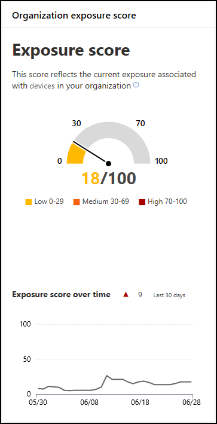

# Exposure score
**Applies to:**
- [Microsoft Defender Advanced Threat Protection (Microsoft Defender ATP)](https://go.microsoft.com/fwlink/p/?linkid=2069559)

Your exposure score reflects how vulnerable your organization is to cybersecurity threats. 

The widget also gives you a high-level view of your exposure score trend over time. Any spikes in the chart gives you a visual indication of a high cybersecurity threat exposure so you can investigate what happened on that date further. 

## How it works

Several factors affect your organization exposure score: 
> Weakness discovered on the device
> Likelihood of a device getting breached
> Value of the device to the organization
> Relevant alert discovered on the device

Reduce the exposure score by addressing what needs to be remediated based on the prioritized security recommendations. See [Security recommendations](tvm-security-recommendation.md) for details.

## Related topics
- [Risk-based Threat & Vulnerability Management](next-gen-threat-and-vuln-mgt.md) 
- [Threat & Vulnerability Management dashboard overview](tvm-dashboard-insights.md)
- [Configuration score](configuration-score.md)
- [Security recommendations](tvm-security-recommendation.md)
- [Remediation](tvm-remediation.md)
- [Software inventory](tvm-software-inventory.md)
- [Weaknesses](tvm-weaknesses.md)
- [Scenarios](threat-and-vuln-mgt-scenarios.md)
