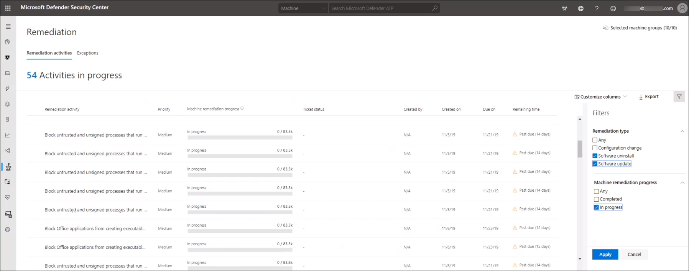
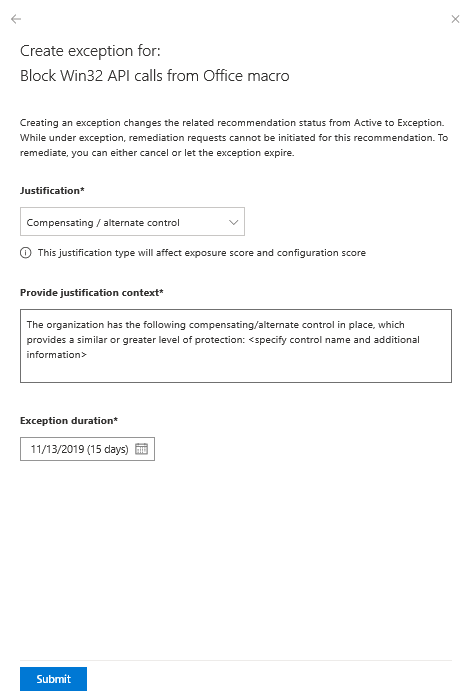
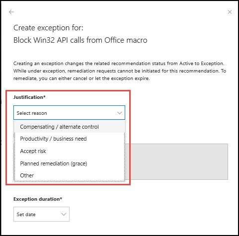
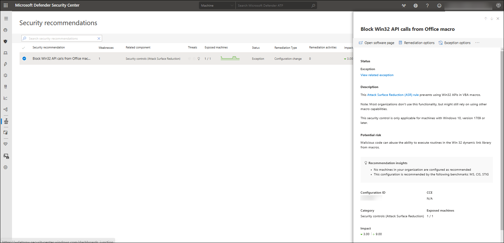

# Remediation and exception
**Applies to:**
- [Microsoft Defender Advanced Threat Protection (Microsoft Defender ATP)](https://go.microsoft.com/fwlink/p/?linkid=2069559)

>Want to experience Microsoft Defender ATP? [Sign up for a free trial.](https://www.microsoft.com/microsoft-365/windows/microsoft-defender-atp?ocid=docs-wdatp-portaloverview-abovefoldlink) 

>[!NOTE]
>To use this capability, enable your Microsoft Intune connections. Navigate to **Settings** > **General** > **Advanced features**. Scroll down and look for **Microsoft Intune connection**. By default, the toggle is turned off. Turn your **Microsoft Intune connection** toggle on.

After your organization's cybersecurity weaknesses are identified and mapped to actionable security recommendations, you can start creating security tasks through the integration with Microsoft Intune where remediation tickets are created.

You can lower down your organization's exposure from vulnerabilities and increase your security configuration by remediating the security recommendations.

## Navigate through your remediation options 
You can access the remediation page in a few places in the portal:
- Security recommendation flyout panel
- Remediation in the navigation menu
- Top remediation activities widget in the dashboard

*Security recommendation flyout page*
 You'll see your remediation options when you select one of the security recommendation blocks from your **Top security recommendations** widget in the dashboard. 
1. From the flyout panel, you'll see the security recommendation details including your next steps. Click **Remediation options**.
2. In the **Remediation options** page, select **Open a ticket in Intune (for AAD joined devices)**. 

>[!NOTE]
>If your request involves remediating more than 10,000 machines, we will only send 10,000 machines for remediation to Intune.

3. Select a remediation due date.
4. Add notes to give your IT administrator a context of your remediation request. For example, you can indicate urgency of the remediation request to avoid potential exposure to a recent exploit activity, or if the request is a part of compliance. 

If you want to check how the ticket shows up in Intune, see [Use Intune to remediate vulnerabilities identified by Microsoft Defender ATP](https://docs.microsoft.com/intune/atp-manage-vulnerabilities) for details.

*Remediation in the navigation menu*
1. Go to the Threat & Vulnerability Management navigation menu and select **Remediation** to open up the list of remediation activities and exceptions found in your organization. You can filter your view based on remediation type, machine remediation progress, and exception justification. If you want to see the remediation activities of software which have reached their end-of-life, select **Software uninstall** from the **Remediation type** filter. If you want to see the remediation activities of software and software versions which have reached their end-of-life, select **Software update** from the **Remediation type** filter. Select **In progress** then click **Apply**.

2. Select the remediation activity that you need to see or process. 

*Top remediation activities widget in the dashboard*
1. Go to the Threat & Vulnerability Management dashboard and scroll down to the **Top remediation activities** widget. The list is sorted and prioritized based on what is listed in the **Top security recommendations**. 
2. Select the remediation activity that you need to see or process.

## How it works

When you submit a remediation request from Threat & Vulnerability Management, it kicks-off a remediation activity. 

It creates a security task which will be tracked in Threat & Vulnerability Management **Remediation** page, and it also creates a remediation ticket in Microsoft Intune.

The dashboard will show that status of your top remediation activities. Click any of the entries and it will take you to the **Remediation** page. You can mark the remediation activity as completed after the IT administration team remediates the task.

## When to file for exception instead of remediating issues 
You can file exceptions to exclude certain recommendation from showing up in reports and affecting your configuration score.

When you select a security recommendation, it opens up a flyout screen with details and options for your next step. You can either **Open software page**, choose from **Remediation options**, go through **Exception options** to file for exceptions, or **Report inaccuracy**.

Select **Exception options** and a flyout screen opens.

### Exception justification
If the security recommendation stemmed from a false positive report, or if there are existing business justification that blocks the remediation, such as compensating control, productivity needs, compliance, or if there's already a planned remediation grace period, you can file an exception and indicate the reason. The following list details the justifications behind the exception options:

-   **Compensating/alternate control** - A 3rd party control that mitigates this recommendation exists, for example, if Network Firewall -   -   prevents access to a machine, third party antivirus
-   **Productivity/business need** - Remediation will impact productivity or interrupt business-critical workflow 
-   **Accept risk** - Poses low risk and/or implementing a compensating control is too expensive
-   **Planned remediation (grace)** - Already planned but is awaiting execution or authorization
-   **Other** - False positive
   
   
   

### Exception visibility
The exceptions you've filed will show up in the **Remediation** page, in the **Exceptions** tab.
However, you also have the option to filter your view based on exception justification, type, and status.  

Aside from that, there's also an option to **Show exceptions** at the bottom of the **Top security recommendations** card in the dashboard. 

Clicking the link opens up to the **Security recommendations** page, where you can select the item exempted item with details.

### Actions on exceptions
-  Cancel - You can cancel the exceptions you've filed any time
-  Resurface - Your exception automatically becomes void and resurfaces in the security recommendation list when dynamic environmental factors change, which adversely affect the exposure impact associated with a recommendation that had previously been excluded

### Exception status
-   **Canceled** - The exception has been canceled and is no longer in effect  
-   **Expired** - The exception that you've filed is no longer in effect
-   **In effect** - The exception that you've filed is in progress

### Exception impact on scores
Creating an exception can potentially affect the Exposure Score (for both types of weaknesses) and Configuration Score (for configurations) of your organization in the following manner:
-   **No impact** - Removes the recommendation from the lists (which can be reverse through filters), but will not affect the scores
-   **Mitigation-like impact** - As if the recommendation was mitigated (and scores will be adjusted accordingly) when you select it as a compensating control.
-   **Hybrid** - Provides visibility on both No impact and Mitigation-like impact. It shows both the Exposure Score and Configuration Score results out of the exception option that you made

The exception impact shows on both the Security recommendations page column and in the flyout pane.

## Related topics
- [Supported operating systems and platforms](tvm-supported-os.md)
- [Risk-based Threat & Vulnerability Management](next-gen-threat-and-vuln-mgt.md) 
- [Threat & Vulnerability Management dashboard overview](tvm-dashboard-insights.md)
- [Exposure score](tvm-exposure-score.md)
- [Configuration score](configuration-score.md)
- [Security recommendation](tvm-security-recommendation.md)
- [Software inventory](tvm-software-inventory.md)
- [Weaknesses](tvm-weaknesses.md)
- [Scenarios](threat-and-vuln-mgt-scenarios.md)
- [Configure data access for Threat & Vulnerability Management roles](https://docs.microsoft.com/windows/security/threat-protection/microsoft-defender-atp/user-roles#create-roles-and-assign-the-role-to-an-azure-active-directory-group)
- [Score APIs](https://docs.microsoft.com/windows/security/threat-protection/microsoft-defender-atp/score)
- [Vulnerability APIs](https://docs.microsoft.com/windows/security/threat-protection/microsoft-defender-atp/vulnerability)
- [Software APIs](https://docs.microsoft.com/windows/security/threat-protection/microsoft-defender-atp/software)
- [Machine APIs](https://docs.microsoft.com/windows/security/threat-protection/microsoft-defender-atp/machine)
- [Recommendation APIs](https://docs.microsoft.com/windows/security/threat-protection/microsoft-defender-atp/vulnerability)

