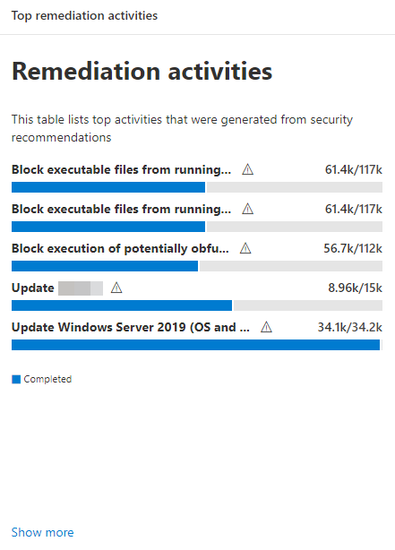
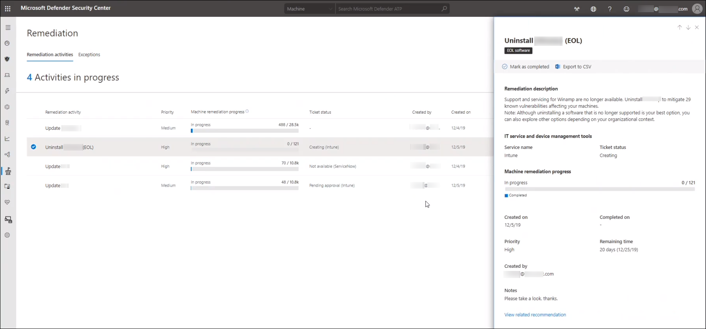
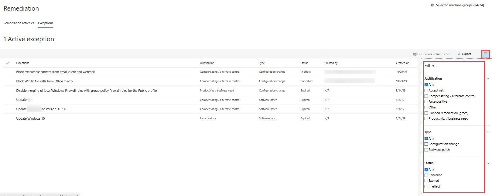
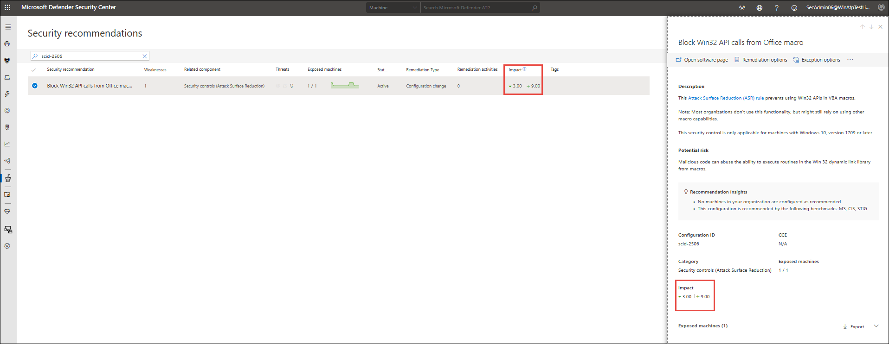
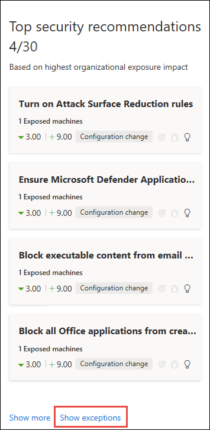

# Remediation activities and exceptions - threat and vulnerability management

[!INCLUDE [Microsoft 365 Defender rebranding](../../includes/microsoft-defender.md)]

**Applies to:**
- [Microsoft Defender Advanced Threat Protection (Microsoft Defender ATP)](https://go.microsoft.com/fwlink/p/?linkid=2069559)

>Want to experience Microsoft Defender ATP? [Sign up for a free trial.](https://www.microsoft.com/microsoft-365/windows/microsoft-defender-atp?ocid=docs-wdatp-portaloverview-abovefoldlink)

>[!NOTE]
>To use this capability, enable your Microsoft Intune connections. Navigate to **Settings** > **General** > **Advanced features**. Scroll down and look for **Microsoft Intune connection**. By default, the toggle is turned off. Turn your **Microsoft Intune connection** toggle on.

After your organization's cybersecurity weaknesses are identified and mapped to actionable [security recommendations](tvm-security-recommendation.md), start creating security tasks. You can create tasks through the integration with Microsoft Intune where remediation tickets are created.

Lower your organization's exposure from vulnerabilities and increase your security configuration by remediating the security recommendations.

## Navigate to the Remediation page

You can access the Remediation page a few different ways:

- Threat and vulnerability management navigation menu in the [Microsoft Defender Security Center](portal-overview.md)
- Top remediation activities card in the [threat and vulnerability management dashboard](tvm-dashboard-insights.md)

### Navigation menu

Go to the threat and vulnerability management navigation menu and select **Remediation**. It will open the list of remediation activities and exceptions found in your organization.

### Top remediation activities in the dashboard

View **Top remediation activities** in the [threat and vulnerability management dashboard](tvm-dashboard-insights.md). Select any of the entries to go to the **Remediation** page. You can mark the remediation activity as completed after the IT admin team remediates the task.

## Remediation activities

When you [submit a remediation request](tvm-security-recommendation.md#request-remediation) from the [Security recommendations page](tvm-security-recommendation.md), it kicks-off a remediation activity. A security task is created that can be tracked in the threat and vulnerability management **Remediation** page, and a remediation ticket is created in Microsoft Intune.

Once you are in the Remediation page, select the remediation activity that you want to view. You can follow the remediation steps, track progress, view the related recommendation, export to CSV, or mark as complete.

## Exceptions

When you [file for an exception](tvm-security-recommendation.md#file-for-exception) from the [Security recommendations page](tvm-security-recommendation.md), you create an exception  for that security recommendation. You can file exceptions to exclude certain recommendation from showing up in reports and affecting your [Microsoft Secure Score for Devices](tvm-microsoft-secure-score-devices.md).

The exceptions you've filed will show up in the **Remediation** page, in the **Exceptions** tab. You can filter your view based on exception justification, type, and status.  

### Exception actions and statuses

You can take the following actions on an exception:

- Cancel - You can cancel the exceptions you've filed anytime
- Resurface - Your exception automatically becomes void and resurfaces in the security recommendation list when dynamic environmental factors change. It adversely affects the exposure impact associated with a recommendation that had previously been excluded.

The following statuses will be a part of an exception:

- **Canceled** - The exception has been canceled and is no longer in effect  
- **Expired** - The exception that you've filed is no longer in effect
- **In effect** - The exception that you've filed is in progress

### Exception impact on scores

Creating an exception can potentially affect the Exposure Score (for both types of weaknesses) and Microsoft Secure Score for Devices of your organization in the following manner:

- **No impact** - Removes the recommendation from the lists (which can be reverse through filters), but will not affect the scores.
- **Mitigation-like impact** - As if the recommendation was mitigated (and scores will be adjusted accordingly) when you select it as a compensating control.
- **Hybrid** - Provides visibility on both No impact and Mitigation-like impact. It shows both the Exposure Score and Microsoft Secure Score for Devices results out of the exception option that you made.

The exception impact shows on both the Security recommendations page column and in the flyout pane.

### View exceptions in other places

Select **Show exceptions** at the bottom of the **Top security recommendations** card in the dashboard. It will open a filtered view in the **Security recommendations** page of recommendations with an "Exception" status.

## Related topics

- [Threat and vulnerability management overview](next-gen-threat-and-vuln-mgt.md)
- [Supported operating systems and platforms](tvm-supported-os.md)
- [Threat and vulnerability management dashboard](tvm-dashboard-insights.md)
- [Exposure score](tvm-exposure-score.md)
- [Microsoft Secure Score for Devices](tvm-microsoft-secure-score-devices.md)
- [Security recommendations](tvm-security-recommendation.md)
- [Software inventory](tvm-software-inventory.md)
- [Weaknesses](tvm-weaknesses.md)
- [Event timeline](threat-and-vuln-mgt-event-timeline.md)
- [Scenarios](threat-and-vuln-mgt-scenarios.md)
- [APIs](next-gen-threat-and-vuln-mgt.md#apis)
- [Configure data access for threat and vulnerability management roles](user-roles.md#create-roles-and-assign-the-role-to-an-azure-active-directory-group)
