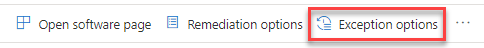

# Security recommendations - threat and vulnerability management

[!INCLUDE [Microsoft 365 Defender rebranding](../../includes/microsoft-defender.md)]

**Applies to:**

- [Microsoft Defender for Endpoint](https://go.microsoft.com/fwlink/p/?linkid=2146631)
- [Threat and vulnerability management](next-gen-threat-and-vuln-mgt.md)

>Want to experience Microsoft Defender for Endpoint? [Sign up for a free trial.](https://www.microsoft.com/microsoft-365/windows/microsoft-defender-atp?ocid=docs-wdatp-portaloverview-abovefoldlink)

Cybersecurity weaknesses identified in your organization are mapped to actionable security recommendations and prioritized by their impact. Prioritized recommendations help shorten the time to mitigate or remediate vulnerabilities and drive compliance.

Each security recommendation includes actionable remediation steps. To help with task management, the recommendation can also be sent using Microsoft Intune and Microsoft Endpoint Configuration Manager. When the threat landscape changes, the recommendation also changes as it continuously collects information from your environment.

## How it works

Each device in the organization is scored based on three important factors to help customers to focus on the right things at the right time.

- **Threat** - Characteristics of the vulnerabilities and exploits in your organizations' devices and breach history. Based on these factors, the security recommendations show the corresponding links to active alerts, ongoing threat campaigns, and their corresponding threat analytic reports.

- **Breach likelihood** - Your organization's security posture and resilience against threats

- **Business value** - Your organization's assets, critical processes, and intellectual properties

## Navigate to the Security recommendations page

Access the Security recommendations page a few different ways:

- Threat and vulnerability management navigation menu in the [Microsoft Defender Security Center](portal-overview.md)
- Top security recommendations in the [threat and vulnerability management dashboard](tvm-dashboard-insights.md)

View related security recommendations in the following places:

- Software page
- Device page

### Navigation menu

Go to the threat and vulnerability management navigation menu and select **Security recommendations**. The page contains a list of security recommendations for the threats and vulnerabilities found in your organization.

### Top security recommendations in the threat and vulnerability management dashboard

In a given day as a Security Administrator, you can take a look at the [threat and vulnerability management dashboard](tvm-dashboard-insights.md) to see your [exposure score](tvm-exposure-score.md) side by side with your [Microsoft Secure Score for Devices](tvm-microsoft-secure-score-devices.md). The goal is to **lower** your organization's exposure from vulnerabilities, and **increase** your organization's device security to be more resilient against cybersecurity threat attacks. The top security recommendations list can help you achieve that goal.

The top security recommendations list the improvement opportunities prioritized based on the important factors mentioned in the previous section - threat, likelihood to be breached, and value. Selecting a recommendation will take you to the security recommendations page with more details.

## Security recommendations overview

View recommendations, the number of weaknesses found, related components, threat insights, number of exposed devices, status, remediation type, remediation activities, impact to your exposure score and Microsoft Secure Score for Devices, and associated tags.

The color of the **Exposed devices** graph changes as the trend changes. If the number of exposed devices is on the rise, the color changes into red. If there's a decrease in the number of exposed devices, the color of the graph will change into green.

>[!NOTE]
>Threat and vulnerability management shows devices that were in use up to **30 days** ago. This is different from the rest of Microsoft Defender for Endpoint, where if a device has not been in use for more than 7 days it has in an ‘Inactive’ status.

### Icons

Useful icons also quickly call your attention to:
-  possible active alerts
-  associated public exploits
-  recommendation insights

### Explore security recommendation options

Select the security recommendation that you want to investigate or process.

From the flyout, you can choose any of the following options:

- **Open software page** - Open the software page to get more context on the software and how it's distributed. The information can include threat context, associated recommendations, weaknesses discovered, number of exposed devices, discovered vulnerabilities, names and detailed of devices with the software installed, and version distribution.

- [**Remediation options**](tvm-remediation.md) - Submit a remediation request to open a ticket in Microsoft Intune for your IT administrator to pick up and address. Track the remediation activity in the Remediation page.

- [**Exception options**](tvm-exception.md) - Submit an exception, provide justification, and set exception duration if you can't remediate the issue yet.

>[!NOTE]
>When a change is made on a device, it typically takes two hours for the data to be reflected in the Microsoft Defender Security Center. However, it may sometimes take longer.

### Investigate changes in device exposure or impact

If there is a large jump in the number of exposed devices, or a sharp increase in the impact on your organization exposure score and configuration score, then that security recommendation is worth investigating.

1. Select the recommendation and **Open software page**
2. Select the **Event timeline** tab to view all the impactful events related to that software, such as new vulnerabilities or new public exploits. [Learn more about event timeline](threat-and-vuln-mgt-event-timeline.md)
3. Decide how to address the increase or your organization's exposure, such as submitting a remediation request

## Request remediation

The threat and vulnerability management remediation capability bridges the gap between Security and IT administrators through the remediation request workflow. Security admins like you can request for the IT Administrator to remediate a vulnerability from the **Security recommendation** page to Intune. [Learn more about remediation options](tvm-remediation.md)

### How to request remediation

Select a security recommendation you would like to request remediation for, and then select **Remediation options**. Fill out the form and select **Submit request**. Go to the [**Remediation**](tvm-remediation.md) page to view the status of your remediation request. [Learn more about how to request remediation](tvm-remediation.md#request-remediation)

## File for exception

As an alternative to a remediation request when a recommendation is not relevant at the moment, you can create exceptions for recommendations. [Learn more about exceptions](tvm-exception.md)

Only users with “exceptions handling” permissions can add exception. [Learn more about RBAC roles](user-roles.md).

When an exception is created for a recommendation, the recommendation is no longer active. The recommendation state will change to **Full exception** or **Partial exception** (by device group).

### How to create an exception

Select a security recommendation you would like create an exception for, and then select **Exception options**.  

Fill out the form and submit. To view all your exceptions (current and past), navigate to the [Remediation](tvm-remediation.md) page under the **Threat & Vulnerability Management** menu and select the **Exceptions** tab. [Learn more about how to create an exception](tvm-exception.md#create-an-exception)

## Report inaccuracy

You can report a false positive when you see any vague, inaccurate, incomplete, or already remediated security recommendation information.

1. Open the Security recommendation.

2. Select the three dots beside the security recommendation that you want to report,  then select **Report inaccuracy**.

    

3. From the flyout pane, select the inaccuracy category from the drop-down menu, fill in your email address, and details regarding the inaccuracy.

4. Select **Submit**. Your feedback is immediately sent to the threat and vulnerability management experts.

## Related articles

- [Threat and vulnerability management overview](next-gen-threat-and-vuln-mgt.md)
- [Dashboard](tvm-dashboard-insights.md)
- [Exposure score](tvm-exposure-score.md)
- [Microsoft Secure Score for Devices](tvm-microsoft-secure-score-devices.md)
- [Remediate vulnerabilities](tvm-remediation.md)
- [Create and view exceptions for security recommendations](tvm-exception.md)
- [Event timeline](threat-and-vuln-mgt-event-timeline.md)
