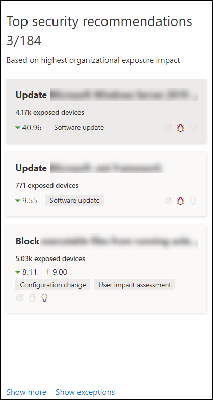
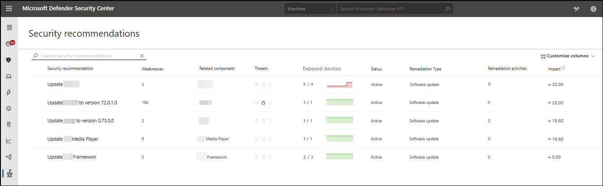
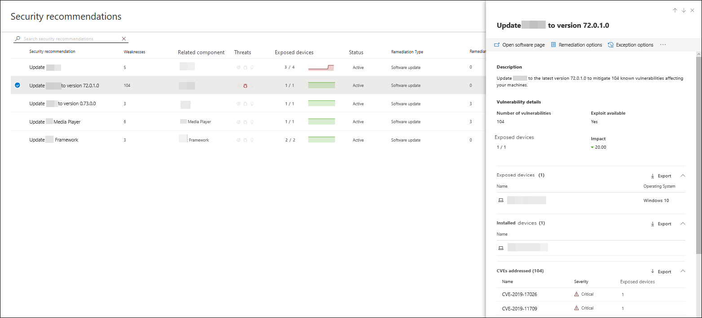
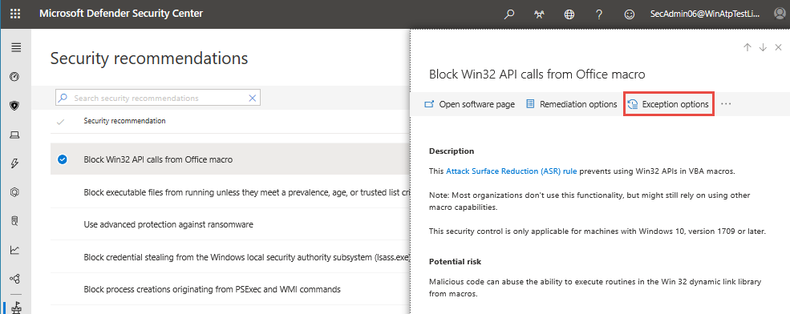
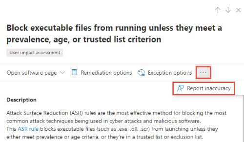
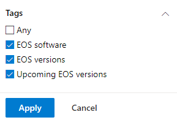
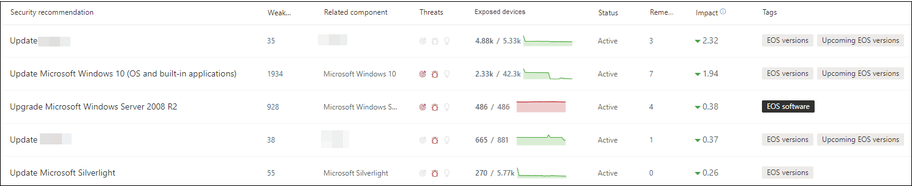
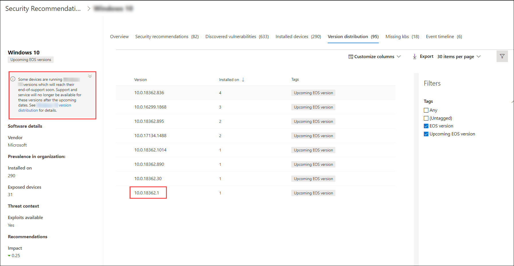
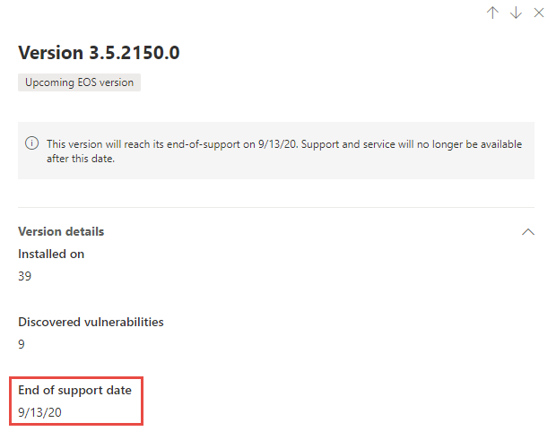

# Security recommendations - threat and vulnerability management

**Applies to:**

- [Microsoft Defender Advanced Threat Protection (Microsoft Defender ATP)](https://go.microsoft.com/fwlink/p/?linkid=2069559)

>Want to experience Microsoft Defender ATP? [Sign up for a free trial.](https://www.microsoft.com/microsoft-365/windows/microsoft-defender-atp?ocid=docs-wdatp-portaloverview-abovefoldlink)

[!include[Prerelease information](../../includes/prerelease.md)]

Cybersecurity weaknesses identified in your organization are mapped to actionable security recommendations and prioritized by their impact. Prioritized recommendations help shorten the time to mitigate or remediate vulnerabilities and drive compliance.

Each security recommendation includes an actionable remediation recommendation which can be pushed into the IT task queue through a built-in integration with Microsoft Intune and Microsoft Endpoint Configuration Manager. When the threat landscape changes, the recommendation also changes as it continuously collects information from your environment.

## How it works

Each device in the organization is scored based on three important factors to help customers to focus on the right things at the right time.

- **Threat** - Characteristics of the vulnerabilities and exploits in your organizations' devices and breach history. Based on these factors, the security recommendations shows the corresponding links to active alerts, ongoing threat campaigns, and their corresponding threat analytic reports.

- **Breach likelihood** - Your organization's security posture and resilience against threats

- **Business value** - Your organization's assets, critical processes, and intellectual properties

## Navigate to the Security recommendations page

Access the Security recommendations page a few different ways:

- Threat and vulnerability management navigation menu in the [Microsoft Defender Security Center](portal-overview.md)
- Top security recommendations in the [threat and vulnerability management dashboard](tvm-dashboard-insights.md)

View related security recommendations in the following places:

- Software page
- Device page

### Navigation menu

Go to the threat and vulnerability management navigation menu and select **Security recommendations** to open the list of security recommendations for the threats and vulnerabilities found in your organization.

### Top security recommendations in the threat and vulnerability management dashboard

In a given day as a Security Administrator, you can take a look at the [threat and vulnerability management dashboard](tvm-dashboard-insights.md) to see your [exposure score](tvm-exposure-score.md) side-by-side with your [Microsoft Secure Score for Devices](tvm-microsoft-secure-score-devices.md). The goal is to **lower** your organization's exposure from vulnerabilities, and **increase** your organization's device security to be more resilient against cybersecurity threat attacks. The top security recommendations list can help you achieve that goal.

The top security recommendations lists the improvement opportunities prioritized based on the important factors mentioned in the previous section - threat, likelihood to be breached, and value. Selecting a recommendation will take you to the security recommendations page with more details about the recommendation.

## Security recommendations overview

View recommendations, the number of weaknesses found, related components, threat insights, number of exposed devices, status, remediation type, remediation activities, impact to your exposure score and Microsoft Secure Score for Devices, and associated tags.

The color of the **Exposed devices** graph changes as the trend changes. If the number of exposed devices is on the rise, the color changes into red. If there's a decrease in the number of exposed devices, the color of the graph will change into green.

### Icons

Useful icons also quickly calls your attention to:  
-  possible active alerts
-  associated public exploits
-  recommendation insights

### Explore security recommendation options

Select the security recommendation that you want to investigate or process.

From the flyout, you can do any of the following:

- **Open software page** - Open the software page to get more context on the software and how it is distributed. The information can include threat context, associated recommendations, weaknesses discovered, number of exposed devices, discovered vulnerabilities, names and detailed of devices with the software installed, and version distribution.

- [**Remediation options**](tvm-security-recommendation.md#request-remediation) - Submit a remediation request to open a ticket in Microsoft Intune for your IT Administrator to pick up and address.

- [**Exception options**](tvm-security-recommendation.md#file-for-exception) - Submit an exception, provide justification, and set exception duration if you can't remediate the issue just yet.

>[!NOTE]
>When a change is made on a device, it may take up to two hours for the data to be reflected in the Microsoft Defender Security Center.

### Investigate changes in machine exposure or impact

If there is a large jump in the number of exposed machines, or a sharp increase in the impact on your organization exposure score and configuration score, then that security recommendation is worth investigating.

1. Select the recommendation and **Open software page**
2. Select the **Event timeline** tab to view all the impactful events related to that software, such as new vulnerabilities or new public exploits. [Learn more about event timeline](threat-and-vuln-mgt-event-timeline.md)
3. Decide how to address the increase or your organization's exposure, such as submitting a remediation request

## Request remediation

The threat and vulnerability management capability in Microsoft Defender ATP bridges the gap between Security and IT administrators through the remediation request workflow. Security admins like you can request for the IT Administrator to remediate a vulnerability from the **Security recommendation** pages to Intune.

### Enable Microsoft Intune connection

To use this capability, enable your Microsoft Intune connections. In the Microsoft Defender Security Center, navigate to **Settings** > **General** > **Advanced features**. Scroll down and look for **Microsoft Intune connection**. By default, the toggle is turned off. Turn your **Microsoft Intune connection** toggle **On**.

See [Use Intune to remediate vulnerabilities identified by Microsoft Defender ATP](https://docs.microsoft.com/intune/atp-manage-vulnerabilities) for details.

### Remediation request steps

1. Select a security recommendation you would like to request remediation for, and then select **Remediation options**.

2. Fill out the form, including what you are requesting remediation for, priority, due date, and optional notes. Select **Submit request**. Submitting a remediation request creates a remediation activity item within threat and vulnerability management, which can be used for monitoring the remediation progress for this recommendation. This will not trigger a remediation or apply any changes to devices.

3. Notify your IT Administrator about the new request and have them log into Intune to approve or reject the request and start a package deployment.

4. Go to the [**Remediation**](tvm-remediation.md) page to view the status of your remediation request.

If you want to check how the ticket shows up in Intune, see [Use Intune to remediate vulnerabilities identified by Microsoft Defender ATP](https://docs.microsoft.com/intune/atp-manage-vulnerabilities) for details.

>[!NOTE]
>If your request involves remediating more than 10,000 devices, we can only send 10,000 devices for remediation to Intune.

## File for exception

As an alternative to a remediation request, you can create exceptions for recommendations.

There are many reasons why organizations create exceptions for a recommendation. For example, if there's a business justification that prevents the company from applying the recommendation, the existence of a compensating or alternative control that provides as much protection than the recommendation would, a false positive, among other reasons.

When an exception is created for a recommendation, the recommendation is no longer active. The recommendation state changes to **Exception**, and it no longer shows up in the security recommendations list.

1. Select a security recommendation you would like create an exception for, and then **Exception options**.

2. Select your justification for the exception you need to file instead of remediating the security recommendation in question. Fill out the justification context, then set the exception duration.

    The following list details the justifications behind the exception options:

    - **Compensating/alternate control** - A 3rd party control that mitigates this recommendation exists, for example, if Network Firewall -   -   prevents access to a device, third party antivirus
    - **Productivity/business need** - Remediation will impact productivity or interrupt business-critical workflow
    - **Accept risk** - Poses low risk and/or implementing a compensating control is too expensive
    - **Planned remediation (grace)** - Already planned but is awaiting execution or authorization
    - **Other** - False positive

3. Select **Submit**. A confirmation message at the top of the page indicates that the exception has been created.

4. Navigate to the [**Remediation**](tvm-remediation.md) page under the **Threat and vulnerability management** menu and select the **Exceptions** tab to view all your exceptions (current and past).

## Report inaccuracy

You can report a false positive when you see any vague, inaccurate, incomplete, or already remediated security recommendation information.

1. Open the Security recommendation.

2. Select the three dots beside the security recommendation that you want to report,  then select **Report inaccuracy**.

    

3. From the flyout pane, select the inaccuracy category from the drop-down menu, fill in your email address, and details regarding the inaccuracy.

4. Select **Submit**. Your feedback is immediately sent to the threat and vulnerability management experts.

## Find and remediate software or software versions which have reached end-of-support (EOS)

End-of-support (otherwise known as end-of-life) for software or software versions means that they will no longer be supported or serviced, and will not receive security updates. When you use software or software versions which have reached end-of-support, you're exposing your organization to security vulnerabilities, legal, and financial risks.

It is crucial for Security and IT Administrators to work together and ensure that the organization's software inventory is configured for optimal results, compliance, and a healthy network ecosystem. They should examine the options to remove or replace apps that have reached end of support, and update versions that have reached end of support. It is best to create and implement a plan **before** the end of support dates.

To find software or software versions which have reached end-of-support:

1. From the threat and vulnerability management menu, navigate to **Security recommendations**.
2. Go to the **Filters** panel and look for the tags section. Select one or more of the EOS tag options. Then **Apply**.

    

3. You will see a list recommendations related to software that is end of support, software versions that are end of support, or upcoming end of support versions. These tags are also visible in the [software inventory](tvm-software-inventory.md) page.

    

### List of versions and dates

To view a list of version that have reached end of support, or end or support soon, and those dates, follow the below steps:

1. For software that has versions which have reached end of support, or will reach end of support soon, a message will appear in the flyout once the security recommendation is selected.

    

2. Select the **version distribution** link to go to the software drill down page. There, you can see a filtered list of versions with tags identifying them as end of support, or upcoming end of support.

    

3. Select one of the versions in the table to open. For example, version 10.0.18362.1. A flyout will appear with the end of support date.

    

After you have identified which software and software versions are vulnerable due to its end-of-support status, remediate them to lower your organizations exposure to vulnerabilities and advanced persistent threats.

## Related topics

- [Threat and vulnerability management overview](next-gen-threat-and-vuln-mgt.md)
- [Supported operating systems and platforms](tvm-supported-os.md)
- [Threat and vulnerability management dashboard](tvm-dashboard-insights.md)
- [Exposure score](tvm-exposure-score.md)
- [Microsoft Secure Score for Devices](tvm-microsoft-secure-score-devices.md)
- [Remediation and exception](tvm-remediation.md)
- [Software inventory](tvm-software-inventory.md)
- [Weaknesses](tvm-weaknesses.md)
- [Event timeline](threat-and-vuln-mgt-event-timeline.md)
- [Scenarios](threat-and-vuln-mgt-scenarios.md)
- [APIs](next-gen-threat-and-vuln-mgt.md#apis)
- [Configure data access for threat and vulnerability management roles](user-roles.md#create-roles-and-assign-the-role-to-an-azure-active-directory-group)