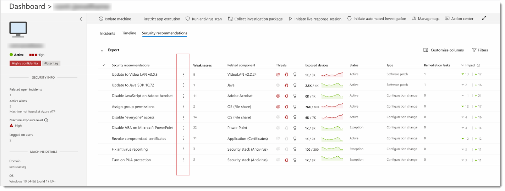
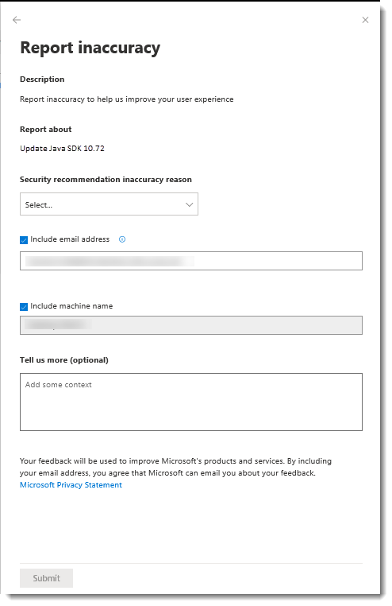
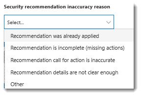

# Security recommendation
**Applies to:**
- [Microsoft Defender Advanced Threat Protection (Microsoft Defender ATP)](https://go.microsoft.com/fwlink/p/?linkid=2069559)

The cybersecurity weaknesses identified in your organization are mapped to actionable security recommendations and prioritized by their impact on the security recommendation list. Prioritized recommendation helps shorten the mean time to mitigate or remediate vulnerabilities and drive compliance.

Each security recommendation includes an actionable remediation recommendation which can be pushed into the IT task queue through a built-in integration with Microsoft Intune and Microsoft System Center Configuration Manager (SCCM). It is also dynamic in the sense that when the threat landscape changes, the recommendation also changes as it continuously collect information from your environment. 

## The basis of the security recommendation
Each machine in the organization is scored based on three important factors: threat, likelihood to be breached, and value, to help customers to focus on the right things at the right time.

- Threat - Characteristics of the vulnerabilities and exploits in your organizations' devices and breach history. Based on these factors, the security recommendations shows the corresponding links to active alerts, ongoing threat campaigns, and their corresponding threat analytic reports. 

- Breach likelihood - Your organization's security posture and resilience against threats

- Business value - Your organization's assets, critical processes, and intellectual properties

## Navigate through your security recommendations

You can access the security recommendation from the Microsoft Defender ATP Threat & Vulnerability Management menu, dashboard, software page, and machine page, to give you the context that you need, as you require it. 

There are security recommendations for application, operating system, network, accounts, and security controls. 

In a given day as a Security Administrator, you can take a look at the dashboard to see your exposure score side-by-side with your configuration score. The goal is to lower down your organization's exposure from vulnerabilities, and increase your organization's security configuration to be more resilient against cybersecurity threat attacks. The top security recommendations list can help you achieve that goal. 

The top security recommendations lists down the improvement opportunities prioritized based on the three important factors mentioned in the previous section - threat, likelihood to be breached, and value.   

You can click on each one of them and see the details, the description, the potential risk if you don't act on or remediate it, insights, how many exposed devices are associated with the security recommendation, vulnerabilities, and other threats.

From that page, you can do any of the following depending on what you need to do:

- Open software page - Drill down and open the software page to get more context of the software details, prevalence in the organization, weaknesses discovered, version distribution, and charts so you can see the exposure trend over time. 

- Choose from remediation options - Submit a remediation request to open a ticket in Microsoft Intune for your IT Administrator to pick up and address.

- Choose from exception options - Submit an exception, provide justification, and set exception duration if you can't remediate the issue just yet due to specific business reasons, compensation controls, or if it is a false positive. 

## Report inaccuracy

You can report a false positive when you see any vague, inaccurate, incomplete, or already remediated security recommendation information in the machine page.

1. Select the **Security recommendation** tab.

2. Click **:** beside the security recommendation that you want to report about,  then select **Report inaccuracy**. 

 A flyout pane opens. 

3. From the flyout pane, select the inaccuracy category from the drop-down menu. 
  

4. Include your email address so Microsoft can send you feedback regarding the inaccuracy you reported.

5. Include your machine name for investigation context.

>[!NOTE]
> You can also provide details regarding the inaccuracy you reported in the **Tell us more (optional)** field to give the threat and vulnerability management investigators context. 

6. Click **Submit**. Your feedback is immediately sent to the Threat & Vulnerability Management experts with its context.

## Related topics
- [Risk-based Threat & Vulnerability Management](next-gen-threat-and-vuln-mgt.md) 
- [Threat & Vulnerability Management dashboard overview](tvm-dashboard-insights.md)
- [Exposure score](tvm-exposure-score.md)
- [Configuration score](configuration-score.md)
- [Remediation](tvm-remediation.md)
- [Software inventory](tvm-software-inventory.md)
- [Weaknesses](tvm-weaknesses.md)
- [Scenarios](threat-and-vuln-mgt-scenarios.md) 
