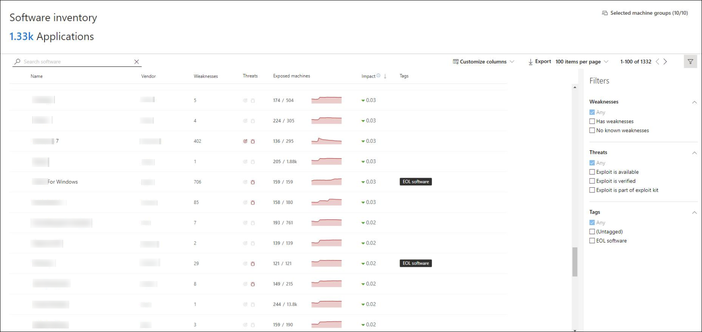
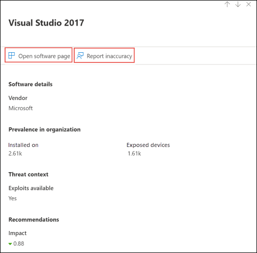
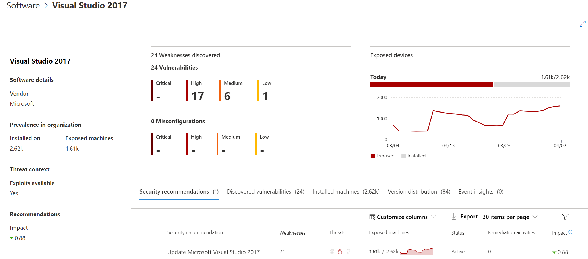
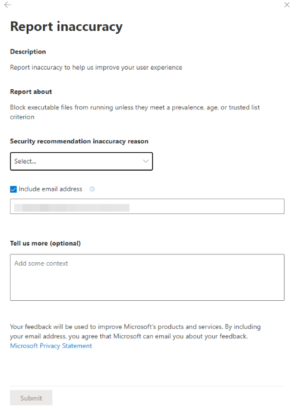

# Software inventory

**Applies to:**
- [Microsoft Defender Advanced Threat Protection (Microsoft Defender ATP)](https://go.microsoft.com/fwlink/p/?linkid=2069559)

>Want to experience Microsoft Defender ATP? [Sign up for a free trial.](https://www.microsoft.com/microsoft-365/windows/microsoft-defender-atp?ocid=docs-wdatp-portaloverview-abovefoldlink)

[!include[Prerelease information](../../includes/prerelease.md)]

Microsoft Defender ATP Threat & Vulnerability management's discovery capability shows in the **Software inventory** page. The software inventory includes the name of the product or vendor, the latest version it is in, and the number of weaknesses and vulnerabilities detected with it.

## How it works

In the field of discovery, we are leveraging the same set of signals that is responsible for detection and vulnerability assessment in [Microsoft Defender ATP endpoint detection and response capabilities](overview-endpoint-detection-response.md).

Since it is real-time, in a matter of minutes, you will see vulnerability information as they get discovered. The engine automatically grabs information from multiple security feeds. In fact, you'll will see if a particular software is connected to a live threat campaign. It also provides a link to a Threat Analytics report soon as it's available.

## Navigate to the Software inventory page

You can access the Software inventory page by selecting **Software inventory** from the Threat & Vulnerability Management navigation menu in the [Microsoft Defender Security Center](portal-overview.md).

## Software inventory overview

The **Software inventory** page opens with a list of software installed in your network, vendor name, weaknesses found, threats associated with them, exposed machines, impact to exposure score, and tags. You can also filter the software inventory list view based on weaknesses found in the software, threats associated with them, and whether the software or software versions have reached end-of-support.

Select the software that you want to investigate and a flyout panel opens up with a more compact view of the information on the page. You can either dive deeper into the investigation and select **Open software page**, or flag any technical inconsistencies by selecting **Report inaccuracy**.

## Software pages

Once you are in the Software inventory page and have opened the flyout panel by selecting a software to investigate, select **Open software page** (see image in the previous section). A full page will appear with all the details of a specific software and the following information:

- Side panel with vendor information, prevalence of the software in the organization (including number of machines it is installed on, and exposed machines that are not patched), whether and exploit is available, and impact to your exposure score
- Data visualizations showing the number of, and severity of, vulnerabilities and misconfigurations. Also, graphs of the number of exposed machines
- Tabs with lists of the corresponding security recommendations for the weaknesses and vulnerabilities identified, the named CVEs of discovered vulnerabilities, the names of the machines that the software is installed on, and the specific versions of the software with the number of machines that have each version installed and number of vulnerabilities.

## Report inaccuracy

You can report a false positive when you see any vague, inaccurate version, incomplete, or already remediated software inventory information.

1. Once you are in the Software inventory page and have opened the flyout panel by selecting a software to investigate, select **Report inaccuracy**

2. Select the inaccuracy category from the drop-down menu, fill in your email address, and details regarding the inaccuracy.

3. Select **Submit**. Your feedback is immediately sent to the Threat & Vulnerability Management experts.

## Related topics

- [Threat & Vulnerability Management overview](next-gen-threat-and-vuln-mgt.md)
- [Supported operating systems and platforms](tvm-supported-os.md)
- [Threat & Vulnerability Management dashboard](tvm-dashboard-insights.md)
- [Exposure score](tvm-exposure-score.md)
- [Configuration score](configuration-score.md)
- [Security recommendations](tvm-security-recommendation.md)
- [Remediation and exception](tvm-remediation.md)
- [Weaknesses](tvm-weaknesses.md)
- [Scenarios](threat-and-vuln-mgt-scenarios.md)
- [APIs](threat-and-vuln-mgt-scenarios.md#apis)
- [Configure data access for Threat & Vulnerability Management roles](user-roles.md#create-roles-and-assign-the-role-to-an-azure-active-directory-group)