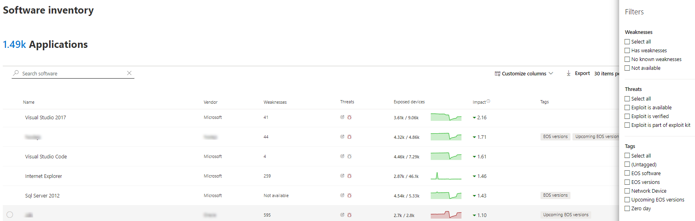
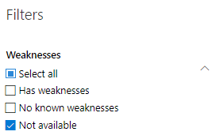

# Software inventory - threat and vulnerability management

[!INCLUDE [Microsoft 365 Defender rebranding](../../includes/microsoft-defender.md)]

**Applies to:**
- [Microsoft Defender for Endpoint](https://go.microsoft.com/fwlink/p/?linkid=2146631)
- [Threat and vulnerability management](next-gen-threat-and-vuln-mgt.md)

>Want to experience Defender for Endpoint? [Sign up for a free trial.](https://www.microsoft.com/microsoft-365/windows/microsoft-defender-atp?ocid=docs-wdatp-portaloverview-abovefoldlink)

The software inventory in threat and vulnerability management is a list of known software in your organization with official [Common Platform Enumerations (CPE)](https://nvd.nist.gov/products/cpe). Software products without an official CPE don’t have vulnerabilities published. It also includes details such as the name of the vendor, number of weaknesses, threats, and number of exposed devices.

## How it works

In the field of discovery, we're leveraging the same set of signals that is responsible for detection and vulnerability assessment in [Microsoft Defender for Endpoint detection and response capabilities](overview-endpoint-detection-response.md).

Since it's real time, in a matter of minutes, you'll see vulnerability information as they get discovered. The engine automatically grabs information from multiple security feeds. In fact, you'll see if a particular software is connected to a live threat campaign. It also provides a link to a Threat Analytics report soon as it's available.

## Navigate to the Software inventory page

Access the Software inventory page by selecting **Software inventory** from the threat and vulnerability management navigation menu in the [Microsoft Defender Security Center](portal-overview.md).

View software on specific devices in the individual devices pages from the [devices list](machines-view-overview.md).

>[!NOTE]
>If you search for software using the Microsoft Defender for Endpoint global search, make sure to put an underscore instead of a space. For example, for the best search results you'd write "windows_10" instead of "Windows 10".

## Software inventory overview

The **Software inventory** page opens with a list of software installed in your network, including the vendor name, weaknesses found, threats associated with them, exposed devices, impact to exposure score, and tags.

You can filter the list view based on weaknesses found in the software, threats associated with them, and tags like whether the software has reached end-of-support.

Select the software that you want to investigate. A flyout panel will open with a more compact view of the information on the page. You can either dive deeper into the investigation and select **Open software page**, or flag any technical inconsistencies by selecting **Report inaccuracy**.

### Software that isn't supported

Software that isn't currently supported by threat & vulnerability management may be present in the Software inventory page. Because it is not supported, only limited data will be available. Filter by unsupported software with the "Not available" option in the "Weakness" section.

The following indicates that a software is not supported:

- Weaknesses field shows "Not available"
- Exposed devices field shows a dash
- Informational text added in side panel and in software page
- The software page won't have the security recommendations, discovered vulnerabilities, or event timeline sections

Currently, products without a CPE are not shown in the software inventory page, only in the device level software inventory.

## Software inventory on devices

From the Microsoft Defender Security Center navigation panel, go to the **[Devices list](machines-view-overview.md)**. Select the name of a device to open the device page (like Computer1), then select the **Software inventory** tab to see a list of all the known software present on the device. Select a specific software entry to open the flyout with more information.

Software may be visible at the device level even if it is currently not supported by threat and vulnerability management. However, only limited data will be available. You'll know if software is unsupported because it will say "Not available" in the "Weakness" column.

Software with no CPE can also show up under this device specific software inventory.

### Software evidence

See evidence of where we detected a specific software on a device from the registry, disk, or both.You can find it on any device in the device software inventory.

Select a software name to open the flyout, and look for the section called "Software Evidence."

## Software pages

You can view software pages a few different ways:

- Software inventory page > Select a software name > Select **Open software page** in the flyout
- [Security recommendations page](tvm-security-recommendation.md) > Select a recommendation > Select **Open software page** in the flyout
- [Event timeline page](threat-and-vuln-mgt-event-timeline.md) > Select an event > Select the hyperlinked software name (like Visual Studio 2017) in the section called "Related component" in the flyout

 A full page will appear with all the details of a specific software and the following information:

- Side panel with vendor information, prevalence of the software in the organization (including number of devices it's installed on, and exposed devices that aren't patched), whether and exploit is available, and impact to your exposure score.
- Data visualizations showing the number of, and severity of, vulnerabilities and misconfigurations. Also, graphs with the number of exposed devices.
- Tabs showing information such as:
    - Corresponding security recommendations for the weaknesses and vulnerabilities identified.
    - Named CVEs of discovered vulnerabilities.
    - Devices that have the software installed (along with device name, domain, OS, and more).
    - Software version list (including number of devices the version is installed on, the number of discovered vulnerabilities, and the names of the installed devices).

    

## Report inaccuracy

Report a false positive when you see any vague, inaccurate, or incomplete information. You can also report on security recommendations that have already been remediated.

1. Open the software flyout on the Software inventory page.
2. Select **Report inaccuracy**.
3. From the flyout pane, select the inaccuracy category from the drop-down menu, fill in your email address, and details about the inaccuracy.
4. Select **Submit**. Your feedback is immediately sent to the threat and vulnerability management experts.

## Related articles

- [Threat and vulnerability management overview](next-gen-threat-and-vuln-mgt.md)
- [Security recommendations](tvm-security-recommendation.md)
- [Event timeline](threat-and-vuln-mgt-event-timeline.md)
- [View and organize the Microsoft Defender for Endpoint Devices list](machines-view-overview.md)
