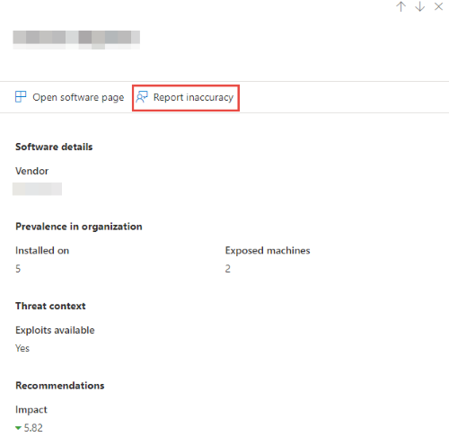

# Software inventory

**Applies to:**
- [Microsoft Defender Advanced Threat Protection (Microsoft Defender ATP)](https://go.microsoft.com/fwlink/p/?linkid=2069559)

>Want to experience Microsoft Defender ATP? [Sign up for a free trial.](https://www.microsoft.com/microsoft-365/windows/microsoft-defender-atp?ocid=docs-wdatp-portaloverview-abovefoldlink)

[!include[Prerelease information](../../includes/prerelease.md)]

Microsoft Defender ATP Threat & Vulnerability management's discovery capability shows in the **Software inventory** page. The software inventory includes the name of the product or vendor, the latest version it is in, and the number of weaknesses and vulnerabilities detected with it.

## Navigate through your software inventory

1. Select **Software inventory** from the Threat & Vulnerability management navigation menu. The **Software inventory** page opens with a list of software installed in your network, vendor name, weaknesses found, threats associated with them, exposed machines, impact, tags. You can also filter the software inventory list view based on weaknesses found in the software, threats associated with them, and whether the software or software versions have reached their end-of-life.
 
2. In the **Software inventory** page, select the software that you want to investigate and a flyout panel opens up with the same details mentioned above but in a more compact view. You can either dive deeper into the investigation and select **Open software page** or flag any technical inconsistencies by selecting **Report inaccuracy**. 
3. Select **Open software page** to dive deeper into your software inventory to see how many weaknesses are discovered in the software, devices exposed, installed machines, version distribution, and the corresponding security recommendations for the weaknesses and vulnerabilities identified. From the **Version distribution** tab, you can also filter the view by **Version EOL** if you want to see the software versions that has reached their end-of-life which needs to be uninstalled, replaced, or updated.

## How it works

In the field of discovery, we are leveraging the same set of signals in Microsoft Defender ATP's endpoint detection and response that's responsible for detection, for vulnerability assessment.

Since it is real-time, in a matter of minutes, you will see vulnerability information as they get discovered. The engine automatically grabs information from multiple security feeds. In fact, you'll will see if a particular software is connected to a live threat campaign. It also provides a link to a Threat Analytics report soon as it's available.

## Report inaccuracy

You can report a false positive when you see any vague, inaccurate version, incomplete, or already remediated software inventory information in the machine page.

1. Select one of the software rows. A flyout will appear.

2. Select "Report inaccuracy" in the flyout

3. From the flyout pane, select the inaccuracy category from the drop-down menu, fill in your email address, and details regarding the inaccuracy.

4. Select **Submit**. Your feedback is immediately sent to the Threat & Vulnerability Management experts.

## Related topics

- [Supported operating systems and platforms](tvm-supported-os.md)
- [Risk-based Threat & Vulnerability Management](next-gen-threat-and-vuln-mgt.md)
- [Threat & Vulnerability Management dashboard overview](tvm-dashboard-insights.md)
- [Exposure score](tvm-exposure-score.md)
- [Configuration score](configuration-score.md)
- [Security recommendation](tvm-security-recommendation.md)
- [Remediation and exception](tvm-remediation.md)
- [Weaknesses](tvm-weaknesses.md)
- [Scenarios](threat-and-vuln-mgt-scenarios.md)
- [Configure data access for Threat & Vulnerability Management roles](user-roles.md#create-roles-and-assign-the-role-to-an-azure-active-directory-group)
- [Recommendation APIs](vulnerability.md)
- [Machine APIs](machine.md)
- [Score APIs](score.md)
- [Software APIs](software.md)
- [Vulnerability APIs](vulnerability.md)
