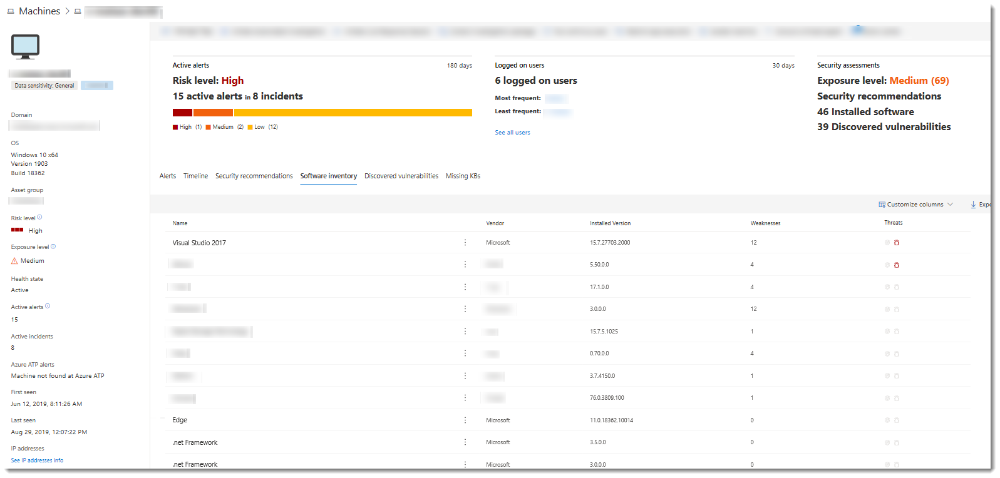
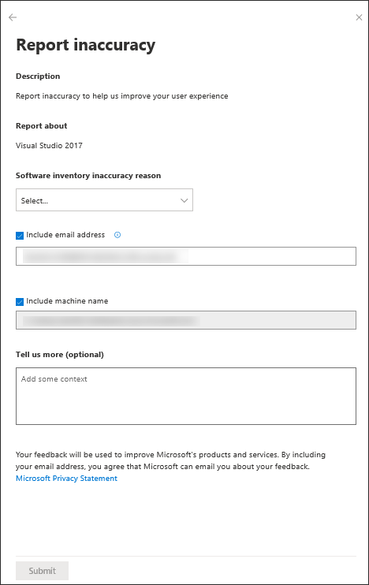
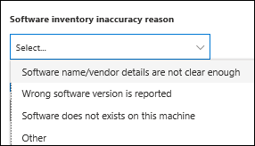

# Software inventory
**Applies to:**
- [Microsoft Defender Advanced Threat Protection (Microsoft Defender ATP)](https://go.microsoft.com/fwlink/p/?linkid=2069559)

Microsoft Defender ATP Threat & Vulnerability management's discovery capability shows in the **Software inventory** page. The software inventory includes the name of the product or vendor, the latest version it is in, and the number of weaknesses and vulnerabilities detected with it.

## Navigate through your software inventory
1. Select **Software inventory** from the Threat & Vulnerability management navigation menu. 
2. In the **Software inventory** page, select the application that you want to investigate and a flyout panel opens up with the software details, vendor information, prevalence in the organization, exposed machines, threat context, and its impact to your  organization's exposure score.   
3. In the flyout panel, select **Open software page** to dive deeper into your software inventory. You will see how many weaknesses are discovered with the application, devices exposed, installed machines, version distribution, and the corresponding security recommendations for the weaknesses and vulnerabilities identified.

## How it works
In the field of discovery, we are leveraging the same set of signals in Microsoft Defender ATP's endpoint detection and response that's responsible for detection, for vulnerability assessment. 

Since it is real-time, in a matter of minutes, you will see vulnerability information as they get discovered. The engine automatically grabs information from multiple security feeds. In fact, you'll will see if a particular application is connected to a live campaign. It also provides a link to a Threat Analytics report soon as it's available.

## Report inaccuracy

You can report a false positive when you see any vague, inaccurate version information, incomplete, or already remediated information in the machine page.

1. Select the **Software inventory** tab. 

2. Click **:** beside software that you want to report about, and then select **Report inaccuracy**. A flyout pane opens.

3. From the flyout pane, select the inaccuracy category from the drop-down menu. 
  

4. Include your email address so Microsoft can send you feedback regarding the inaccuracy you reported.

5. Include your machine name for investigation context.

>[!NOTE]
> You can also provide details regarding the inaccuracy you reported in the **Tell us more (optional)** field to give the threat and vulnerability management investigators context. 

6. Click **Submit**. Your feedback is immediately sent to the Threat & Vulnerability Management experts with its context.

## Related topics
- [Risk-based Threat & Vulnerability Management](next-gen-threat-and-vuln-mgt.md) 
- [Threat & Vulnerability Management dashboard overview](tvm-dashboard-insights.md)
- [Exposure score](tvm-exposure-score.md)
- [Configuration score](configuration-score.md)
- [Security recommendation](tvm-security-recommendation.md)
- [Remediation](tvm-remediation.md)
- [Weaknesses](tvm-weaknesses.md)
- [Scenarios](threat-and-vuln-mgt-scenarios.md)
