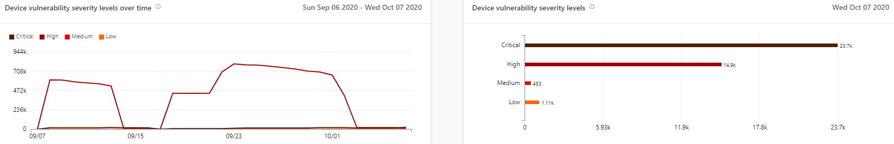
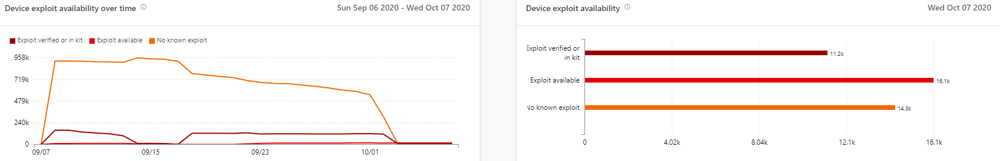
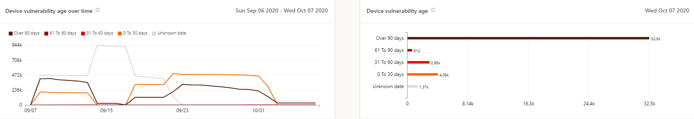
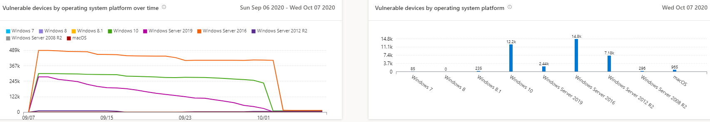
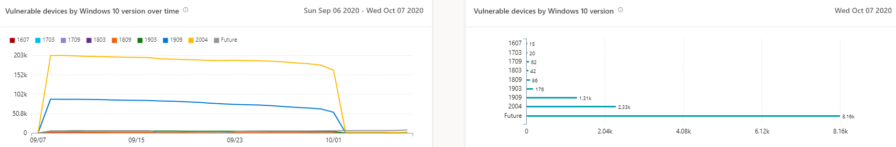

# Vulnerable devices report - threat and vulnerability management

[!INCLUDE [Microsoft 365 Defender rebranding](../../includes/microsoft-defender.md)]

**Applies to:**

- [Microsoft Defender for Endpoint](https://go.microsoft.com/fwlink/?linkid=2154037)
- [Threat and vulnerability management](next-gen-threat-and-vuln-mgt.md)
- [Microsoft 365 Defender](https://go.microsoft.com/fwlink/?linkid=2118804)

>Want to experience Microsoft Defender for Endpoint? [Sign up for a free trial.](https://www.microsoft.com/microsoft-365/windows/microsoft-defender-atp?ocid=docs-wdatp-portaloverview-abovefoldlink)

The report shows graphs and bar charts with vulnerable device trends and current statistics. The goal is for you to understand the breath and scope of your device exposure. 

Access the report in the Microsoft Defender Security Center by going to **Reports > Vulnerable devices**

There are two columns:

- Trends (over time). Can show the past 30 days, 3 months, 6 months, or a custom date range.
- Today (current information)

**Filter**: You can filter the data by vulnerability severity levels, exploit availability, vulnerability age, operating system platform, Windows 10 version, or device group.

**Drill down**: If there is an insight you want to explore further, select the relevant bar chart to view a filtered list of devices in the Device inventory page. From there, you can export the list.

## Severity level graphs

Each device is counted only once according to the most severe vulnerability found on that device.

## Exploit availability graphs

Each device is counted only once based on the highest level of known exploit.

## Vulnerability age graphs

Each device is counted only once under the oldest vulnerability publication date. Older vulnerabilities have a higher chance of being exploited.

## Vulnerable devices by operating system platform graphs

The number of devices on each operating system that are exposed due to software vulnerabilities.

## Vulnerable devices by Windows 10 version graphs

The number of devices on each Windows 10 version that are exposed due to vulnerable applications or OS.

## Related topics

- [Threat and vulnerability management overview](next-gen-threat-and-vuln-mgt.md)
- [Security recommendations](tvm-security-recommendation.md)
