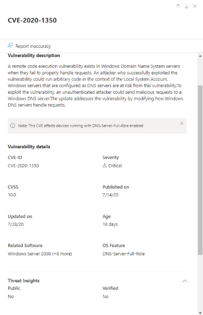
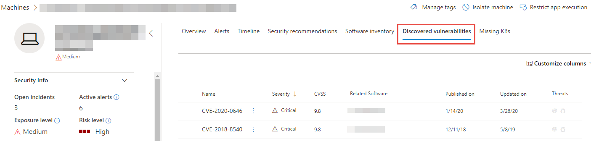
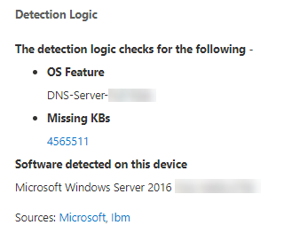

# Weaknesses found by threat and vulnerability management

[!INCLUDE [Microsoft 365 Defender rebranding](../../includes/microsoft-defender.md)]

**Applies to:**
- [Microsoft Defender Advanced Threat Protection (Microsoft Defender ATP)](https://go.microsoft.com/fwlink/p/?linkid=2069559)

>Want to experience Microsoft Defender ATP? [Sign up for a free trial.](https://www.microsoft.com/microsoft-365/windows/microsoft-defender-atp?ocid=docs-wdatp-portaloverview-abovefoldlink)

Threat and vulnerability management uses the same signals in Microsoft Defender ATP's endpoint protection to scan and detect vulnerabilities.

The **Weaknesses** page lists down the vulnerabilities found in the infected software running in your organization by listing the Common Vulnerabilities and Exposures (CVE) ID. You can also view the severity, Common Vulnerability Scoring System (CVSS) rating, prevalence in your organization, corresponding breach, threat insights, and more.

>[!NOTE]
>If there is no official CVE-ID assigned to a vulnerability, the vulnerability name is assigned by threat and vulnerability management.

>[!IMPORTANT]
>To boost your vulnerability assessment detection rates, you can download the following mandatory security updates and deploy them in your network:
>- 19H1 customers | [KB 4512941](https://support.microsoft.com/help/4512941/windows-10-update-kb4512941)
>- RS5 customers | [KB 4516077](https://support.microsoft.com/help/4516077/windows-10-update-kb4516077)
>- RS4 customers | [KB 4516045](https://support.microsoft.com/help/4516045/windows-10-update-kb4516045)
>- RS3 customers | [KB 4516071](https://support.microsoft.com/help/4516071/windows-10-update-kb4516071)

## Navigate to the Weaknesses page

Access the Weaknesses page a few different ways:

- Selecting **Weaknesses** from the threat and vulnerability management navigation menu in the [Microsoft Defender Security Center](portal-overview.md)
- Global search

### Navigation menu

Go to the threat and vulnerability management navigation menu and select **Weaknesses** to open the list of CVEs.

### Vulnerabilities in global search

1. Go to the global search drop-down menu.
2. Select **Vulnerability** and key-in the Common Vulnerabilities and Exposures (CVE) ID that you're looking for, then select the search icon. The **Weaknesses** page opens with the CVE information that you're looking for.

3. Select the CVE to open a flyout panel with more information, including the vulnerability description, details, threat insights, and exposed devices.

To see the rest of the vulnerabilities in the **Weaknesses** page, type CVE, then select search.

## Weaknesses overview

Remediate the vulnerabilities in exposed devices to reduce the risk to your assets and organization. If the **Exposed Devices** column shows 0, that means you aren't at risk.

### Breach and threat insights

View related breach and threat insights in the **Threat** column when the icons are colored red.

 >[!NOTE]
 > Always prioritize recommendations that are associated with ongoing threats. These recommendations are marked with the threat insight icon  and breach insight icon .  

The breach insights icon is highlighted if there's a vulnerability found in your organization.

The threat insights icon is highlighted if there are associated exploits in the vulnerability found in your organization. Hovering over the icon shows whether the threat is a part of an exploit kit, or connected to specific advanced persistent campaigns or activity groups. When available, there is a link to a Threat Analytics report with zero-day exploitation news, disclosures, or related security advisories.  

### Gain vulnerability insights

If you select a CVE, a flyout panel will open with more information, including the vulnerability description, details, threat insights, and exposed devices.

The "OS Feature" category is shown in relevant scenarios.

 

## View Common Vulnerabilities and Exposures (CVE) entries in other places

### Top vulnerable software in the dashboard

1. Go to the [threat and vulnerability management dashboard](tvm-dashboard-insights.md) and scroll down to the **Top vulnerable software** widget. You will see the number of vulnerabilities found in each software, along with threat information and a high-level view of device exposure over time.

    

2. Select the software you want to investigate to go to a drilldown page.
3. Select the **Discovered vulnerabilities** tab.
4. Select the vulnerability you want to investigate for more information on vulnerability details

    

### Discover vulnerabilities in the device page

View related weaknesses information in the device page.

1. Go to the Microsoft Defender Security Center navigation menu bar, then select the device icon. The **Devices list** page opens.
2. In the **Devices list** page, select the device name that you want to investigate.

    

3. The device page will open with details and response options for the device you want to investigate.
4. Select **Discovered vulnerabilities**.

    

5. Select the vulnerability that you want to investigate to open up a flyout panel with the CVE details, such as: vulnerability description, threat insights, and detection logic.

#### CVE Detection logic

Similar to the software evidence, we now show the detection logic we applied on a device in order to state that it's vulnerable. The new section is called "Detection Logic" (in any discovered vulnerability in the device page) and shows the detection logic and source.

The "OS Feature" category is also shown in relevant scenarios. A CVE would affect devices that run a vulnerable OS only if a specific OS component is enabled. Let's say Windows Server 2019 has vulnerability in its DNS component. With this new capability, we’ll only attach this CVE to the Windows Server 2019 devices with the DNS capability enabled in their OS.

## Report inaccuracy

Report a false positive when you see any vague, inaccurate, or incomplete information. You can also report on security recommendations that have already been remediated.

1. Open the CVE on the Weaknesses page.
2. Select **Report inaccuracy** and a flyout pane will open.
3. Select the inaccuracy category from the drop-down menu and fill in your email address and inaccuracy details.
4. Select **Submit**. Your feedback is immediately sent to the threat and vulnerability management experts.

## Related topics

- [Threat and vulnerability management overview](next-gen-threat-and-vuln-mgt.md)
- [Supported operating systems and platforms](tvm-supported-os.md)
- [Threat and vulnerability management dashboard](tvm-dashboard-insights.md)
- [Exposure score](tvm-exposure-score.md)
- [Microsoft Secure Score for Devices](tvm-microsoft-secure-score-devices.md)
- [Security recommendations](tvm-security-recommendation.md)
- [Remediation and exception](tvm-remediation.md)
- [Software inventory](tvm-software-inventory.md)
- [Event timeline](threat-and-vuln-mgt-event-timeline.md)
- [Scenarios](threat-and-vuln-mgt-scenarios.md)
- [APIs](next-gen-threat-and-vuln-mgt.md#apis)
- [Configure data access for threat and vulnerability management roles](user-roles.md#create-roles-and-assign-the-role-to-an-azure-active-directory-group)
