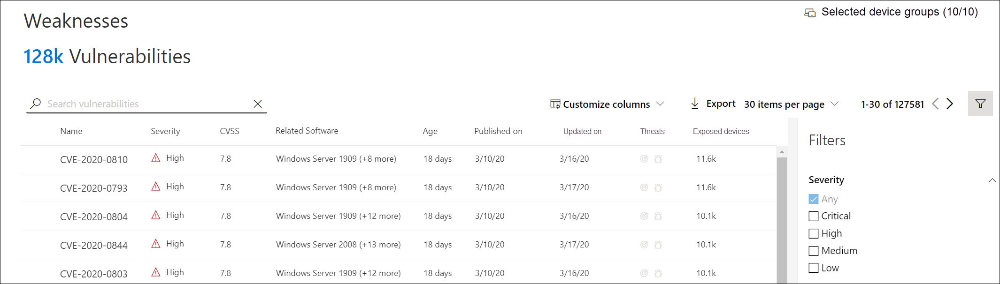
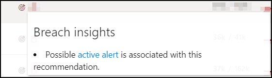
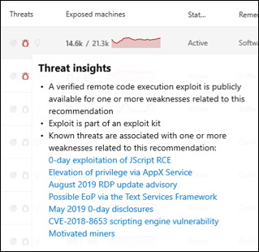
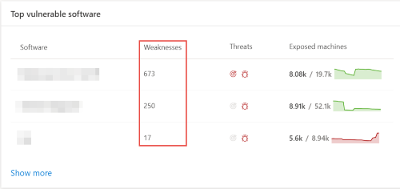
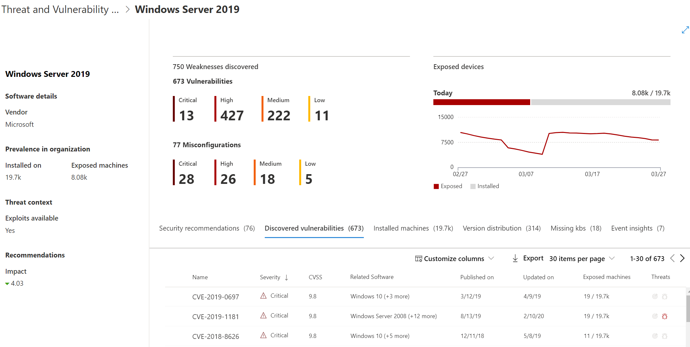
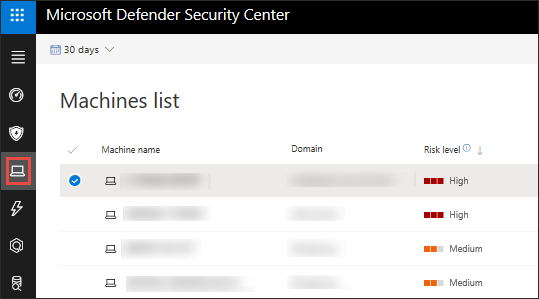
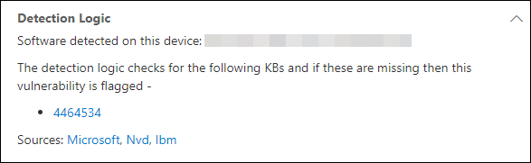

# Weaknesses

**Applies to:**
- [Microsoft Defender Advanced Threat Protection (Microsoft Defender ATP)](https://go.microsoft.com/fwlink/p/?linkid=2069559)

>Want to experience Microsoft Defender ATP? [Sign up for a free trial.](https://www.microsoft.com/microsoft-365/windows/microsoft-defender-atp?ocid=docs-wdatp-portaloverview-abovefoldlink)

[!include[Prerelease information](../../includes/prerelease.md)]

Threat & Vulnerability Management leverages the same signals in Microsoft Defender ATP's endpoint protection to scan and detect vulnerabilities.

The **Weaknesses** page lists down the vulnerabilities found in the infected software running in your organization by listing the Common Vulnerabilities and Exposures (CVE) ID, the severity, Common Vulnerability Scoring System (CVSS) rating, prevalence in your organization, corresponding breach, and threat insights.

>[!IMPORTANT]
>To boost your vulnerability assessment detection rates, you can download the following mandatory security updates and deploy them in your network:
>- 19H1 customers | [KB 4512941](https://support.microsoft.com/help/4512941/windows-10-update-kb4512941)
>- RS5 customers | [KB 4516077](https://support.microsoft.com/help/4516077/windows-10-update-kb4516077)
>- RS4 customers | [KB 4516045](https://support.microsoft.com/help/4516045/windows-10-update-kb4516045)
>- RS3 customers | [KB 4516071](https://support.microsoft.com/help/4516071/windows-10-update-kb4516071)

## Navigate to the Weaknesses page

Access the Weaknesses page a few different ways:

- Selecting **Weaknesses** from the Threat & Vulnerability Management navigation menu in the [Microsoft Defender Security Center](portal-overview.md)
- Global search

### Navigation menu

Go to the Threat & Vulnerability Management navigation menu and select **Weaknesses** to open the list of CVEs.

### Vulnerabilities in global search

1. Go to the global search drop-down menu.
2. Select **Vulnerability** and key-in the Common Vulnerabilities and Exposures (CVE) ID that you are looking for, then select the search icon. The **Weaknesses** page opens with the CVE information that you are looking for.

3. Select the CVE and a flyout panel opens up with more information - the vulnerability description, exploits available, severity level, CVSS v3 rating, publishing and update dates.

To see the rest of the vulnerabilities in the **Weaknesses** page, type CVE, then click search.

## Weaknesses overview

If the **Exposed Devices** column shows 0, that means you are not at risk. If exposed devices exist, the next step is to remediate the vulnerabilities in those devices to reduce the risk to your assets and organization.

### Breach and threat insights

You can view the related breach and threat insights in the **Threat** column when the icons are colored red.

 >[!NOTE]
 > Always prioritize recommendations that are associated with ongoing threats. These recommendations are marked with the threat insight icon  and breach insight icon .  

The breach insights icon is highlighted if there is a vulnerability found in your organization.

The threat insights icon is highlighted if there are associated exploits in the vulnerability found in your organization. It also shows whether the threat is a part of an exploit kit or connected to specific advanced persistent campaigns or activity groups. Threat Analytics report links are provided that you can read with zero-day exploitation news, disclosures, or related security advisories.  

## View Common Vulnerabilities and Exposures (CVE) entries in other places

### Top vulnerable software in the dashboard

1. Go to the [Threat & Vulnerability Management dashboard](tvm-dashboard-insights.md) and scroll down to the **Top vulnerable software** widget. You will see the number of vulnerabilities found in each software along with threat information and a high-level view of the device exposure trend over time.

    

2. Select the software that you want to investigate to go a drill down page.
3. Select the **Discovered vulnerabilities** tab.
4. Select the vulnerability that you want to investigate. A flyout panel will appear with the vulnerability details, such as: CVE description, CVE ID, exploits available, CVSS V3 rating, severity, publish, and update dates.  

    

### Discover vulnerabilities in the device page

View related weaknesses information in the device page.

1. Go to the Microsoft Defender Security Center navigation menu bar, then select the device icon. The **Devices list** page opens.
2. In the **Devices list** page, select the device name that you want to investigate.

    

3. The device page will open with details and response options for the device you want to investigate.
4. Select **Discovered vulnerabilities**.

    [Screenshot of the device page with details and response options](images/tvm-discovered-vulnerabilities.png)

5. Select the vulnerability that you want to investigate to open up a flyout panel with the CVE details, such as: vulnerability description, threat insights, and detection logic.

#### CVE Detection logic

Similar to the software evidence, we now show the detection logic we applied on a device in order to state that it's vulnerable. This is a new section called "Detection Logic" (in any discovered vulnerability in the device page) that shows the detection logic and source.

## Report inaccuracy

You can report a false positive when you see any vague, inaccurate, incomplete, or already remediated security recommendation information.

1. Open the CVE on the Weaknesses page.
2. Select **Report inaccuracy**.
3. From the flyout pane, select the inaccuracy category from the drop-down menu, fill in your email address, and details regarding the inaccuracy.
4. Select **Submit**. Your feedback is immediately sent to the Threat & Vulnerability Management experts.

## Related topics

- [Threat & Vulnerability Management overview](next-gen-threat-and-vuln-mgt.md)
- [Supported operating systems and platforms](tvm-supported-os.md)
- [Threat & Vulnerability Management dashboard](tvm-dashboard-insights.md)
- [Exposure score](tvm-exposure-score.md)
- [Configuration score](configuration-score.md)
- [Security recommendations](tvm-security-recommendation.md)
- [Remediation and exception](tvm-remediation.md)
- [Software inventory](tvm-software-inventory.md)
- [Scenarios](threat-and-vuln-mgt-scenarios.md)
- [APIs](threat-and-vuln-mgt-scenarios.md#apis)
- [Configure data access for Threat & Vulnerability Management roles](user-roles.md#create-roles-and-assign-the-role-to-an-azure-active-directory-group)