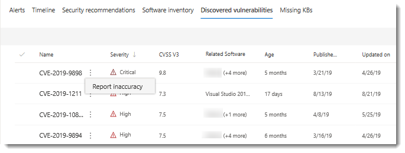
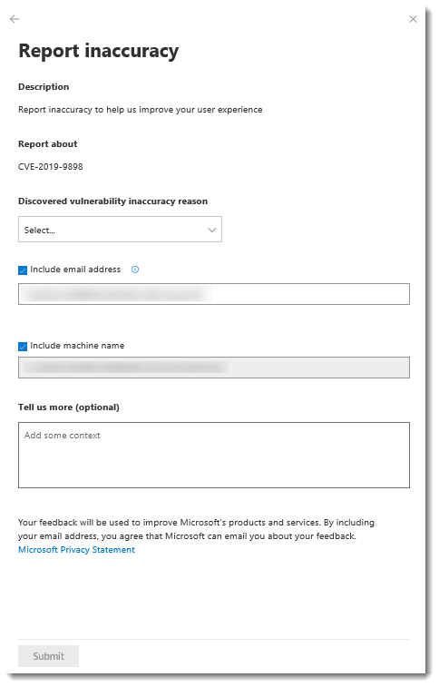
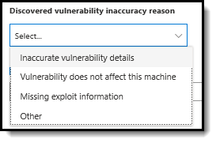

# Weaknesses

**Applies to:**
- [Microsoft Defender Advanced Threat Protection (Microsoft Defender ATP)](https://go.microsoft.com/fwlink/p/?linkid=2069559)

>Want to experience Microsoft Defender ATP? [Sign up for a free trial.](https://www.microsoft.com/microsoft-365/windows/microsoft-defender-atp?ocid=docs-wdatp-portaloverview-abovefoldlink)

[!include[Prerelease information](../../includes/prerelease.md)]

Threat & Vulnerability Management leverages the same signals in Microsoft Defender ATP's endpoint protection to scan and detect vulnerabilities.

The **Weaknesses** page lists down the vulnerabilities found in the infected software running in your organization, their severity, Common Vulnerability Scoring System (CVSS) rating, its prevalence in your organization, corresponding breach, and threat insights.

You can access the list of vulnerabilities in a few places in the portal:

- Global search
- Weaknesses option in the navigation menu
- Top vulnerable software widget in the dashboard
- Discovered vulnerabilities page in the machine page

>[!IMPORTANT]
>To boost your vulnerability assessment detection rates, you can download the following mandatory security updates and deploy them in your network:
>- 19H1 customers | [KB 4512941](https://support.microsoft.com/help/4512941/windows-10-update-kb4512941)
>- RS5 customers | [KB 4516077](https://support.microsoft.com/help/4516077/windows-10-update-kb4516077)
>- RS4 customers | [KB 4516045](https://support.microsoft.com/help/4516045/windows-10-update-kb4516045)
>- RS3 customers | [KB 4516071](https://support.microsoft.com/help/4516071/windows-10-update-kb4516071)

## Navigate to the Weaknesses page

When new vulnerabilities are released, you can find out how many of your assets are exposed in the **Weaknesses** page of the Threat & Vulnerability Management navigation menu. If the **Exposed Machines** column shows 0, that means you are not at risk. If exposed machines exist, the next step is to remediate the vulnerabilities in those machines to reduce the risk to your assets and organization.

### Breach and threat insights

You can view the related breach and threat insights in the **Threat** column when the icons are colored red.

 >[!NOTE]
 > Always prioritize recommendations that are associated with ongoing threats. These recommendations are marked with the threat insight  icon and breach insight  icon.  

The breach insights icon is highlighted if there is a vulnerability found in your organization.

The threat insights icon is highlighted if there are associated exploits in the vulnerability found in your organization. It also shows whether the threat is a part of an exploit kit or connected to specific advanced persistent campaigns or activity groups. Threat Analytics report links are provided that you can read with zero-day exploitation news, disclosures, or related security advisories.  

## Vulnerabilities in global search

1. Go to the global search drop-down menu.
2. Select **Vulnerability** and key-in the Common Vulnerabilities and Exposures (CVE) ID that you are looking for, then select the search icon. The **Weaknesses** page opens with the CVE information that you are looking for.

3. Select the CVE and a flyout panel opens up with more information - the vulnerability description, exploits available, severity level, CVSS v3 rating, publishing and update dates.

To see the rest of the vulnerabilities in the **Weaknesses** page, type CVE, then click search.

## Top vulnerable software in the dashboard

1. Go to the [Threat & Vulnerability Management dashboard](tvm-dashboard-insights.md) and scroll down to the **Top vulnerable software** widget. You will see the number of vulnerabilities found in each software along with threat information and a high-level view of the device exposure trend over time.

2. Select the software that you want to investigate to go a drill down page.
3. Select the **Discovered vulnerabilities** tab.
4. Select the vulnerability that you want to investigate to open up a flyout panel with the vulnerability details, such as: CVE description, CVE ID, exploits available, CVSS V3 rating, severity, publish, and update dates.  

## Discover vulnerabilities in the machine page

1. Go to the left-hand navigation menu bar, then select the machine icon. The **Machines list** page opens.
2. In the **Machines list** page, select the machine name that you want to investigate. 
  
3. The machine page will open with details and response options for the machine you want to investigate. 
4. Select **Discovered vulnerabilities**.
  
5. Select the vulnerability that you want to investigate to open up a flyout panel with the CVE details, such as: vulnerability description, threat insights, and detection logic.

### CVE Detection logic

Similar to the software evidence, we now show the detection logic we applied on a machine in order to state that it's vulnerable. This is a new section called "Detection Logic" (in any discovered vulnerability in the machine page) that shows the detection logic and source.

## Report inaccuracy

You can report a false positive when you see any vague, inaccurate, missing, or already remediated vulnerability information in the machine page.

1. Select the **Discovered vulnerabilities** tab.

2. Click **:** beside the vulnerability that you want to report about, and then select **Report inaccuracy**.

 A flyout pane opens. 

3. From the flyout pane, select the inaccuracy category from the **Discovered vulnerability inaccuracy reason** drop-down menu.
  

4. Include your email address so Microsoft can send you feedback regarding the inaccuracy you reported.

5. Include your machine name for investigation context.

    > [!NOTE]
    > You can also provide details regarding the inaccuracy you reported in the **Tell us more (optional)** field to give the threat and vulnerability management investigators context.

6. Click **Submit**. Your feedback is immediately sent to the Threat & Vulnerability Management experts with its context.

## Related topics
- [Supported operating systems and platforms](tvm-supported-os.md)
- [Risk-based Threat & Vulnerability Management](next-gen-threat-and-vuln-mgt.md) 
- [Threat & Vulnerability Management dashboard overview](tvm-dashboard-insights.md)
- [Exposure score](tvm-exposure-score.md)
- [Configuration score](configuration-score.md)
- [Security recommendation](tvm-security-recommendation.md)
- [Remediation and exception](tvm-remediation.md)
- [Software inventory](tvm-software-inventory.md)
- [Scenarios](threat-and-vuln-mgt-scenarios.md)
- [Configure data access for Threat & Vulnerability Management roles](https://docs.microsoft.com/windows/security/threat-protection/microsoft-defender-atp/user-roles#create-roles-and-assign-the-role-to-an-azure-active-directory-group)
- [Vulnerability APIs](https://docs.microsoft.com/windows/security/threat-protection/microsoft-defender-atp/vulnerability)
- [Machine APIs](https://docs.microsoft.com/windows/security/threat-protection/microsoft-defender-atp/machine)
- [Software APIs](https://docs.microsoft.com/windows/security/threat-protection/microsoft-defender-atp/software)
- [Recommendation APIs](https://docs.microsoft.com/windows/security/threat-protection/microsoft-defender-atp/vulnerability)
- [Score APIs](https://docs.microsoft.com/windows/security/threat-protection/microsoft-defender-atp/score)
