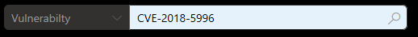
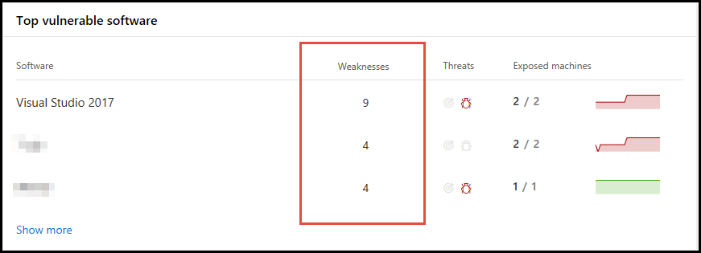

# Weaknesses
**Applies to:**
- [Microsoft Defender Advanced Threat Protection (Microsoft Defender ATP)](https://go.microsoft.com/fwlink/p/?linkid=2069559)

Threat & Vulnerability Management leverages the same signals in Microsoft Defender ATP's endpoint protection to scan and detect vulnerabilities.

The **Weaknesses** page lists down the vulnerabilities found in the infected software running in your organization, their severity, Common Vulnerability Scoring System (CVSS) rating, its prevalence in your organization, corresponding breach, and threat insights. 

## Navigate through your organization's weaknesses page
You can see the list of vulnerabilities in three ways: 

*Vulnerabilities in global search*
1. Click the global search drop-down menu.
2. Select **Vulnerability** and key-in the Common Vulnerabilities and Exposures (CVE) ID that you are looking for, then click the search icon. The **Weaknesses** page opens with the CVE information that you are looking for. 

3. Select the CVE and a flyout panel opens up with more information - the vulnerability description, exploits available, severity level, CVSS v3 rating, publishing and update dates. 

>[!NOTE]
>To see the rest of the vulnerabilities in the **Weaknesses** page, type CVE, then click search. 

*Weaknesses page in the menu* 
1. Go to the Threat & Vulnerability Management navigation menu and select **Weaknesses** to open up the list of vulnerabilities found in your organization.
2. Select the vulnerability that you want to investigate to open up a flyout panel with the vulnerability details, such as: CVE description, CVE ID, exploits available, CVSS V3 rating, severity, publish, and update dates.  

*Top vulnerable software widget in the dashboard* 
1. Go to the Threat & Vulnerability Management dashboard and scroll down to the **Top vulnerable software** widget. You will see the number of vulnerabilities found in each software along with threat information and a high-level view of the device exposure trend over time. 

2. Click the software that you want to investigate and it takes you to the software page. You will the weaknesses found in your machine per severity level, in which machines are they installed, version distribution, and the corresponding security recommendation. 
3. Select the **Discovered vulnerabilities** tab. 
4. Select the vulnerability that you want to investigate to open up a flyout panel with the vulnerability details, such as: CVE description, CVE ID, exploits available, CVSS V3 rating, severity, publish, and update dates.  

## How it works
When new vulnerabilities are released, you would want know how many of your assets are exposed. You can see the list of vulnerabilities and the details in the **Weaknesses** page. 

If the **Exposed Machines** column shows 0, that means you are not infected. 

If there's a number in the **Exposed Machines**, that means you need to remediate the vulnerabilities in those machines because they  put the rest of your assets and your organization at risk. 

You can also see the related alert and threat insights in the **Threat** column.

 >[!NOTE]
 > Always prioritize recommendations that are associated with ongoing threats. These recommendations are marked with the threat insight  icon and possible active alert  icon.  

## Related topics
- [Risk-based Threat & Vulnerability Management](next-gen-threat-and-vuln-mgt.md) 
- [Threat & Vulnerability Management dashboard overview](tvm-dashboard-insights.md)
- [Exposure score](tvm-exposure-score.md)
- [Configuration score](configuration-score.md)
- [Security recommendation](tvm-security-recommendation.md)
- [Remediation](tvm-remediation.md)
- [Software inventory](tvm-software-inventory.md)
- [Scenarios](threat-and-vuln-mgt-scenarios.md)
