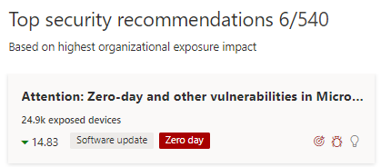
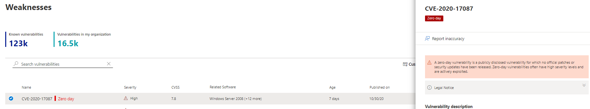
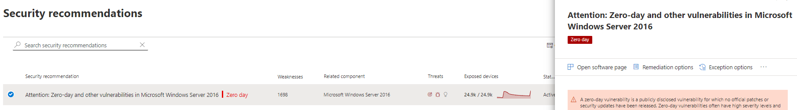
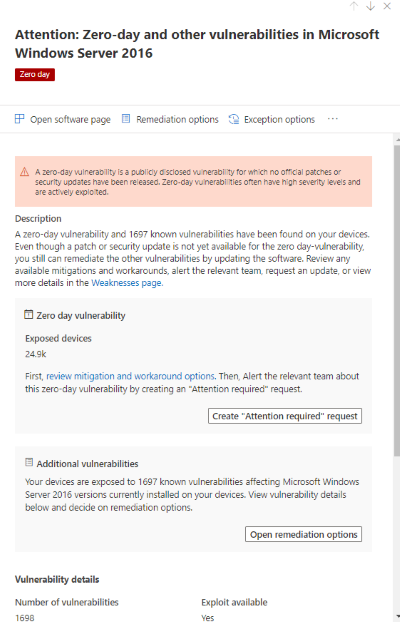
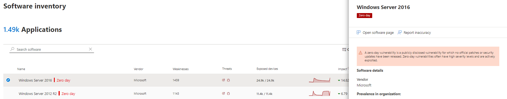
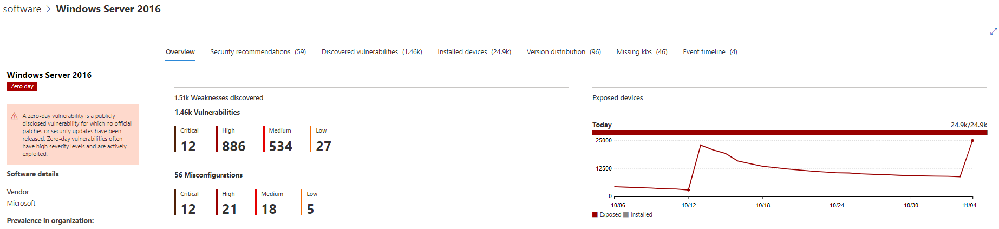

# Mitigate zero-day vulnerabilities - threat and vulnerability management

[!INCLUDE [Microsoft 365 Defender rebranding](../../includes/microsoft-defender.md)]

**Applies to:**

- [Microsoft Defender Advanced Threat Protection (Microsoft Defender ATP)](https://go.microsoft.com/fwlink/p/?linkid=2146631)
- [Threat and vulnerability management](next-gen-threat-and-vuln-mgt.md)

>Want to experience Microsoft Defender ATP? [Sign up for a free trial.](https://www.microsoft.com/microsoft-365/windows/microsoft-defender-atp?ocid=docs-wdatp-portaloverview-abovefoldlink)

A zero-day vulnerability is a publicly disclosed vulnerability for which no official patches or security updates have been released. Zero-day vulnerabilities often have high severity levels and are actively exploited.

Threat and vulnerability management will only display zero-day vulnerabilities it has information about.

## Find information about zero-day vulnerabilities

Once a zero-day vulnerability has been found, information about it will be conveyed through the following experiences in the Microsoft Defender Security Center.

### Threat and vulnerability management dashboard

Find recommendations with a zero-day tag in the “Top security recommendation” card.

### Weaknesses page

Find the named zero-day vulnerability along with a description and details.

- If this vulnerability has a CVE-ID assigned, you’ll see the zero-day label next to the CVE name.

- If this vulnerability has no CVE-ID assigned, you will find it under an internal, temporary name that looks like “TVM-XXXX-XXXX”. The name will be updated once an official CVE-ID has been assigned, but the previous internal name will still be searchable and found in the side-panel.

### Security recommendations page

Clear suggestions regarding remediation and mitigation options, including workarounds if exist.

When there is an application with associated zero-day vulnerability and additional vulnerabilities to address, you will get one recommendation regarding both.

## Addressing the zero-day vulnerability

Go to the security recommendation page and select the zero-day vulnerability. A flyout will open with information about the zero-day and other vulnerabilities for that software.

There will be a link to mitigation options and workarounds if they are available. Workarounds may help reduce the risk posed by this zero-day vulnerability until a patch or security update can be deployed.

Open remediation options and choose the attention type.

## Patching the zero-day vulnerability

When a patch is released for the zero-day, the recommendation will be changed to “Update” and a blue label next to it that says “New security update for zero day.”

## Other places to find vulnerable software

### Software inventory page

Find software with the zero-day tag.

### Software page

Find a zero-day tag for each software that has been affected by the zero–day vulnerability.

## Related topics

- [Threat and vulnerability management overview](next-gen-threat-and-vuln-mgt.md)
- [Security recommendations](tvm-security-recommendation.md)
