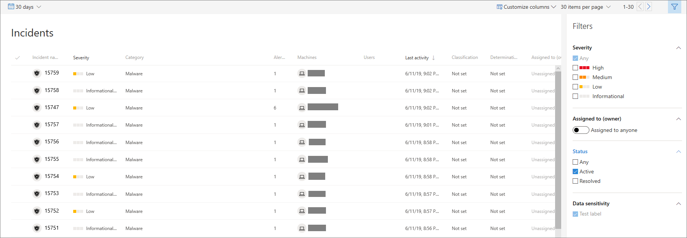

# View and organize the Microsoft Defender Advanced Threat Protection Incidents queue
**Applies to:**
- [Microsoft Defender Advanced Threat Protection (Microsoft Defender ATP)](https://go.microsoft.com/fwlink/p/?linkid=2069559)

The **Incidents queue** shows a collection of incidents that were flagged from machines in your network. It helps you sort through incidents to prioritize and create an informed cybersecurity response decision.

By default, the queue displays incidents seen in the last 30 days, with the most recent incident showing at the top of the list, helping you see the most recent incidents first.

There are several options you can choose from to customize the Incidents queue view. 

On the top navigation you can:
- Customize columns to add or remove columns 
- Modify the number of items to view per page
- Select the items to show per page
- Batch-select the incidents to assign 
- Navigate between pages
- Apply filters

## Sort and filter the incidents queue
You can apply the following filters to limit the list of incidents and get a more focused view.

### Severity

Incident severity | Description
:---|:---
High  (Red) | Threats often associated with advanced persistent threats (APT). These incidents indicate a high risk due to the severity of damage they can inflict on machines.
Medium  (Orange) | Threats rarely observed in the organization, such as anomalous registry change, execution of suspicious files, and observed behaviors typical of attack stages.
Low  (Yellow) | Threats associated with prevalent malware and hack-tools that do not necessarily indicate an advanced threat targeting the organization.
Informational  (Grey) | Informational incidents are those that might not be considered harmful to the network but might be good to keep track of.

## Assigned to
You can choose to filter the list by selecting assigned to anyone or ones that are assigned to you.

### Category
Incidents are categorized based on the description of the stage by which the cybersecurity kill chain is in. This view helps the threat analyst to determine priority, urgency, and corresponding response strategy to deploy based on context.

### Status
You can choose to limit the list of incidents shown based on their status to see which ones are active or resolved.

### Data sensitivity
Use this filter to show incidents that contain sensitivity labels.

## Related topics
- [Incidents queue](incidents-queue.md)
- [Manage incidents](manage-incidents.md)
- [Investigate incidents](investigate-incidents.md)

