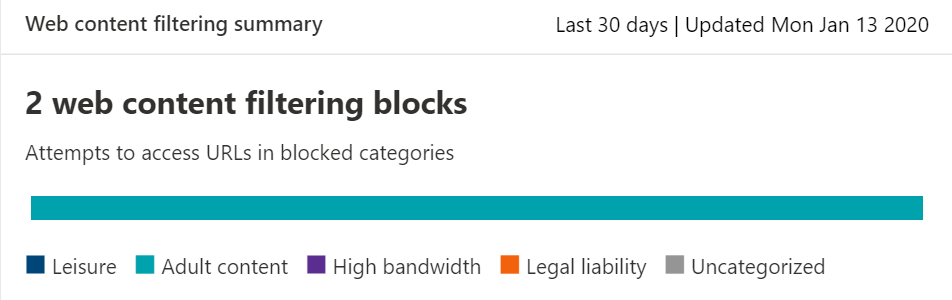
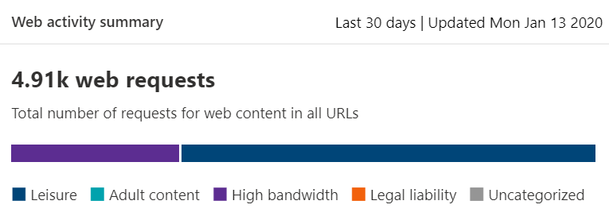
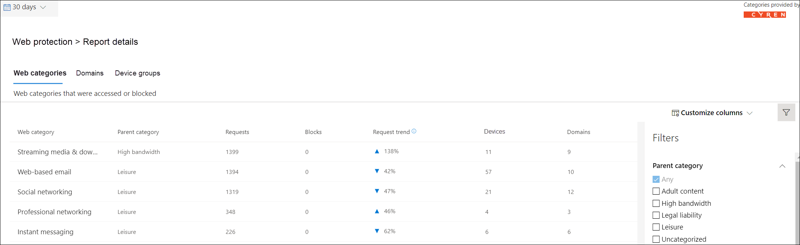

# Web content filtering

[!INCLUDE [Microsoft 365 Defender rebranding](../../includes/microsoft-defender.md)]

**Applies to:**
- [Microsoft Defender for Endpoint](https://go.microsoft.com/fwlink/p/?linkid=2154037)
- [Microsoft 365 Defender](https://go.microsoft.com/fwlink/p/?linkid=2118804)

> [!IMPORTANT]
> **Web content filtering is currently in public preview** 
> This preview version is provided without a service level agreement, and it's not recommended for production workloads. Certain features might not be supported or might have constrained capabilities.
> For more information, see [Microsoft Defender for Endpoint preview features](preview.md).

>Want to experience Microsoft Defender for Endpoint? [Sign up for a free trial.](https://www.microsoft.com/microsoft-365/windows/microsoft-defender-atp?ocid=docs-wdatp-main-abovefoldlink&rtc=1)

Web content filtering is part of [Web protection](web-protection-overview.md) capabilities in Microsoft Defender for Endpoint. It enables your organization to track and regulate access to websites based on their content categories. Many of these websites, while not malicious, might be problematic because of compliance regulations, bandwidth usage, or other concerns.

Configure policies across your device groups to block certain categories. Blocking a category prevents users within specified device groups from accessing URLs associated with the category. For any category that's not blocked, the URLs are automatically audited. Your users can access the URLs without disruption, and you'll gather access statistics to help create a more custom policy decision. Your users will see a block notification if an element on the page they're viewing is making calls to a blocked resource.

Web content filtering is available on the major web browsers, with blocks performed by Windows Defender SmartScreen (Microsoft Edge) and Network Protection (Chrome, Firefox, Brave and Opera). For more information about browser support, see the prerequisites section.

Summarizing the benefits:

- Users are prevented from accessing websites in blocked categories, whether they're browsing on-premises or away
- Conveniently deploy policies to groups of users using device groups defined in [Microsoft Defender for Endpoint role-based access control settings](https://docs.microsoft.com/windows/security/threat-protection/microsoft-defender-atp/rbac)
- Access web reports in the same central location, with visibility over actual blocks and web usage

## User experience

The blocking experience for 3rd party supported browsers is provided by Network Protection, which provides a system-level toast notifying the user of a blocked connection. 

For a more user-friendly in-browser experience, consider using Microsoft Edge.

## Prerequisites

Before trying out this feature, make sure you have the following requirements:

- Windows 10 Enterprise E5 license OR Microsoft 365 E3 + Microsoft 365 E5 Security add-on.
- Access to Microsoft Defender Security Center portal
- Devices running Windows 10 Anniversary Update (version 1607) or later with the latest MoCAMP update.

If Windows Defender SmartScreen isn't turned on, Network Protection will take over the blocking. It requires [enabling Network Protection](enable-network-protection.md) on the device. Chrome, Firefox, Brave, and Opera are currently 3rd party browsers in which this feature is enabled.

## Data handling

We will follow whichever region you have elected to use as part of your [Microsoft Defender for Endpoint data handling settings](https://docs.microsoft.com/windows/security/threat-protection/microsoft-defender-atp/data-storage-privacy). Your data will not leave the data center in that region. In addition, your data will not be shared with any third-parties, including our data providers.

## Turn on web content filtering

From the left-hand navigation menu, select **Settings > General > Advanced Features**. Scroll down until you see the entry for **Web content filtering**. Switch the toggle to **On** and **Save preferences**.

### Configure web content filtering policies

Web content filtering policies specify which site categories are blocked on which device groups. To manage the policies, go to **Settings > Rules > Web content filtering**.

Use the filter to locate policies that contain certain blocked categories or are applied to specific device groups.

### Create a policy

To add a new policy:

1. Select **Add policy** on the **Web content filtering** page in **Settings**.
2. Specify a name.
3. Select the categories to block. Use the expand icon to fully expand each parent category and select specific web content categories.
4. Specify the policy scope. Select the device groups to specify where to apply the policy. Only devices in the selected device groups will be prevented from accessing websites in the selected categories.
5. Review the summary and save the policy. The policy refresh may take up to 2 hours to apply to your selected devices.

Tip: You can deploy a policy without selecting any category on a device group. This action will create an audit only policy, to help you understand user behavior before creating a block policy.

>[!NOTE]
>If you are removing a policy or changing device groups at the same time, this might cause a delay in policy deployment.

>[!IMPORTANT]
>Blocking the "Uncategorized" category may lead to unexpected and undesired results.  

### Allow specific websites

It's possible to override the blocked category in web content filtering to allow a single site by creating a custom indicator policy. The custom indicator policy will supersede the web content filtering policy when it's applied to the device group in question.

1. Create a custom indicator in the Microsoft Defender Security Center by going to **Settings** > **Indicators** > **URL/Domain** > **Add Item**
2. Enter the domain of the site
3. Set the policy action to **Allow**.  

### Reporting inaccuracies

If you encounter a domain that has been incorrectly categorized, you can report inaccuracies directly to us from the Web Content Filtering reports page. This feature is available only in the new Microsoft 365 security center (security.microsoft.com).

To report an inaccuracy, navigate to **Reports > Web protection > Web Content Filtering Details > Domains**. On the domains tab of our Web Content Filtering reports, you will see an ellipsis beside each of the domains. Hover over this ellipsis and select **Report Inaccuracy**.

A panel will open where you can select the priority and add additional details such as the suggested category for re-categorization. Once you complete the form, select **Submit**. Our team will review the request within one business day. For immediate unblocking, create a [custom allow indicator](indicator-ip-domain.md).

## Web content filtering cards and details

Select **Reports > Web protection** to view cards with information about web content filtering and web threat protection. The following cards provide summary information about web content filtering.

### Web activity by category

This card lists the parent web content categories with the largest increase or decrease in the number of access attempts. Understand drastic changes in web activity patterns in your organization from last 30 days, 3 months, or 6 months. Select a category name to view more information.

In the first 30 days of using this feature, your organization might not have enough data to display this information.

### Web content filtering  summary card

This card displays the distribution of blocked access attempts across the different parent web content categories. Select one of the colored bars to view more information about a specific parent web category.

### Web activity summary card

This card displays the total number of requests for web content in all URLs.

### View card details

You can access the **Report details** for each card by selecting a table row or colored bar from the chart in the card. The report details page for each card contains extensive statistical data about web content categories, website domains, and device groups.

- **Web categories**: Lists the web content categories that have had access attempts in your organization. Select a specific category to open a summary flyout.

- **Domains**: Lists the web domains that have been accessed or blocked in your organization. Select a specific domain to view detailed information about that domain.

- **Device groups**: Lists all the device groups that have generated web activity in your organization

Use the time range filter at the top left of the page to select a time period. You can also filter the information or customize the columns. Select a row to open a flyout pane with even more information about the selected item.

## Errors and issues

### Limitations and known issues in this preview

- Only Microsoft Edge is supported if your device's OS configuration is Server (cmd > Systeminfo > OS Configuration). Network Protection is only supported in Inspect mode on Server devices, which is responsible for securing traffic across supported 3rd party browsers.

- Unassigned devices will have incorrect data shown within the report. In the Report details > Device groups pivot, you may see a row with a blank Device Group field. This group contains your unassigned devices before they get put into your specified group. The report for this row may not contain an accurate count of devices or access counts.

## Related topics

- [Web protection overview](web-protection-overview.md)
- [Web threat protection](web-threat-protection.md)
- [Monitor web security](web-protection-monitoring.md)
- [Respond to web threats](web-protection-response.md)
