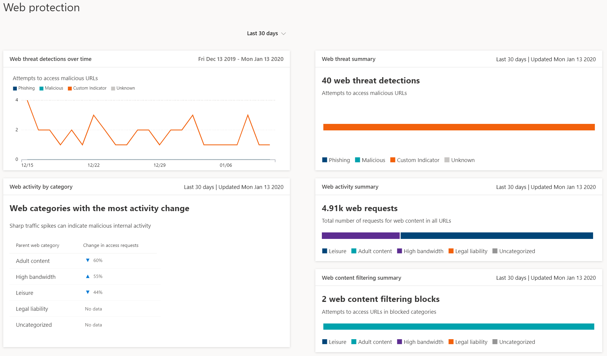

# Web protection

>Want to experience Microsoft Defender ATP? [Sign up for a free trial.](https://www.microsoft.com/microsoft-365/windows/microsoft-defender-atp?ocid=docs-wdatp-main-abovefoldlink&rtc=1)

Web protection in Microsoft Defender ATP is a capability made up of [Web threat protection](web-threat-protection.md) and [Web content filtering](web-content-filtering.md). Web protection lets you secure your devices against web threats and helps you regulate unwanted content. You can find Web protection reports in the Microsoft Defender Security Center by going to **Reports > Web protection**.

## Web threat protection

The cards that make up web threat protection are **Web threat detections over time** and **Web threat summary**.

Web threat protection includes:
- Comprehensive visibility into web threats affecting your organization
- Investigation capabilities over web-related threat activity through alerts and comprehensive profiles of URLs and the devices that access these URLs
- A full set of security features that track general access trends to malicious and unwanted websites

## Web content filtering

The cards that comprise web content filtering are **Web activity by category**, **Web content filtering summary**, and **Web activity summary**.

Web content filtering includes:
- Users are prevented from accessing websites in blocked categories, whether they are browsing on-premises or away
- You can conveniently deploy varied policies to various sets of users using the device groups defined in the [Microsoft Defender ATP role-based access control settings](https://docs.microsoft.com/windows/security/threat-protection/microsoft-defender-atp/rbac)
- You can access web reports in the same central location, with visibility over actual blocks and web usage

## In this section

Topic | Description
:---|:---
[Web threat protection](web-threat-protection.md) | Stop access to phishing sites, malware vectors, exploit sites, untrusted or low-reputation sites, as well as sites that you have blocked.
[Web content filtering](web-content-filtering.md) | Track and regulate access to websites based on their content categories.
