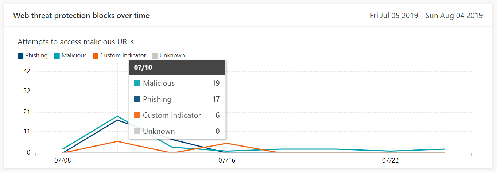
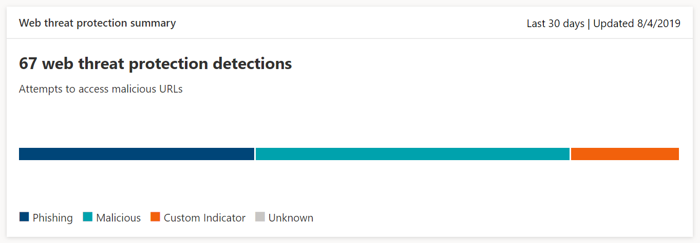

# Monitor web browsing security

>Want to experience Microsoft Defender ATP? [Sign up for a free trial.](https://www.microsoft.com/en-us/WindowsForBusiness/windows-atp?ocid=docs-wdatp-advancedhunting-abovefoldlink)

[!include[Prerelease information](prerelease.md)]

Web threat protection lets you monitor your organization’s web browsing security through reports under **Reports > Web protection** in the Microsoft Defender Security Center. The report contains the following cards that provide detection statistics from web threat protection:

- **Web threat protection detections over time** — this trending card displays the number of web threats detected by type during the selected time period (Last 30 days, Last 3 months, Last 6 months)
 
    

- **Web threat protection summary** — this card displays the total web threat protection detections in the past 30 days, showing distribution across the different types of web threats. Clicking a slice opens the list of the domains that were found with malicious or unwanted websites.

    

>[!Note]
>It can take up to 12 hours before a block is reflected in the cards or the domain list.

## Types of web threats
Web threat protection categorizes malicious and unwanted websites as:
- **Phishing** — websites that contain spoofed web forms and other phishing mechanisms designed to trick users into divulging credentials and other sensitive information
- **Malicious** — websites that host malware and exploit code
- **Custom indicator** — websites whose URLs or domains you've added to your [custom indicator list](manage-indicators.md) for blocking

## View the domain list
Clicking on a specific web threat category in the **Web threat protection summary** card opens the **Domains** page, which shows a list of the domains prefiltered under that threat category. The page provides the following information for each domain:

- **Access count** — number of requests for URLs in the domain
- **Blocks** — number of times requests were blocked
- **Access trend** — change in number of access attempts
- **Threat category** — type of web threat
- **Machines** — number of machines with access attempts

Selecting a domain opens a panel that shows the list of URLs in that domain that have been accessed. The panel also lists machines that have attempted to access URLs in the domain.

## Related topics
- [Web threat protection overview](web-threat-protection-overview.md)
- [Respond to web threats](web-threat-protection-response.md)