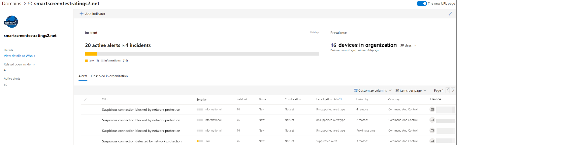
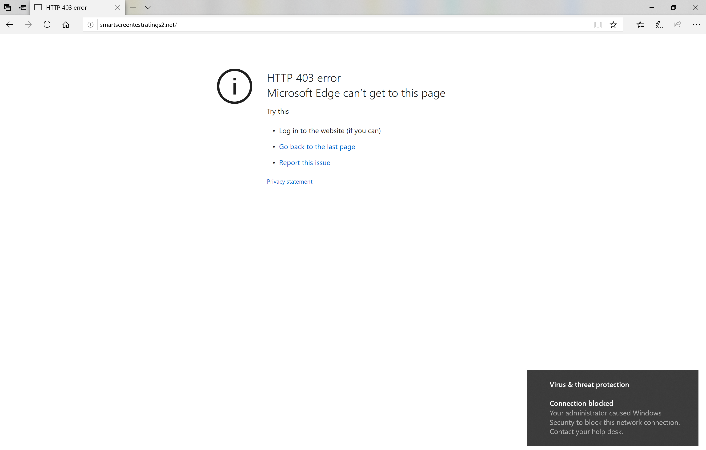
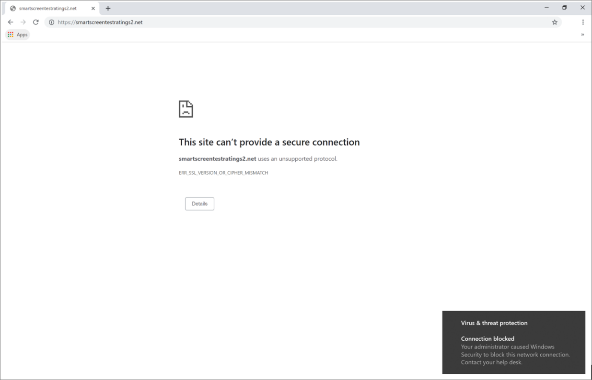

# Respond to web threats

>Want to experience Microsoft Defender ATP? [Sign up for a free trial.](https://www.microsoft.com/en-us/WindowsForBusiness/windows-atp?ocid=docs-wdatp-advancedhunting-abovefoldlink)

Web threat protection in Microsoft Defender APT lets you efficiently investigate and respond to alerts related to malicious websites and websites in your custom indicator list.

## View web threat alerts
Microsoft Defender ATP generates the following [alerts](manage-alerts.md) for malicious or suspicious web activity:
- **Suspicious connection blocked by network protection** — this alert is generated when an attempt to access a malicious website or a website in your custom indicator list is *stopped* by network protection in *block* mode
- **Suspicious connection detected by network protection** — this alert is generated when an attempt to access a malicious website or a website in your custom indicator list is detected by network protection in *audit only* mode

Each alert provides the following information: 
- Machine that attempted to access the blocked website
- Application or program used to send the web request
- Malicious URL or URL in the custom indicator list
- Recommended actions for responders

>[!Note]
>To reduce the volume of alerts, Microsoft Defender ATP consolidates web threat protection detections for the same domain on the same machine each day to a single alert. Only one alert is generated and counted into the [web protection report](web-threat-protection-monitoring.md).

## Inspect website details
You can dive deeper by selecting the URL or domain of the website in the alert. This opens a page about that particular URL or domain with various information, including:
- Machines that attempted to access website
- Incidents and alerts related to the website
- How frequent the website was seen in events in your organization

[Learn more about URL or domain entity pages](investigate-domain.md)

## Inspect the machine
You can also check the machine that attempted to access a blocked URL. Selecting the name of the machine on the alert page opens a page with comprehensive information about the machine.

[Learn more about machine entity pages](investigate-machines.md)

## Web browser and Windows notifications for end users

With web threat protection in Microsoft Defender ATP, your end users will be blocked from visiting malicious or unwanted websites using Microsoft Edge or other browsers. Because blocking is performed by [network protection](../windows-defender-exploit-guard/network-protection-exploit-guard.md), they will see a generic error from the web browser. They will also see a notification from Windows.

*Web threat blocked by Microsoft Edge*

*Web threat blocked by the Chrome web browser*

## Related topics
- [Web threat protection overview](web-threat-protection-overview.md)
- [Monitor web security](web-threat-protection-monitoring.md)
