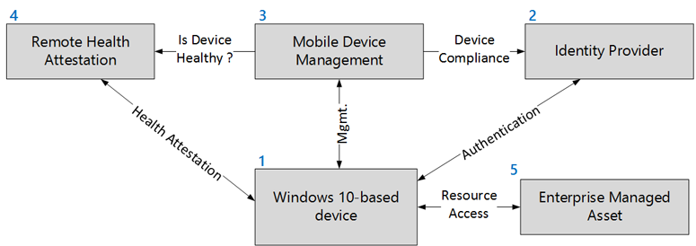
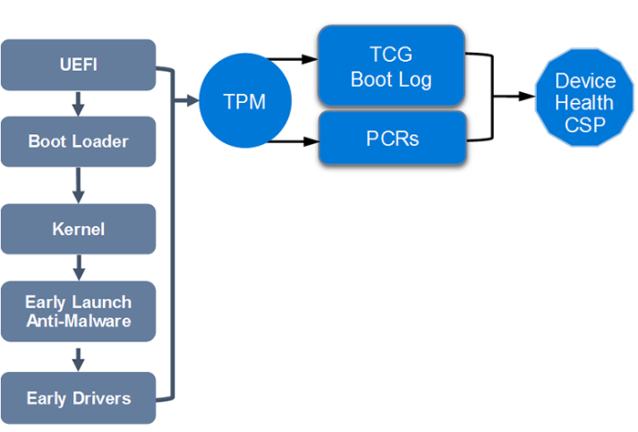
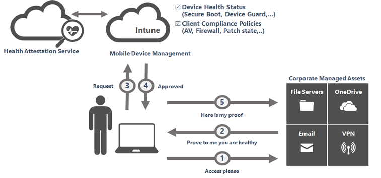
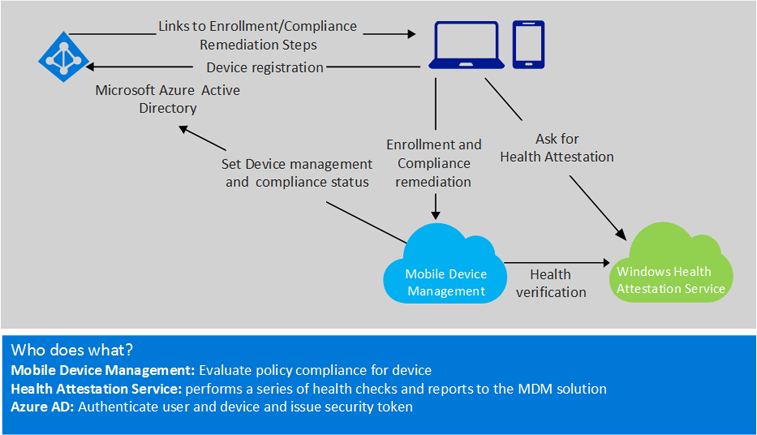
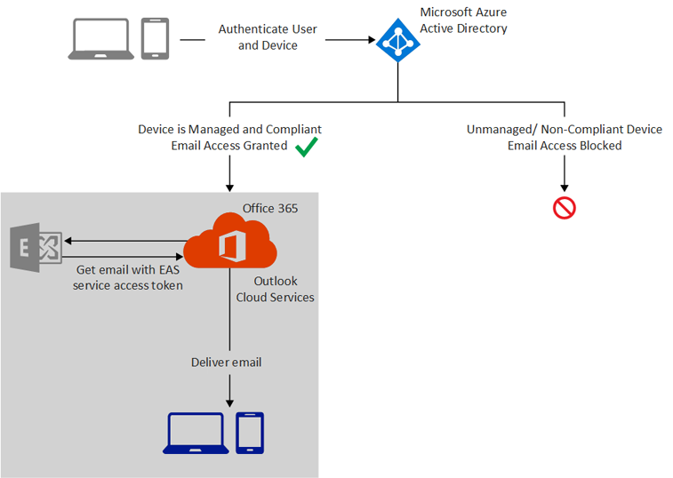
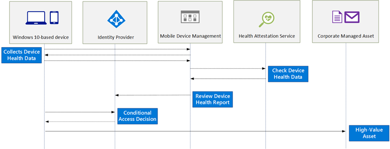

# Control the health of Windows 10-based devices

**Applies to**

-   Windows 10

This article details an end-to-end solution that helps you protect high-value assets by enforcing, controlling, and reporting the health of Windows 10-based devices.

## Introduction

In Bring Your Own Device (BYOD) scenarios, employees bring commercially available devices to access both work-related resources and their personal data. Users want to use the device of their choice to access the organization’s applications, data, and resources not only from the internal network but also from anywhere. This phenomenon is also known as the consumerization of IT.

Users want to have the best productivity experience when accessing corporate applications and working on organization data from their devices. That means they will not tolerate being prompted to enter their work credentials each time they access an application or a file server. From a security perspective, it also means that users will manipulate corporate credentials and corporate data on unmanaged devices.

With the increased use of BYOD, there will be more unmanaged and potentially unhealthy systems accessing corporate services, internal resources, and cloud apps.

Even managed devices can be compromised and become harmful. Organizations need to detect when security has been breached and react as early as possible in order to protect high-value assets.

As Microsoft moves forward, security investments are increasingly focused on security preventive defenses and also on detection and response capabilities.

Windows 10 is an important component of an end-to-end security solution that focuses not only on the implementation of security preventive defenses, but adds device health attestation capabilities to the overall security strategy.

## Description of a robust end-to-end security solution

Today’s computing threat landscape is increasing at a speed never encountered before. The sophistication of criminal attacks is growing, and there is no doubt that malware now targets both consumers and professionals in all industries.

During recent years, one particular category of threat has become prevalent: advanced persistent threats (APTs). The term APT is commonly used to describe any attack that seems to target individual organizations on an on-going basis. In fact, this type of attack typically involves determined adversaries who may use any methods or techniques necessary.

With the BYOD phenomena, a poorly maintained device represents a target of choice. For an attacker, it’s an easy way to breach the security network perimeter, gain access to, and then steal high-value assets.

The attackers target individuals, not specifically because of who they are, but because of who they work for. An infected device will bring malware into an organization, even if the organization has hardened the perimeter of networks or has invested in its defensive posture. A defensive strategy is not sufficient against these threats.

### A different approach

Rather than the traditional focus on the prevention of compromise, an effective security strategy assumes that determined adversaries will successfully breach any defenses. It means that it’s necessary to shift focus away from preventative security controls to detection of, and response to, security issues. The implementation of the risk management strategy, therefore, balances investment in prevention, detection, and response.

Because mobile devices are increasingly being used to access corporate information, some way to evaluate device security or health is required. This section describes how to provision device health assessment in such a way that high-value assets can be protected from unhealthy devices.

Devices that are used to access corporate resources must be trusted. An efficient end-to-end security approach is able to evaluate device health and use the current security state when granting access to a high-value asset.

A robust design needs to establish the user’s identity, strengthen the authentication method if needed, and learn behavior like the network location the user regularly connects from. Also, a modern approach must be able to release sensitive content only if user devices are determined to be healthy and secure.

The following figure shows a solution built to assess device health from the cloud. The device authenticates the user through a connection to an identity provider in the cloud. If the managed asset contains highly confidential information, the conditional access engine of the identity provider may elect to verify the security compliance of the mobile device before access is granted. The user’s device is able to prove its health status that can be sent at any time or when mobile device management (MDM) requests it.

Windows devices can be protected from low-level rootkits and bootkits by using low-level hardware technologies such as Unified Extensible Firmware Interface (UEFI) Secure Boot.

Secure Boot is a firmware validation process that helps prevent rootkit attacks; it is part of the UEFI specification. The intent of UEFI is to define a standard way for the operating system to communicate with modern hardware, which can perform faster and with more efficient input/output (I/O) functions than older, software interrupt-driven BIOS systems.

A device health attestation module can communicate measured boot data that is protected by a Trusted Platform Module (TPM) to a remote service. After the device successfully boots, boot process measurement data is sent to a trusted cloud service (Health Attestation Service) using a more secure and tamper-resistant communication channel.

Remote health attestation service performs a series of checks on the measurements. It validates security related data points, including boot state (Secure Boot, Debug Mode, and so on), and the state of components that manage security (BitLocker, Device Guard, and so on). It then conveys the health state of the device by sending a health encrypted blob back to the device.

An MDM solution typically applies configuration policies and deploys software to devices. MDM defines the security baseline and knows the level of compliance of the device with regular checks to see what software is installed and what configuration is enforced, as well as determining the health status of the device.

An MDM solution asks the device to send device health information and forward the health encrypted blob to the remote health attestation service. The remote health attestation service verifies device health data, checks that MDM is communicating to the same device, and then issues a device health report back to the MDM solution.

An MDM solution evaluates the health assertions and, depending on the health rules belonging to the organization, can decide if the device is healthy. If the device is healthy and compliant, MDM passes that information to the identity provider so the organization’s access control policy can be invoked to grant access.

Access to content is then authorized to the appropriate level of trust for whatever the health status and other conditional elements indicate.

Depending on the requirements and the sensitivity of the managed asset, device health status can be combined with user identity information when processing an access request. Access to content is then authorized to the appropriate level of trust. The Conditional Access engine may be structured to allow additional verification as needed by the sensitivity of the managed asset. For example, if access to high-value data is requested, additional security authentication may need to be established by querying the user to answer a phone call before access is granted.

### Microsoft’s security investments in Windows 10

In Windows 10, there are three pillars of investments:

-   **Secure identities.** Microsoft is part of the FIDO Alliance which aims to provide an interoperable method of secure authentication by moving away from the use of passwords for authentication, both on the local system as well as for services like on-premises resources and cloud resources.
-   **Information protection.** Microsoft is making investments to allow organizations to have better control over who has access to important data and what they can do with that data. With Windows 10, organizations can take advantage of policies that specify which applications are considered to be corporate applications and can be trusted to access secure data.
-   **Threat resistance.** Microsoft is helping organizations to better secure enterprise assets against the threats of malware and attacks by using security defenses relying on hardware.

### Protect, control, and report on the security status of Windows 10-based devices

This section is an overview that describes different parts of the end-to-end security solution that helps protect high-value assets and information from attackers and malware.

| Number | Part of the solution | Description |
| - | - | - |
| **1** | Windows 10-based device | The first time a Windows 10-based device is powered on, the out-of-box experience (OOBE) screen is displayed. During setup, the device can be automatically registered into Azure Active Directory (AD) and enrolled in MDM. A Windows 10-based device with TPM can report health status at any time by using the Health Attestation Service available with all editions of Windows 10.|
| **2** | Identity provider | Azure AD contains users, registered devices, and registered application of organization’s tenant. A device always belongs to a user and a user can have multiple devices. A device is represented as an object with different attributes like the compliance status of the device. A trusted MDM can update the compliance status. Azure AD is more than a repository. Azure AD is able to authenticate users and devices and can also authorize access to managed resources. Azure AD has a conditional access control engine that leverages the identity of the user, the location of the device and also the compliance status of the device when making a trusted access decision.|
| **3**|Mobile device management| Windows 10 has MDM support that enables the device to be managed out-of-box without deploying any agent. MDM can be Microsoft Intune or any third-party MDM solution that is compatible with Windows 10.|
| **4** | Remote health attestation | The Health Attestation Service is a trusted cloud service operated by Microsoft that performs a series of health checks and reports to MDM what Windows 10 security features are enabled on the device. Security verification includes boot state (WinPE, Safe Mode, Debug/test modes) and components that manage security and integrity of runtime operations (BitLocker, Device Guard).|
| **5** | Enterprise managed asset | Enterprise managed asset is the resource to protect. For example, the asset can be Office 365, other cloud apps, on-premises web resources published by Azure AD, or even VPN access.|

The combination of Windows 10-based devices, identity provider, MDM, and remote health attestation creates a robust end-to-end-solution that provides validation of health and compliance of devices that access high-value assets.

## Protect devices and enterprise credentials against threats

This section describes what Windows 10 offers in terms of security defenses and what control can be measured and reported to.

### Windows 10 hardware-based security defenses

The most aggressive forms of malware try to insert themselves into the boot process as early as possible so that they can take control of the operating system early and prevent protection mechanisms and antimalware software from working. This type of malicious code is often called a rootkit or bootkit. The best way to avoid having to deal with low-level malware is to secure the boot process so that the device is protected from the very start.
Windows 10 supports multiple layers of boot protection. Some of these features are available only if specific types of hardware are installed. For more information, see the [Hardware requirements](#hardware-req) section.

Windows 10 supports features to help prevent sophisticated low-level malware like rootkits and bootkits from loading during the startup process:

-   **Trusted Platform Module.** A Trusted Platform Module (TPM) is a hardware component that provides unique security features.

    Windows 10 leverages security characteristics of a TPM for measuring boot integrity sequence (and based on that, unlocking automatically BitLocker protected drives), for protecting credentials or for health attestation.

    A TPM implements controls that meet the specification described by the Trusted Computing Group (TCG). At the time of this writing, there are two versions of TPM specification produced by TCG that are not compatible with each other:

    -   The first TPM specification, version 1.2, was published in February 2005 by the TCG and standardized under ISO / IEC 11889 standard.
    -   The latest TPM specification, referred to as TPM 2.0, was released in April 2014 and has been approved by the ISO/IEC Joint Technical Committee (JTC) as ISO/IEC 11889:2015.

    Windows 10 uses the TPM for cryptographic calculations as part of health attestation and to protect the keys for BitLocker, Windows Hello, virtual smart cards, and other public key certificates. For more information, see [TPM requirements in Windows 10](https://go.microsoft.com/fwlink/p/?LinkId=733948).

    Windows 10 recognizes versions 1.2 and 2.0 TPM specifications produced by the TCG. For the most recent and modern security features, Windows 10 supports only TPM 2.0. 

    TPM 2.0 provides a major revision to the capabilities over TPM 1.2:

    -   Update crypto strength to meet modern security needs

        -   Support for SHA-256 for PCRs
        -   Support for HMAC command

    -   Cryptographic algorithms flexibility to support government needs

        -   TPM 1.2 is severely restricted in terms of what algorithms it can support
        -   TPM 2.0 can support arbitrary algorithms with minor updates to the TCG specification documents

    -   Consistency across implementations

        -   The TPM 1.2 specification allows vendors wide latitude when choosing implementation details
        -   TPM 2.0 standardizes much of this behavior

-   **Secure Boot.** Devices with UEFI firmware can be configured to load only trusted operating system bootloaders. Secure Boot does not require a TPM.

    The most basic protection is the Secure Boot feature, which is a standard part of the UEFI 2.2+ architecture. On a PC with conventional BIOS, anyone who can take control of the boot process can boot by using an alternative OS loader, and potentially gain access to system resources. When Secure Boot is enabled, you can boot using only an OS loader that’s signed using a certificate stored in the UEFI Secure Boot DB. Naturally, the Microsoft certificate used to digitally sign the Windows 10 OS loaders are in that store, which allows UEFI to validate the certificate as part of its security policy. Secure Boot must be enabled by default on all computers that are certified for Windows 10 under the Windows Hardware Compatibility Program.

    Secure Boot is a UEFI firmware-based feature, which allows for the signing and verification of critical boot files and drivers at boot time. Secure Boot checks signature values of the Windows Boot Manager, BCD store, Windows OS loader file, and other boot critical DLLs at boot time before the system is allowed to fully boot into a usable operating system by using policies that are defined by the OEM at build time. Secure Boot prevents many types of boot-based rootkit, malware, and other security-related attacks against the Windows platform. Secure Boot protects the operating system boot process whether booting from local hard disk, USB, PXE, or DVD, or into full Windows or Windows Recovery Environment (RE).
    Secure Boot protects the boot environment of a Windows 10 installation by verifying the signatures of the critical boot components to confirm malicious activity did not compromise them. Secure Boot protection ends after the Windows kernel file (ntoskrnl.exe) has been loaded.

    >**Note:**  Secure Boot protects the platform until the Windows kernel is loaded. Then protections like ELAM take over.

-   **Secure Boot configuration policy.** Extends Secure Boot functionality to critical Windows 10 configuration.

    Examples of protected configuration information include protecting Disable Execute bit (NX option) or ensuring that the test signing policy (code integrity) cannot be enabled. This ensures that the binaries and configuration of the computer can be trusted after the boot process has completed.
    Secure Boot configuration policy does this with UEFI policy. These signatures for these policies are signed in the same way that operating system binaries are signed for use with Secure Boot.

    The Secure Boot configuration policy must be signed by a private key that corresponds to one of the public keys stored in the Key Exchange Key (KEK) list. The Microsoft Certificate Authority (CA) will be present in the KEK list of all Windows certified Secure Boot systems. By default, a policy signed by the Microsoft KEK shall be work on all Secure Boot systems. BootMgr must verify the signature against the KEK list before applying a signed policy. With Windows 10, the default Secure Boot configuration policy is embedded in bootmgr.

    The bootloader verifies the digital signature of the Windows 10 kernel before loading it. The Windows 10 kernel, in turn, verifies every other component of the Windows startup process, including the boot drivers, startup files, and the ELAM component. This step is important and protects the rest of the boot process by verifying that all Windows boot components have integrity and can be trusted.

-   **Early Launch Antimalware (ELAM).** ELAM tests all drivers before they load and prevents unapproved drivers from loading.

    Traditional antimalware apps don’t start until after the boot drivers have been loaded, which gives a rootkit that is disguised as a driver the opportunity to work. ELAM is a Windows mechanism introduced in a previous version of Windows that allows antimalware software to run very early in the boot sequence. Thus, the antimalware component is the first third-party component to run and control the initialization of other boot drivers until the Windows operating system is operational. When the system is started with a complete runtime environment (network access, storage, and so on), then a full-featured antimalware is loaded.

    ELAM can load a Microsoft or non-Microsoft antimalware driver before all non-Microsoft boot drivers and applications, thus continuing the chain of trust established by Secure Boot and Trusted Boot. Because the operating system hasn’t started yet, and because Windows needs to boot as quickly as possible, ELAM has a simple task: Examine every boot driver and determine whether it is on the list of trusted drivers. If it’s not trusted, Windows won’t load it.

    >**Note:**  Windows Defender, Microsoft's antimalware included by default in Windows 10, supports ELAM; it can be replaced with a third-party antimalware compatible solution. The name of the Windows Defender ELAM driver is WdBoot.sys. Windows Defender in Windows 10 uses its ELAM driver to roll back any malicious changes made to the Windows Defender driver at the next reboot. This prevents kernel mode malware making lasting changes to Windows Defender’s mini-filter driver before shutdown or reboot.

    The ELAM signed driver is loaded before any other third-party drivers or applications, which allows the antimalware software to detect and block any attempts to tamper with the boot process by trying to load unsigned or untrusted code.

    The ELAM driver is a small driver with a small policy database that has a very narrow scope, focused on drivers that are loaded early at system launch. The policy database is stored in a registry hive that is also measured to the TPM, to record the operational parameters of the ELAM driver. An ELAM driver must be signed by Microsoft and the associated certificate must contain the complementary EKU (1.3.6.1.4.1.311.61.4.1).
-   **Virtualization-based security (Hyper-V + Secure Kernel).** Virtualization-based security is a completely new enforced security boundary that allows you to protect critical parts of Windows 10.

    Virtualization-based security isolates sensitive code like Kernel Mode Code Integrity or sensitive corporate domain credentials from the rest of the Windows operating system. For more information, refer to the [Virtualization-based security](#virtual) section.

-   **Hypervisor-protected Code Integrity (HVCI).** Hypervisor-protected Code Integrity is a feature of Device Guard that ensures only drivers, executables, and DLLs that comply with the Device Guard Code Integrity policy are allowed to run.

    When enabled and configured, Windows 10 can start the Hyper-V virtualization-based security services. HVCI helps protect the system core (kernel), privileged drivers, and system defenses, like antimalware solutions, by preventing malware from running early in the boot process, or after startup.

    HVCI uses virtualization-based security to isolate Code Integrity, the only way kernel memory can become executable is through a Code Integrity verification. This means that kernel memory pages can never be Writable and Executable (W+X) and executable code cannot be directly modified.

    >**Note:**  Device Guard devices that run Kernel Mode Code Integrity with virtualization-based security must have compatible drivers. For additional information, please read the [Driver compatibility with Device Guard in Windows 10](https://go.microsoft.com/fwlink/p/?LinkId=691612) blog post.

    The Device Guard Code Integrity feature lets organizations control what code is trusted to run into the Windows kernel and what applications are approved to run in user mode. It’s configurable by using a policy.
    Device Guard Code Integrity policy is a binary file that Microsoft recommends you sign. The signing of the Code Integrity policy aids in the protection against a malicious user with Administrator privileges trying to modify or remove the current Code Integrity policy.

-   **Credential Guard.** Credential Guard protects corporate credentials with hardware-based credential isolation.

    In Windows 10, Credential Guard aims to protect domain corporate credentials from theft and reuse by malware. With Credential Guard, Windows 10 implemented an architectural change that fundamentally prevents the current forms of the pass-the-hash (PtH) attack.

    This is accomplished by leveraging Hyper-V and the new virtualization-based security feature to create a protected container where trusted code and secrets are isolated from the Windows kernel. That means that even if the Windows kernel is compromised an attacker has no way to read and extract the data required to initiate a PtH attack. Credential Guard prevents this because the memory where secrets are stored is no longer accessible from the regular OS, even in kernel mode - the hypervisor controls who can access the memory.

-   **Health attestation.** The device’s firmware logs the boot process, and Windows 10 can send it to a trusted server that can check and assess the device’s health.

    Windows 10 takes measurements of the UEFI firmware and each of the Windows and antimalware components are made as they load during the boot process. Additionally, they are taken and measured sequentially, not all at once. When these measurements are complete, their values are digitally signed and stored securely in the TPM and cannot be changed unless the system is reset.

    For more information, see [Secured Boot and Measured Boot: Hardening Early Boot Components Against Malware](https://go.microsoft.com/fwlink/p/?LinkId=733950).

    During each subsequent boot, the same components are measured, which allows comparison of the measurements against an expected baseline. For additional security, the values measured by the TPM can be signed and transmitted to a remote server, which can then perform the comparison. This process, called *remote device health attestation*, allows the server to verify health status of the Windows device.

    Although Secure Boot is a proactive form of protection, health attestation is a reactive form of boot protection. Health attestation ships disabled in Windows and is enabled by an antimalware or an MDM vendor. Unlike Secure Boot, health attestation will not stop the boot process and enter remediation when a measurement does not work. But with conditional access control, health attestation will help to prevent access to high-value assets.

### Virtualization-based security

Virtualization-based security provides a new trust boundary for Windows 10. leverages Hyper-V hypervisor technology to enhance platform security. Virtualization-based security provides a secure execution environment to run specific Windows trusted code (trustlet) and to protect sensitive data.

Virtualization-based security helps to protect against a compromised kernel or a malicious user with Administrator privileges. Note that virtualization-based security is not trying to protect against a physical attacker.

The following Windows 10 services are protected with virtualization-based security:

-   **Credential Guard** (LSA Credential Isolation): prevents pass-the-hash attacks and enterprise credential theft that happens by reading and dumping the content of lsass memory
-   **Device Guard** (Hyper-V Code Integrity): Device Guard uses the new virtualization-based security in Windows 10 to isolate the Code Integrity service from the Windows kernel itself, which lets the service use signatures defined by your enterprise-controlled policy to help determine what is trustworthy. In effect, the Code Integrity service runs alongside the kernel in a Windows hypervisor-protected container.
-   **Other isolated services**: for example, on Windows Server 2016, there is the vTPM feature that allows you to have encrypted virtual machines (VMs) on servers.

>**Note:**  Virtualization-based security is only available with Windows 10 Enterprise. Virtualization-based security requires devices with UEFI (2.3.1 or higher) with Secure Boot enabled, x64 processor with Virtualization Extensions and SLAT enabled. IOMMU, TPM 2.0. and support for Secure Memory overwritten are optional, but recommended.

The schema below is a high-level view of Windows 10 with virtualization-based security.

### Credential Guard

In Windows 10, when Credential Guard is enabled, Local Security Authority Subsystem Service (lsass.exe) runs sensitive code in an Isolated user mode to help protect data from malware that may be running in the normal user mode. This helps ensure that protected data is not stolen and reused on 
remote machines, which mitigates many PtH-style attacks.

Credential Guard helps protect credentials by encrypting them with either a per-boot or persistent key:

-   **The per-boot key** is used for any in-memory credentials that do not require persistence. An example of such a credential would be a ticket-granting ticket (TGT) session key. This key is negotiated with a Key Distribution Center (KDC) every time authentication occurs and is protected with a per-boot key.
-   **The persistent key**, or some derivative, is used to help protect items that are stored and reloaded after a reboot. Such protection is intended for long-term storage, and must be protected with a consistent key.
Credential Guard is activated by a registry key and then enabled by using an UEFI variable. This is done to protect against remote modifications of the configuration. The use of a UEFI variable implies that physical access is required to change the configuration. When lsass.exe detects that 
credential isolation is enabled, it then spawns LsaIso.exe as an isolated process, which ensures that it runs within isolated user mode. The startup of LsaIso.exe is performed before initialization of a security support provider, which ensures that the secure mode support routines are ready before any authentication begins.

### Device Guard

Device Guard is a new feature of Windows 10 Enterprise that allows organizations to lock down a device to help protect it from running untrusted software. In this configuration, the only applications allowed to run are those that are trusted by the organization.

The trust decision to execute code is performed by using Hyper-V Code Integrity, which runs in virtualization-based security, a Hyper-V protected container that runs alongside regular Windows.

Hyper-V Code Integrity is a feature that validates the integrity of a driver or system file each time it is loaded into memory. Code integrity detects whether an unsigned driver or system file is being loaded into the kernel, or whether a system file has been modified by malicious software that is being run by a user account with Administrator privileges. On x64-based versions of Windows 10 kernel-mode drivers must be digitally signed.

>**Note:**  Independently of activation of Device Guard Policy, [Windows 10 by default raises the bar for what runs in the kernel](https://go.microsoft.com/fwlink/p/?LinkId=691613). Windows 10 drivers must be signed by Microsoft, and more specifically, by the WHQL (Windows Hardware Quality Labs) portal. Additionally, starting in October 2015, the WHQL portal will only accept driver submissions, including both kernel and user mode driver submissions, that have a valid Extended Validation (“EV”) Code Signing Certificate.

With Device Guard in Windows 10, organizations are now able to define their own Code Integrity policy for use on x64 systems running Windows 10 Enterprise. Organizations have the ability to configure the policy that determines what is trusted to run. These include drivers and system files, as well as traditional desktop applications and scripts. The system is then locked down to only run applications that the organization trusts.

Device Guard is a built-in feature of Windows 10 Enterprise that prevents the execution of unwanted code and applications. Device Guard can be configured using two rule actions - allow and deny:

-   **Allow** limits execution of applications to an allowed list of code or trusted publisher and blocks everything else.
-   **Deny** completes the allow trusted publisher approach by blocking the execution of a specific application.

At the time of this writing, and according to Microsoft’s latest research, more than 90 percent of malware is unsigned completely. So implementing a basic Device Guard policy can simply and effectively help block the vast majority of malware. In fact, Device Guard has the potential to go further, and can also help block signed malware.

Device Guard needs to be planned and configured to be truly effective. It is not just a protection that is enabled or disabled. Device Guard is a combination of hardware security features and software security features that, when configured together, can lock down a computer to help ensure the most secure and resistant system possible.

There are three different parts that make up the Device Guard solution in Windows 10:

-   The first part is a base **set of hardware security features** introduced with the previous version of Windows. TPM for hardware cryptographic operations and UEFI with modern firmware, along with Secure Boot, allows you to control what the device is running when the systems start.
-   After the hardware security feature, there is the code integrity engine. In Windows 10, **Code Integrity is now fully configurable** and now resides in Isolated user mode, a part of the memory that is protected by virtualization-based security.
-   The last part of Device Guard is **manageability**. Code Integrity configuration is exposed through specific Group Policy Objects, PowerShell cmdlets, and MDM configuration service providers (CSPs).

For more information on how to deploy Device Guard in an enterprise, see the [Device Guard deployment guide](/windows/device-security/device-guard/device-guard-deployment-guide).

### Device Guard scenarios

As previously described, Device Guard is a powerful way to lock down systems. Device Guard is not intended to be used broadly and it may not always be applicable, but there are some high-interest scenarios.

Device Guard is useful and applicable on fixed workloads systems like cash registers, kiosk machines, Secure Admin Workstations (SAWs), or well managed desktops. Device Guard is highly relevant on systems that have very well-defined software that are expected to run and don’t change too frequently. 
It could also help protect Information Workers (IWs) beyond just SAWs, as long as what they need to run is known and the set of applications is not going to change on a daily basis.

SAWs are computers that are built to help significantly reduce the risk of compromise from malware, phishing attacks, bogus websites, and PtH attacks, among other security risks. Although SAWs can’t be considered a “silver bullet” security solution to these attacks, these types of clients are helpful as part of a layered, defense-in-depth approach to security.

To protect high-value assets, SAWs are used to make secure connections to those assets.

Similarly, on corporate fully-managed workstations, where applications are installed by using a distribution tool like System Center Configuration Manager, Intune, or any third-party device management, then Device Guard is very applicable. In that type of scenario, the organization has a good idea of the software that an average user is running.

It could be challenging to use Device Guard on corporate, lightly-managed workstations where the user is typically allowed to install software on their own. When an organization offers great flexibility, it’s quite difficult to run Device Guard in enforcement mode. Nevertheless, Device Guard can be run in Audit mode, and in that case, the event log will contain a record of any binaries that violated the Device Guard policy. When Device Guard is used in Audit mode, organizations can get rich data about drivers and applications that users install and run.

Before you can benefit from the protection included in Device Guard, Code Integrity policy must be created by using tools provided by Microsoft, but the policy can be deployed with common management tools, like Group Policy. The Code Integrity policy is a binary-encoded XML document that includes configuration settings for both the User and Kernel-modes of Windows 10, along with restrictions on Windows 10 script hosts. Device Guard Code Integrity policy restricts what code can run on a device.

>**Note:**  Device Guard policy can be signed in Windows 10, which adds additional protection against administrative users changing or removing this policy.

Signed Device Guard policy offers stronger protection against a malicious local administrator trying to defeat Device Guard.

When the policy is signed, the GUID of the policy is stored in a UEFI pre-OS secure variable which offers tampering protection. The only way to update the Device Guard policy subsequently is to provide a new version of the policy signed by the same signer or from a signer specified as part of the 
Device Guard policy into the UpdateSigner section.

### The importance of signing applications

On computers with Device Guard, Microsoft proposes to move from a world where unsigned apps can be run without restriction to a world where only signed and trusted code is allowed to run on Windows 10.

With Windows 10, organizations will make line-of-business (LOB) apps available to members of the organization through the Microsoft Store infrastructure. More specifically, LOB apps will be available in a private store within the public Microsoft Store. Microsoft Store signs and distributes Universal 
Windows apps and Classic Windows apps. All apps downloaded from the Microsoft Store are signed.

In organizations today, the vast majority of LOB applications are unsigned. Code signing is frequently viewed as a tough problem to solve for a variety of reasons, like the lack of code signing expertise. Even if code signing is a best practice, a lot of internal applications are not signed.

Windows 10 includes tools that allow IT pros to take applications that have been already packaged and run them through a process to create additional signatures that can be distributed along with existing applications.

### Why are antimalware and device management solutions still necessary?

Although allow-list mechanisms are extremely efficient at ensuring that only trusted applications can be run, they cannot prevent the compromise of a trusted (but vulnerable) application by malicious content designed to exploit a known vulnerability. Device Guard doesn’t protect against user mode malicious code run by exploiting vulnerabilities.

Vulnerabilities are weaknesses in software that could allow an attacker to compromise the integrity, availability, or confidentiality of the device. Some of the worst vulnerabilities allow attackers to exploit the compromised device by causing it to run malicious code without the user’s knowledge.

It’s common to see attackers distributing specially crafted content in an attempt to exploit known vulnerabilities in user mode software like web browsers (and their plug-ins), Java virtual machines, PDF readers, or document editors. As of today, 90 percent of discovered vulnerabilities affect user mode applications compared to the operating system and kernel mode drivers that host them.

To combat these threats, patching is the single most effective control, with antimalware software forming complementary layers of defense.

Most application software has no facility for updating itself, so even if the software vendor publishes an update that fixes the vulnerability, the user may not know that the update is available or how to obtain it, and therefore remains vulnerable to attack. Organizations still need to manage devices and to patch vulnerabilities.

MDM solutions are becoming prevalent as a light-weight device management technology. Windows 10 extends the management capabilities that have become available for MDMs. One key feature Microsoft has added to Windows 10 is the ability for MDMs to acquire a strong statement of device health from managed and registered devices.

### Device health attestation

Device health attestation leverages the TPM to provide cryptographically strong and verifiable measurements of the chain of software used to boot the device.

For Windows 10-based devices, Microsoft introduces a new public API that will allow MDM software to access a remote attestation service called Windows Health Attestation Service. A health attestation result, in addition with other elements, can be used to allow or deny access to networks, apps, or services, based on whether devices prove to be healthy.

For more information on device health attestation, see the [Detect an unhealthy Windows 10-based device](#detect-unhealthy) section.

### Hardware requirements

The following table details the hardware requirements for both virtualization-based security services and the health attestation feature. For more information, see [Minimum hardware requirements](https://go.microsoft.com/fwlink/p/?LinkId=733951).

<table>
<colgroup>
<col width="50%" />
<col width="50%" />
</colgroup>
<thead>
<tr class="header">
<th align="left">Hardware</th>
<th align="left">Motivation</th>
</tr>
</thead>
<tbody>
<tr class="odd">
<td align="left">
UEFI 2.3.1 or later firmware with Secure Boot enabled
</td>
<td align="left">
Required to support UEFI Secure Boot.

UEFI Secure Boot ensures that the device boots only authorized code.

Additionally, Boot Integrity (Platform Secure Boot) must be supported following the requirements in Hardware Compatibility Specification for Systems for Windows 10 under the subsection: “System.Fundamentals.Firmware.CS.UEFISecureBoot.ConnectedStandby”
</td>
</tr>
<tr class="even">
<td align="left">
Virtualization extensions, such as Intel VT-x, AMD-V, and SLAT must be enabled
</td>
<td align="left">
Required to support virtualization-based security.

<strong>Note</strong> 
Device Guard can be enabled without using virtualization-based security.

</td>
</tr>
<tr class="odd">
<td align="left">
X64 processor
</td>
<td align="left">
Required to support virtualization-based security that uses Windows Hypervisor. Hyper-V is supported only on x64 processor (and not on x86).

Direct Memory Access (DMA) protection can be enabled to provide additional memory protection but requires processors to include DMA protection technologies.
</td>
</tr>
<tr class="even">
<td align="left">
IOMMU, such as Intel VT-d, AMD-Vi
</td>
<td align="left">
Support for the IOMMU in Windows 10 enhances system resiliency against DMA attacks.
</td>
</tr>
<tr class="odd">
<td align="left">
Trusted Platform Module (TPM) 
</td>
<td align="left">
Required to support health attestation and necessary for additional key protections for virtualization-based security. TPM 2.0 is supported. Support for TPM 1.2 was added beginning in Windows 10, version 1607 (RS1)
</td>
</tr>
</tbody>
</table>

This section presented information about several closely related controls in Windows 10. The multi-layer defenses and in-depth approach helps to eradicate low-level malware during boot sequence. Virtualization-based security is a fundamental operating system architecture change that adds a new security boundary. Device Guard and Credential Guard respectively help to block untrusted code and protect corporate domain credentials from theft and reuse. This section also briefly discussed the importance of managing devices and patching vulnerabilities. All these technologies can be used to harden and lock down devices while limiting the risk of attackers compromising them.

## Detect an unhealthy Windows 10-based device

As of today, many organizations only consider devices to be compliant with company policy after they’ve passed a variety of checks that show, for example, that the operating system is in the correct state, properly configured, and has security protection enabled. Unfortunately, with today’s systems, this form of reporting is not entirely reliable because malware can spoof a software statement about system health. A rootkit, or a similar low-level exploit, can report a false healthy state to traditional compliance tools.

The biggest challenge with rootkits is that they can be undetectable to the client. Because they start before antimalware, and they have system-level privileges, they can completely disguise themselves while continuing to access system resources. As a result, traditional computers infected with rootkits appear to be healthy, even with antimalware running.

As previously discussed, the health attestation feature of Windows 10 uses the TPM hardware component to securely record a measurement of every boot-related component, including firmware, Windows 10 kernel, and even early boot drivers. Because, health attestation leverages the hardware-based security capabilities of TPM, the log of all boot measured components remains out of the reach of any malware.

By attesting a trusted boot state, devices can prove that they are not running low-level malware that could spoof later compliance checks. TPM-based health attestation provides a reliable anchor of trust for assets that contain high-value data.

### What is the concept of device health?

To understand the concept of device health, it’s important to know traditional measures that IT pros have taken to prevent the breach of malware. Malware control technologies are highly focused on the prevention of installation and distribution.

However, the use of traditional malware prevention technologies like antimalware or patching solutions brings a new set of issues for IT pros: the ability to monitor and control the compliance of devices accessing organization’s resources.

The definition of device compliance will vary based on an organization’s installed antimalware, device configuration settings, patch management baseline, and other security requirements. But health of the device is part of the overall device compliance policy.

The health of the device is not binary and depends on the organization’s security implementation. The Health Attestation Service provides information back to the MDM on which security features are enabled during the boot of the device by leveraging trustworthy hardware TPM.

But health attestation only provides information, which is why an MDM solution is needed to take and enforce a decision.

### Remote device health attestation

In Windows 10, health attestation refers to a feature where Measured Boot data generated during the boot process is sent to a remote device health attestation service operated by Microsoft.

This is the most secure approach available for Windows 10-based devices to detect when security defenses are down. During the boot process, the TCG log and PCRs values are sent to a remote Microsoft cloud service. Logs are then checked by the Health Attestation Service to determine what changes have occurred on the device.

A relying party like an MDM can inspect the report generated by the remote health attestation service.

>**Note:**  To use the health attestation feature of Windows 10, the device must be equipped with a discrete or firmware TPM. There is no restriction on any particular edition of Windows 10.

Windows 10 supports health attestation scenarios by allowing applications access to the underlying health attestation configuration service provider (CSP) so that applications can request a health attestation token. The measurement of the boot sequence can be checked at any time locally by an antimalware or an MDM agent.

Remote device health attestation combined with an MDM provides a hardware-rooted method for reporting the current security status and detecting any changes, without having to trust the software running on the system.

In the case where malicious code is running on the device, the use of a remote server is required. If a rootkit is present on the device, the antimalware is no longer reliable, and its behavior can be hijacked by a malicious code running early in the startup sequence. That's why it's important to use Secure Boot and Device Guard, to control which code is loaded during the boot sequence.

The antimalware software can search to determine whether the boot sequence contains any signs of malware, such as a rootkit. It can also send the TCG log and the PCRs to a remote health attestation server to provide a separation between the measurement component and the verification component.

Health attestation logs the measurements in various TPM Platform Configuration Registers (PCRs) and TCG logs during the boot process.

When starting a device equipped with TPM, a measurement of different components is performed. This includes firmware, UEFI drivers, CPU microcode, and also all the Windows 10 drivers whose type is Boot Start. The raw measurements are stored in the TPM PCR registers while the details of all events (executable path, authority certification, and so on) are available in the TCG log.

The health attestation process works as follows:

1.  Hardware boot components are measured.
2.  Operating system boot components are measured.
3.  If Device Guard is enabled, current Device Guard policy is measured.
4.  Windows kernel is measured.
5.  Antivirus software is started as the first kernel mode driver.
6.  Boot start drivers are measured.
7.  MDM server through the MDM agent issues a health check command by leveraging the Health Attestation CSP.
8.  Boot measurements are validated by the Health Attestation Service

>**Note:**  By default, the last 100 system boot logs and all associated resume logs are archived in the %SystemRoot%\\logs\\measuredboot folder.
The number of retained logs may be set with the registry **REG\_DWORD** value **PlatformLogRetention** under the **HKLM\\SYSTEM\\CurrentControlSet\\Services\\TPM** key. A value of **0** will turn off log archival and a value of **0xffffffff** will keep all logs.

The following process describes how health boot measurements are sent to the health attestation service:

1.  The client (a Windows 10-based device with TPM) initiates the request with the remote device health attestation service. Because the health attestation server is expected to be a Microsoft cloud service, the URI is already pre-provisioned in the client.
2.  The client then sends the TCG log, the AIK signed data (PCR values, boot counter) and the AIK certificate information.
3.  The remote device heath attestation service then:

    1.  Verifies that the AIK certificate is issued by a known and trusted CA and the certificate is valid and not revoked.
    2.  Verifies that the signature on the PCR quotes is correct and consistent with the TCG log value.
    3.  Parses the properties in the TCG log.
    4.  Issues the device health token that contains the health information, the AIK information, and the boot counter information. The health token also contains valid issuance time. The device health token is encrypted and signed, that means that the information is protected and only accessible to issuing health attestation service.

4.  The client stores the health encrypted blob in its local store. The device health token contains device health status, a device ID (the Windows AIK), and the boot counter.

### Device health attestation components

The device health attestation solution involves different components that are TPM, Health Attestation CSP, and the Windows Health Attestation Service. Those components are described in this section.

### Trusted Platform Module

This section describes how PCRs (that contain system configuration data), endorsement key (EK) (that act as an identity card for TPM), SRK (that protect keys) and AIKs (that can report platform state) are used for health attestation reporting.

In a simplified manner, the TPM is a passive component with limited resources. It can calculate random numbers, RSA keys, decrypt short data, store hashes taken when booting the device.

A TPM incorporates in a single component:

-   A RSA 2048-bit key generator
-   A random number generator
-   Nonvolatile memory for storing EK, SRK, and AIK keys
-   A cryptographic engine to encrypt, decrypt, and sign
-   Volatile memory for storing the PCRs and RSA keys

### Endorsement key

The TPM has an embedded unique cryptographic key called the endorsement key. The TPM endorsement key is a pair of asymmetric keys (RSA size 2048 bits).

The endorsement key public key is generally used for sending securely sensitive parameters, such as when taking possession of the TPM that contains the defining hash of the owner password. The EK private key is used when creating secondary keys like AIKs.

The endorsement key acts as an identity card for the TPM. For more information, see [Understand the TPM endorsement key](https://go.microsoft.com/fwlink/p/?LinkId=733952).

The endorsement key is often accompanied by one or two digital certificates:

-   One certificate is produced by the TPM manufacturer and is called the **endorsement certificate**. The endorsement certificate is used to prove the authenticity of the TPM (for example, that it’s a real TPM manufactured by a specific chip maker) to local processes, applications, or cloud services. The endorsement certificate is created during manufacturing or the first time the TPM is initialized by communicating with an online service.
-   The other certificate is produced by the platform builder and is called the **platform certificate** to indicate that a specific TPM is integrated with a certain device.
For certain devices that use firmware-based TPM produced by Intel or Qualcomm, the endorsement certificate is created when the TPM is initialized during the OOBE of Windows 10.

>**Note:**  Secure Boot protects the platform until the Windows kernel is loaded. Then protections like Trusted Boot, Hyper-V Code Integrity and ELAM take over. A device that uses Intel TPM or Qualcomm TPM gets a signed certificate online from the manufacturer that has created the chip and then stores the signed certificate in TPM storage. For the operation to succeed, if you are filtering Internet access from your client devices, you must authorize the following URLs:

-   For Intel firmware TPM: **https://ekop.intel.com/ekcertservice**
-   For Qualcomm firmware TPM: **https://ekcert.spserv.microsoft.com/**

### Attestation Identity Keys

Because the endorsement certificate is unique for each device and does not change, the usage of it may present privacy concerns because it's theoretically possible to track a specific device. To avoid this privacy problem, Windows 10 issues a derived attestation anchor based on the endorsement certificate. This intermediate key, which can be attested to an endorsement key, is the Attestation Identity Key (AIK) and the corresponding certificate is called the AIK certificate. This AIK certificate is issued by a Microsoft cloud service.

>**Note:**  Before the device can report its health using the TPM attestation functions, an AIK certificate must be provisioned in conjunction with a third-party service like the Microsoft Cloud CA service. After it is provisioned, the AIK private key can be used to report platform configuration. Windows 10 creates a signature over the platform log state (and a monotonic counter value) at each boot by using the AIK.

The AIK is an asymmetric (public/private) key pair that is used as a substitute for the EK as an identity for the TPM for privacy purposes. The private portion of an AIK is never revealed or used outside the TPM and can only be used inside the TPM for a limited set of operations. Furthermore, it can only be used for signing, and only for limited, TPM-defined operations.

Windows 10 creates AIKs protected by the TPM, if available, that are 2048-bit RSA signing keys. Microsoft is hosting a cloud service called Microsoft Cloud CA to establish cryptographically that it is communicating with a real TPM and that the TPM possesses the presented AIK. After the Microsoft 
Cloud CA service has established these facts, it will issue an AIK certificate to the Windows 10-based device.

Many existing devices that will upgrade to Windows 10 will not have a TPM, or the TPM will not contain an endorsement certificate. **To accommodate those devices, Windows 10 allows the issuance of AIK certificates without the presence of an endorsement certificate.** Such AIK certificates are not issued by Microsoft Cloud CA. Note that this is not as trustworthy as an endorsement certificate that is burned into the device during manufacturing, but it will provide compatibility for advanced scenarios like Windows Hello for Business without TPM.

In the issued AIK certificate, a special OID is added to attest that endorsement certificate was used during the attestation process. This information can be leveraged by a relying party to decide whether to reject devices that are attested using AIK certificates without an endorsement certificate or accept them. Another scenario can be to not allow access to high-value assets from devices that are attested by an AIK certificate that is not backed by an endorsement certificate.

### Storage root key

The storage root key (SRK) is also an asymmetric key pair (RSA with a minimum of 2048 bits length). The SRK has a major role and is used to protect TPM keys, so that these keys cannot be used without the TPM. The SRK key is created when the ownership of the TPM is taken.

### Platform Configuration Registers

The TPM contains a set of registers that are designed to provide a cryptographic representation of the software and state of the system that booted. These registers are called Platform Configuration Registers (PCRs).

The measurement of the boot sequence is based on the PCR and TCG log. To establish a static root of trust, when the device is starting, the device must be able to measure the firmware code before execution. In this case, the Core Root of Trust for Measurement (CRTM) is executed from the boot, calculates the hash of the firmware, then stores it by expanding the register PCR\[0\] and transfers execution to the firmware.

PCRs are set to zero when the platform is booted, and it is the job of the firmware that boots the platform to measure components in the boot chain and to record the measurements in the PCRs. Typically, boot components take the hash of the next component that is to be run and record the measurements in the PCRs. The initial component that starts the measurement chain is implicitly trusted. This is the CRTM. Platform manufacturers are required to have a secure update process for the CRTM or not permit updates to it. The PCRs record a cumulative hash of the components that have been measured.

The value of a PCR on its own is hard to interpret (it is just a hash value), but platforms typically keep a log with details of what has been measured, and the PCRs merely ensure that the log has not been tampered with. The logs are referred as a TCG log. Each time a register PCR is extended, an entry is added to the TCG log. Thus, throughout the boot process, a trace of the executable code and configuration data is created in the TCG log.

### TPM provisioning

For the TPM of a Windows 10-based device to be usable, it must first be provisioned. The process of provisioning differs somewhat based on TPM versions, but, when successful, it results in the TPM being usable and the owner authorization data (ownerAuth) for the TPM being stored locally on the registry.

When the TPM is provisioned, Windows 10 will first attempt to determine the EK and locally stored **ownerAuth** values by looking in the registry at the following location: **HKLM\\SYSTEM\\CurrentControlSet\\Services\\TPM\\WMI\\Endorsement**

During the provisioning process, the device may need to be restarted.

Note that the **Get-TpmEndorsementKeyInfo PowerShell** cmdlet can be used with administrative privilege to get information about the endorsement key and certificates of the TPM.

If the TPM ownership is not known but the EK exists, the client library will provision the TPM and will store the resulting **ownerAuth** value into the registry if the policy allows it will store the SRK public portion at the following location: 
**HKLM\\SYSTEM\\CurrentControlSet\\Services\\TPM\\WMI\\Admin\\SRKPub**

As part of the provisioning process, Windows 10 will create an AIK with the TPM. When this operation is performed, the resulting AIK public portion is stored in the registry at the following location: **HKLM\\SYSTEM\\CurrentControlSet\\Services\\TPM\\WMI\\WindowsAIKPub**

> **Note:**  For provisioning AIK certificates and filtering Internet access, you must authorize the following wildcard URL: <strong>https://\*.microsoftaik.azure.net</strong>

### Windows 10 Health Attestation CSP

Windows 10 contains a configuration service provider (CSP) specialized for interacting with the health attestation feature. A CSP is a component that plugs into the Windows MDM client and provides a published protocol for how MDM servers can configure settings and manage Windows-based devices. The management protocol is represented as a tree structure that can be specified as URIs with functions to perform on the URIs such as “get”, “set”, “delete”, and so on.

The following is a list of functions performed by the Windows 10 Health Attestation CSP:

-   Collects data that is used to verify a device’s health status
-   Forwards the data to the Health Attestation Service
-   Provisions the Health Attestation Certificate that it receives from the Health Attestation Service
-   Upon request, forwards the Health Attestation Certificate (received from the Health Attestation Service) and related runtime information to the MDM server for verification

During a health attestation session, the Health Attestation CSP forwards the TCG logs and PCRs values that are measured during the boot, by using a secure communication channel to the Health Attestation Service.

When an MDM server validates that a device has attested to the Health Attestation Service, it will be given a set of statements and claims about how that device booted, with the assurance that the device did not reboot between the time that it attested its health and the time that the MDM server validated it.

### Windows Health Attestation Service

The role of Windows Health Attestation Service is essentially to evaluate a set of health data (TCG log and PCR values), make a series of detections (based on available health data) and generate encrypted health blob or produce report to MDM servers.

>**Note:**  Both device and MDM servers must have access to **has.spserv.microsoft.com** using the TCP protocol on port 443 (HTTPS).

Checking that a TPM attestation and the associated log are valid takes several steps:

1.  First, the server must check that the reports are signed by **trustworthy AIKs**. This might be done by checking that the public part of the AIK is listed in a database of assets, or perhaps that a certificate has been checked.
2.  After the key has been checked, the signed attestation (a quote structure) should be checked to see whether it is a **valid signature over PCR values**.
3.  Next the logs should be checked to ensure that they match the PCR values reported.
4.  Finally, the logs themselves should be examined by an MDM solution to see whether they represent **known or valid security configurations**. For example, a simple check might be to see whether the measured early OS components are known to be good, that the ELAM driver is as expected, and that the ELAM driver policy file is up to date. If all of these checks succeed, an attestation statement can be issued that later can be used to determine whether or not the client should be granted access to a resource.

The Health Attestation Service provides the following information to an MDM solution about the health of the device:

-   Secure Boot enablement
-   Boot and kernel debug enablement
-   BitLocker enablement
-   VSM enabled
-   Signed or unsigned Device Guard Code Integrity policy measurement
-   ELAM loaded
-   Safe Mode boot, DEP enablement, test signing enablement
-   Device TPM has been provisioned with a trusted endorsement certificate

For completeness of the measurements, see [Health Attestation CSP](https://go.microsoft.com/fwlink/p/?LinkId=733949).

The following table presents some key items that can be reported back to MDM depending on the type of Windows 10-based device.

<table>
<colgroup>
<col width="50%" />
<col width="50%" />
</colgroup>
<thead>
<tr class="header">
<th align="left">OS type</th>
<th align="left">Key items that can be reported</th>
</tr>
</thead>
<tbody>
<tr class="odd">
<td align="left">
Windows 10 Mobile
</td>
<td align="left"><ul>
<li>
PCR0 measurement
</li>
<li>
Secure Boot enabled
</li>
<li>
Secure Boot db is default
</li>
<li>
Secure Boot dbx is up to date
</li>
<li>
Secure Boot policy GUID is default
</li>
<li>
Device Encryption enabled
</li>
<li>
Code Integrity revocation list timestamp/version is up to date
</li>
</ul></td>
</tr>
<tr class="even">
<td align="left">
Windows 10 for desktop editions
</td>
<td align="left"><ul>
<li>
PCR0 measurement
</li>
<li>
Secure Boot Enabled
</li>
<li>
Secure Boot db matches Expected
</li>
<li>
Secure Boot dbx is up to date
</li>
<li>
Secure Boot policy GUID matches Expected
</li>
<li>
BitLocker enabled
</li>
<li>
Virtualization-based security enabled
</li>
<li>
ELAM was loaded
</li>
<li>
Code Integrity version is up to date
</li>
<li>
Code Integrity policy hash matches Expected
</li>
</ul></td>
</tr>
</tbody>
</table>

### Leverage MDM and the Health Attestation Service

To make device health relevant, the MDM solution evaluates the device health report and is configured to the organization’s device health requirements.

A solution that leverages MDM and the Health Attestation Service consists of three main parts:

1.  A device with health attestation enabled. This will usually be done as a part of enrollment with an MDM provider (health attestation will be disabled by default).
2.  After this is enabled, and every boot thereafter, the device will send health measurements to the Health Attestation Service hosted by Microsoft, and it will receive a health attestation blob in return.
3.  At any point after this, an MDM server can request the health attestation blob from the device and ask Health Attestation Service to decrypt the content and validate that it’s been attested.

Interaction between a Windows 10-based device, the Health Attestation Service, and MDM can be performed as follows:

1.  The client initiates a session with the MDM server. The URI for the MDM server would be part of the client app that initiates the request. The MDM server at this time could request the health attestation data by using the appropriate CSP URI.
2.  The MDM server specifies a nonce along with the request.
3.  The client then sends the AIK quoted nonce + the boot counter and the health blob information. This health blob is encrypted with a Health Attestation Service public key that only the Health Attestation Service can decrypt.
4.  The MDM server:

    1.  Verifies that the nonce is as expected.
    2.  Passes the quoted data, the nonce and the encrypted health blob to the Health Attestation Service server.

5.  The Health Attestation Service:

    1.  Decrypts the health blob.
    2.  Verifies that the boot counter in the quote is correct using the AIK in the health blob and matches the value in the health blob.
    3.  Verifies that the nonce matches in the quote and the one that is passed from MDM.
    4.  Because the boot counter and the nonce are quoted with the AIK from the health blob, it also proves that the device is the same one as the one for which the health blob has been generated.
    5.  Sends data back to the MDM server including health parameters, freshness, and so on.

>**Note:**  The MDM server (relying party) never performs the quote or boot counter validation itself. It gets the quoted data and the health blob (which is encrypted) and sends the data to the Health Attestation Service for validation. This way, the AIK is never visible to the MDM, which thereby addresses privacy concerns.

Setting the requirements for device compliance is the first step to ensure that registered devices that do not meet health and compliance requirements are detected, tracked, and have actions enforced by the MDM solution.

Devices that attempt to connect to resources must have their health evaluated so that unhealthy and noncompliant devices can be detected and reported. To be fully efficient, an end-to-end security solution must impose a consequence for unhealthy devices like refusing access to high-value assets. 
That is the purpose of conditional access control, which is detailed in the next section.

## Control the security of a Windows 10-based device before access is granted

Today’s access control technology, in most cases, focuses on ensuring that the right people get access to the right resources. If users can authenticate, they get access to resources using a device that the organization’s IT staff and systems know very little about. Perhaps there is some check such as ensuring that a device is encrypted before giving access to email, but what if the device is infected with malware?

The remote device health attestation process uses measured boot data to verify the health status of the device. The health of the device is then available for an MDM solution like Intune.

>**Note:**  For the latest information on Intune and Windows 10 features support, see the [Microsoft Intune blog](https://go.microsoft.com/fwlink/p/?LinkId=691614) and [What's new in Microsoft Intune](https://go.microsoft.com/fwlink/p/?LinkId=733956).

The figure below shows how the Health Attestation Service is expected to work with Microsoft’s cloud-based Intune MDM service.

An MDM solution can then leverage health state statements and take them to the next level by coupling with client policies that will enable conditional access to be granted based on the device’s ability to prove that it’s malware free, its antimalware system is functional and up to date, the 
firewall is running, and the devices patch state is compliant.

Finally, resources can be protected by denying access to endpoints that are unable to prove they’re healthy. This feature is much needed for BYOD devices that need to access organizational resources.

### Built-in support of MDM in Windows 10

Windows 10 has an MDM client that ships as part of the operating system. This enables MDM servers to manage Windows 10-based devices without requiring a separate agent.

### Third-party MDM server support

Third-party MDM servers can manage Windows 10 by using the MDM protocol. The built-in management client is able to communicate with a compatible server that supports the OMA-DM protocol to perform enterprise management tasks. For additional information, see [Azure Active Directory integration with MDM](https://go.microsoft.com/fwlink/p/?LinkId=733954).

>**Note:**  MDM servers do not need to create or download a client to manage Windows 10. For more information, see [Mobile device management](https://go.microsoft.com/fwlink/p/?LinkId=733955).

The third-party MDM server will have the same consistent first-party user experience for enrollment, which also provides simplicity for Windows 10 users.

### Management of Windows Defender by third-party MDM

This management infrastructure makes it possible for IT pros to use MDM-capable products like Intune, to manage health attestation, Device Guard, or Windows Defender on Windows 10-based devices, including BYODs that aren’t domain joined. IT pros will be able to manage and configure all of the actions and settings they are familiar with customizing by using Intune with Intune Endpoint Protection on down-level operating systems. Admins that currently only manage domain joined devices through Group Policy will find it easy to transition to managing Windows 10-based devices by using MDM because many of the settings and actions are shared across both mechanisms.

For more information on how to manage Windows 10 security and system settings with an MDM solution, see [Custom URI settings for Windows 10 devices](https://go.microsoft.com/fwlink/p/?LinkId=733953).

### Conditional access control

On most platforms, the Azure Active Directory (Azure AD) device registration happens automatically during enrollment. The device states are written by the MDM solution into Azure AD, and then read by Office 365 (or by any authorized Windows app that interacts with Azure AD) the next time the client tries to access an Office 365 compatible workload.

If the device is not registered, the user will get a message with instructions on how to register (also known as enrolling). If the device is not compliant, the user will get a different message that redirects them to the MDM web portal where they can get more information on the compliance problem and how to resolve it.

**Azure AD** authenticates the user and the device, **MDM** manages the compliance and conditional access policies, and the **Health Attestation Service** reports about the health of the device in an attested way.

### Office 365 conditional access control

Azure AD enforces conditional access policies to secure access to Office 365 services. A tenant admin can create a conditional access policy that blocks a user on a non-compliant device from accessing an Office 365 service. The user must conform to the company’s device policies before access can be granted to the service. Alternately, the admin can also create a policy that requires users to just enroll their devices to gain access to an Office 365 service. Policies may be applied to all users of an organization, or limited to a few target groups and enhanced over time to include additional 
target groups.

When a user requests access to an Office 365 service from a supported device platform, Azure AD authenticates the user and device from which the user launches the request; and grants access to the service only when the user conforms to the policy set for the service. Users that do not have their device enrolled are given remediation instructions on how to enroll and become compliant to access corporate Office 365 services.

When a user enrolls, the device is registered with Azure AD, and enrolled with a compatible MDM solution like Intune.

>**Note**  Microsoft is working with third-party MDM ISVs to support automated MDM enrollment and policy based access checks. Steps to turn on auto-MDM enrollment with Azure AD and Intune are explained in the [Windows 10, Azure AD And Microsoft Intune: Automatic MDM Enrollment Powered By The Cloud!](https://go.microsoft.com/fwlink/p/?LinkId=691615) blog post.

When a user enrolls a device successfully, the device becomes trusted. Azure AD provides single-sign-on to access company applications and enforces conditional access policy to grant access to a service not only the first time the user requests access, but every time the user requests to renew access.

The user will be denied access to services when sign-in credentials are changed, a device is lost/stolen, or the compliance policy is not met at the time of request for renewal.

Depending on the type of email application that employees use to access Exchange online, the path to establish secured access to email can be slightly different. However, the key components: Azure AD, Office 365/Exchange Online, and Intune, are the same. The IT experience and end-user experience also are similar.

Clients that attempt to access Office 365 will be evaluated for the following properties:

-   Is the device managed by an MDM?
-   Is the device registered with Azure AD?
-   Is the device compliant?

To get to a compliant state, the Windows 10-based device needs to:

-   Enroll with an MDM solution.
-   Register with Azure AD.
-   Be compliant with the device policies set by the MDM solution.

>**Note:**  At the present time, conditional access policies are selectively enforced on users on iOS and Android devices. For more information, see the [Azure AD, Microsoft Intune and Windows 10 – Using the cloud to modernize enterprise mobility!](https://go.microsoft.com/fwlink/p/?LinkId=691616) blog post.

### Cloud and on-premises apps conditional access control

Conditional access control is a powerful policy evaluation engine built into Azure AD. It gives IT pros an easy way to create access rules beyond Office 365 that evaluate the context of a user's logon to make real-time decisions about which applications they should be allowed to access.

IT pros can configure conditional access control policies for cloud SaaS applications secured by Azure AD and even on-premises applications. Access rules in Azure AD leverage the conditional access engine to check device health and compliance state reported by a compatible MDM solution like Intune in order to determine whether to allow access.

For more information about conditional access, see [Azure Conditional Access Preview for SaaS Apps.](https://go.microsoft.com/fwlink/p/?LinkId=524807)

>**Note:**  Conditional access control is an Azure AD Premium feature that's also available with EMS. If you don't have an Azure AD Premium subscription, you can get a trial from the [Microsoft Azure](https://go.microsoft.com/fwlink/p/?LinkId=691617) site.

For on-premises applications there are two options to enable conditional access control based on a device's compliance state:

-   For on-premises applications that are published through the Azure AD Application Proxy, you can configure conditional access control policies as you would for cloud applications. For more details, see the [Azure AD Conditional Access preview updated: Now supports On-Premises and Custom LOB apps](https://go.microsoft.com/fwlink/p/?LinkId=691618) blog post.
-   Additionally, Azure AD Connect will sync device compliance information from Azure AD to on-premises AD. ADFS on Windows Server 2016 will support conditional access control based on a device's compliance state. IT pros will configure conditional access control policies in ADFS that use the device's compliance state reported by a compatible MDM solution to secure on-premises applications.

The following process describes how Azure AD conditional access works:

1.  User has already enrolled with MDM through Workplace Access/Azure AD join which registers device with Azure AD.
2.  When the device boots or resumes from hibernate, a task “Tpm-HASCertRetr” is triggered to request in background a health attestation blob. Device sends TPM boot measurements to the Health Attestation Service.
3.  Health Attestation Service validates device state and issues an encrypted blob to the device based on the health state with details on failed checks (if any).
4.  User logs on and the MDM agent contacts the Intune/MDM server.
5.  MDM server pushes down new policies if available and queries health blob state and other inventory state.
6.  Device sends a health attestation blob previously acquired and also the value of the other state inventory requested by the Intune/MDM server.
7.  Intune/MDM server sends the health attestation blob to Health Attestation Service to be validated.
8.  Health Attestation Service validates that the device which sent the health attestation blob is healthy, and returns this result to Intune/MDM server.
9.  Intune/MDM server evaluates compliance based on the compliance and the queried inventory/health attestation state from device.
10. Intune/MDM server updates compliance state against device object in Azure AD.
11. User opens app, attempts to access a corporate managed asset.
12. Access gated by compliance claim in Azure AD.
13. If the device is compliant and the user is authorized, an access token is generated.
14. User can access the corporate managed asset.

For more information about Azure AD join, see the [Azure AD & Windows 10: Better Together for Work or School](https://go.microsoft.com/fwlink/p/?LinkId=691619) white paper.

Conditional access control is a topic that many organizations and IT pros may not know as well as they should. The different attributes that describe a user, a device, compliance, and context of access are very powerful when used with a conditional access engine. Conditional access control is an essential step that helps organizations secure their environment.

## Takeaways and summary

The following list contains high-level key take-aways to improve the security posture of any organization. However, the few take-aways presented in this section should not be interpreted as an exhaustive list of security best practices.

-   **Understand that no solution is 100 percent secure**

    If determined adversaries with malicious intent gain physical access to the device, they could eventually break through its security layers and control it.

-   **Use health attestation with an MDM solution**

    Devices that attempt to connect to high-value assets must have their health evaluated so that unhealthy and noncompliant devices can be detected, reported, and eventually blocked.

-   **Use Credential Guard**

    Credential Guard is a feature that greatly helps protect corporate domain credentials from pass-the-hash attacks.

-   **Use Device Guard**

    Device Guard is a real advance in security and an effective way to help protect against malware. The new Device Guard feature in Windows 10 blocks untrusted apps (apps not authorized by your organization).

-   **Sign Device Guard policy**

    Signed Device Guard policy helps protect against a user with administrator privileges trying to defeat the current policy. When a policy is signed, the only way to modify Device Guard subsequently is to provide a new version of the policy signed by the same signer or from a signer specify as part of the Device Guard policy.

-   **Use virtualization-based security**

    When you have Kernel Mode Code Integrity protected by virtualization-based security, the code integrity rules are still enforced even if a vulnerability allows unauthorized kernel mode memory access. Keep in mind that Device Guard devices that run Kernel Code Integrity with virtualization-based security must have compatible drivers.

-   **Start to deploy Device Guard with Audit mode**

    Deploy Device Guard policy to targeted computers and devices in Audit mode. Monitor the Code Integrity event log that indicates a program or a driver would have been blocked if Device Guard was configured in Enforcement mode. Adjust Device Guard rules until a high level of confidence has been reached. After the testing phase has been completed, Device Guard policy can be switched to Enforcement mode.

-   **Build an isolated reference machine when deploying Device Guard**

    Because the corporate network can contain malware, you should start to configure a reference environment that is isolated from your main corporate network. After that, you can create a code integrity policy that includes the trusted applications you want to run on your protected devices.

-   **Use AppLocker when it makes sense**

    Although AppLocker is not considered a new Device Guard feature, it complements Device Guard functionality for some scenarios like being able to deny a specific Universal Windows apps for a specific user or a group of users.

-   **Lock down firmware and configuration**

    After Windows 10 is installed, lock down firmware boot options access. This prevents a user with physical access from modifying UEFI settings, disabling Secure Boot, or booting other operating systems. Also, in order to protect against an administrator trying to disable Device Guard, add a rule in the current Device Guard policy that will deny and block execution of the **C:\\Windows\\System32\\SecConfig.efi** tool.

Health attestation is a key feature of Windows 10 that includes client and cloud components to control access to high-value assets based on a user and their device’s identity and compliance with corporate governance policy. Organizations can choose to detect and report unhealthy devices, or to configure health enforcement rules based on their needs. Health attestation provides an end-to-end security model and integration points, which vendors and software developers can use to build and integrate a customized solution.

## Related topics

- [Protect derived domain credentials with Credential Guard](/windows/access-protection/credential-guard/credential-guard)
- [Device Guard deployment guide](/windows/device-security/device-guard/device-guard-deployment-guide)
- [Trusted Platform Module technology overview](https://go.microsoft.com/fwlink/p/?LinkId=733957)
