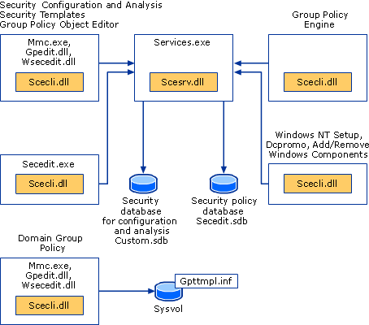

# Security policy settings

**Applies to**
-   Windows 10

This reference topic describes the common scenarios, architecture, and processes for security settings.

Security policy settings are rules that administrators configure on a computer or multiple devices for the purpose of protecting resources on a device or network. The Security Settings extension of the Local Group Policy Editor snap-in allows you to define security configurations as part of a Group Policy Object (GPO). The GPOs are linked to Active Directory containers such as sites, domains, or organizational units, and they enable you to manage security settings for multiple devices from any device joined to the domain. Security settings policies are used as part of your overall security implementation to help secure domain controllers, servers, clients, and other resources in your organization.

Security settings can control:

-   User authentication to a network or device.
-   The resources that users are permitted to access.
-   Whether to record a user’s or group’s actions in the event log.
-   Membership in a group.

To manage security configurations for multiple devices, you can use one of the following options:

-   Edit specific security settings in a GPO.
-   Use the Security Templates snap-in to create a security template that contains the security policies you want to apply, and then import the security template into a Group Policy Object. A security template is a file that represents a security configuration, and it can be imported to a GPO, applied to a local device, or used to analyze security.

For more info about managing security configurations, see [Administer security policy settings](administer-security-policy-settings.md).

The Security Settings extension of the Local Group Policy Editor includes the following types of security policies:

-   **Account Policies.** These polices are defined on devices; they affect how user accounts can interact with the computer or domain. Account policies include the following types of policies:

    -   **Password Policy.** These policies determine settings for passwords, such as enforcement and lifetimes. Password policies are used for domain accounts.
    -   **Account Lockout Policy.** These policies determine the conditions and length of time that an account will be locked out of the system. Account lockout policies are used for domain or local user accounts.
    -   **Kerberos Policy.** These policies are used for domain user accounts; they determine Kerberos-related settings, such as ticket lifetimes and enforcement.

-   **Local Policies.** These policies apply to a computer and include the following types of policy settings:

    -   **Audit Policy.** Specify security settings that control the logging of security events into the Security log on the computer, and specifies what types of security events to log (success, failure, or both).
        
        >**Note:**  For devices running Windows 7 and later, we recommend to use the settings under Advanced Audit Policy Configuration rather than the Audit Policy settings under Local Policies.
         
    -   **User Rights Assignment.** Specify the users or groups that have logon rights or privileges on a device
    -   **Security Options.** Specify security settings for the computer, such as Administrator and Guest Account names; access to floppy disk drives and CD-ROM drives; installation of drivers; logon prompts; and so on.

-   **Windows Firewall with Advanced Security.** Specify settings to protect the device on your network by using a stateful firewall that allows you to determine which network traffic is permitted to pass between your device and the network.
-   **Network List Manager Policies.** Specify settings that you can use to configure different aspects of how networks are listed and displayed on one device or on many devices.
-   **Public Key Policies.** Specify settings to control Encrypting File System, Data Protection, and BitLocker Drive Encryption in addition to certain certificate paths and services settings.
-   **Software Restriction Policies.** Specify settings to identify software and to control its ability to run on your local device, organizational unit, domain, or site.
-   **Application Control Policies.** Specify settings to control which users or groups can run particular applications in your organization based on unique identities of files.
-   **IP Security Policies on Local Computer.** Specify settings to ensure private, secure communications over IP networks through the use of cryptographic security services. IPsec establishes trust and security from a source IP address to a destination IP address.
-   **Advanced Audit Policy Configuration.** Specify settings that control the logging of security events into the security log on the device. The settings under Advanced Audit Policy Configuration provide finer control over which activities to monitor as opposed to the Audit Policy settings under 
Local Policies.

## Policy-based security settings management

The Security Settings extension to Group Policy provides an integrated policy-based management infrastructure to help you manage and enforce your security policies.

You can define and apply security settings policies to users, groups, and network servers and clients through Group Policy and Active Directory Domain Services (AD DS). A group of servers with the same functionality can be created (for example, a Microsoft Web (IIS) server), and then Group Policy Objects can be used to apply common security settings to the group. If more servers are added to this group later, many of the common security settings are automatically applied, reducing deployment and administrative labor.

### Common scenarios for using security settings policies

Security settings policies are used to manage the following aspects of security: accounts policy, local policy, user rights assignment, registry values, file and registry Access Control Lists (ACLs), service startup modes, and more.

As part of your security strategy, you can create GPOs with security settings policies configured specifically for the various roles in your organization, such as domain controllers, file servers, member servers, clients, and so on.

You can create an organizational unit (OU) structure that groups devices according to their roles. Using OUs is the best method for separating specific security requirements for the different roles in your network. This approach also allows you to apply customized security templates to each class of server or computer. After creating the security templates, you create a new GPO for each of the OUs, and then import the security template (.inf file) into the new GPO.

Importing a security template to a GPO ensures that any accounts to which the GPO is applied automatically receive the template’s security settings when the Group Policy settings are refreshed. On a workstation or server, the security settings are refreshed at regular intervals (with a random 
offset of at most 30 minutes), and, on a domain controller, this process occurs every few minutes if changes have occurred in any of the GPO settings that apply. The settings are also refreshed every 16 hours, whether or not any changes have occurred.

>**Note:**  These refresh settings vary between versions of the operating system and can be configured.
 
By using Group Policy−based security configurations in conjunction with the delegation of administration, you can ensure that specific security settings, rights, and behavior are applied to all servers and computers within an OU. This approach makes it simple to update a number of servers with any additional changes required in the future.

### Dependencies on other operating system technologies

For devices that are members of a Windows Server 2008 or later domain, security settings policies depend on the following technologies:

-   **Active Directory Domain Services (AD DS)**

    The Windows-based directory service, AD DS, stores information about objects on a network and makes this information available to administrators and users. By using AD DS, you can view and manage network objects on the network from a single location, and users can access permitted network resources by using a single logon.

-   **Group Policy**

    The infrastructure within AD DS that enables directory-based configuration management of user and computer settings on devices running Windows Server. By using Group Policy, you can define configurations for groups of users and computers, including policy settings, registry-based policies, software installation, scripts, folder redirection, Remote Installation Services, Internet Explorer maintenance, and security.

-   **Domain Name System (DNS)**

    A hierarchical naming system used for locating domain names on the Internet and on private TCP/IP networks. DNS provides a service for mapping DNS domain names to IP addresses, and IP addresses to domain names. This allows users, computers, and applications to query DNS to specify remote systems by fully qualified domain names rather than by IP addresses.

-   **Winlogon**

    A part of the Windows operating system that provides interactive logon support. Winlogon is designed around an interactive logon model that consists of three components: the Winlogon executable, a credential provider, and any number of network providers.

-   **Setup**

    Security configuration interacts with the operating system setup process during a clean installation or upgrade from earlier versions of Windows Server.

-   **Security Accounts Manager (SAM)**

    A Windows service used during the logon process. SAM maintains user account information, including groups to which a user belongs.

-   **Local Security Authority (LSA)**

    A protected subsystem that authenticates and logs users onto the local system. LSA also maintains information about all aspects of local security on a system, collectively known as the Local Security Policy of the system.

-   **Windows Management Instrumentation (WMI)**

    A feature of the Microsoft Windows operating system, WMI is the Microsoft implementation of Web-Based Enterprise Management (WBEM), which is an industry initiative to develop a standard technology for accessing management information in an enterprise environment. WMI provides access to information about objects in a managed environment. Through WMI and the WMI application programming interface (API), applications can query for and make changes to static information in the Common Information Model (CIM) repository and dynamic information maintained by the various types of providers.

-   **Resultant Set of Policy (RSoP)**

    An enhanced Group Policy infrastructure that uses WMI in order to make it easier to plan and debug policy settings. RSoP provides public methods that expose what an extension to Group Policy would do in a what-if situation, and what the extension has done in an actual situation. This allows administrators to easily determine the combination of policy settings that apply to, or will apply to, a user or device.

-   **Service Control Manager (SCM)**

    Used for configuration of service startup modes and security.

-   **Registry**

    Used for configuration of registry values and security.

-   **File system**

    Used for configuration of security.

-   **File system conversions**

    Security is set when an administrator converts a file system from FAT to NTFS.

-   **Microsoft Management Console (MMC)**

    The user interface for the Security Settings tool is an extension of the Local Group Policy Editor MMC snap-in.

### Security settings policies and Group Policy

The Security Settings extension of the Local Group Policy Editor is part of the Security Configuration Manager tool set. The following components are associated with Security Settings: a configuration engine; an analysis engine; a template and database interface layer; setup integration logic; and the secedit.exe command-line tool. The security configuration engine is responsible for handling security configuration editor-related security requests for the system on which it runs. The analysis engine analyzes system security for a given configuration and saves the result. The template and database interface layer handles reading and writing requests from and to the template or database (for internal storage). The Security Settings extension of the Local Group Policy Editor handles Group Policy from a domain-based or local device. The security configuration logic integrates with setup and manages system security for a clean installation or upgrade to a more recent Windows operating system. Security information is stored in templates (.inf files) or in the Secedit.sdb database.

The following diagram shows Security Settings and related features.

**Security Settings Policies and Related Features**

-   **Scesrv.dll**

    Provides the core security engine functionality.

-   **Scecli.dll**

    Provides the client-side interfaces to the security configuration engine and provides data to Resultant Set of Policy (RSoP).

-   **Wsecedit.dll**

    The Security Settings extension of Local Group Policy Editor. scecli.dll is loaded into wsecedit.dll to support the Security Settings user interface.

-   **Gpedit.dll**

    The Local Group Policy Editor MMC snap-in.

## Security Settings extension architecture

The Security Settings extension of the Local Group Policy Editor is part of the Security Configuration Manager tools, as shown in the following diagram.

**Security Settings Architecture**

The security settings configuration and analysis tools include a security configuration engine, which provides local computer (non-domain member) and Group Policy−based configuration and analysis of security settings policies. The security configuration engine also supports the creation of security policy files. The primary features of the security configuration engine are scecli.dll and scesrv.dll.

The following list describes these primary features of the security configuration engine and other Security Settings−related features.

-   **scesrv.dll**

    This .dll is hosted in services.exe and runs under local system context. scesrv.dll provides core Security Configuration Manager functionality, such as import, configure, analyze, and policy propagation.

    Scesrv.dll performs configuration and analysis of various security-related system parameters by calling corresponding system APIs, including LSA, SAM, and the registry.

    Scesrv.dll exposes APIs such as import, export, configure, and analyze. It checks that the request is made over LRPC (Windows XP) and fails the call if it is not.

    Communication between parts of the Security Settings extension occurs by using the following methods:

    -   Component Object Model (COM) calls
    -   Local Remote Procedure Call (LRPC)
    -   Lightweight Directory Access Protocol (LDAP)
    -   Active Directory Service Interfaces (ADSI)
    -   Server Message Block (SMB)
    -   Win32 APIs
    -   Windows Management Instrumentation (WMI) calls

    On domain controllers, scesrv.dll receives notifications of changes made to SAM and the LSA that need to be synchronized across domain controllers. Scesrv.dll incorporates those changes into the Default Domain Controller Policy GPO by using in-process scecli.dll template modification APIs.
    Scesrv.dll also performs configuration and analysis operations.

-   **Scecli.dll**

    This is the client-side interface or wrapper to scesrv.dll. scecli.dll is loaded into Wsecedit.dll to support MMC snap-ins. It is used by Setup to configure default system security and security of files, registry keys, and services installed by the Setup API .inf files.

    The command-line version of the security configuration and analysis user interfaces, secedit.exe, uses scecli.dll.

    Scecli.dll implements the client-side extension for Group Policy.

    Scesrv.dll uses scecli.dll to download applicable Group Policy files from SYSVOL in order to apply Group Policy security settings to the local device.

    Scecli.dll logs application of security policy into WMI (RSoP).

    Scesrv.dll policy filter uses scecli.dll to update Default Domain Controller Policy GPO when changes are made to SAM and LSA.

-   **Wsecedit.dll**

    The Security Settings extension of the Group Policy Object Editor snap-in. You use this tool to configure security settings in a Group Policy Object for a site, domain, or organizational unit. You can also use Security Settings to import security templates to a GPO.

-   **Secedit.sdb**

    This is a permanent system database used for policy propagation including a table of persistent settings for rollback purposes.

-   **User databases**

    A user database is any database other than the system database created by administrators for the purposes of configuration or analysis of security.

-   **.Inf Templates**

    These are text files that contain declarative security settings. They are loaded into a database before configuration or analysis. Group Policy security policies are stored in .inf files on the SYSVOL folder of domain controllers, where they are downloaded (by using file copy) and merged into 
    the system database during policy propagation.

## Security settings policy processes and interactions

For a domain-joined device, where Group Policy is administered, security settings are processed in conjunction with Group Policy. Not all settings are configurable.

### Group Policy processing

When a computer starts and a user logs on, computer policy and user policy are applied according to the following sequence:

1.  The network starts. Remote Procedure Call System Service (RPCSS) and Multiple Universal Naming Convention Provider (MUP) start.
2.  An ordered list of Group Policy Objects is obtained for the device. The list might depend on these factors:

    -   Whether the device is part of a domain and, therefore, subject to Group Policy through Active Directory.
    -   The location of the device in Active Directory.
    -   Whether the list of Group Policy Objects has changed. If the list of Group Policy Objects has not changed, no processing is done.

3.  Computer policy is applied. These are the settings under Computer Configuration from the gathered list. This is a synchronous process by default and occurs in the following order: local, site, domain, organizational unit, child organizational unit, and so on. No user interface appears while computer policies are processed.
4.  Startup scripts run. This is hidden and synchronous by default; each script must complete or time out before the next one starts. The default time-out is 600 seconds. You can use several policy settings to modify this behavior.
5.  The user presses CTRL+ALT+DEL to log on.
6.  After the user is validated, the user profile loads; it is governed by the policy settings that are in effect.
7.  An ordered list of Group Policy Objects is obtained for the user. The list might depend on these factors:

    -   Whether the user is part of a domain and, therefore, subject to Group Policy through Active Directory.
    -   Whether loopback policy processing is enabled, and if so, the state (Merge or Replace) of the loopback policy setting.
    -   The location of the user in Active Directory.
    -   Whether the list of Group Policy Objects has changed. If the list of Group Policy Objects has not changed, no processing is done.

8.  User policy is applied. These are the settings under User Configuration from the gathered list. This is synchronous by default and in the following order: local, site, domain, organizational unit, child organizational unit, and so on. No user interface appears while user policies are processed.
9.  Logon scripts run. Group Policy−based logon scripts are hidden and asynchronous by default. The user object script runs last.
10. The operating system user interface that is prescribed by Group Policy appears.

### Group Policy Objects storage

A Group Policy Object (GPO) is a virtual object that is identified by a Globally Unique Identifier (GUID) and stored at the domain level. The policy setting information of a GPO is stored in the following two locations:

-   **Group Policy containers in Active Directory.**

    The Group Policy container is an Active Directory container that contains GPO properties, such as version information, GPO status, plus a list of other component settings.

-   **Group Policy templates in a domain’s system volume folder (SYSVOL).**

    The Group Policy template is a file system folder that includes policy data specified by .admx files, security settings, script files, and information about applications that are available for installation. The Group Policy template is located in the SYSVOL folder in the domain\\Policies subfolder.

The **GROUP\_POLICY\_OBJECT** structure provides information about a GPO in a GPO list, including the version number of the GPO, a pointer to a string that indicates the Active Directory portion of the GPO, and a pointer to a string that specifies the path to the file system portion of the GPO.

### Group Policy processing order

Group Policy settings are processed in the following order:

1.  **Local Group Policy Object.**

    Each device running a Windows operating system beginning with Windows XP has exactly one Group Policy Object that is stored locally.

2.  **Site.**

    Any Group Policy Objects that have been linked to the site are processed next. Processing is synchronous and in an order that you specify.

3.  **Domain.**

    Processing of multiple domain-linked Group Policy Objects is synchronous and in an order you speciy.

4.  **Organizational units.**

    Group Policy Objects that are linked to the organizational unit that is highest in the Active Directory hierarchy are processed first, then Group Policy Objects that are linked to its child organizational unit, and so on. Finally, the Group Policy Objects that are linked to the organizational unit that contains the user or device are processed.

At the level of each organizational unit in the Active Directory hierarchy, one, many, or no Group Policy Objects can be linked. If several Group Policy Objects are linked to an organizational unit, their processing is synchronous and in an order that you specify.

This order means that the local Group Policy Object is processed first, and Group Policy Objects that are linked to the organizational unit of which the computer or user is a direct member are processed last, which overwrites the earlier Group Policy Objects.

This is the default processing order and administrators can specify exceptions to this order. A Group Policy Object that is linked to a site, domain, or organizational unit (not a local Group Policy Object) can be set to **Enforced** with respect to that site, domain, or organizational unit, so that none of its policy settings can be overridden. At any site, domain, or organizational unit, you can mark Group Policy inheritance selectively as **Block Inheritance**. Group Policy Object links that are set to **Enforced** are always applied, however, and they cannot be blocked.

### Security settings policy processing

In the context of Group Policy processing, security settings policy is processed in the following order.

1.  During Group Policy processing, the Group Policy engine determines which security settings policies to apply.
2.  If security settings policies exist in a GPO, Group Policy invokes the Security Settings client-side extension.
3.  The Security Settings extension downloads the policy from the appropriate location such as a specific domain controller.
4.  The Security Settings extension merges all security settings policies according to precedence rules. The processing is according to the Group Policy processing order of local, site, domain, and organizational unit (OU), as described earlier in the “Group Policy processing order” section. If multiple GPOs are in effect for a given device and there are no conflicting policies, then the policies are cumulative and are merged.

    This example uses the Active Directory structure shown in the following figure. A given computer is a member of OU2, to which the **GroupMembershipPolGPO** GPO is linked. This computer is also subject to the **UserRightsPolGPO** GPO, which is linked to OU1, higher in the hierarchy. In this case, no conflicting policies exist so the device receives all of the policies contained in both the **UserRightsPolGPO** and the **GroupMembershipPolGPO** GPOs.

    **Multiple GPOs and Merging of Security Policy**

    

5.  The resultant security policies are stored in secedit.sdb, the security settings database. The security engine gets the security template files and imports them to secedit.sdb.
6.  The security settings policies are applied to devices.
The following figure illustrates the security settings policy processing.

**Security Settings Policy Processing**

### Merging of security policies on domain controllers

Password policies, Kerberos, and some security options are only merged from GPOs that are linked at the root level on the domain. This is done to keep those settings synchronized across all domain controllers in the domain. The following security options are merged:

-   Network Security: Force logoff when logon hours expire
-   Accounts: Administrator account status
-   Accounts: Guest account status
-   Accounts: Rename administrator account
-   Accounts: Rename guest account

Another mechanism exists that allows security policy changes made by administrators by using net accounts to be merged into the Default Domain Policy GPO. User rights changes that are made by using Local Security Authority (LSA) APIs are filtered into the Default Domain Controllers Policy GPO.

### Special considerations for domain controllers

If an application is installed on a primary domain controller (PDC) with operations master role (also known as flexible single master operations or FSMO) and the application makes changes to user rights or password policy, these changes must be communicated to ensure that synchronization across domain controllers occurs. Scesrv.dll receives a notification of any changes made to the security account manager (SAM) and LSA that need to be synchronized across domain controllers and then incorporates the changes into the Default Domain Controller Policy GPO by using scecli.dll template modification APIs.

### When security settings are applied

After you have edited the security settings policies, the settings are refreshed on the computers in the organizational unit linked to your Group Policy Object in the following instances:

-   When a device is restarted.
-   Every 90 minutes on a workstation or server and every 5 minutes on a domain controller. This refresh interval is configurable.
-   By default, Security policy settings delivered by Group Policy are also applied every 16 hours (960 minutes) even if a GPO has not changed.

### Persistence of security settings policy

Security settings can persist even if a setting is no longer defined in the policy that originally applied it.

Security settings might persist in the following cases:

-   The setting has not been previously defined for the device.
-   The setting is for a registry security object.
-   The settings are for a file system security object.

All settings applied through local policy or through a Group Policy Object are stored in a local database on your computer. Whenever a security setting is modified, the computer saves the security setting value to the local database, which retains a history of all the settings that have been applied to the computer. If a policy first defines a security setting and then no longer defines that setting, then the setting takes on the previous value in the database. If a previous value does not exist in the database then the setting does not revert to anything and remains defined as is. 
This behavior is sometimes referred to as “tattooing.”

Registry and file security settings will maintain the values applied through Group Policy until that setting is set to other values.

### Permissions required for policy to apply

Both Apply Group Policy and Read permissions are required to have the settings from a Group Policy Object apply to users or groups, and computers.

### Filtering security policy

By default, all GPOs have Read and Apply Group Policy both Allowed for the Authenticated Users group. The Authenticated Users group includes both users and computers. Security settings policies are computer-based. To specify which client computers will or will not have a Group Policy Object applied to them, you can deny them either the Apply Group Policy or Read permission on that Group Policy Object. Changing these permissions allows you to limit the scope of the GPO to a specific set of computers within a site, domain, or OU.

**Note:**  Do not use security policy filtering on a domain controller as this would prevent security policy from applying to it.
 
### Migration of GPOs containing security settings

In some situations, you might want to migrate GPOs from one domain environment to another environment. The two most common scenarios are test-to-production migration, and production-to-production migration. The GPO copying process has implications for some types of security settings.

Data for a single GPO is stored in multiple locations and in various formats; some data is contained in Active Directory and other data is stored on the SYSVOL share on the domain controllers. Certain policy data might be valid in one domain but might be invalid in the domain to which the GPO is being copied. For example, Security Identifiers (SIDs) stored in security policy settings are often domain-specific. So copying GPOs is not as simple as taking a folder and copying it from one device to another.

The following security policies can contain security principals and might require some additional work to successfully move them from one domain to another.

-   User rights assignment
-   Restricted groups
-   Services
-   File system
-   Registry
-   The GPO DACL, if you choose to preserve it during a copy operation

To ensure that data is copied correctly, you can use Group Policy Management Console (GPMC). When migrating a GPO from one domain to another, GPMC ensures that all relevant data is properly copied. GPMC also offers migration tables, which can be used to update domain-specific data to new values as part of the migration process. GPMC hides much of the complexity involved in the migrating GPO operations, and it provides simple and reliable mechanisms for performing operations such as copy and backup of GPOs.

## In this section

| Topic | Description |
| - | - |
| [Administer security policy settings](administer-security-policy-settings.md) | This article discusses different methods to administer security policy settings on a local device or throughout a small- or medium-sized organization.| 
| [Configure security policy settings](how-to-configure-security-policy-settings.md) | Describes steps to configure a security policy setting on the local device, on a domain-joined device, and on a domain controller.| 
| [Security policy settings reference](security-policy-settings-reference.md) | This reference of security settings provides information about how to implement and manage security policies, including setting options and security considerations.| 
