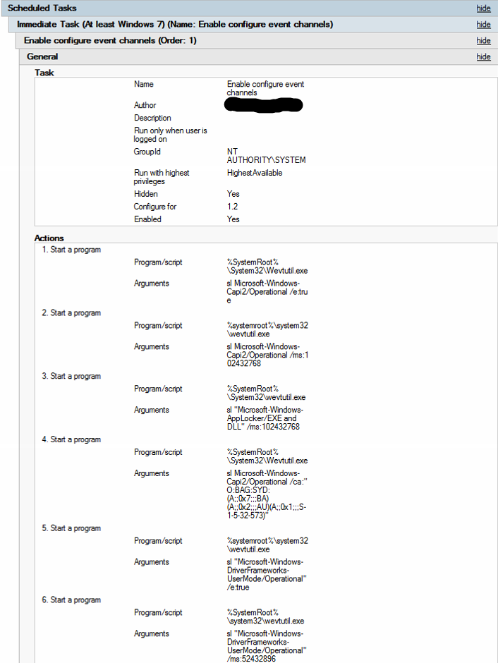

# Use Windows Event Forwarding to help with intrusion detection

**Applies to**
-   Windows 10
-   Windows Server

Learn about an approach to collect events from devices in your organization. This article talks about events in both normal operations and when an intrusion is suspected.

Windows Event Forwarding (WEF) reads any operational or administrative event log on a device in your organization and forwards the events you choose to a Windows Event Collector (WEC) server.

To accomplish this, there are two different of subscriptions published to client devices - the Baseline subscription and the suspect subscription. The Baseline subscription enrolls all devices in your organization, and a Suspect subscription only includes devices that have been added by you. The
Suspect subscription collects additional events to help build context for system activity and can quickly be updated to accommodate new events and/or scenarios as needed without impacting baseline operations.

This implementation helps differentiate where events are ultimately stored. Baseline events can be sent to devices with online analytical capability, such as Security Event Manager (SEM), while also sending events to a MapReduce system, such as HDInsight or Hadoop, for long-term storage and deeper analysis. Events from the Suspect subscription are sent directly to a MapReduce system due to volume and lower signal/noise ratio, they are largely used for host forensic analysis.

An SEM’s strength lies in being able to inspect, correlate events, and generate alerts for known patterns manner and alert security staff at machine speed.

A MapReduce system has a longer retention time (years versus months for an SEM), larger ingress ability (hundreds of terabytes per day), and the ability to perform more complex operations on the data like statistical and trend analysis, pattern clustering analysis, or apply Machine Learning algorithms.

Here's an approximate scaling guide for WEF events:

| Events/second range | Data store                 |
|---------------------|----------------------------|
| 0 - 5,000           | SQL or SEM                 |
| 5,000 - 50,000      | SEM                        |
| 50,000+             | Hadoop/HDInsight/Data Lake |
 
Event generation on a device must be enabled either separately or as part of the GPO for the baseline WEF implementation, including enabling of disabled event logs and setting channel permissions. For more info, see [Appendix C - Event channel settings (enable and channel access) methods](#bkmk-appendixc). This is because WEF is a passive system with regards to the event log. It cannot change the size of event log files, enable disabled event channels, change channel permissions, or adjust a security audit policy. WEF only queries event channels for existing events. Additionally, having event generation already occurring on a device allows for more complete event collection building a complete history of system activity. Otherwise, you'll be limited to the speed of GPO and WEF subscription refresh cycles to make changes to what is being generated on the device. On modern devices, enabling additional event channels and expanding the size of event log files has not resulted in noticeable performance differences.

For the minimum recommended audit policy and registry system ACL settings, see [Appendix A - Minimum recommended minimum audit policy](#bkmk-appendixa) and [Appendix B - Recommended minimum registry system ACL policy](#bkmk-appendixb).

>**Note:**  These are only minimum values need to meet what the WEF subscription selects.
 
From a WEF subscription management perspective, the event queries provided should be used in two separate subscriptions for ease of maintenance; only machines meeting specific criteria would be allowed access to the targeted subscription, this access would be determined by an algorithm or an analysts’ direction. All devices should have access to the Baseline subscription.

This means you would create two base subscriptions:

-   **Baseline WEF subscription**. Events collected from all hosts, this includes some role-specific events, which will only be emitted by those machines.
-   **Targeted WEF subscription**. Events collected from a limited set of hosts due to unusual activity and/or heightened awareness for those systems.

Each using the respective event query below. Note that for the Targeted subscription enabling the “read existing events” option should be set to true to allow collection of existing events from systems. By default, WEF subscriptions will only forward events generated after the WEF subscription was received by the client.

In [Appendix E – Annotated Baseline Subscription Event Query](#bkmk-appendixe) and [Appendix F – Annotated Suspect Subscription Event Query](#bkmk-appendixf), the event query XML is included when creating WEF subscriptions. These are annotated for query purpose and clarity. Individual &lt;Query&gt; element can be removed or edited without affecting the rest of the query.

### Common WEF questions

This section addresses common questions from IT pros and customers.

### Will the user notice if their machine is enabled for WEF or if WEF encounters an error?

The short answer is: No.

The longer answer is: The **Eventlog-forwardingPlugin/Operational** event channel logs the success, warning, and error events related to WEF subscriptions present on the device. Unless the user opens Event Viewer and navigates to that channel, they will not notice WEF either through resource consumption or Graphical User Interface pop-ups. Even if there is an issue with the WEF subscription, there is no user interaction or performance degradation. All success, warning, and failure events are logged to this operational event channel.

### Is WEF Push or Pull?

A WEF subscription can be configured to be push or pull, but not both. The simplest, most flexible IT deployment with the greatest scalability can be achieved by using a push, or source initiated, subscription. WEF clients are configured by using a GPO and the built-in forwarding client is activated. For pull, collector initiated, the subscription on the WEC server is pre-configured with the names of the WEF Client devices from which events are to be selected. Those clients also have to be configured ahead of time to allow the credentials used in the subscription to access their event logs remotely (normally by adding the credential to the **Event Log Readers** built-in local security group.) A useful scenario: closely monitoring a specific set of machines.

### Will WEF work over VPN or RAS?

WEF handles VPN, RAS, and DirectAccess scenarios well and will reconnect and send any accumulated backlog of events when the connection to the WEF Collector is re-established.

### How is client progress tracked?

The WEC server maintains in its registry the bookmark information and last heartbeat time for each event source for each WEF subscription. When an event source re-connects to a WEC server, the last bookmark position is sent to the device to use as a starting point to resume forwarding events. If a
WEF client has no events to send, the WEF client will connect periodically to send a Heartbeat to the WEC server to indicate it is active. This heartbeat value can be individually configured for each subscription.

### Will WEF work in an IPv4, IPv6, or mixed IPv4/IPv6 environment?

Yes. WEF is transport agnostic and will work over IPv4 or IPv6.

### Are WEF events encrypted? I see an HTTP/HTTPS option!

In a domain setting, the connection used to transmit WEF events is encrypted using Kerberos, by default (with NTLM as a fallback option, which can be disabled by using a GPO). Only the WEF collector can decrypt the connection. Additionally, the connection between WEF client and WEC server is mutually authenticated regardless of authentication type (Kerberos or NTLM.) There are GPO options to force Authentication to use Kerberos Only.

This authentication and encryption is performed regardless if HTTP or HTTPS is selected.

The HTTPS option is available if certificate based authentication is used, in cases where the Kerberos based mutual authentication is not an option. The SSL certificate and provisioned client certificates are used to provide mutual authentication.

### Do WEF Clients have a separate buffer for events?

The WEF client machines local event log is the buffer for WEF for when the connection to the WEC server is lost. To increase the “buffer size”, increase the maximum file size of the specific event log file where events are being selected. For more info, see [Appendix C – Event Channel Settings (enable and Channel Access) methods](#bkmk-appendixc).

When the event log overwrites existing events (resulting in data loss if the device is not connected to the Event Collector), there is no notification sent to the WEF collector that events are lost from the client. Neither is there an indicator that there was a gap encountered in the event stream.

### What format is used for forwarded events?

WEF has two modes for forwarded events. The default is “Rendered Text” which includes the textual description of the event as you would see it in Event Viewer. This means that the event size is effectively doubled or tripled depending on the size of the rendered description. The alternative mode is
“Events” (also sometimes referred to as “Binary” format) – which is just the event XML itself sent in binary XML format (as it would be written to the evtx file.) This is very compact and can more than double the event volume a single WEC server can accommodate.

A subscription “testSubscription” can be configured to use the Events format through the WECUTIL utility:

``` syntax
@rem required to set the DeliveryMaxItems or DeliveryMaxLatencyTime
Wecutil ss “testSubscription” /cf:Events
```

### How frequently are WEF events delivered?

Event delivery options are part of the WEF subscription configuration parameters – There are three built-in subscription delivery options: Normal, Minimize Bandwidth, and Minimize Latency. A fourth, catch-all called “Custom” is available but cannot be selected or configured through the WEF UI by using Event Viewer. The Custom delivery option must be selected and configured using the WECUTIL.EXE command-line application. All subscription options define a maximum event count and maximum event age, if either limit is exceeded then the accumulated events are sent to the event collector.

This table outlines the built-in delivery options:

| Event delivery optimization options | Description |
| - | - |
| Normal | This option ensures reliable delivery of events and does not attempt to conserve bandwidth. It is the appropriate choice unless you need tighter control over bandwidth usage or need forwarded events delivered as quickly as possible. It uses pull delivery mode, batches 5 items at a time and sets a batch timeout of 15 minutes. |
| Minimize bandwidth | This option ensures that the use of network bandwidth for event delivery is strictly controlled. It is an appropriate choice if you want to limit the frequency of network connections made to deliver events. It uses push delivery mode and sets a batch timeout of 6 hours. In addition, it uses a heartbeat interval of 6 hours. |
| Minimize latency | This option ensures that events are delivered with minimal delay. It is an appropriate choice if you are collecting alerts or critical events. It uses push delivery mode and sets a batch timeout of 30 seconds. |
 
For more info about delivery options, see [Configure Advanced Subscription Settings](https://technet.microsoft.com/library/cc749167.aspx).

The primary difference is in the latency which events are sent from the client. If none of the built-in options meet your requirements you can set Custom event delivery options for a given subscription from an elevated command prompt:

``` syntax
@rem required to set the DeliveryMaxItems or DeliveryMaxLatencyTime
Wecutil ss “SubscriptionNameGoesHere” /cm:Custom
@rem set DeliveryMaxItems to 1 event
Wecutil ss “SubscriptionNameGoesHere” /dmi:1
@rem set DeliveryMaxLatencyTime to 10 ms
Wecutil ss “SubscriptionNameGoesHere” /dmlt:10
```
### How do I control which devices have access to a WEF Subscription?

For source initiated subscriptions: Each WEF subscription on a WEC server has its own ACL for machine accounts or security groups containing machine accounts (not user accounts) that are explicitly allowed to participate in that subscription or are explicitly denied access. This ACL applies to only a single WEF subscription (since there can be multiple WEF subscriptions on a given WEC server), other WEF Subscriptions have their own separate ACL.

For collector initiated subscriptions: The subscription contains the list of machines from which the WEC server is to collect events. This list is managed at the WEC server, and the credentials used for the subscription must have access to read event logs from the WEF Clients – the credentials can be either the machine account or a domain account.

### Can a client communicate to multiple WEF Event Collectors?

Yes. If you desire a High-Availability environment, simply configure multiple WEC servers with the same subscription configuration and publish both WEC Server URIs to WEF clients. WEF Clients will forward events simultaneously to the configured subscriptions on the WEC servers, if they have the appropriate access.

### <a href="" id="what-are-the-wec-server-s-limitations-"></a>What are the WEC server’s limitations?

There are three factors that limit the scalability of WEC servers. The general rule for a stable WEC server on commodity hardware is “10k x 10k” – meaning, no more than 10,000 concurrently active WEF Clients per WEC server and no more than 10,000 events/second average event volume.

-   **Disk I/O**. The WEC server does not process or validate the received event, but rather buffers the received event and then logs it to a local event log file (EVTX file). The speed of logging to the EVTX file is limited by the disk write speed. Isolating the EVTX file to its own array or using high speed disks can increase the number of events per second that a single WEC server can receive.
-   **Network Connections**. While a WEF source does not maintain a permanent, persistent connection to the WEC server, it does not immediately disconnect after sending its events. This means that the number of WEF sources that can simultaneously connect to the WEC server is limited to the open TCP ports available on the WEC server.
-   **Registry size**. For each unique device that connects to a WEF subscription, there is a registry key (corresponding to the FQDN of the WEF Client) created to store bookmark and source heartbeat information. If this is not pruned to remove inactive clients this set of registry keys can grow to an unmanageable size over time.

    -   When a subscription has &gt;1000 WEF sources connect to it over its operational lifetime, also known as lifetime WEF sources, Event Viewer can become unresponsive for a few minutes when selecting the **Subscriptions** node in the left-navigation, but will function normally afterwards.
    -   At &gt;50,000 lifetime WEF sources, Event Viewer is no longer an option and wecutil.exe (included with Windows) must be used to configure and manage subscriptions.
    -   At &gt;100,000 lifetime WEF sources, the registry will not be readable and the WEC server will likely have to be rebuilt.

## Subscription information

Below lists all of the items that each subscription collects, the actual subscription XML is available in an Appendix. These are separated out into Baseline and Targeted. The intent is to subscribe all hosts to Baseline, and then enroll (and remove) hosts on an as needed basis to the Targeted subscription.

### Baseline subscription

While this appears to be the largest subscription, it really is the lowest volume on a per-device basis. (Exceptions should be allowed for unusual devices – a device performing complex developer related tasks can be expected to create an unusually high volume of process create and AppLocker events.) This subscription does not require special configuration on client devices to enable event channels or modify channel permissions.

The subscription is essentially a collection of query statements applied to the Event Log. This means that it is modular in nature and a given query statement can be removed or changed without impacting other query statement in the subscription. Additionally, suppress statements which filter out specific events, only apply within that query statement and are not to the entire subscription.

### Baseline subscription requirements

To gain the most value out of the baseline subscription we recommend to have the following requirements set on the device to ensure that the clients are already generating the required events to be forwarded off the system.

-   Apply a security audit policy that is a super-set of the recommended minimum audit policy. For more info, see [Appendix A – Minimum Recommended minimum Audit Policy](#bkmk-appendixa). This ensures that the security event log is generating the required events.
-   Apply at least an Audit-Only AppLocker policy to devices.

    -   If you are already whitelisting or blacklisting events by using AppLocker, then this requirement is met.
    -   AppLocker events contain extremely useful information, such as file hash and digital signature information for executables and scripts.

-   Enable disabled event channels and set the minimum size for modern event files.
-   Currently, there is no GPO template for enabling or setting the maximum size for the modern event files. This must be done by using a GPO. For more info, see [Appendix C – Event Channel Settings (enable and Channel Access) methods](#bkmk-appendixc).

The annotated event query can be found in the following. For more info, see [Appendix F – Annotated Suspect Subscription Event Query](#bkmk-appendixf).

- Anti-malware events from Microsoft Antimalware or Windows Defender. This can be configured for any given anti-malware product easily if it writes to the Windows event log.
- Security event log Process Create events.
- AppLocker Process Create events (EXE, script, packaged App installation and execution).
- Registry modification events. For more info, see [Appendix B – Recommended minimum Registry System ACL Policy](#bkmk-appendixb).
- OS startup and shutdown

  -   Startup event include operating system version, service pack level, QFE version, and boot mode.

- Service install

  -   Includes what the name of the service, the image path, and who installed the service.

- Certificate Authority audit events

  -   This is only applicable on systems with the Certificate Authority role installed.
  -   Logs certificate requests and responses.

- User profile events

  -   Use of a temporary profile or unable to create a user profile may indicate an intruder is interactively logging into a device but not wanting to leave a persistent profile behind.

- Service start failure

  -   Failure codes are localized, so you have to check the message DLL for values.

- Network share access events

  -   Filter out IPC$ and /NetLogon file shares, which are expected and noisy.

- System shutdown initiate requests

  -   Find out what initiated the restart of a device.

- User initiated interactive logoff event
- Remote Desktop Services session connect, reconnect, or disconnect.
- EMET events, if EMET is installed.
- Event forwarding plugin events

  -   For monitoring WEF subscription operations, particularly Partial Success events. This is useful for diagnosing deployment issues.

- Network share create and delete

  - Enables detection of unauthorized share creation.
    >**Note:**  All shares are re-created when the device starts.
         
- Logon sessions

  -   Logon success for interactive (local and Remote Interactive/Remote Desktop)
  -   Logon success for services for non-built-in accounts, such as LocalSystem, LocalNetwork, and so on.
  -   Logon success for batch sessions
  -   Logon session close, which are logoff events for non-network sessions.

- Windows Error Reporting (Application crash events only)

  -   This can help detect early signs of intruder not familiar with enterprise environment using targeted malware.

- Event log service events

  -   Errors, start events, and stop events for the Windows Event Log service.

- Event log cleared (including the Security Event Log)

  -   This could indicate an intruder that are covering their tracks.

- Special privileges assigned to new logon

  -   This indicates that at the time of logon a user is either an Administrator or has the sufficient access to make themselves Administrator.

- Outbound Remote Desktop Services session attempts

  -   Visibility into potential beachhead for intruder

- System time changed
- SMB Client (mapped drive connections)
- Account credential validation

  -   Local accounts or domain accounts on domain controllers

- A user was added or removed from the local Administrators security group.
- Crypto API private key accessed

  -   Associated with signing objects using the locally stored private key.

- Task Scheduler task creation and delete

  -   Task Scheduler allows intruders to run code at specified times as LocalSystem.

- Logon with explicit credentials

  -   Detect credential use changes by intruders to access additional resources.

- Smartcard card holder verification events

  -   This detects when a smartcard is being used.

### Suspect subscription

This adds some possible intruder-related activity to help analyst further refine their determinations about the state of the device.

-   Logon session creation for network sessions

    -   Enables time-series analysis of network graphs.

-   RADIUS and VPN events

    -   Useful if you use a Microsoft IAS RADIUS/VPN implementation. It shows user-&gt; IP address assignment with remote IP address connecting to the enterprise.

-   Crypto API X509 object and build chain events

    -   Detects known bad certificate, CA, or sub-CA
    -   Detects unusual process use of CAPI

-   Groups assigned to local logon

    -   Gives visibility to groups which enable account wide access
    -   Allows better planning for remediation efforts
    -   Excludes well known, built-in system accounts.

-   Logon session exit

    -   Specific for network logon sessions.

-   Client DNS lookup events

    -   Returns what process performed a DNS query and the results returned from the DNS server.

-   Process exit

    -   Enables checking for processes terminating unexpectedly.

-   Local credential validation or logon with explicit credentials

    -   Generated when the local SAM is authoritative for the account credentials being authenticated.
    -   Noisy on domain controllers
    -   On client devices this is only generated when local accounts log on.

-   Registry modification audit events

    -   Only when a registry value is being created, modified, or deleted.

-   Wireless 802.1x authentication

    -   Detect wireless connection with a peer MAC address

-   Windows PowerShell logging

    -   Covers Windows PowerShell 2.0 and later and includes the Windows PowerShell 5.0 logging improvements for in-memory attacks using Windows PowerShell.
    -   Includes Windows PowerShell remoting logging

-   User Mode Driver Framework “Driver Loaded” event

    -   Can possibly detect a USB device loading multiple device drivers. For example, a USB\_STOR device loading the keyboard or network driver.

## <a href="" id="bkmk-appendixa"></a>Appendix A - Minimum recommended minimum audit policy

If your organizational audit policy enables additional auditing to meet its needs, that is fine. The policy below is the minimum audit policy settings needed to enable events collected by both baseline and targeted subscriptions.

| Category           | Subcategory                     | Audit settings      |
|--------------------|---------------------------------|---------------------|
| Account Logon      | Credential Validation           | Success and Failure |
| Account Management | Security Group Management       | Success  |
| Account Management | User Account Management         | Success and Failure |
| Account Management | Computer Account Management     | Success and Failure |
| Account Management | Other Account Management Events | Success and Failure |
| Detailed Tracking  | Process Creation                | Success             |
| Detailed Tracking  | Process Termination             | Success             |
| Logon/Logoff       | User/Device Claims              | Not configured      |
| Logon/Logoff       | IPsec Extended Mode             | Not configured      |
| Logon/Logoff       | IPsec Quick Mode                | Not configured      |
| Logon/Logoff       | Logon                           | Success and Failure |
| Logon/Logoff       | Logoff                          | Success             |
| Logon/Logoff       | Other Logon/Logoff Events       | Success and Failure |
| Logon/Logoff       | Special Logon                   | Success and Failure |
| Logon/Logoff       | Account Lockout                 | Success             |
| Object Access      | Application Generated           | Not configured      |
| Object Access      | File Share                      | Success             |
| Object Access      | File System                     | Not configured      |
| Object Access      | Other Object Access Events      | Not configured      |
| Object Access      | Registry                        | Not configured      |
| Object Access      | Removable Storage               | Success             |
| Policy Change      | Audit Policy Change             | Success and Failure |
| Policy Change      | MPSSVC Rule-Level Policy Change | Success and Failure |
| Policy Change      | Other Policy Change Events      | Success and Failure |
| Policy Change      | Authentication Policy Change    | Success and Failure |
| Policy Change      | Authorization Policy Change     | Success and Failure |
| Privilege Use      | Sensitive Privilege Use         | Not configured      |
| System             | Security State Change           | Success and Failure |
| System             | Security System Extension       | Success and Failure |
| System             | System Integrity                | Success and Failure |
 
## <a href="" id="bkmk-appendixb"></a>Appendix B - Recommended minimum registry system ACL policy

The Run and RunOnce keys are useful for intruders and malware persistence. It allows code to be run (or run only once then removed, respectively) when a user logs into the system.

This can easily be extended to other Auto-Execution Start Points keys in the registry.

Use the following figures to see how you can configure those registry keys.


## <a href="" id="bkmk-appendixc"></a>Appendix C - Event channel settings (enable and channel access) methods

Some channels are disabled by default and have to be enabled. Others, such as Microsoft-Windows-CAPI2/Operational must have the channel access modified to allow the Event Log Readers built-in security group to read from it.

The recommended and most effective way to do this is to configure the baseline GPO to run a scheduled task to configure the event channels (enable, set maximum size, and adjust channel access.) This will take effect at the next GPO refresh cycle and has minimal impact on the client device.

The following GPO snippet performs the following:

-   Enables the **Microsoft-Windows-Capi2/Operational** event channel.
-   Sets the maximum file size for **Microsoft-Windows-Capi2/Operational** to 100MB.
-   Sets the maximum file size for **Microsoft-Windows-AppLocker/EXE and DLL** to 100MB.
-   Sets the maximum channel access for **Microsoft-Windows-Capi2/Operational** to include the built-in Event Log Readers security group.
-   Enables the **Microsoft-Windows-DriverFrameworks-UserMode/Operational** event channel.
-   Sets the maximum file size for **Microsoft-Windows-DriverFrameworks-UserMode/Operational** to 50MB.



## <a href="" id="bkmk-appendixd"></a>Appendix D - Minimum GPO for WEF Client configuration

Here are the minimum steps for WEF to operate:

1.  Configure the collector URI(s).
2.  Start the WinRM service.
3.  Add the Network Service account to the built-in Event Log Readers security group. This allows reading from secured event channel, such as the security event channel.


## <a href="" id="bkmk-appendixe"></a>Appendix E – Annotated baseline subscription event query

```xml
<QueryList>
  <Query Id="0" Path="System">
    <!-- Anti-malware *old* events, but only detect events (cuts down noise) -->
    <Select Path="System">*[System[Provider[@Name='Microsoft Antimalware'] and (EventID &gt;= 1116 and EventID &lt;= 1119)]]</Select>
  </Query>
  <!-- AppLocker EXE events or Script events -->
  <Query Id="1" Path="Microsoft-Windows-AppLocker/EXE and DLL">
    <Select Path="Microsoft-Windows-AppLocker/EXE and DLL">*[UserData[RuleAndFileData[PolicyName="EXE"]]]</Select>
    <Select Path="Microsoft-Windows-AppLocker/MSI and Script">*</Select>
  </Query>
  <Query Id="2" Path="Security">
    <!-- Wireless Lan 802.1x authentication events with Peer MAC address -->
    <Select Path="Security">*[System[(EventID=5632)]]</Select>
  </Query>
  <Query Id="3" Path="Microsoft-Windows-TaskScheduler/Operational">
    <!-- Task scheduler Task Registered (106),  Task Registration Deleted (141), Task Deleted (142) -->
    <Select Path="Microsoft-Windows-TaskScheduler/Operational">*[System[Provider[@Name='Microsoft-Windows-TaskScheduler'] and (EventID=106 or EventID=141 or EventID=142 )]]</Select>
    <Select Path="System">*[System[Provider[@Name='Microsoft-Windows-TaskScheduler'] and (EventID=106 or EventID=141 or EventID=142 )]]</Select>
  </Query>
  <Query Id="4" Path="System">
    <!-- System startup (12 - includes OS/SP/Version) and shutdown -->
    <Select Path="System">*[System[Provider[@Name='Microsoft-Windows-Kernel-General'] and (EventID=12 or EventID=13)]]</Select>
  </Query>
  <Query Id="5" Path="System">
    <!-- Service Install (7000), service start failure (7045), new service (4697) -->
    <Select Path="System">*[System[Provider[@Name='Service Control Manager'] and (EventID = 7000 or EventID=7045)]]</Select>
<Select Path="Security">*[System[(EventID=4697)]]</Select>
  </Query>
  <Query Id="6" Path="Security">
    <!-- TS Session reconnect (4778), TS Session disconnect (4779) -->
    <Select Path="Security">*[System[(EventID=4778 or EventID=4779)]]</Select>
  </Query>
  <Query Id="7" Path="Security">
    <!-- Network share object access without IPC$ and Netlogon shares -->
    <Select Path="Security">*[System[(EventID=5140)]] and (*[EventData[Data[@Name="ShareName"]!="\\*\IPC$"]]) and (*[EventData[Data[@Name="ShareName"]!="\\*\NetLogon"]])</Select>
  </Query>
  <Query Id="8" Path="Security">
    <!-- System Time Change (4616)  -->
    <Select Path="Security">*[System[(EventID=4616)]]</Select>
  </Query>
  <Query Id="9" Path="System">
    <!-- Shutdown initiate requests, with user, process and reason (if supplied) -->
    <Select Path="System">*[System[Provider[@Name='USER32'] and (EventID=1074)]]</Select>
  </Query>
  <!-- AppLocker packaged (Modern UI) app execution -->
  <Query Id="10" Path="Microsoft-Windows-AppLocker/Packaged app-Execution">
    <Select Path="Microsoft-Windows-AppLocker/Packaged app-Execution">*</Select>
  </Query>
  <!-- AppLocker packaged (Modern UI) app installation -->
  <Query Id="11" Path="Microsoft-Windows-AppLocker/Packaged app-Deployment">
    <Select Path="Microsoft-Windows-AppLocker/Packaged app-Deployment">*</Select>
  </Query>
  <Query Id="12" Path="Application">
    <!-- EMET events -->
    <Select Path="Application">*[System[Provider[@Name='EMET']]]</Select>
  </Query>
  <Query Id="13" Path="System">
    <!-- Event log service events -->
    <Select Path="System">*[System[Provider[@Name='Microsoft-Windows-Eventlog']]]</Select>
  </Query>
  <Query Id="14" Path="Security">
    <!-- Local logons without network or service events -->
    <Select Path="Security">*[System[(EventID=4624)]] and (*[EventData[Data[@Name="LogonType"]!="3"]]) and (*[EventData[Data[@Name="LogonType"]!="5"]])</Select>
  </Query>
  <Query Id="15" Path="Application">
    <!-- WER events for application crashes only -->
    <Select Path="Application">*[System[Provider[@Name='Windows Error Reporting']]] and (*[EventData[Data[3] ="APPCRASH"]])</Select>
  </Query>
  <Query Id="16" Path="Security">
    <!-- Security Log cleared events (1102), EventLog Service shutdown (1100)-->
    <Select Path="Security">*[System[(EventID=1102 or EventID = 1100)]]</Select>
  </Query>
  <Query Id="17" Path="System">
    <!-- Other Log cleared events (104)-->
    <Select Path="System">*[System[(EventID=104)]]</Select>
  </Query>
  <Query Id="18" Path="Security">
    <!--  user initiated logoff -->
    <Select Path="Security">*[System[(EventID=4647)]]</Select>
  </Query>
  <Query Id="19" Path="Security">
    <!-- user logoff for all non-network logon sessions-->
    <Select Path="Security">*[System[(EventID=4634)]] and (*[EventData[Data[@Name="LogonType"] != "3"]])</Select>
  </Query>
  <Query Id="20" Path="Security">
    <!-- Service logon events if the user account isn't LocalSystem, NetworkService, LocalService -->
    <Select Path="Security">*[System[(EventID=4624)]] and (*[EventData[Data[@Name="LogonType"]="5"]]) and (*[EventData[Data[@Name="TargetUserSid"] != "S-1-5-18"]]) and (*[EventData[Data[@Name="TargetUserSid"] != "S-1-5-19"]]) and (*[EventData[Data[@Name="TargetUserSid"] != "S-1-5-20"]])</Select>
  </Query>
  <Query Id="21" Path="Security">
    <!-- Network Share create (5142), Network Share Delete (5144)  -->
    <Select Path="Security">*[System[(EventID=5142 or EventID=5144)]]</Select>
  </Query>
  <Query Id="22" Path="Security">
    <!-- Process Create (4688) -->
    <Select Path="Security">*[System[EventID=4688]]</Select>
  </Query>
  <Query Id="23" Path="Security">
    <!-- Event log service events specific to Security channel -->
    <Select Path="Security">*[System[Provider[@Name='Microsoft-Windows-Eventlog']]]</Select>
  </Query>
  <Query Id="26" Path="Security">
    <!-- Special Privileges (Admin-equivalent Access) assigned to new logon, excluding LocalSystem-->
    <Select Path="Security">*[System[(EventID=4672)]]</Select>
    <Suppress Path="Security">*[EventData[Data[1]="S-1-5-18"]]</Suppress>
  </Query>
  <Query Id="27" Path="Security">
    <!-- New user added to local security group-->
    <Select Path="Security">*[System[(EventID=4732)]]</Select>
  </Query>
  <Query Id="28" Path="Security">
    <!-- New user added to global security group-->
    <Select Path="Security">*[System[(EventID=4728)]]</Select>
  </Query>
  <Query Id="29" Path="Security">
    <!-- New user added to universal security group-->
    <Select Path="Security">*[System[(EventID=4756)]]</Select>
  </Query>
  <Query Id="30" Path="Security">
    <!-- User removed from local Administrators group-->
    <Select Path="Security">*[System[(EventID=4733)]] and (*[EventData[Data[@Name="TargetUserName"]="Administrators"]])</Select>
  </Query>
  <Query Id="31" Path="Microsoft-Windows-TerminalServices-RDPClient/Operational">
    <!-- Log attempted TS connect to remote server -->
    <Select Path="Microsoft-Windows-TerminalServices-RDPClient/Operational">*[System[(EventID=1024)]]</Select>
  </Query>
  <Query Id="32" Path="Security">
    <!-- Certificate Services received certificate request (4886), Approved and Certificate issued (4887), Denied request (4888) -->
    <Select Path="Security">*[System[(EventID=4886 or EventID=4887 or EventID=4888)]]</Select>
  </Query>
  <Query Id="34" Path="Security">
    <!-- New User Account Created(4720), User Account Enabled (4722), User Account Disabled (4725), User Account Deleted (4726) -->
    <Select Path="Security">*[System[(EventID=4720 or EventID=4722 or EventID=4725 or EventID=4726)]]</Select>
  </Query>
  <Query Id="35" Path="Microsoft-Windows-SmartCard-Audit/Authentication">
    <!-- Gets all Smart-card Card-Holder Verification (CHV) events (success and failure) performed on the host. -->
    <Select Path="Microsoft-Windows-SmartCard-Audit/Authentication">*</Select>
  </Query>
  <Query Id="36" Path="Microsoft-Windows-SMBClient/Operational">
    <!-- get all UNC/mapped drive successful connection -->
    <Select Path="Microsoft-Windows-SMBClient/Operational">*[System[(EventID=30622 or EventID=30624)]]</Select>
  </Query>
  <Query Id="37" Path="Application">
    <!-- User logging on with Temporary profile (1511), cannot create profile, using temporary profile (1518)-->
    <Select Path="Application">*[System[Provider[@Name='Microsoft-Windows-User Profiles Service'] and (EventID=1511 or EventID=1518)]]</Select>
  </Query>
  <Query Id="39" Path="Microsoft-Windows-Sysmon/Operational">
    <!-- Modern SysMon event provider-->
    <Select Path="Microsoft-Windows-Sysmon/Operational">*</Select>
  </Query>
  <Query Id="40" Path="Application">
    <!-- Application crash/hang events, similar to WER/1001. These include full path to faulting EXE/Module.-->
    <Select Path="Application">*[System[Provider[@Name='Application Error'] and (EventID=1000)]]</Select>
    <Select Path="Application">*[System[Provider[@Name='Application Hang'] and (EventID=1002)]]</Select>
  </Query>
  <Query Id="41" Path="Microsoft-Windows-Windows Defender/Operational">
    <!-- Modern Windows Defender event provider Detection events (1006-1009) and (1116-1119) -->
    <Select Path="Microsoft-Windows-Windows Defender/Operational">*[System[( (EventID &gt;= 1006 and EventID &lt;= 1009) )]]</Select>
    <Select Path="Microsoft-Windows-Windows Defender/Operational">*[System[( (EventID &gt;= 1116 and EventID &lt;= 1119) )]]</Select>
  </Query>
</QueryList>
```

## <a href="" id="bkmk-appendixf"></a>Appendix F – Annotated Suspect Subscription Event Query

```xml
<QueryList>
  <Query Id="0" Path="Security">
    <!-- Network logon events-->
    <Select Path="Security">*[System[(EventID=4624)]] and (*[EventData[Data[@Name="LogonType"]="3"]])</Select>
  </Query>
  <Query Id="1" Path="System">
    <!-- RADIUS authentication events User Assigned IP address (20274), User successfully authenticated (20250), User Disconnected (20275)  -->
    <Select Path="System">*[System[Provider[@Name='RemoteAccess'] and (EventID=20274 or EventID=20250 or EventID=20275)]]</Select>
  </Query>
  <Query Id="2" Path="Microsoft-Windows-CAPI2/Operational">
    <!-- CAPI events Build Chain (11), Private Key accessed (70), X509 object (90)-->
    <Select Path="Microsoft-Windows-CAPI2/Operational">*[System[(EventID=11 or EventID=70 or EventID=90)]]</Select>
  </Query>
  <Query Id="3" Path="Security">
    <!-- CA stop/Start events CA Service Stopped (4880), CA Service Started (4881), CA DB row(s) deleted (4896), CA Template loaded (4898) -->
    <Select Path="Security">*[System[(EventID=4880 or EventID = 4881 or EventID = 4896 or EventID = 4898)]]</Select>
  </Query>
  <Query Id="4" Path="Microsoft-Windows-LSA/Operational">
    <!-- Groups assigned to new login (except for well known, built-in accounts)-->
    <Select Path="Microsoft-Windows-LSA/Operational">*[System[(EventID=300)]] and (*[EventData[Data[@Name="TargetUserSid"] != "S-1-5-20"]]) and (*[EventData[Data[@Name="TargetUserSid"] != "S-1-5-18"]]) and (*[EventData[Data[@Name="TargetUserSid"] != "S-1-5-19"]])</Select>
  </Query>
  <Query Id="5" Path="Security">
    <!-- Logoff events - for Network Logon events-->
    <Select Path="Security">*[System[(EventID=4634)]] and (*[EventData[Data[@Name="LogonType"] = "3"]])</Select>
  </Query>
  <Query Id="6" Path="Security">
    <!-- RRAS events – only generated on Microsoft IAS server -->
    <Select Path="Security">*[System[( (EventID &gt;= 6272 and EventID &lt;= 6280) )]]</Select>
  </Query>
  <Query Id="7" Path="Microsoft-Windows-DNS-Client/Operational">
    <!-- DNS Client events Query Completed (3008) -->
    <Select Path="Microsoft-Windows-DNS-Client/Operational">*[System[(EventID=3008)]]</Select>
<!-- suppresses local machine name resolution events -->
<Suppress Path="Microsoft-Windows-DNS-Client/Operational">*[EventData[Data[@Name="QueryOptions"]="140737488355328"]]</Suppress>
<!-- suppresses empty name resolution events -->
<Suppress Path="Microsoft-Windows-DNS-Client/Operational">*[EventData[Data[@Name="QueryResults"]=""]]</Suppress>
  </Query>
  <Query Id="8" Path="Security">
    <!-- Process Terminate (4689) -->
    <Select Path="Security">*[System[(EventID = 4689)]]</Select>
  </Query>
  <Query Id="9" Path="Security">
    <!-- Local credential authentication events (4776), Logon with explicit credentials (4648) -->
    <Select Path="Security">*[System[(EventID=4776 or EventID=4648)]]</Select>
  </Query>
  <Query Id="10" Path="Security">
    <!-- Registry modified events for Operations: New Registry Value created (%%1904), Existing Registry Value modified (%%1905), Registry Value Deleted (%%1906) -->
    <Select Path="Security">*[System[(EventID=4657)]] and ((*[EventData[Data[@Name="OperationType"] = "%%1904"]]) or (*[EventData[Data[@Name="OperationType"] = "%%1905"]]) or (*[EventData[Data[@Name="OperationType"] = "%%1906"]]))</Select>
  </Query>
  <Query Id="11" Path="Security">
    <!-- Request made to authenticate to Wireless network (including Peer MAC (5632) -->
    <Select Path="Security">*[System[(EventID=5632)]]</Select>
  </Query>
  <Query Id="12" Path="Microsoft-Windows-PowerShell/Operational">
    <!-- PowerShell execute block activity (4103), Remote Command(4104), Start Command(4105), Stop Command(4106) -->
    <Select Path="Microsoft-Windows-PowerShell/Operational">*[System[(EventID=4103 or EventID=4104 or EventID=4105 or EventID=4106)]]</Select>
  </Query>
  <Query Id="13" Path="Microsoft-Windows-DriverFrameworks-UserMode/Operational">
    <!-- Detect User-Mode drivers loaded - for potential BadUSB detection. -->
    <Select Path="Microsoft-Windows-DriverFrameworks-UserMode/Operational">*[System[(EventID=2004)]]</Select>
  </Query>
<Query Id="14" Path="Windows PowerShell">
    <!-- Legacy PowerShell pipeline execution details (800) -->
    <Select Path="Windows PowerShell">*[System[(EventID=800)]]</Select>
  </Query>
</QueryList>
```
## <a href="" id="bkmk-appendixg"></a>Appendix G - Online resources

You can get more info with the following links:

-   [Event Selection](https://msdn.microsoft.com/library/aa385231.aspx)
-   [Event Queries and Event XML](https://msdn.microsoft.com/library/bb399427.aspx)
-   [Event Query Schema](https://msdn.microsoft.com/library/aa385760.aspx)
-   [Windows Event Collector](https://msdn.microsoft.com/library/windows/desktop/bb427443.aspx)


