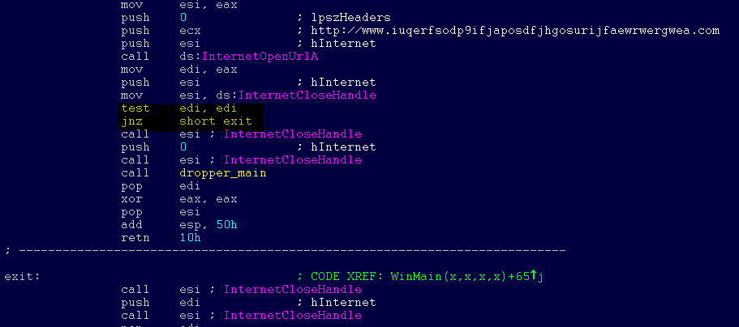
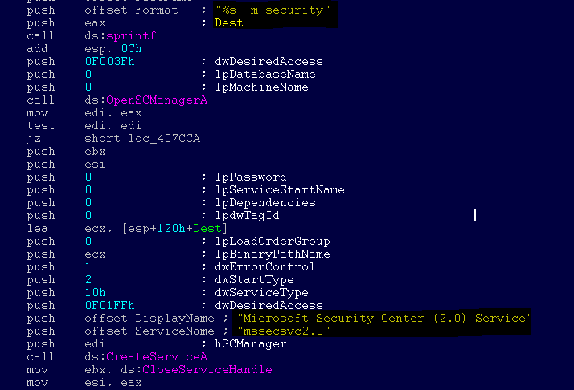
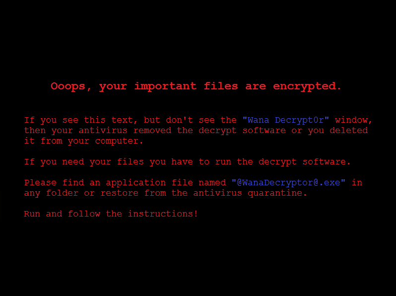
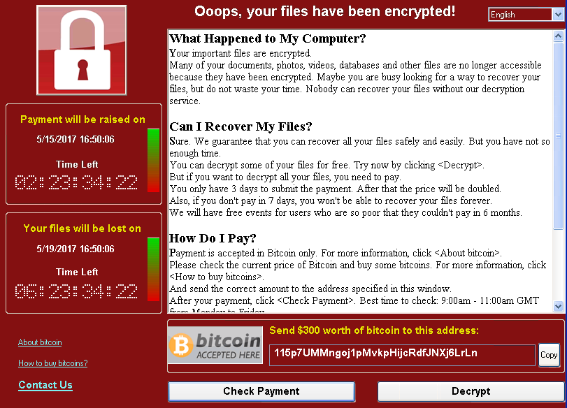
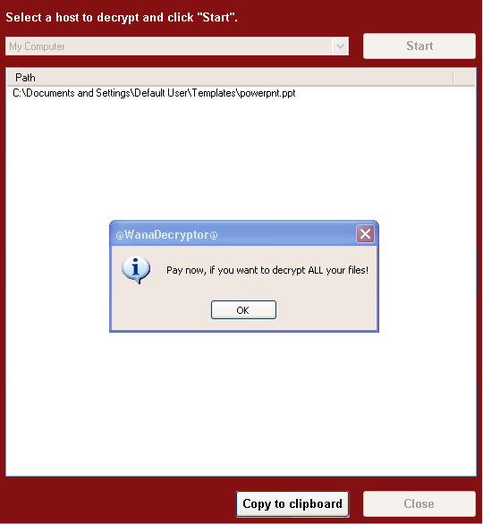
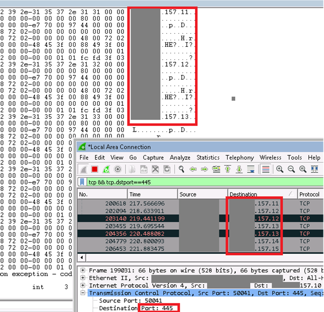

# WannaCrypt ransomware worm targets out-of-date systems


On May 12, 2017 we detected a new ransomware that spreads like a worm by leveraging vulnerabilities that have been previously fixed. While security updates are automatically applied in most computers, some users and enterprises may delay deployment of patches. Unfortunately, the ransomware, known as [WannaCrypt](https://www.microsoft.com/security/portal/threat/encyclopedia/Entry.aspx?Name=Ransom:Win32/WannaCrypt), appears to have affected computers that have not applied the patch for these vulnerabilities. While the attack is unfolding, we remind users to install [MS17-010](https://technet.microsoft.com/library/security/ms17-010.aspx) if they have not already done so.

Microsoft antimalware diagnostic data immediately picked up signs of this campaign. Our expert systems gave us visibility and context into this new attack as it happened, allowing [Windows Defender Antivirus](https://technet.microsoft.com/itpro/windows/keep-secure/windows-defender-in-windows-10) to deliver real-time defense. Through automated analysis, machine learning, and predictive modeling, we were able to rapidly protect against this malware.

In this blog, we provide an early analysis of the end-to-end ransomware attack. Please note this threat is still under investigation. The attack is still active, and there is a possibility that the attacker will attempt to react to our detection response.

## Attack vector

Ransomware threats do not typically spread rapidly. Threats like WannaCrypt (also known as WannaCry, WanaCrypt0r, WCrypt, or WCRY) usually leverage social engineering or email as primary attack vector, relying on users downloading and executing a malicious payload. However, in this unique case, the ransomware perpetrators used publicly available exploit code for the patched SMB 'EternalBlue' vulnerability, [CVE-2017-0145](http://cve.mitre.org/cgi-bin/cvename.cgi?name=CVE-2017-0145), which can be triggered by sending a specially crafted packet to a targeted SMBv1 server. This vulnerability was fixed in security bulletin [MS17-010](https://technet.microsoft.com/library/security/ms17-010.aspx), which was released on March 14, 2017.

WannaCrypt's spreading mechanism is borrowed from [well-known](https://packetstormsecurity.com/files/142464/MS17-010-SMBv1-SrvOs2FeaToNt-OOB-Remote-Code-Execution.html) [public SMB exploits](https://github.com/RiskSense-Ops/MS17-010), which armed this regular ransomware with worm-like functionalities, creating an entry vector for machines still unpatched even after the fix had become available.

The exploit code used by WannaCrypt was designed to work only against unpatched Windows 7 and Windows Server 2008 (or earlier OS) systems, so Windows 10 PCs are not affected by this attack.

We haven't found evidence of the exact initial entry vector used by this threat, but there are two scenarios that we believe are highly possible explanations for the spread of this ransomware:

- Arrival through social engineering emails designed to trick users to run the malware and activate the worm-spreading functionality with the SMB exploit
- Infection through SMB exploit when an unpatched computer is addressable from other infected machines

## Dropper

The threat arrives as a dropper Trojan that has the following two components:

1. A component that attempts to exploit the SMB CVE-2017-0145 vulnerability in other computers
2. The ransomware known as WannaCrypt

The dropper tries to connect the following domains using the API `InternetOpenUrlA()`:

- www[.]iuqerfsodp9ifjaposdfjhgosurijfaewrwergwea[.]com
- www[.]ifferfsodp9ifjaposdfjhgosurijfaewrwergwea[.]com

If connection to the domains is successful, the dropper does not infect the system further with ransomware or try to exploit other systems to spread; it simply stops execution. However, if the connection fails, the threat proceeds to drop the ransomware and creates a service on the system.

In other words, unlike in most malware infections, **IT Administrators should NOT block these domains**. Note that the malware is not proxy-aware, so a local DNS record may be required. This does not need to point to the Internet, but can resolve to any accessible server which will accept connections on TCP 80.



The threat creates a service named *mssecsvc2.0*, whose function is to exploit the SMB vulnerability in other computers accessible from the infected system:
```
Service Name: mssecsvc2.0
Service Description: (Microsoft Security Center (2.0) Service)
Service Parameters: '-m security'
```

 

## WannaCrypt ransomware

The ransomware component is a dropper that contains a password-protected .zip archive in its resource section. The document encryption routine and the files in the .zip archive contain support tools, a decryption tool, and the ransom message. In the samples we analyzed, the password for the .zip archive is 'WNcry@2ol7'.

When run, WannaCrypt creates the following registry keys:

- *HKLM\SOFTWARE\Microsoft\Windows\CurrentVersion\Run\\\<random string> = '\<malware working directory>\tasksche.exe'*
- *HKLM\SOFTWARE\WanaCrypt0r\\wd = '\<malware working directory>'*

It changes the wallpaper to a ransom message by modifying the following registry key:

- *HKCU\Control Panel\Desktop\Wallpaper: '\<malware working directory>\\@WanaDecryptor@.bmp'*

It creates the following files in the malware's working directory:

- *00000000.eky*
- *00000000.pky*
- *00000000.res*
- *274901494632976.bat*
- <em>@Please_Read_Me@.txt</em>
- <em>@WanaDecryptor@.bmp</em>
- <em>@WanaDecryptor@.exe</em>
- *b.wnry*
- *c.wnry*
- *f.wnry*
- *m.vbs*
- *msg\m_bulgarian.wnry*
- *msg\m_chinese (simplified).wnry*
- *msg\m_chinese (traditional).wnry*
- *msg\m_croatian.wnry*
- *msg\m_czech.wnry*
- *msg\m_danish.wnry*
- *msg\m_dutch.wnry*
- *msg\m_english.wnry*
- *msg\m_filipino.wnry*
- *msg\m_finnish.wnry*
- *msg\m_french.wnry*
- *msg\m_german.wnry*
- *msg\m_greek.wnry*
- *msg\m_indonesian.wnry*
- *msg\m_italian.wnry*
- *msg\m_japanese.wnry*
- *msg\m_korean.wnry*
- *msg\m_latvian.wnry*
- *msg\m_norwegian.wnry*
- *msg\m_polish.wnry*
- *msg\m_portuguese.wnry*
- *msg\m_romanian.wnry*
- *msg\m_russian.wnry*
- *msg\m_slovak.wnry*
- *msg\m_spanish.wnry*
- *msg\m_swedish.wnry*
- *msg\m_turkish.wnry*
- *msg\m_vietnamese.wnry*
- *r.wnry*
- *s.wnry*
- *t.wnry*
- *TaskData\Tor\libeay32.dll*
- *TaskData\Tor\libevent-2-0-5.dll*
- *TaskData\Tor\libevent_core-2-0-5.dll*
- *TaskData\Tor\libevent_extra-2-0-5.dll*
- *TaskData\Tor\libgcc_s_sjlj-1.dll*
- *TaskData\Tor\libssp-0.dll*
- *TaskData\Tor\ssleay32.dll*
- *TaskData\Tor\taskhsvc.exe*
- *TaskData\Tor\tor.exe*
- *TaskData\Tor\zlib1.dll*
- *taskdl.exe*
- *taskse.exe*
- *u.wnry*

WannaCrypt may also create the following files:

- *%SystemRoot%\tasksche.exe*
- *%SystemDrive%\intel\\\<random directory name>\tasksche.exe*
- *%ProgramData%\\\<random directory name>\tasksche.exe*

It may create a randomly named service that has the following associated ImagePath: `cmd.exe /c '<malware working directory>\tasksche.exe'`.

It then searches the whole computer for any file with any of the following file name extensions: *.123, .jpeg , .rb , .602 , .jpg , .rtf , .doc , .js , .sch , .3dm , .jsp , .sh , .3ds , .key , .sldm , .3g2 , .lay , .sldm , .3gp , .lay6 , .sldx , .7z , .ldf , .slk , .accdb , .m3u , .sln , .aes , .m4u , .snt , .ai , .max , .sql , .ARC , .mdb , .sqlite3 , .asc , .mdf , .sqlitedb , .asf , .mid , .stc , .asm , .mkv , .std , .asp , .mml , .sti , .avi , .mov , .stw , .backup , .mp3 , .suo , .bak , .mp4 , .svg , .bat , .mpeg , .swf , .bmp , .mpg , .sxc , .brd , .msg , .sxd , .bz2 , .myd , .sxi , .c , .myi , .sxm , .cgm , .nef , .sxw , .class , .odb , .tar , .cmd , .odg , .tbk , .cpp , .odp , .tgz , .crt , .ods , .tif , .cs , .odt , .tiff , .csr , .onetoc2 , .txt , .csv , .ost , .uop , .db , .otg , .uot , .dbf , .otp , .vb , .dch , .ots , .vbs , .der' , .ott , .vcd , .dif , .p12 , .vdi , .dip , .PAQ , .vmdk , .djvu , .pas , .vmx , .docb , .pdf , .vob , .docm , .pem , .vsd , .docx , .pfx , .vsdx , .dot , .php , .wav , .dotm , .pl , .wb2 , .dotx , .png , .wk1 , .dwg , .pot , .wks , .edb , .potm , .wma , .eml , .potx , .wmv , .fla , .ppam , .xlc , .flv , .pps , .xlm , .frm , .ppsm , .xls , .gif , .ppsx , .xlsb , .gpg , .ppt , .xlsm , .gz , .pptm , .xlsx , .h , .pptx , .xlt , .hwp , .ps1 , .xltm , .ibd , .psd , .xltx , .iso , .pst , .xlw , .jar , .rar , .zip , .java , .raw.*

WannaCrypt encrypts all files it finds and renames them by appending *.WNCRY* to the file name. For example, if a file is named *picture.jpg*, the ransomware encrypts and renames the file to *picture.jpg.WNCRY*.

This ransomware also creates the file <em>@Please_Read_Me@.txt</em> in every folder where files are encrypted. The file contains the same ransom message shown in the replaced wallpaper image (see screenshot below).

After completing the encryption process, the malware deletes the volume shadow copies by running the following command:
`cmd.exe /c vssadmin delete shadows /all /quiet & wmic shadowcopy delete & bcdedit /set {default} bootstatuspolicy ignoreallfailures & bcdedit /set {default} recoveryenabled no & wbadmin delete catalog -quiet`

It then replaces the desktop background image with the following message:



It also runs an executable showing a ransom note which indicates a $300 ransom in Bitcoins as well as a timer:

 

The text is localized into the following languages: Bulgarian, Chinese (simplified), Chinese (traditional), Croatian, Czech, Danish, Dutch, English, Filipino, Finnish, French, German, Greek, Indonesian, Italian, Japanese, Korean, Latvian, Norwegian, Polish, Portuguese, Romanian, Russian, Slovak, Spanish, Swedish, Turkish, and Vietnamese.

The ransomware also demonstrates the decryption capability by allowing the user to decrypt a few random files, free of charge. It then quickly reminds the user to pay the ransom to decrypt all the remaining files.

 

## Spreading capability

The worm functionality attempts to infect unpatched Windows machines in the local network. At the same time, it also executes massive scanning on Internet IP addresses to find and infect other vulnerable computers. This activity results in large SMB traffic from the infected host, which can be observed by SecOps personnel, as shown below.



The Internet scanning routine randomly generates octets to form the IPv4 address. The malware then targets that IP to attempt to exploit CVE-2017-0145. The threat avoids infecting the IPv4 address if the randomly generated value for first octet is 127 or if the value is equal to or greater than 224, in order to skip local loopback interfaces. Once a vulnerable machine is found and infected, it becomes the next hop to infect other machines. The vicious infection cycle continues as the scanning routing discovers unpatched computers.

When it successfully infects a vulnerable computer, the malware runs kernel-level shellcode that seems to have been copied from the public backdoor known as DOUBLEPULSAR, but with certain adjustments to drop and execute the ransomware dropper payload, both for x86 and x64 systems.

 

 

## Protection against the WannaCrypt attack

To get the latest protection from Microsoft, upgrade to [Windows 10](https://www.microsoft.com/en-us/windows/windows-10-upgrade). Keeping your computers [up-to-date](https://www.microsoft.com/en-us/security/portal/mmpc/help/updatefaqs.aspx) gives you the benefits of the latest features and proactive mitigations built into the latest versions of Windows.

We recommend customers that have not yet installed the security update [MS17-010](https://technet.microsoft.com/library/security/ms17-010.aspx) do so as soon as possible. Until you can apply the patch, we also recommend two possible workarounds to reduce the attack surface:

- Disable SMBv1 with the steps documented at [Microsoft Knowledge Base Article 2696547](https://support.microsoft.com/kb/2696547) and as [recommended previously](https://blogs.technet.microsoft.com/filecab/2016/09/16/stop-using-smb1/)
- Consider adding a rule on your router or firewall to block incoming SMB traffic on port 445

[Windows Defender Antivirus](https://technet.microsoft.com/itpro/windows/keep-secure/windows-defender-in-windows-10) detects this threat as [Ransom:Win32/WannaCrypt](https://www.microsoft.com/security/portal/threat/encyclopedia/Entry.aspx?Name=Ransom:Win32/WannaCrypt) as of the *1.243.297.0* update. Windows Defender Antivirus uses cloud-based protection, helping to protect you from the latest threats.

For enterprises, use [Device Guard](https://technet.microsoft.com/itpro/windows/keep-secure/device-guard-deployment-guide) to lock down devices and provide kernel-level virtualization-based security, allowing only trusted applications to run, effectively preventing malware from running.

Use [Office 365 Advanced Threat Protection](https://blogs.office.com/2015/04/08/introducing-exchange-online-advanced-threat-protection/), which has machine learning capability that blocks dangerous email threats, such as the emails carrying ransomware.

Monitor networks with [Windows Defender Advanced Threat Protection](https://www.microsoft.com/en-us/WindowsForBusiness/windows-atp), which alerts security operations teams about suspicious activities. Download this playbook to see how you can leverage Windows Defender ATP to detect, investigate, and mitigate ransomware in networks: [Windows Defender Advanced Threat Protection - Ransomware response playbook](https://www.microsoft.com/en-us/download/details.aspx?id=55090).

## Resources

Download English language security updates: [Windows Server 2003 SP2 x64](http://download.windowsupdate.com/d/csa/csa/secu/2017/02/windowsserver2003-kb4012598-x64-custom-enu_f24d8723f246145524b9030e4752c96430981211.exe), [Windows Server 2003 SP2 x86,](http://download.windowsupdate.com/c/csa/csa/secu/2017/02/windowsserver2003-kb4012598-x86-custom-enu_f617caf6e7ee6f43abe4b386cb1d26b3318693cf.exe) [Windows XP SP2 x64](http://download.windowsupdate.com/d/csa/csa/secu/2017/02/windowsserver2003-kb4012598-x64-custom-enu_f24d8723f246145524b9030e4752c96430981211.exe), [Windows XP SP3 x86](http://download.windowsupdate.com/d/csa/csa/secu/2017/02/windowsxp-kb4012598-x86-custom-enu_eceb7d5023bbb23c0dc633e46b9c2f14fa6ee9dd.exe), [Windows XP Embedded SP3 x86](http://download.windowsupdate.com/c/csa/csa/secu/2017/02/windowsxp-kb4012598-x86-embedded-custom-enu_8f2c266f83a7e1b100ddb9acd4a6a3ab5ecd4059.exe), [Windows 8 x86,](http://download.windowsupdate.com/c/msdownload/update/software/secu/2017/05/windows8-rt-kb4012598-x86_a0f1c953a24dd042acc540c59b339f55fb18f594.msu) [Windows 8 x64](http://download.windowsupdate.com/c/msdownload/update/software/secu/2017/05/windows8-rt-kb4012598-x64_f05841d2e94197c2dca4457f1b895e8f632b7f8e.msu)

Download localized language security updates: [Windows Server 2003 SP2 x64](https://www.microsoft.com/downloads/details.aspx?FamilyId=d3cb7407-3339-452e-8371-79b9c301132e), [Windows Server 2003 SP2 x86](https://www.microsoft.com/downloads/details.aspx?FamilyId=350ec04d-a0ba-4a50-9be3-f900dafeddf9), [Windows XP SP2 x64](https://www.microsoft.com/downloads/details.aspx?FamilyId=5fbaa61b-15ce-49c7-9361-cb5494f9d6aa), [Windows XP SP3 x86](https://www.microsoft.com/downloads/details.aspx?FamilyId=7388c05d-9de6-4c6a-8b21-219df407754f), [Windows XP Embedded SP3 x86](https://www.microsoft.com/downloads/details.aspx?FamilyId=a1db143d-6ad2-4e7e-9e90-2a73316e1add), [Windows 8 x86](https://www.microsoft.com/downloads/details.aspx?FamilyId=6e2de6b7-9e43-4b42-aca2-267f24210340), [Windows 8 x64](https://www.microsoft.com/downloads/details.aspx?FamilyId=b08bb3f1-f156-4e61-8a68-077963bae8c0)

MS17-010 Security Update: [https://technet.microsoft.com/library/security/ms17-010.aspx](https://technet.microsoft.com/library/security/ms17-010.aspx)

Customer guidance for WannaCrypt attacks: [https://blogs.technet.microsoft.com/msrc/2017/05/12/customer-guidance-for-wannacrypt-attacks/](https://blogs.technet.microsoft.com/msrc/2017/05/12/customer-guidance-for-wannacrypt-attacks/)

General information on ransomware: [https://www.microsoft.com/en-us/security/portal/mmpc/shared/ransomware.aspx](https://www.microsoft.com/en-us/security/portal/mmpc/shared/ransomware.aspx)

## Indicators of compromise

SHA1 of samples analyzed:

- 51e4307093f8ca8854359c0ac882ddca427a813c
- e889544aff85ffaf8b0d0da705105dee7c97fe26

Files created:

- %SystemRoot%\mssecsvc.exe
- %SystemRoot%\tasksche.exe
- %SystemRoot%\qeriuwjhrf
- b.wnry
- c.wnry
- f.wnry
- r.wnry
- s.wnry
- t.wnry
- u.wnry
- taskdl.exe
- taskse.exe
- 00000000.eky
- 00000000.res
- 00000000.pky
- @WanaDecryptor@.exe
- @Please_Read_Me@.txt
- m.vbs
- @WanaDecryptor@.exe.lnk
- @WanaDecryptor@.bmp
- 274901494632976.bat
- taskdl.exe
- Taskse.exe
- Files with '.wnry' extension
- Files with '.WNCRY' extension

Registry keys created:

- HKLM\SOFTWARE\WanaCrypt0r\wd


*Karthik Selvaraj, Elia Florio, Andrea Lelli, and Tanmay Ganacharya*<br />*Microsoft Malware Protection Center*

