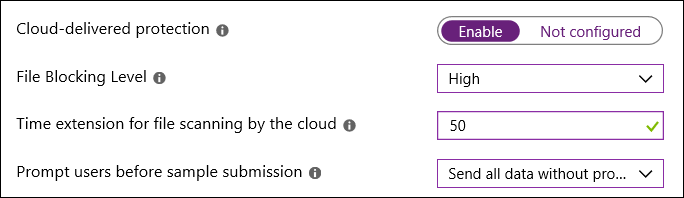
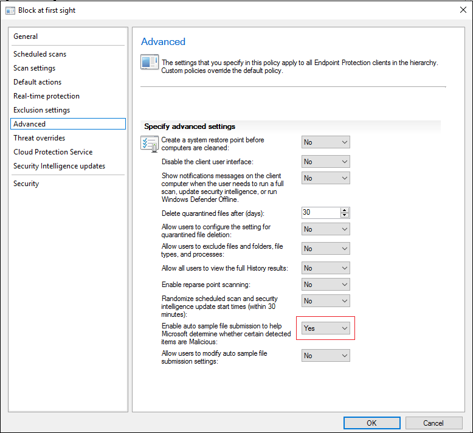

# Enable block at first sight

**Applies to:**

- [Microsoft Defender Advanced Threat Protection (Microsoft Defender ATP)](https://go.microsoft.com/fwlink/p/?linkid=2069559)

Block at first sight is a feature of next gen protection that provides a way to detect and block new malware within seconds.

It is enabled by default when certain pre-requisite settings are also enabled. In most cases, these pre-requisite settings are also enabled by default, so the feature is running without any intervention. 

You can [specify how long the file should be prevented from running](configure-cloud-block-timeout-period-windows-defender-antivirus.md) while the cloud-based protection service analyzes the file.

You can also [customize the message displayed on users' desktops](https://docs.microsoft.com/windows/security/threat-protection/windows-defender-security-center/wdsc-customize-contact-information) when a file is blocked. You can change the company name, contact information, and message URL.

>[!TIP]
>You can also visit the Microsoft Defender ATP demo website at [demo.wd.microsoft.com](https://demo.wd.microsoft.com?ocid=cx-wddocs-testground) to confirm the features are working and see how they work.

## How it works

When Windows Defender Antivirus encounters a suspicious but undetected file, it queries our cloud protection backend. The cloud backend applies heuristics, machine learning, and automated analysis of the file to determine whether the files are malicious or clean.

In Windows 10, version 1803, block at first sight can now block non-portable executable files (such as JS, VBS, or macros) as well as executable files.

Block at first sight only uses the cloud protection backend for executable files and non-portable executable files that are downloaded from the Internet, or that originate from the Internet zone. A hash value of the .exe file is checked via the cloud backend to determine if this is a previously undetected file.

If the cloud backend is unable to make a determination, Windows Defender Antivirus locks the file and uploads a copy to the cloud. The cloud performs additional analysis to reach a determination before it either allows the file to run or blocks it in all future encounters, depending on whether it determines the file to be malicious or safe.

In many cases, this process can reduce the response time for new malware from hours to seconds.

## Confirm and validate that block at first sight is enabled

Block at first sight requires a number of settings to be configured correctly or it will not work. These settings are enabled by default in most enterprise Windows Defender Antivirus deployments.

### Confirm block at first sight is enabled with Intune

1. In Intune, navigate to **Device configuration - Profiles > *Profile name* > Device restrictions > Windows Defender Antivirus**.

> [!NOTE]
> The profile you select must be a Device Restriction profile type, not an Endpoint Protection profile type.

2. Verify these settings are configured as follows:

   - **Cloud-delivered protection**: **Enable**
   - **File Blocking Level**: **High**
   - **Time extension for file scanning by the cloud**: **50**
   - **Prompt users before sample submission**: **Send all data without prompting**

   

For more information about configuring Windows Defender Antivirus device restrictions in Intune, see [Configure device restriction settings in Microsoft Intune](https://docs.microsoft.com/intune/device-restrictions-configure).

For a list of Windows Defender Antivirus device restrictions in Intune, see [Device restriction for Windows 10 (and newer) settings in Intune](https://docs.microsoft.com/intune/device-restrictions-windows-10#windows-defender-antivirus).

### Enable block at first sight with SCCM

1. In System Center Configuration Manager, click **Assets and Compliance** > **Endpoint Protection** > **AntiMalware Policies**.
1. Click **Home** > **Create Antimalware Policy**.
1. Enter a name and a description, and add these settings:
   - **Real time protection**
   - **Advanced**
   - **Cloud Protection Service**
1. In the left column, click **Real time protection**, set **Enable real-time protection** to **Yes**, and set **Scan system files** to **Scan incoming and outgoing files**.
   
1. Click **Advanced**, set **Enable real-time protection** to **Yes**, and set **Scan system files** to **Scan incoming and outgoing files**.
   
1. Click **Cloud Protection Service**, set **Cloud Protection Service membership type** to **Advanced membership**, set **Level for blocking malicious files** to **High**, and set **Allow extended cloud check to block and scan suspicious files for up to (seconds)** to **50** seconds.
   
1. Click **OK** to create the policy.

### Confirm block at first sight is enabled with Group Policy

1. On your Group Policy management computer, open the [Group Policy Management Console](https://technet.microsoft.com/library/cc731212.aspx), right-click the Group Policy Object you want to configure and click **Edit**.

2. In the **Group Policy Management Editor** go to **Computer configuration** and click **Administrative templates**.

3. Expand the tree to **Windows components > Windows Defender Antivirus > MAPS** and configure the following Group Policies:

    1. Double-click **Join Microsoft MAPS** and ensure the option is set to **Enabled**. Click **OK**.

    2. Double-click **Send file samples when further analysis is required** and ensure the option is set to **Enabled** and the additional options are either of the following:

        - Send safe samples (1)
        - Send all samples (3)

        > [!WARNING]
        > Setting to 0 (Always Prompt) will lower the protection state of the device. Setting to 2 (Never send) means block at first sight will not function.

    3. Click **OK**.

4. In the **Group Policy Management Editor**, expand the tree to **Windows components > Windows Defender Antivirus > Real-time Protection**:

    1. Double-click **Scan all downloaded files and attachments** and ensure the option is set to **Enabled**. Click **OK**.

    2. Double-click **Turn off real-time protection** and ensure the option is set to **Disabled**. Click **OK**.

If you had to change any of the settings, you should re-deploy the Group Policy Object across your network to ensure all endpoints are covered.

### Confirm block at first sight is enabled with the Windows Security app

You can confirm that block at first sight is enabled in Windows Settings.

Block at first sight is automatically enabled as long as **Cloud-based protection** and **Automatic sample submission** are both turned on.

**Confirm Block at First Sight is enabled on individual clients**

1. Open the Windows Security app by clicking the shield icon in the task bar.

2. Click the **Virus & threat protection** tile (or the shield icon on the left menu bar) and then click **Manage Settings** under **Virus & threat protection settings**:

 

3. Confirm that **Cloud-based Protection** and **Automatic sample submission** are switched to **On**.

> [!NOTE]
> If the pre-requisite settings are configured and deployed using Group Policy, the settings described in this section will be greyed-out and unavailable for use on individual endpoints. Changes made through a Group Policy Object must first be deployed to individual endpoints before the setting will be updated in Windows Settings.

### Validate block at first sight is working

You can validate that the feature is working by following the steps outlined in [Validate connections between your network and the cloud](configure-network-connections-windows-defender-antivirus.md#validate).

## Disable block at first sight

> [!WARNING]
> Disabling block at first sight will lower the protection state of the endpoint and your network.

You may choose to disable block at first sight if you want to retain the pre-requisite settings without using block at first sight protection. You might wish to do this if you are experiencing latency issues or you want to test the feature's impact on your network.

**Disable block at first sight with Group Policy**

1. On your Group Policy management computer, open the [Group Policy Management Console](https://technet.microsoft.com/library/cc731212.aspx), right-click the Group Policy Object you want to configure and click **Edit**.

2. In the **Group Policy Management Editor** go to **Computer configuration** and click **Administrative templates**.

3. Expand the tree through **Windows components > Windows Defender Antivirus > MAPS**.

4. Double-click **Configure the 'Block at First Sight' feature** and set the option to **Disabled**.

    > [!NOTE]
    > Disabling block at first sight will not disable or alter the pre-requisite group policies.

## Related topics

- [Windows Defender Antivirus in Windows 10](windows-defender-antivirus-in-windows-10.md)
- [Enable cloud-delivered protection](enable-cloud-protection-windows-defender-antivirus.md)
