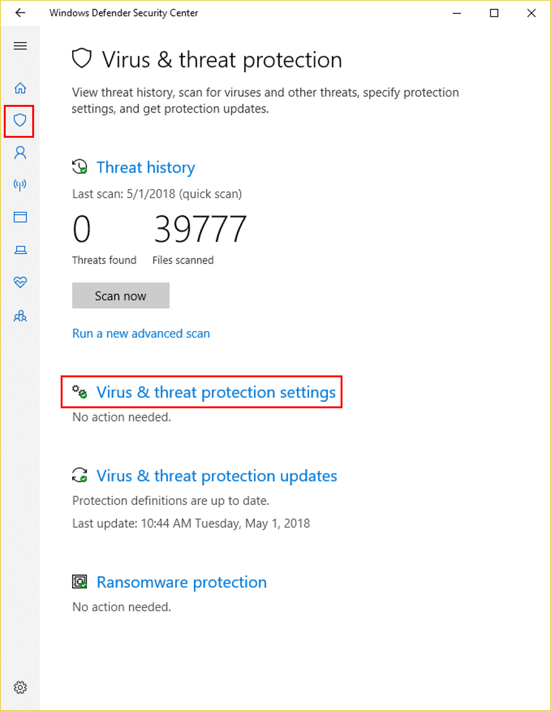

# Enable cloud-delivered protection

**Applies to:**

- [Microsoft Defender Advanced Threat Protection (Microsoft Defender ATP)](https://go.microsoft.com/fwlink/p/?linkid=2069559)

>[!NOTE]
>The Windows Defender Antivirus cloud service is a mechanism for delivering updated protection to your network and endpoints. Although it is called a cloud service, it is not simply protection for files stored in the cloud; rather, it uses distributed resources and machine learning to deliver protection to your endpoints at a rate that is far faster than traditional Security intelligence updates.

You can enable or disable Windows Defender Antivirus cloud-delivered protection with Microsoft Intune, System Center Configuration Manager, Group Policy, PowerShell cmdlets, or on individual clients in the Windows Security app.

See [Use Microsoft cloud-delivered protection](utilize-microsoft-cloud-protection-windows-defender-antivirus.md) for an overview of Windows Defender Antivirus cloud-delivered protection.

There are specific network-connectivity requirements to ensure your endpoints can connect to the cloud-delivered protection service. See [Configure and validate network connections](configure-network-connections-windows-defender-antivirus.md) for more details.

>[!NOTE]
>In Windows 10, there is no difference between the **Basic** and **Advanced** options described in this topic. This is a legacy distinction and choosing either setting will result in the same level of cloud-delivered protection. There is no difference in the type or amount of information that is shared. See the [Microsoft Privacy Statement](https://go.microsoft.com/fwlink/?linkid=521839) for more information on what we collect.

**Use Intune to enable cloud-delivered protection**

1. Sign in to the [Azure portal](https://portal.azure.com).
2. Select **All services > Intune**.
3. In the **Intune** pane, select **Device configuration > Profiles**, and then select the **Device restrictions** profile type you want to configure. If you haven't yet created a **Device restrictions** profile type, or if you want to create a new one, see [Configure device restriction settings in Microsoft Intune](https://docs.microsoft.com/intune/device-restrictions-configure).
4. Select **Properties**, select **Settings: Configure**, and then select **Windows Defender Antivirus**.
5. On the **Cloud-delivered protection** switch, select **Enable**.
6. In the **Prompt users before sample submission** dropdown, select **Send all data without prompting**. 
7. In the **Submit samples consent** dropdown, select one of the following:

    - **Send safe samples automatically**
    - **Send all samples automatically**

        >[!NOTE]
        >**Send safe samples automatically** option means that most samples will be sent automatically. Files that are likely to contain personal information will still prompt and require additional confirmation.

        > [!WARNING]
        > Setting to **Always Prompt** will lower the protection state of the device. Setting to **Never send** means the [Block at First Sight](configure-block-at-first-sight-windows-defender-antivirus.md) feature will not function.

8. Click **OK** to exit the **Windows Defender Antivirus** settings pane, click **OK** to exit the **Device restrictions** pane, and then click **Save** to save the changes to your **Device restrictions** profile.

For more information about Intune device profiles, including how to create and configure their settings, see [What are Microsoft Intune device profiles?](https://docs.microsoft.com/intune/device-profiles)

**Use Configuration Manager to enable cloud-delivered protection:**

See [How to create and deploy antimalware policies: Cloud-protection service](https://docs.microsoft.com/sccm/protect/deploy-use/endpoint-antimalware-policies#cloud-protection-service) for details on configuring System Center Configuration Manager (current branch).

**Use Group Policy to enable cloud-delivered protection:**

1. On your Group Policy management computer, open the [Group Policy Management Console](https://technet.microsoft.com/library/cc731212.aspx), right-click the Group Policy Object you want to configure and click **Edit**.

2. In the **Group Policy Management Editor** go to **Computer configuration**.

3. Click **Administrative templates**.

4. Expand the tree to **Windows components > Windows Defender Antivirus > MAPS**

5. Double-click **Join Microsoft MAPS** and ensure the option is enabled and set to **Basic MAPS** or **Advanced MAPS**. Click **OK**.

6. Double-click **Send file samples when further analysis is required** and ensure the option is set to **Enabled** and the additional options are either of the following:

    1. **Send safe samples** (1)
    2. **Send all samples** (3)

        >[!NOTE]
        >**Send safe samples automatically** option means that most samples will be sent automatically. Files that are likely to contain personal information will still prompt and require additional confirmation.

        > [!WARNING]
        > Setting to 0 (Always Prompt) will lower the protection state of the device. Setting to 2 (Never send) means the [Block at First Sight](configure-block-at-first-sight-windows-defender-antivirus.md) feature will not function.

7. Click **OK**.

**Use PowerShell cmdlets to enable cloud-delivered protection:**

Use the following cmdlets to enable cloud-delivered protection:

```PowerShell
Set-MpPreference -MAPSReporting Advanced
Set-MpPreference -SubmitSamplesConsent AlwaysPrompt
```

>[!NOTE]
>You can also set -SubmitSamplesConsent to `None`. Setting it to `Never` will lower the protection state of the device, and setting it to 2 means the [Block at First Sight](configure-block-at-first-sight-windows-defender-antivirus.md) feature will not function.

See [Use PowerShell cmdlets to configure and run Windows Defender Antivirus](use-powershell-cmdlets-windows-defender-antivirus.md)  and [Defender cmdlets](https://technet.microsoft.com/library/dn433280.aspx) for more information on how to use PowerShell with Windows Defender Antivirus.

**Use Windows Management Instruction (WMI) to enable cloud-delivered protection:**

Use the [**Set** method of the **MSFT_MpPreference**](https://msdn.microsoft.com/library/dn439474(v=vs.85).aspx) class for the following properties:

```WMI
MAPSReporting 
SubmitSamplesConsent
```

See the following for more information and allowed parameters:
- [Windows Defender WMIv2 APIs](https://msdn.microsoft.com/library/dn439477(v=vs.85).aspx)

**Enable cloud-delivered protection on individual clients with the Windows Security app**

> [!NOTE]
> If the **Configure local setting override for reporting Microsoft MAPS** Group Policy setting is set to **Disabled**, then the **Cloud-based protection** setting in Windows Settings will be greyed-out and unavailable. Changes made through a Group Policy Object must first be deployed to individual endpoints before the setting will be updated in Windows Settings.

1. Open the Windows Security app by clicking the shield icon in the task bar or searching the start menu for **Defender**.

2. Click the **Virus & threat protection** tile (or the shield icon on the left menu bar) and then the **Virus & threat protection settings** label:

    

3. Confirm that **Cloud-based Protection** and **Automatic sample submission** are switched to **On**.

>[!NOTE]
>If automatic sample submission has been configured with Group Policy then the setting will be greyed-out and unavailable.

## Related topics

- [Configure the cloud block timeout period](configure-cloud-block-timeout-period-windows-defender-antivirus.md)
- [Configure block at first sight](configure-block-at-first-sight-windows-defender-antivirus.md)
- [Use PowerShell cmdlets to manage Windows Defender Antivirus](use-powershell-cmdlets-windows-defender-antivirus.md)
- [Help secure Windows PCs with Endpoint Protection for Microsoft Intune](https://docs.microsoft.com/intune/deploy-use/help-secure-windows-pcs-with-endpoint-protection-for-microsoft-intune)]
- [Defender cmdlets](https://technet.microsoft.com/library/dn433280.aspx)
- [Utilize Microsoft cloud-delivered protection in Windows Defender Antivirus](utilize-microsoft-cloud-protection-windows-defender-antivirus.md)
- [How to create and deploy antimalware policies: Cloud-protection service](https://docs.microsoft.com/sccm/protect/deploy-use/endpoint-antimalware-policies#cloud-protection-service)
- [Windows Defender Antivirus in Windows 10](windows-defender-antivirus-in-windows-10.md)
