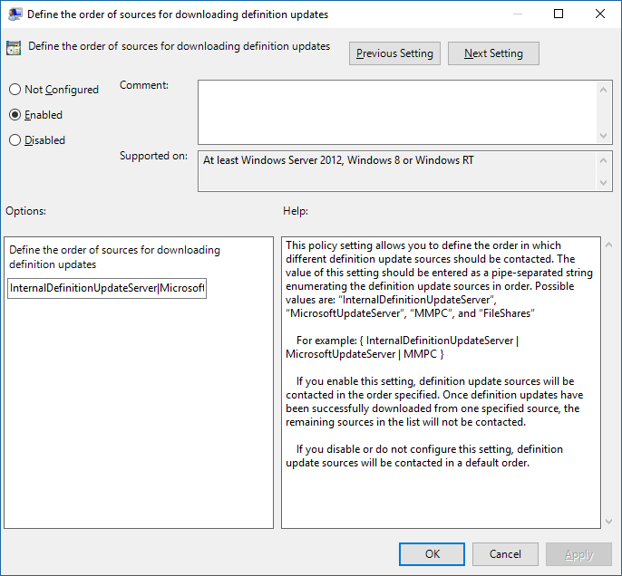

# Manage the sources for Windows Defender Antivirus protection updates

**Applies to:**

- [Microsoft Defender Advanced Threat Protection (Microsoft Defender ATP)](https://go.microsoft.com/fwlink/p/?linkid=2069559)

<a id="protection-updates"></a>
<!-- this has been used as anchor in VDI content -->

There are two components to managing protection updates - where the updates are downloaded from, and when updates are downloaded and applied.

This topic describes where you can specify the updates should be downloaded from, also known as the fallback order.

See [Manage Windows Defender Antivirus updates and apply baselines](manage-updates-baselines-windows-defender-antivirus.md) topic for an overview on how updates work, and how to configure other aspects of updates (such as scheduling updates).

<a id="fallback-order"></a>

There are five locations where you can specify where an endpoint should obtain updates. Typically, you would configure endpoints to individually download the updates from a primary source, followed by the other sources in order of priority based on your network configuration.

Updates will be obtained from the sources in the order you specify. If a source is not available, the next source in the list will be used.

You can use the following sources:


-   Microsoft Update
-   [Windows Server Update Service (WSUS)](https://technet.microsoft.com/windowsserver/bb332157.aspx)
-   System Center Configuration Manager
-   A network file share
-   The [Microsoft Malware Protection Center Security intelligence page (MMPC)](https://www.microsoft.com/security/portal/definitions/adl.aspx)


When updates are published, some logic will be applied to minimize the size of the update. In most cases, only the "delta" (or the differences between the latest update and the update that is currently installed on the endpoint) will be downloaded and applied. However, the size of the delta depends on:

- How old the current update on the endpoint is
- Which source you use


The older the updates on an endpoint, the larger the download. However, you must also consider frequency versus size - a more frequent update schedule may result in more ad hoc network usage, while a less-frequent schedule may result in larger file sizes.

Microsoft Update allows for rapid releases, which means it will download small deltas on a frequent basis. This ensures the best protection, but may increase network bandwidth.

The WSUS, Configuration Manager, and MMPC sources will deliver less frequent updates. The size of the updates may be slightly larger than the frequent release from Microsoft Update (as the delta, or differences between the latest version and what is on the endpoint will be larger). This ensures consistent protection without increasing ad hoc network usage (although the amount of data may be the same or increased as the updates will be fewer, but may be slightly larger).

> [!IMPORTANT]
> If you have set MMPC as a fallback source after WSUS or Microsoft Update, updates will only be downloaded from MMPC when the current update is considered to be out-of-date (by default, this is 14 consecutive days of not being able to apply updates from the WSUS or Microsoft Update services).
> You can, however, [set the number of days before protection is reported as out-of-date](https://docs.microsoft.com/windows/threat-protection/windows-defender-antivirus/manage-outdated-endpoints-windows-defender-antivirus#set-the-number-of-days-before-protection-is-reported-as-out-of-date).

Each source has typical scenarios that depend on how your network is configured, in addition to how often they publish updates, as described in the following table:

Location | Sample scenario
---|---
WSUS | You are using WSUS to manage updates for your network.
Microsoft Update | You want your endpoints to connect directly to Microsoft Update. This can be useful for endpoints that irregularly connect to your enterprise network, or if you do not use WSUS to manage your updates.
File share | You have non-Internet-connected devices (such as VMs). You can use your Internet-connected VM host to download the updates to a network share, from which the VMs can obtain the updates. See the [VDI deployment guide](deployment-vdi-windows-defender-antivirus.md) for how file shares can be used in virtual desktop infrastructure (VDI) environments.
Configuration Manager | You are using System Center Configuration Manager to update your endpoints.
MMPC | You need to download the latest protection updates because of a recent infection or to help provision a strong, base image for [VDI deployment](deployment-vdi-windows-defender-antivirus.md). This option should generally be used only as a final fallback source, and not the primary source. It will only be used if updates cannot be downloaded from WSUS or Microsoft Update for [a specified number of days](https://docs.microsoft.com/windows/threat-protection/windows-defender-antivirus/manage-outdated-endpoints-windows-defender-antivirus#set-the-number-of-days-before-protection-is-reported-as-out-of-date).


You can manage the order in which update sources are used with Group Policy, System Center Configuration Manager, PowerShell cmdlets, and WMI.

> [!IMPORTANT]
> If you set WSUS as a download location, you must approve the updates - regardless of what management tool you use to specify the location. You can set up an automatic approval rule with WSUS, which may be useful as updates arrive at least once a day. See [To synchronize endpoint protection updates in standalone WSUS](https://docs.microsoft.com/sccm/protect/deploy-use/endpoint-definitions-wsus#to-synchronize-endpoint-protection-definition-updates-in-standalone-wsus) for more details.


The procedures in this article first describe how to set the order, and then how to set up the **File share** option if you have enabled it.


**Use Group Policy to manage the update location:**

1. On your Group Policy management machine, open the [Group Policy Management Console](https://technet.microsoft.com/library/cc731212.aspx), right-click the Group Policy Object you want to configure and click **Edit**.

2. In the **Group Policy Management Editor** go to **Computer configuration**.

3. Click **Policies** then **Administrative templates**.

4. Expand the tree to **Windows components > Windows Defender > Signature updates** and configure the following settings:

   1.  Double-click the **Define the order of sources for downloading definition updates** setting and set the option to **Enabled**.

   2.  Enter the order of sources, separated by a single pipe, for example: `InternalDefinitionUpdateServer|MicrosoftUpdateServer|MMPC`, as shown in the following screenshot.

   

   3. Click **OK**. This will set the order of protection update sources.

   4. Double-click the **Define file shares for downloading definition updates** setting and set the option to **Enabled**.

   5. Enter the file share source. If you have multiple sources, enter each source in the order they should be used, separated by a single pipe. Use [standard UNC notation](https://msdn.microsoft.com/library/gg465305.aspx) for denoting the path, for example: `\\host-name1\share-name\object-name|\\host-name2\share-name\object-name`.  If you do not enter any paths then this source will be skipped when the VM downloads updates.

   6. Click **OK**. This will set the order of file shares when that source is referenced in the **Define the order of sources...** group policy setting.


**Use Configuration Manager to manage the update location:**

See [Configure Security intelligence Updates for Endpoint Protection](https://docs.microsoft.com/sccm/protect/deploy-use/endpoint-definition-updates) for details on configuring System Center Configuration Manager (current branch).


**Use PowerShell cmdlets to manage the update location:**

Use the following PowerShell cmdlets to set the update order.

```PowerShell
Set-MpPreference -SignatureFallbackOrder {LOCATION|LOCATION|LOCATION|LOCATION}
Set-MpPreference -SignatureDefinitionUpdateFileSharesSource {\\UNC SHARE PATH|\\UNC SHARE PATH}
```
See the following for more information:
- [Set-MpPreference -SignatureFallbackOrder](https://technet.microsoft.com/itpro/powershell/windows/defender/set-mppreference#-signaturefallbackorder)
- [Set-MpPreference -SignatureDefinitionUpdateFileSharesSource](https://technet.microsoft.com/itpro/powershell/windows/defender/set-mppreference#-signaturedefinitionupdatefilesharessources)
- [Use PowerShell cmdlets to configure and run Windows Defender Antivirus](use-powershell-cmdlets-windows-defender-antivirus.md)
- [Defender cmdlets](https://technet.microsoft.com/library/dn433280.aspx)

**Use Windows Management Instruction (WMI) to manage the update location:**

Use the [**Set** method of the **MSFT_MpPreference**](https://msdn.microsoft.com/library/dn455323(v=vs.85).aspx) class for the following properties:

```WMI
SignatureFallbackOrder
SignatureDefinitionUpdateFileSharesSource
```

See the following for more information:
- [Windows Defender WMIv2 APIs](https://msdn.microsoft.com/library/dn439477(v=vs.85).aspx)

**Use Mobile Device Management (MDM) to manage the update location:**

See [Policy CSP - Defender/SignatureUpdateFallbackOrder](https://docs.microsoft.com/windows/client-management/mdm/policy-csp-defender#defender-signatureupdatefallbackorder) for details on configuring MDM.


## Related topics

- [Deploy Windows Defender Antivirus](deploy-manage-report-windows-defender-antivirus.md)
- [Manage Windows Defender Antivirus updates and apply baselines](manage-updates-baselines-windows-defender-antivirus.md)
- [Manage updates for endpoints that are out of date](manage-outdated-endpoints-windows-defender-antivirus.md)
- [Manage event-based forced updates](manage-event-based-updates-windows-defender-antivirus.md)
- [Manage updates for mobile devices and VMs](manage-updates-mobile-devices-vms-windows-defender-antivirus.md)
- [Windows Defender Antivirus in Windows 10](windows-defender-antivirus-in-windows-10.md)

