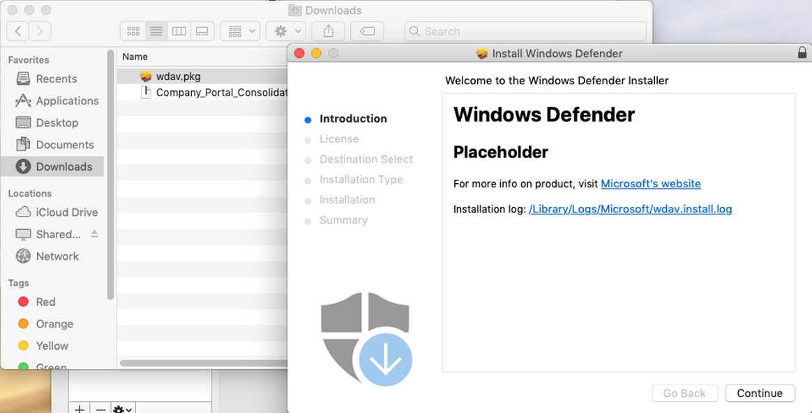
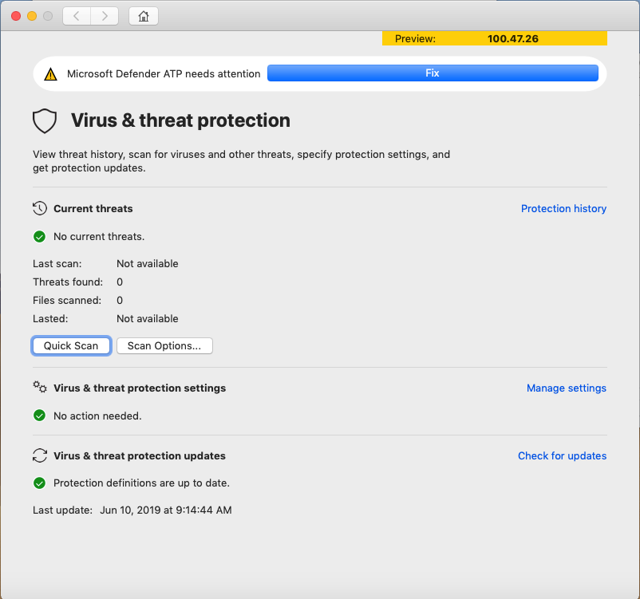
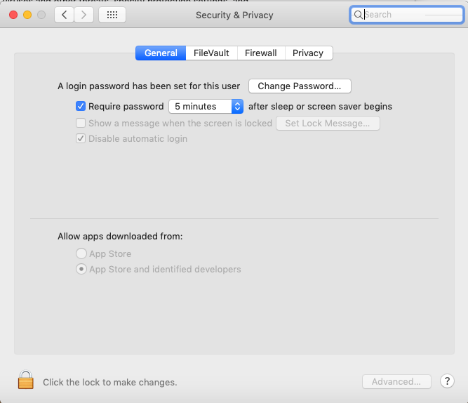

# Manual deployment

**Applies to:**

[Microsoft Defender Advanced Threat Protection (Microsoft Defender ATP) for Mac](microsoft-defender-atp-mac.md)

>[!IMPORTANT]
>This topic relates to the pre-release version of Microsoft Defender ATP for Mac. Microsoft Defender ATP for Mac is not yet widely available. Microsoft makes no warranties, express or implied, with respect to the information provided here.

## Prerequisites and system requirements

Before you get started, please see [the main Microsoft Defender ATP for Mac page](microsoft-defender-atp-mac.md) for a description of prerequisites and system requirements for the current software version.

## Download installation and onboarding packages

Download the installation and onboarding packages from Windows Defender Security Center:

1. In Windows Defender Security Center, go to **Settings > Machine Management > Onboarding**.
2. In Section 1 of the page, set operating system to **Linux, macOS, iOS or Android** and Deployment method to **Local script**.
3. In Section 2 of the page, select **Download installation package**. Save it as wdav.pkg to a local directory.
4. In Section 2 of the page, select **Download onboarding package**. Save it as WindowsDefenderATPOnboardingPackage.zip to the same directory.

    

5. From a command prompt, verify that you have the two files.
    Extract the contents of the .zip files:
  
    ```bash
   mavel-macmini:Downloads test$ ls -l
    total 721152
    -rw-r--r--  1 test  staff       6185 Mar 15 10:45 WindowsDefenderATPOnboardingPackage.zip
    -rw-r--r--  1 test  staff  354531845 Mar 13 08:57 wdav.pkg
    mavel-macmini:Downloads test$ unzip WindowsDefenderATPOnboardingPackage.zip
    Archive:  WindowsDefenderATPOnboardingPackage.zip
    inflating: WindowsDefenderATPOnboarding.py
    ```

## Application installation

To complete this process, you must have admin privileges on the machine.

1. Navigate to the downloaded wdav.pkg in Finder and open it.

    

2. Select **Continue**, agree with the License terms, and enter the password when prompted.

    

   > [!IMPORTANT]
   > You will be prompted to allow a driver from Microsoft to be installed (either "System Exception Blocked" or "Installation is on hold" or both. The driver must be allowed to be installed.

   

3. Select **Open Security Preferences**  or **Open System Preferences > Security & Privacy**. Select **Allow**:

    

The installation will proceed.

> [!NOTE]
> If you don't select **Allow**, the installation will proceed after 5 minutes. Defender ATP will be loaded, but real-time protection will be disabled.

### Fixing disabled Real Time Protection

If you did not enable Microsoft's driver during installation, then Defender's application will display a banner prompting you to enable it:

   

You can also run ```mdatp --health```. It will report if Real Time Protection is enabled but not available:

```bash
mavel-mojave:~ testuser$ mdatp --health
...
realTimeProtectionAvailable             : false
realTimeProtectionEnabled               : true
...
```

> [!NOTE]
> You have a 30 minute window to enable Real Time Protection from the warning banner, immediately following installation.

The warning banner containing a **Fix** button, which allows you to quickly enable Real Time Protection, without having to open a command prompt. Select the **Fix** button. It will prompt the **Security & Privacy** system window, where you will have to **Allow** system software from developers "Microsoft Corporation".

If you don't see a prompt, it means that 30 or more minutes have already passed, and Real Time Protection has still not been enabled:



In this case, you will need to perform the following steps to enable Real Time Protection instead. 

1. In Terminal, attempt to install the driver. (The operation will fail)
    ```bash
    mavel-mojave:~ testuser$ sudo kextutil /Library/Extensions/wdavkext.kext
    Kext rejected due to system policy: <OSKext 0x7fc34d528390 [0x7fffa74aa8e0]> { URL = "file:///Library/StagedExtensions/Library/Extensions/wdavkext.kext/", ID = "com.microsoft.wdavkext" }
    Kext rejected due to system policy: <OSKext 0x7fc34d528390 [0x7fffa74aa8e0]> { URL = "file:///Library/StagedExtensions/Library/Extensions/wdavkext.kext/", ID = "com.microsoft.wdavkext" }
    Diagnostics for /Library/Extensions/wdavkext.kext:
    ```

2. Open **System Preferences...** > **Security & Privacy** from the menu. (Close it first, if it's opened.)

3. **Allow** system software from developers "Microsoft Corporation"

4. In Terminal, install the driver again. This time the operation will succeed:

```bash
mavel-mojave:~ testuser$ sudo kextutil /Library/Extensions/wdavkext.kext
```

The banner should disappear from the Defender application, and ```mdatp --health``` should now report that Real Time Protection is both enabled and available:

```bash
mavel-mojave:~ testuser$ mdatp --health
...
realTimeProtectionAvailable             : true
realTimeProtectionEnabled               : true
...
```

## Client configuration

1. Copy wdav.pkg and WindowsDefenderATPOnboarding.py to the machine where you deploy Microsoft Defender ATP for Mac.

    The client machine is not associated with orgId.  Note that the orgid is blank.

    ```bash
    mavel-mojave:wdavconfig testuser$ mdatp --health orgId
    ```

2. Install the configuration file on a client machine:

    ```bash
    mavel-mojave:wdavconfig testuser$ python WindowsDefenderATPOnboarding.py
    Generating /Library/Application Support/Microsoft/Defender/com.microsoft.wdav.atp.plist ... (You may be required to enter sudos password)
    ```

3. Verify that the machine is now associated with orgId:

    ```bash
    mavel-mojave:wdavconfig testuser$ mdatp --health orgId
    E6875323-A6C0-4C60-87AD-114BBE7439B8
    ```

After installation, you'll see the Microsoft Defender icon in the macOS status bar in the top-right corner.

   

## Logging installation issues

See [Logging installation issues](microsoft-defender-atp-mac-resources.md#logging-installation-issues) for more information on how to find the automatically generated log that is created by the installer when an error occurs.

## Uninstallation

See [Uninstalling](microsoft-defender-atp-mac-resources.md#uninstalling) for details on how to remove Microsoft Defender ATP for Mac from client devices.
