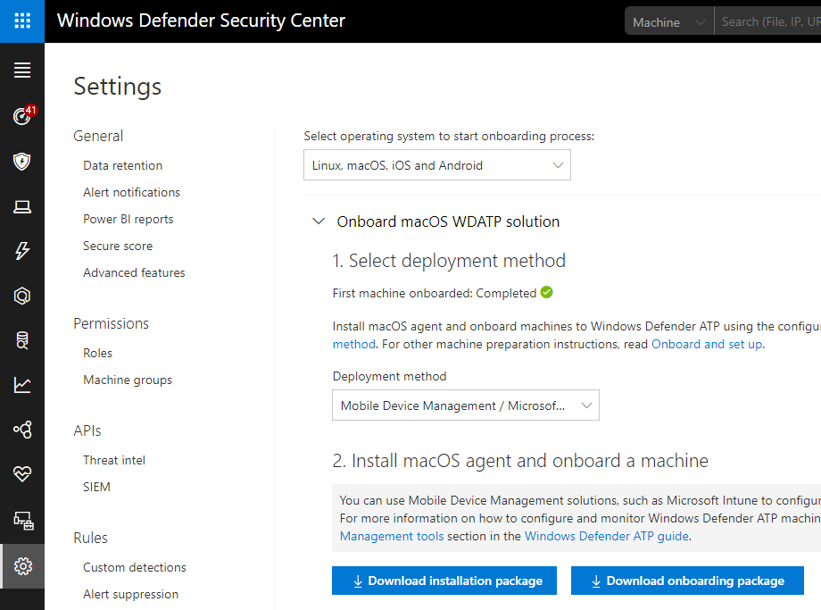
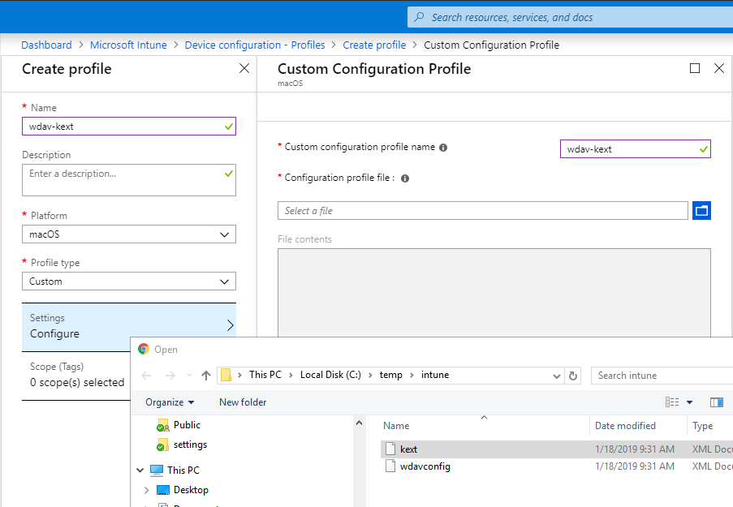
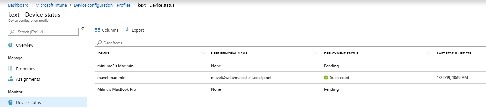

# Microsoft Intune-based deployment

**Applies to:**

[Windows Defender Advanced Threat Protection (Windows Defender ATP) for Mac](microsoft-defender-atp-mac.md)

>[!IMPORTANT]
>This topic relates to the pre-release version of Microsoft Defender ATP for Mac. Microsoft Defender ATP for Mac is not yet widely available, and this topic only applies to enterprise customers who have been accepted into the preview program. Microsoft makes no warranties, express or implied, with respect to the information provided here.

## Prerequisites and system requirements

Before you get started, please see [the main Microsoft Defender ATP for Mac page](microsoft-defender-atp-mac.md) for a description of prerequisites and system requirements for the current software version.

## Download installation and onboarding packages

Download the installation and onboarding packages from Windows Defender Security Center:

1. In Windows Defender Security Center, go to **Settings > Machine Management > Onboarding**.
2. In Section 1 of the page, set operating system to **Linux, macOS, iOS or Android** and Deployment method to **Mobile Device Management / Microsoft Intune**.
3. In Section 2 of the page, select **Download installation package**. Save it as wdav.pkg to a local directory.
4. In Section 2 of the page, select **Download onboarding package**. Save it as WindowsDefenderATPOnboardingPackage.zip to the same directory.
5. Download IntuneAppUtil from [https://docs.microsoft.com/en-us/intune/lob-apps-macos](https://docs.microsoft.com/en-us/intune/lob-apps-macos).

    

6. From a command prompt, verify that you have the three files.
    Extract the contents of the .zip files:

    ```bash
    mavel-macmini:Downloads test$ ls -l
    total 721688
    -rw-r--r--  1 test  staff     269280 Mar 15 11:25 IntuneAppUtil
    -rw-r--r--  1 test  staff      11821 Mar 15 09:23 WindowsDefenderATPOnboardingPackage.zip
    -rw-r--r--  1 test  staff  354531845 Mar 13 08:57 wdav.pkg
    mavel-macmini:Downloads test$ unzip WindowsDefenderATPOnboardingPackage.zip
    Archive:  WindowsDefenderATPOnboardingPackage.zip
    warning:  WindowsDefenderATPOnboardingPackage.zip appears to use backslashes as path separators
      inflating: intune/kext.xml
      inflating: intune/WindowsDefenderATPOnboarding.xml
      inflating: jamf/WindowsDefenderATPOnboarding.plist
    mavel-macmini:Downloads test$
    ```

7. Make IntuneAppUtil an executable:

    ```mavel-macmini:Downloads test$ chmod +x IntuneAppUtil```

8. Create the wdav.pkg.intunemac package from wdav.pkg:

    ```bash
    mavel-macmini:Downloads test$ ./IntuneAppUtil -c wdav.pkg -o . -i "com.microsoft.wdav" -n "1.0.0"
    Microsoft Intune Application Utility for Mac OS X
    Version: 1.0.0.0
    Copyright 2018 Microsoft Corporation

    Creating intunemac file for /Users/test/Downloads/wdav.pkg
    Composing the intunemac file output
    Output written to ./wdav.pkg.intunemac.

    IntuneAppUtil successfully processed "wdav.pkg",
    to deploy refer to the product documentation.
    ```

## Client Machine Setup

You need no special provisioning for a Mac machine beyond a standard [Company Portal installation](https://docs.microsoft.com/en-us/intune-user-help/enroll-your-device-in-intune-macos-cp).

1. You'll be asked to confirm device management.


Select Open System Preferences, locate Management Profile on the list and select the **Approve...** button. Your Management Profile would be displayed as **Verified**:


2. Select the **Continue** button and complete the enrollment.

You can enroll additional machines. Optionally, you can do it later, after system configuration and application package are provisioned.

3. In Intune, open the **Manage > Devices > All devices** blade. You'll see your machine:


## Create System Configuration profiles

1. In Intune open the **Manage > Device configuration** blade. Select **Manage > Profiles > Create Profile**.
2. Choose a name for the profile. Change **Platform=macOS**, **Profile type=Custom**. Select **Configure**.
3. Open the configuration profile and upload intune/kext.xml. This file was created during the Generate settings step above.
4. Select **OK**.

    

5. Select **Manage > Assignments**. In the **Include** tab, select **Assign to All Users & All devices**.
6. Repeat these steps with the second profile.  
7. Create Profile one more time, give it a name, upload the intune/WindowsDefenderATPOnboarding.xml file.
8. Select **Manage > Assignments**.  In the Include tab, select **Assign to All Users & All devices**.

After Intune changes are propagated to the enrolled machines, you'll see it on the **Monitor > Device status** blade:



## Publish application

1. In Intune, open the **Manage > Client apps** blade. Select **Apps > Add**.
2. Select **App type=Other/Line-of-business app**.
3. Select **file=wdav.pkg.intunemac**. Select **OK** to upload.
4. Select **Configure** and add the required information.
5. Use **macOS Sierra 10.12** as the minimum OS. Other settings can be any other value.

    

6. Select **OK** and **Add**.

    

7. It will take a while to upload the package. After it's done, select the name and then go to **Assignments** and **Add group**.

    

8. Change **Assignment type=Required**.
9. Select **Included Groups**. Select **Make this app required for all devices=Yes**. Select **Select group to include** and add a group that contains the users you want to target. Select **OK** and **Save**.

    

10. After some time the application will be published to all enrolled machines. You'll see it on the **Monitor > Device** install status blade:

    

## Verify client machine state

1. After the configuration profiles are deployed to your machines, on your Mac device, open **System Preferences  > Profiles**.

    
    

2. Verify the three profiles listed there:
    

3. The **Management Profile** should be the Intune system profile.
4. wdav-config and wdav-kext are system configuration profiles that we added in Intune.
5. You should also see the Microsoft Defender icon in the top-right corner:

    

## Logging installation issues

See [Logging installation issues](microsoft-defender-atp-mac-resources.md#logging-installation-issues) for more information on how to find the automatically generated log that is created by the installer when an error occurs.

## Uninstallation

See [Uninstalling](microsoft-defender-atp-mac-resources.md#uninstalling) for details on how to remove Windows Defender ATP for Mac from client devices.