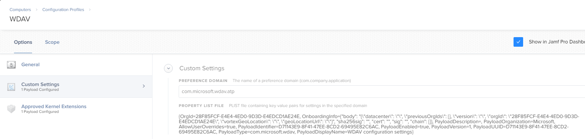
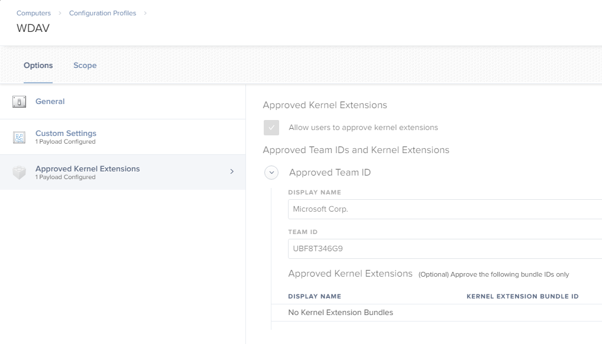
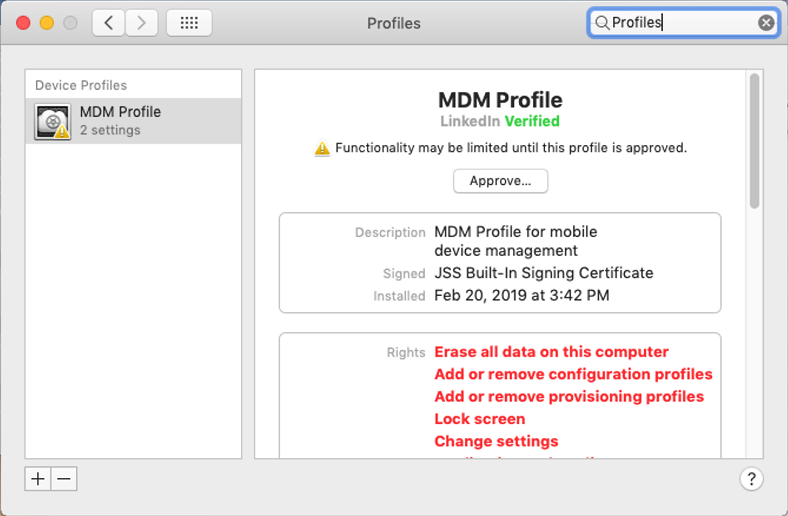
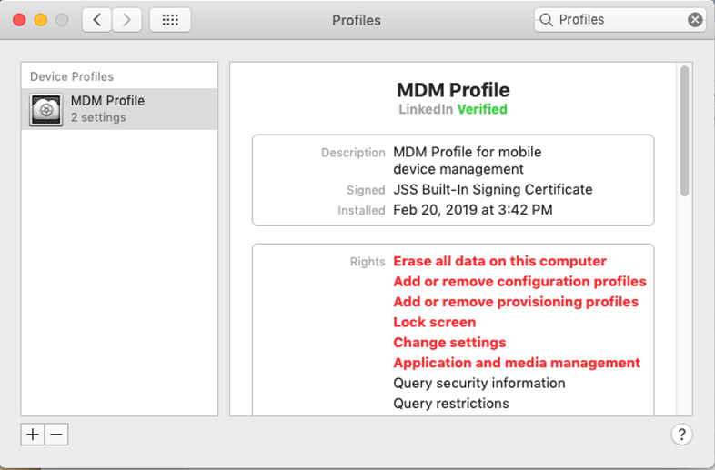
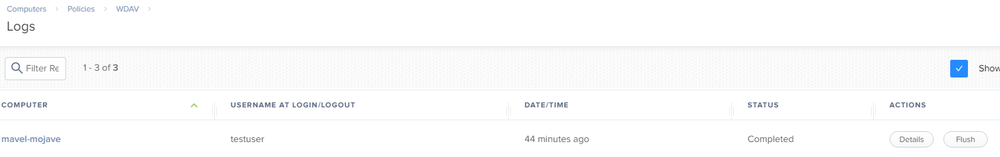
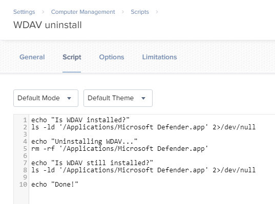

# JAMF-based deployment

**Applies to:**

[Microsoft Defender Advanced Threat Protection (Microsoft Defender ATP) for Mac](microsoft-defender-atp-mac.md)

>[!IMPORTANT]
>This topic relates to the pre-release version of Microsoft Defender ATP for Mac. Microsoft Defender ATP for Mac is not yet widely available, and this topic only applies to enterprise customers who have been accepted into the preview program. Microsoft makes no warranties, express or implied, with respect to the information provided here.

## Prerequisites and system requirements

Before you get started, please see [the main Microsoft Defender ATP for Mac page](microsoft-defender-atp-mac.md) for a description of prerequisites and system requirements for the current software version.

In addition, for JAMF deployment, you need to be familiar with JAMF administration tasks, have a JAMF tenant, and know how to deploy packages. This includes having a properly configured distribution point. JAMF has many ways to complete the same task. These instructions provide an example for most common processes. Your organization might use a different workflow.

## Download installation and onboarding packages

Download the installation and onboarding packages from Windows Defender Security Center:

1. In Windows Defender Security Center, go to **Settings > device Management > Onboarding**.
2. In Section 1 of the page, set the operating system to **Linux, macOS, iOS or Android** and deployment method to **Mobile Device Management / Microsoft Intune**.
3. In Section 2 of the page, select **Download installation package**. Save it as _wdav.pkg_ to a local directory.
4. In Section 2 of the page, select **Download onboarding package**. Save it as _WindowsDefenderATPOnboardingPackage.zip_ to the same directory.

    

5. From the command prompt, verify that you have the two files. Extract the contents of the .zip files like so:

    ```bash
    mavel-macmini:Downloads test$ ls -l
    total 721160
    -rw-r--r--  1 test  staff      11821 Mar 15 09:23 WindowsDefenderATPOnboardingPackage.zip
    -rw-r--r--  1 test  staff  354531845 Mar 13 08:57 wdav.pkg
    mavel-macmini:Downloads test$ unzip WindowsDefenderATPOnboardingPackage.zip
    Archive:  WindowsDefenderATPOnboardingPackage.zip
    warning:  WindowsDefenderATPOnboardingPackage.zip appears to use backslashes as path separators
    inflating: intune/kext.xml
     inflating: intune/WindowsDefenderATPOnboarding.xml
     inflating: jamf/WindowsDefenderATPOnboarding.plist
    mavel-macmini:Downloads test$
    ```

## Create JAMF Policies

You need to create a configuration profile and a policy to start deploying Microsoft Defender ATP for Mac to client devices.

### Configuration Profile

The configuration profile contains a custom settings payload that includes:

- Microsoft Defender ATP for Mac onboarding information
- Approved Kernel Extensions payload, to enable running the Microsoft kernel driver

To set the onboarding information, add a property list file with the name, _jamf/WindowsDefenderATPOnboarding.plist_, as a custom setting. You can do this by navigating to **Computers**>**Configuration Profiles**, selecting **New**, then choosing **Custom Settings**>**Configure**. From there, you can upload the property list.

  >[!IMPORTANT]
  > You must set the the Preference Domain as "com.microsoft.wdav.atp"

    

### Approved Kernel Extension

To approve the kernel extension:

1. In **Computers > Configuration Profiles** select **Options > Approved Kernel Extensions**.
2. Use **UBF8T346G9** for Team Id.



#### Configuration Profile's Scope

Configure the appropriate scope to specify the devices that will receive the configuration profile.

Open **Computers** > **Configuration Profiles**, and select **Scope > Targets**. From there, select the devices you want to target.


Save the **Configuration Profile**.

Use the **Logs** tab to monitor deployment status for each enrolled device.

### Package

1. Create a package in **Settings > Computer Management > Packages**.

    

2. Upload the package to the Distribution Point.
3. In the **filename** field, enter the name of the package. For example, _wdav.pkg_.

### Policy

Your policy should contain a single package for Microsoft Defender.


Configure the appropriate scope to specify the computers that will receive this policy.

After you save the Configuration Profile, you can use the Logs tab to monitor the deployment status for each enrolled device.

## Client device setup

You'll need no special provisioning for a macOS computer, beyond the standard JAMF Enrollment.

> [!NOTE]
> After a computer is enrolled, it will show up in the Computers inventory (All Computers).

1. Open **Device Profiles**, from the **General** tab, and make sure that **User Approved MDM** is set to **Yes**. If it's currently set to No, the user needs to open **System Preferences > Profiles** and select **Approve** on the MDM Profile.




After a moment, the device's User Approved MDM status will change to **Yes**.


You may now enroll additional devices. You may also enroll them later, after you have finished provisioning system configuration and application packages.

## Deployment

Enrolled client devices periodically poll the JAMF Server, and install new configuration profiles and policies as soon as they are detected.

### Status on the server

You can monitor deployment status in the **Logs** tab:

- **Pending** means that the deployment is scheduled but has not yet happened
- **Completed** means that the deployment succeeded and is no longer scheduled



### Status on client device

After the Configuration Profile is deployed, you'll see the profile for the device in  **System Preferences** > **Profiles >**.


Once the policy is applied, you'll see the Microsoft Defender ATP icon in the macOS status bar in the top-right corner.


You can monitor policy installation on a device by following the JAMF log file:

```bash
    mavel-mojave:~ testuser$ tail -f /var/log/jamf.log
    Thu Feb 21 11:11:41 mavel-mojave jamf[7960]: No patch policies were found.
    Thu Feb 21 11:16:41 mavel-mojave jamf[8051]: Checking for policies triggered by "recurring check-in" for user "testuser"...
    Thu Feb 21 11:16:43 mavel-mojave jamf[8051]: Executing Policy WDAV
    Thu Feb 21 11:17:02 mavel-mojave jamf[8051]: Installing Microsoft Defender...
    Thu Feb 21 11:17:23 mavel-mojave jamf[8051]: Successfully installed Microsoft Defender.
    Thu Feb 21 11:17:23 mavel-mojave jamf[8051]: Checking for patches...
    Thu Feb 21 11:17:23 mavel-mojave jamf[8051]: No patch policies were found.
```

You can also check the onboarding status:

```bash
mavel-mojave:~ testuser$ mdatp --health
...
licensed                                : true
orgId                                   : "4751b7d4-ea75-4e8f-a1f5-6d640c65bc45"
...
```

- **licensed**: This confirms that the device has an ATP license.

- **orgid**: Your Microsoft Defender ATP org id; it will be the same for your organization.

## Check onboarding status

You can check that devices have been correctly onboarded by creating a script. For example, the following script checks enrolled devices for onboarding status:

```bash
mdatp --health healthy
```

This script returns:
- 0 if Microsoft Defender ATP is registered with the Microsoft Defender ATP service
- 1 if the device is not yet onboarded
- 3 if the connection to the daemon cannot be established—for example, if the daemon is not running

## Logging installation issues

See [Logging installation issues](microsoft-defender-atp-mac-resources.md#logging-installation-issues) for more information on how to find the automatically generated log that is created by the installer when an error occurs.

## Uninstallation

This method is based on the script described in [Uninstalling](microsoft-defender-atp-mac-resources.md#uninstalling).

### Script

Create a script in **Settings > Computer Management > Scripts**.

This script removes Microsoft Defender ATP from the /Applications directory:

```bash
   echo "Is WDAV installed?"
   ls -ld '/Applications/Microsoft Defender ATP.app' 2>/dev/null

   echo "Uninstalling WDAV..."
   rm -rf '/Applications/Microsoft Defender ATP.app'

   echo "Is WDAV still installed?"
   ls -ld '/Applications/Microsoft Defender ATP.app' 2>/dev/null

   echo "Done!"
```



### Policy

Your policy should contain a single script:


Configure the appropriate scope in the **Scope** tab to specify the machines that will receive this policy.
