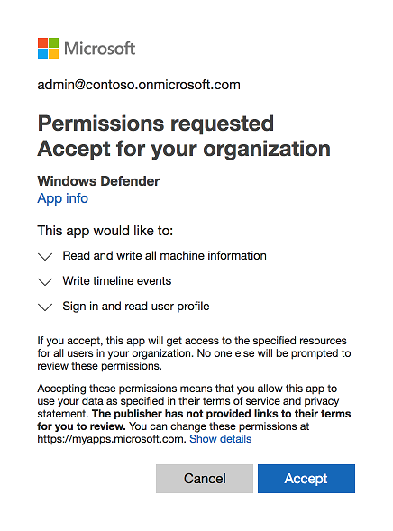

# Microsoft Defender ATP for Mac

>[!IMPORTANT]
>Some information relates to prereleased product which may be substantially modified before it's commercially released. Microsoft makes no warranties, express or implied, with respect to the information provided here.

This topic describes how to install and use Microsoft Defender ATP for Mac. It supports the preview program and the information here is subject to change. 
Microsoft Defender ATP for Mac is not yet widely available, and this topic only applies to enterprise customers who have been accepted into the preview program. 

## Prerequisites
You should have beginner-level experience in macOS and BASH scripting. You must have administrative privileges on the machine.

You should also have access to Windows Defender Security Center.

### System Requirements
Microsoft Defender ATP for Mac system requirements:
- macOS version: 10.14 (Mojave), 10.13 (High Sierra), 10.12 (Sierra)
- Disk space during preview: 1GB 
- The following URLs must be accessible from the Mac device:
  - ```https://fresno.blob.core.windows.net/preview/macos/wdav.pkg ```<br>
  - ```https://cdn.x.cp.wd.microsoft.com/ ```<br>
  - ```https://eu-cdn.x.cp.wd.microsoft.com/ ```<br>
  - ```https://wu-cdn.x.cp.wd.microsoft.com/ ``` <br>
  - ```https://x.cp.wd.microsoft.com/ ``` <br>
  - ```https://asia.x.cp.wd.microsoft.com/ ``` <br>
  - ```https://australia.x.cp.wd.microsoft.com/ ``` <br>
  - ```https://europe.x.cp.wd.microsoft.com/ ``` <br>
  - ```https://unitedkingdom.x.cp.wd.microsoft.com/ ``` <br>
  - ```https://unitedstates.x.cp.wd.microsoft.com/ ``` <br>

## Installation and configuration overview
There are various methods and deployment tools that you can use to install and configure Microsoft Defender ATP for Mac. 
In general you'll need to take the following steps:
- [Register macOS devices](#register-macos-devices) with Windows Defender ATP
- Deploy Microsoft Defender ATP for Mac using any of the following deployment methods and tools:
  - [Microsoft Intune based deployment](#microsoft-intune-based-deployment)
  - [JAMF based deployment](#jamf-based-deployment)
  - [Manual deployment](#manual-deployment)

## Register macOS devices
To onboard your devices for Microsoft Defender ATP for Mac, you must register the devices with Windows Defender ATP and provide consent to submit telemetry.

Use the following URL to give consent to submit telemetry: ```https://login.microsoftonline.com/common/oauth2/authorize?prompt=consent&client_id=f9eb614c-7a8e-422a-947d-2059e657d855&response_type=code&sso_reload=true```

> [!NOTE]
> You may get an error that a page on ```https://ppe.fresno.wd.microsoft.com``` cannot be opened. Disregard the error as it does not affect the onboarding process.




## Deploy Microsoft Defender ATP for Mac
Use any of the supported methods to deploy Microsoft Defender ATP for Mac

## Microsoft Intune based deployment

### Download installation and onboarding packages
Download the installation and onboarding packages from Windows Defender Security Center:
1.	In Windows Defender Security Center, go to **Settings > Machine Management > Onboarding**.
2.	In Section 1 of the page, set operating system to **Linux, macOS, iOS or Android** and Deployment method to **Mobile Device Management / Microsoft Intune**.
3.	In Section 2 of the page, click **Download installation package**. Save it as wdav.pkg to a local directory.
4.	In Section 2 of the page, click **Download onboarding package**. Save it as WindowsDefenderATPOnboardingPackage.zip to the same directory.
5.	Download IntuneAppUtil from https://docs.microsoft.com/en-us/intune/lob-apps-macos.

    

6. From a command prompt, verify that you have the three files. 
    Extract the contents of the .zip files:
    
    ```
    mavel-macmini:Downloads test$ ls -l
    total 721688
    -rw-r--r--  1 test  staff     269280 Mar 15 11:25 IntuneAppUtil
    -rw-r--r--  1 test  staff      11821 Mar 15 09:23 WindowsDefenderATPOnboardingPackage.zip
    -rw-r--r--  1 test  staff  354531845 Mar 13 08:57 wdav.pkg
    mavel-macmini:Downloads test$ unzip WindowsDefenderATPOnboardingPackage.zip
    Archive:  WindowsDefenderATPOnboardingPackage.zip
    warning:  WindowsDefenderATPOnboardingPackage.zip appears to use backslashes as path separators
      inflating: intune/kext.xml
      inflating: intune/WindowsDefenderATPOnboarding.xml
      inflating: jamf/WindowsDefenderATPOnboarding.plist
    mavel-macmini:Downloads test$
    ```
7.	Make IntuneAppUtil an executable:

    ```mavel-macmini:Downloads test$ chmod +x IntuneAppUtil```

8. Create the wdav.pkg.intunemac package from wdav.pkg:

    ```
    mavel-macmini:Downloads test$ ./IntuneAppUtil -c wdav.pkg -o . -i "com.microsoft.wdav" -n "1.0.0"
    Microsoft Intune Application Utility for Mac OS X
    Version: 1.0.0.0
    Copyright 2018 Microsoft Corporation

    Creating intunemac file for /Users/test/Downloads/wdav.pkg
    Composing the intunemac file output
    Output written to ./wdav.pkg.intunemac.

    IntuneAppUtil successfully processed "wdav.pkg",
    to deploy refer to the product documentation.
    ```

### Client Machine Setup
You need no special provisioning for a Mac machine beyond a standard [Company Portal installation](https://docs.microsoft.com/en-us/intune-user-help/enroll-your-device-in-intune-macos-cp).

1. You'll be asked to confirm device management.


2. Click the **Continue** button, and your Management Profile is displayed as verified:


You can enroll additional machines. Optionally, you can do it later, after system configuration and application package are provisioned.

3. In Intune, open the **Manage > Devices > All devices** blade. You'll see your machine:


### Create System Configuration profiles
1.	In Intune open the **Manage > Device configuration** blade. Click **Manage > Profiles > Create Profile**.
2.	Choose a name for the profile. Change **Platform=macOS**, **Profile type=Custom**. Click **Configure**.
3.	Open the configuration profile and upload intune/kext.xml. This file was created during the Generate settings step above.
4.	Click **OK**.

    

5. **Click Manage > Assignments**. In the **Include** tab, click **Assign to All Users & All devices**.
7.	Repeat these steps with the second profile.  
8.	Create Profile one more time, give it a name, upload the intune/WindowsDefenderATPOnboarding.xml file. 
9.	Click **Manage > Assignments**.  In the Include tab, click **Assign to All Users & All devices**.

After Intune changes are propagated to the enrolled machines, you'll see it on the **Monitor > Device status** blade:


### Publish application

1.	In Intune, open the **Manage > Client apps** blade. Click **Apps > Add**.
2.	Select **App type=Other/Line-of-business app**.
3.	Select **file=wdav.pkg.intunemac**. Click **OK** to upload.
4.	Click **Configure** and add the required information.
5.	Use **macOS Sierra 10.12** as the minimum OS. Other settings can be any other value.

    

6. Click **OK** and **Add**.
 
    

7. It will take a while to upload the package. After it's done, click the name and then go to **Assignments** and **Add group**.

    

8. Change **Assignment type=Required**.
9.	Click **Included Groups**. Select **Make this app required for all devices=Yes**. Click **Select group to include** and add a group that contains the users you want to target. Select **OK** and **Save**.

    

10. After some time the application will be published to all enrolled machines. You'll see it on the **Monitor > Device** install status blade:

    

### Verify client machine state
1.	After the configuration profiles are deployed to your machines, on your Mac device, open **System Preferences  > Profiles**.

    
    

2. Verify the three profiles listed there:
    

3.	The **Management Profile** should be the Intune system profile.
4.	wdav-config and wdav-kext are system configuration profiles that we added in Intune.
5.	You should also see the Microsoft Defender icon in the top-right corner:

    

## JAMF based deployment
### Prerequsites
You need to be familiar with JAMF administration tasks, have a JAMF tenant, and know how to deploy packages. This includes a properly configured distribution point. JAMF has many alternative ways to complete the same task. These instructions provide you an example for most common processes. Your organization might use a different workflow. 


### Download installation and onboarding packages
Download the installation and onboarding packages from Windows Defender Security Center:
1.	In Windows Defender Security Center, go to **Settings > Machine Management > Onboarding**.
2.	In Section 1 of the page, set operating system to **Linux, macOS, iOS or Android** and Deployment method to **Mobile Device Management / Microsoft Intune**.
3.	In Section 2 of the page, click **Download installation package**. Save it as wdav.pkg to a local directory.
4.	In Section 2 of the page, click **Download onboarding package**. Save it as WindowsDefenderATPOnboardingPackage.zip to the same directory.

    

5. From a command prompt, verify that you have the two files. 
    Extract the contents of the .zip files:
    
    ```
    mavel-macmini:Downloads test$ ls -l
    total 721160
    -rw-r--r--  1 test  staff      11821 Mar 15 09:23 WindowsDefenderATPOnboardingPackage.zip
    -rw-r--r--  1 test  staff  354531845 Mar 13 08:57 wdav.pkg
    mavel-macmini:Downloads test$ unzip WindowsDefenderATPOnboardingPackage.zip
    Archive:  WindowsDefenderATPOnboardingPackage.zip
    warning:  WindowsDefenderATPOnboardingPackage.zip appears to use backslashes as path separators
    inflating: intune/kext.xml
     inflating: intune/WindowsDefenderATPOnboarding.xml
     inflating: jamf/WindowsDefenderATPOnboarding.plist
    mavel-macmini:Downloads test$
    ``` 

### Create JAMF Policies
You need to create a configuration profile and a policy to start deploying Microsoft Defender ATP for Mac to client machines.

#### Configuration Profile
The configuration profile contains one custom settings payload that includes:

- Microsoft Defender ATP for Mac onboarding information 
- Approved Kernel Extensions payload to enable the Microsoft kernel driver to run


1. Upload jamf/WindowsDefenderATPOnboarding.plist as the Property List File.

    >[!NOTE]
    > You must use exactly "com.microsoft.wdav.atp" as the Preference Domain.

    

#### Approved Kernel Extension

To approve the kernel extension:
1.	In **Computers > Configuration Profiles** click **Options > Approved Kernel Extensions**.
2.	Use **UBF8T346G9** for Team Id.


#### Configuration Profile's Scope 
Configure the appropriate scope to specify the machines that will receive this configuration profile.

In the Configuration Profiles, click **Scope > Targets**. Select the appropriate Target computers. 


Save the **Configuration Profile**.

Use the **Logs** tab to monitor deployment status for each enrolled machine.

#### Package
1. Create a package in **Settings > Computer Management > Packages**.

    

2. Upload wdav.pkg to the Distribution Point. 
3. In the **filename** field, enter the name of the package. For example, wdav.pkg.

#### Policy
Your policy should contain a single package for Microsoft Defender.


Configure the appropriate scope to specify the computers that will receive this policy.

After you save the Configuration Profile, you can use the Logs tab to monitor the deployment status for each enrolled machine.

### Client machine setup
You need no special provisioning for a macOS computer beyond the standard JAMF Enrollment.

> [!NOTE]
>  After a computer is enrolled, it will show up in the Computers inventory (All Computers). 

1.	Open the machine details, from **General** tab, and make sure that **User Approved MDM** is set to **Yes**. If it's set to No, the user needs to open **System Preferences > Profiles** and click **Approve** on the MDM Profile.


After some time, the machine's User Approved MDM status will change to Yes. 


You can enroll additional machines now. Optionally, can do it after system configuration and application packages are provisioned.


### Deployment
Enrolled client machines periodically poll the JAMF Server and install new configuration profiles and policies as soon as they are detected.

#### Status on server
You can monitor the deployment status in the Logs tab:
 - **Pending** means that the deployment is scheduled but has not yet happened 
 - **Completed** means that the deployment succeeded and is no longer scheduled


#### Status on client machine
After the Configuration Profile is deployed, you'll see the profile on the machine in the **System Preferences > Profiles >** Name of Configuration Profile.


After the policy is applied, you'll see the Microsoft Defender icon in the macOS status bar in the top-right corner.


You can monitor policy installation on a machine by following the JAMF's log file:

```
mavel-mojave:~ testuser$ tail -f /var/log/jamf.log
Thu Feb 21 11:11:41 mavel-mojave jamf[7960]: No patch policies were found.
Thu Feb 21 11:16:41 mavel-mojave jamf[8051]: Checking for policies triggered by "recurring check-in" for user "testuser"...
Thu Feb 21 11:16:43 mavel-mojave jamf[8051]: Executing Policy WDAV
Thu Feb 21 11:17:02 mavel-mojave jamf[8051]: Installing Microsoft Defender...
Thu Feb 21 11:17:23 mavel-mojave jamf[8051]: Successfully installed Microsoft Defender.
Thu Feb 21 11:17:23 mavel-mojave jamf[8051]: Checking for patches...
Thu Feb 21 11:17:23 mavel-mojave jamf[8051]: No patch policies were found.
```

You can also check the onboarding status:
```
mavel-mojave:~ testuser$ /Library/Extensions/wdavkext.kext/Contents/Resources/Tools/wdavconfig.py
uuid            : 69EDB575-22E1-53E1-83B8-2E1AB1E410A6
orgid           : 79109c9d-83bb-4f3e-9152-8d75ee59ae22
orgid managed   : 79109c9d-83bb-4f3e-9152-8d75ee59ae22
orgid effective : 79109c9d-83bb-4f3e-9152-8d75ee59ae22
```

- **orgid/orgid managed**: This is the Microsoft Defender ATP org id specified in the configuration profile. If this value is blank, then the Configuration Profile was not properly set.

- **orgid effective**: This is the Microsoft Defender ATP org id currently in use. If it does not match the value in the Configuration Profile, then the configuration has not been refreshed.

### Uninstalling Microsoft Defender ATP for Mac
#### Uninstalling with a script

Create a script in **Settings > Computer Management > Scripts**.


For example, this script removes Microsoft Defender ATP from the /Applications directory:

```
echo "Is WDAV installed?"
ls -ld '/Applications/Microsoft Defender.app' 2>/dev/null

echo "Uninstalling WDAV..."
rm -rf '/Applications/Microsoft Defender.app'

echo "Is WDAV still installed?"
ls -ld '/Applications/Microsoft Defender.app' 2>/dev/null

echo "Done!"
```

#### Uninstalling with a policy
Your policy should contain a single script:


Configure the appropriate scope in the **Scope** tab to specify the machines that will receive this policy.

### Check onboarding status

You can check that machines are correctly onboarded by creating a script. For example, the following script checks that enrolled machines are onboarded:

```
/Library/Extensions/wdavkext.kext/Contents/Resources/Tools/wdavconfig.py | grep -E 'orgid effective : [-a-zA-Z0-9]+'
```

This script returns 0 if Microsoft Defender ATP is registered with the Windows Defender ATP service, and another exit code if it is not installed or registered.

## Manual deployment

### Download installation and onboarding packages
Download the installation and onboarding packages from Windows Defender Security Center:
1.	In Windows Defender Security Center, go to **Settings > Machine Management > Onboarding**.
2.	In Section 1 of the page, set operating system to **Linux, macOS, iOS or Android** and Deployment method to **Mobile Device Management / Microsoft Intune**.
3.	In Section 2 of the page, click **Download installation package**. Save it as wdav.pkg to a local directory.
4.	In Section 2 of the page, click **Download onboarding package**. Save it as WindowsDefenderATPOnboardingPackage.zip to the same directory.

    

5. From a command prompt, verify that you have the two files. 
    Extract the contents of the .zip files:
    
    ```
   mavel-macmini:Downloads test$ ls -l
    total 721152
    -rw-r--r--  1 test  staff       6185 Mar 15 10:45 WindowsDefenderATPOnboardingPackage.zip
    -rw-r--r--  1 test  staff  354531845 Mar 13 08:57 wdav.pkg
    mavel-macmini:Downloads test$ unzip WindowsDefenderATPOnboardingPackage.zip
    Archive:  WindowsDefenderATPOnboardingPackage.zip
    inflating: WindowsDefenderATPOnboarding.py
    ``` 

### Application installation
To complete this process, you must have admin privileges on the machine.

1. Download the wdav.pkg from: https://fresno.blob.core.windows.net/preview/macos/wdav.pkg.

2. Navigate to the downloaded wdav.pkg in Finder and open it.

    

3. Click **Continue**, agree with the License terms, and enter the password when prompted.

    

   > [!IMPORTANT]
   > You will be prompted to allow a driver from Microsoft to be installed (either "System Exception Blocked" or "Installation is on hold" or both. The driver must be allowed to be installed.

   

4. Click **Open Security Preferences**  or **Open System Preferences > Security & Privacy**. Click **Allow**:

    


The installation will proceed.

> [!NOTE]
> If you don't click **Allow**, the installation will fail after 5 minutes. You can restart it again at any time.

### Client configuration
1.	Copy wdav.pkg and WindowsDefenderATPOnboarding.py to the machine where you deploy Microsoft Defender ATP for Mac.

    The client machine is not associated with orgId.  Note that the orgid is blank.

    ```
    mavel-mojave:wdavconfig testuser$ /Library/Extensions/wdavkext.kext/Contents/Resources/Tools/wdavconfig.py
    uuid  : 69EDB575-22E1-53E1-83B8-2E1AB1E410A6
    orgid :
    ```
2.	Install the configuration file on a client machine:

    ```
    mavel-mojave:wdavconfig testuser$ python WindowsDefenderATPOnboarding.py
    Generating /Library/Application Support/Microsoft/Defender/com.microsoft.wdav.atp.plist ... (You may be required to enter sudos password)
    ```

3.	Verify that the machine is now associated with orgId:

    ```
    mavel-mojave:wdavconfig testuser$ /Library/Extensions/wdavkext.kext/Contents/Resources/Tools/wdavconfig.py
    uuid  : 69EDB575-22E1-53E1-83B8-2E1AB1E410A6
    orgid : E6875323-A6C0-4C60-87AD-114BBE7439B8
    ```
After installation, you'll see the Microsoft Defender icon in the macOS status bar in the top-right corner.

   

## Uninstallation
### Removing Microsoft Defender ATP from Mac devices
To remove Microsoft Defender ATP from your macOS devices:

- Open **Finder > Applications**. Right click on **Microsoft Defender ATP > Move to Trash**.

Or, from a command line:

- ```sudo rm -rf '/Applications/Microsoft Defender ATP'```

## Known issues
- Microsoft Defender ATP is not yet optimized for performance or disk space.
- Centrally managed uninstall using Intune/JAMF is still in development. To uninstall (as a workaround) an uninstall action has to be completed on each client device).
- Geo preference for telemetry traffic is not yet supported. Cloud traffic (definition updates) routed to US only.
- Full Windows Defender ATP integration is not yet available
- Not localized yet
- There might be accessibility issues 

### Installation issues
If an error occurs during installation, the installer will only report a general failure. The detailed log is saved to /Library/Logs/Microsoft/wdav.install.log. If you experience issues during installation, send us this file so we can help diagnose the cause. You can also contact _**xplatpreviewsupport@microsoft.com**_ for support on onboarding issues. 

 
For feedback on the preview, contact: _**mdatpfeedback@microsoft.com**_.


