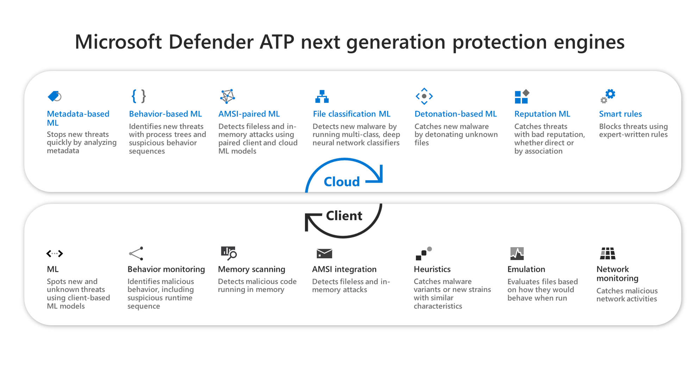

# Windows Defender Antivirus

**Applies to:**

- [Microsoft Defender Advanced Threat Protection (Microsoft Defender ATP)](https://go.microsoft.com/fwlink/p/?linkid=2069559)

Windows Defender Antivirus is a built-in antimalware solution that provides next generation protection for desktops, portable computers, and servers.

Windows Defender Antivirus includes:
- [Cloud-delivered protection](utilize-microsoft-cloud-protection-windows-defender-antivirus.md) for near-instant detection and blocking of new and emerging threats. Along with machine learning and the Intelligent Security Graph, cloud-delivered protection is part of the next-gen technologies that power Windows Defender Antivirus. 
- [Always-on scanning](configure-real-time-protection-windows-defender-antivirus.md), using advanced file and process behavior monitoring and other heuristics (also known as "real-time protection")
- [Dedicated protection updates](manage-updates-baselines-windows-defender-antivirus.md) based on machine-learning, human and automated big-data analysis, and in-depth threat resistance research

Windows Defender Antivirus uses multiple detection and prevention technologies to deliver accurate, real-time, and intelligent protection. [Get to know the advanced technologies at the core of Microsoft Defender ATP next generation protection](https://www.microsoft.com/security/blog/2019/06/24/inside-out-get-to-know-the-advanced-technologies-at-the-core-of-microsoft-defender-atp-next-generation-protection/).
  

You can configure and manage Windows Defender Antivirus with:
- System Center Configuration Manager (as System Center Endpoint Protection, or SCEP) 
- Microsoft Intune
- PowerShell
- Windows Management Instrumentation (WMI)
- Group Policy

## Minimum system requirements

Windows Defender AV has the same hardware requirements as Windows 10. For more information, see:
-   [Minimum hardware requirements](https://msdn.microsoft.com/library/windows/hardware/dn915086.aspx)
-   [Hardware component guidelines](https://msdn.microsoft.com/library/windows/hardware/dn915049.aspx)

Functionality, configuration, and management is largely the same when using Windows Defender AV on Windows Server 2016; however, [there are some differences](windows-defender-antivirus-on-windows-server-2016.md).

>[!TIP]
>You can visit the Windows Defender Testground website at [demo.wd.microsoft.com](https://demo.wd.microsoft.com?ocid=cx-wddocs-testground) to confirm the following features are working and see how they work:
>- Cloud-delivered protection
>- Fast learning (including Block at first sight)
>- Potentially unwanted application blocking

## Related topics

- [Windows Defender AV in the Windows Security app](windows-defender-security-center-antivirus.md)
- [Windows Defender AV on Windows Server 2016](windows-defender-antivirus-on-windows-server-2016.md)
- [Windows Defender AV compatibility](windows-defender-antivirus-compatibility.md)
- [Evaluate Windows Defender AV protection](evaluate-windows-defender-antivirus.md)
- [Deploy, manage updates, and report on Windows Defender AV](deploy-manage-report-windows-defender-antivirus.md)
- [Configure Windows Defender AV features](configure-windows-defender-antivirus-features.md)
- [Customize, initiate, and review the results of scans and remediation](customize-run-review-remediate-scans-windows-defender-antivirus.md)
- [Review event logs and error codes to troubleshoot issues](troubleshoot-windows-defender-antivirus.md)
- [Reference topics for management and configuration tools](configuration-management-reference-windows-defender-antivirus.md)

