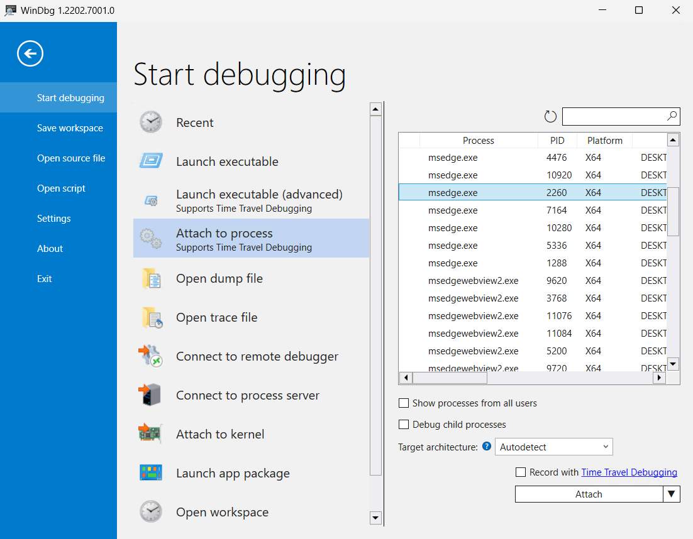
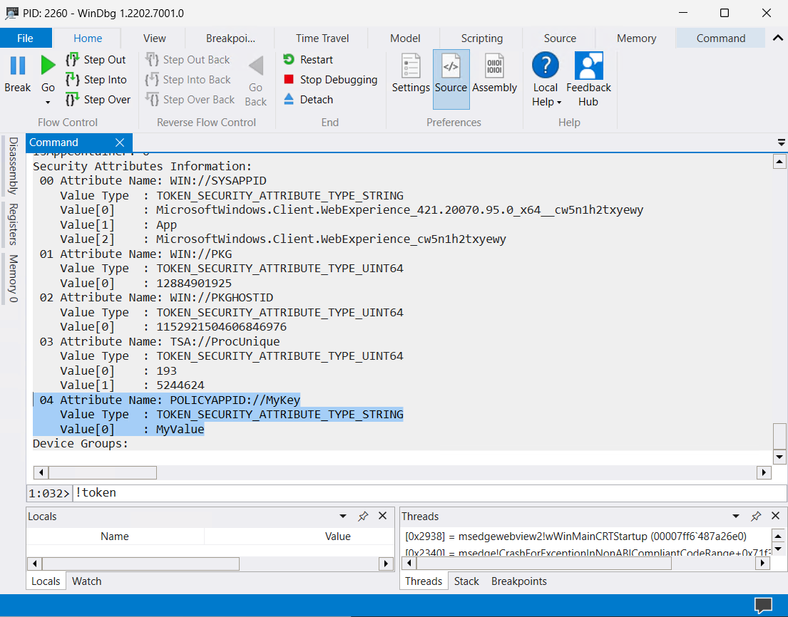

# Testing and Debugging AppId Tagging Policies

**Applies to:**

- Windows 10
- Windows 11
- Windows Server 2016 and above

> [!NOTE]
> Some capabilities of Windows Defender Application Control (WDAC) are only available on specific Windows versions. Learn more about the [Windows Defender Application Control feature availability](../feature-availability.md).

After deployment of the WDAC AppId Tagging policy, WDAC will log a 3099 policy deployed event in the [Event Viewer logs](../event-id-explanations.md). You first should ensure that the policy has been successfully deployed onto the system by verifying the presence of the 3099 event. 

## Verifying Tags on Running Processes

After verifying the policy has been deployed, the next step is to verify that the application processes you expect to pass the AppId Tagging policy have your tag set. Note that processes running at the time of policy deployment will need to be restarted since Windows Defender Application Control (WDAC) can only tag processes created after the policy has been deployed. 

1. Download and Install the Windows Debugger 

	[Microsoft's WinDbg Preview application](https://www.microsoft.com/store/productId/9PGJGD53TN86) can be downloaded from the Store and used to verify tags on running processes. 

2. Get the Process ID (PID) of the process under validation

	Using Task Manager, or an equivalent process monitoring tool, locate the PID of the process you wish to inspect. In the example below, we've located the PID for the running process for Microsoft Edge to be 2260. The PID will be used in the next step. 

	

3. Use WinDbg to inspect the process

	After opening WinDbg. select File followed by `Attach to Process`, and select the process with the PID identified in the step prior. Finally, select `Attach` to connect to the process. 

	

	Lastly, in the textbox, type `!token` and then press the Enter key to dump the security attributes on the process, including the _POLICYAPPID://_ followed by the key you set in the policy, and its corresponding value in the Value[0] field.

	