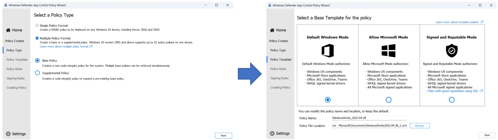
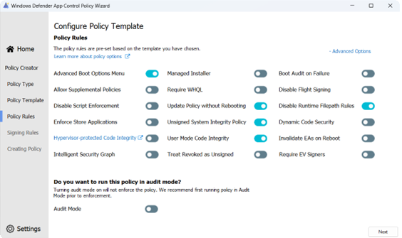

# Creating your WDAC AppId Tagging Policies

**Applies to:**

-   Windows 10
-   Windows 11
-   Windows Server 2016 and above

> [!NOTE]
> Some capabilities of Windows Defender Application Control (WDAC) are only available on specific Windows versions. Learn more about the [Windows Defender Application Control feature availability](../feature-availability.md).

## Create the policy using the WDAC Wizard

You can use the Windows Defender Application Control (WDAC) Wizard and the PowerShell commands to create an application control policy and convert it to an AppIdTagging policy. The WDAC Wizard is available for download at the [WDAC Wizard Installer site](https://aka.ms/wdacwizard). These PowerShell commands are only available on the supported platforms listed in [AppId Tagging Guide](./windows-defender-application-control-appid-tagging-guide.md).

1. Create a new base policy using the templates:

	Start with the Policy Creator task and select Multiple Policy Format and Base Policy. Select the Base Template to use for the policy. The example below shows beginning with the [Default Windows Mode](../wdac-wizard-create-base-policy.md#template-base-policies) template and build on top of these rules. 

	
	
	> [!NOTE]
	> If your AppId Tagging Policy does build off the base templates or does not allow Windows in-box processes, you will notice significant performance regressions, especially during boot. For this reason, it is strongly recommended to build off the base templates. 
	For more information on the issue, see the [AppId Tagging Known Issue](../operations/known-issues.md#Slow-boot-and-performance-with-custom-policies).


2. 	Set the following rule-options using the Wizard toggles:

	

3. Create custom rules:

	Selecting the `+ Custom Rules` button will open the Custom Rules panel. The Wizard supports five types of file rules: 

	- Publisher rules: Create a rule based off the signing certificate hierarchy. Additionally, the original filename and version can be combined with the signing certificate for added security. 
	- Path rules: Create a rule based off the path to a file or a parent folder path. Path rules support wildcards. 
	- File attribute rules: Create a rule based off a file's immutable properties like the original filename, file description, product name or internal name.
	- Package app name rules: Create a rule based off the package family name of an appx/msix.
	- Hash rules: Create a rule based off the PE Authenticode hash of a file. 


	For more information on creating new policy file rules, see the guidelines provided in the [creating policy file rules section](../wdac-wizard-create-base-policy.md#creating-custom-file-rules).

4. Convert to AppId Tagging Policy:

	After the Wizard builds the policy file, open the file in a text editor and remove the entire "Value=131" SigningScenario text block. The only remaining signing scenario should be "Value=12" which is the usermode application section. Next, open PowerShell in an elevated prompt and run the following command. Replace the AppIdTagging Key-Value pair for your scenario:

	```powershell
	Set-CIPolicyIdInfo -ResetPolicyID -FilePath .\AppIdPolicy.xml -AppIdTaggingPolicy -AppIdTaggingKey "MyKey" -AppIdTaggingValue "MyValue"
	```
	The policyID GUID will be returned by PowerShell if successful. 

## Create the policy using PowerShell 

Using this method, you'll create an AppId Tagging policy directly using the WDAC PowerShell commands. These PowerShell commands are only available on the supported platforms listed in [AppId Tagging Guide](./windows-defender-application-control-appid-tagging-guide.md). In an elevate PowerShell instance:

1. Create an AppId rule for the policy based on a combination of the signing certificate chain and version of the application. In the example below, the level has been set to SignedVersion. Any of the [WDAC File Rule Levels](../select-types-of-rules-to-create.md#table-2-windows-defender-application-control-policy---file-rule-levels) can be used in AppId rules:

	```powershell
	$rule = New-CiPolicyRule -Level SignedVersion -DriverFilePath <path_to_application>
	```
2. Create the AppId Tagging Policy. Replace the AppIdTagging Key-Value pair for your scenario:

	```powershell
	New-CIPolicy -rules $rule -FilePath .\AppIdPolicy.xml -AppIdTaggingPolicy -AppIdTaggingKey "MyKey" -AppIdTaggingValue "MyValue"
	```
3. Set the rule-options for the policy:

	```powershell
	Set-RuleOption -Option 0 .\AppIdPolicy.xml  # Usermode Code Integrity (UMCI)
	Set-RuleOption -Option 16 .\AppIdPolicy.xml # Refresh Policy no Reboot
	Set-RuleOption -Option 18 .\AppIdPolicy.xml # (Optional) Disable FilePath Rule Protection
	```

	If you're using filepath rules, you'll likely want to set option 18. Otherwise, there's no need. 
	
4. Set the name and ID on the policy, which is helpful for future debugging:

	```powershell
	Set-CIPolicyIdInfo -ResetPolicyId -PolicyName "MyPolicyName" -PolicyId "MyPolicyId"" -AppIdTaggingPolicy -FilePath ".\AppIdPolicy.xml"
	```
	The policyID GUID will be returned by PowerShell if successful. 

## Deploy for Local Testing

After creating your AppId Tagging policy in the above steps, you can deploy the policy to your local machine for testing before broadly deploying the policy to your endpoints:

1. Depending on your deployment method, convert the xml to binary: 

	```powershell
	Convertfrom-CIPolicy .\policy.xml ".\{PolicyIDGUID}.cip"
	```

2. Optionally, deploy it for local testing:

	```powershell
		copy ".\{Policy ID}.cip" c:\windows\system32\codeintegrity\CiPolicies\Active\
		./RefreshPolicy.exe
	```

	RefreshPolicy.exe is available for download from the [Microsoft Download Center](https://www.microsoft.com/download/details.aspx?id=102925).

## Next Steps
For more information on debugging and broad deployment of the AppId Tagging policy, see [Debugging AppId policies](./debugging-operational-guide-appid-tagging-policies.md) and [Deploying AppId policies](deploy-appid-tagging-policies.md). 