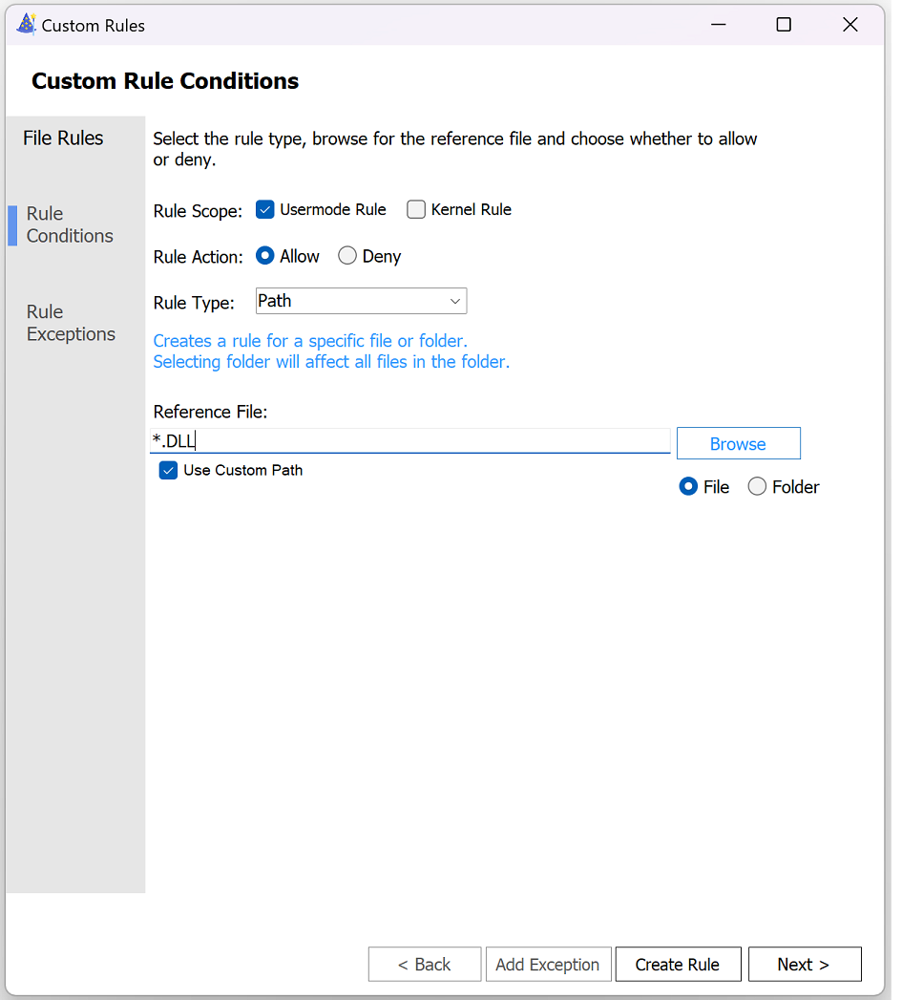
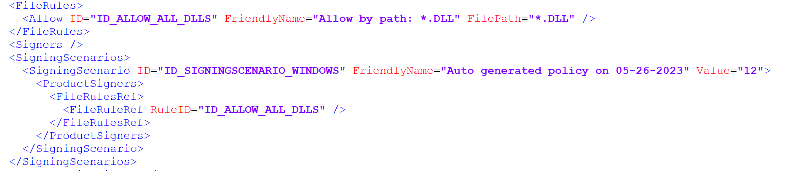

# WDAC AppId Tagging Policies Known Issues

**Applies to:**

-   Windows 10
-   Windows 11
-   Windows Server 2022 and above

This article covers tips and mitigations for known issues with Windows Defender Application Control (WDAC) AppId Tagging Policies. Test this configuration in your lab before enabling it in production.

## Known Issues

### Slow Boot and Performance Regressions 

If the AppId Tagging Policy was not built off the WDAC base templates or does not allow the Windows in-box signers, you will notice a significant increase in boot times (~2 minutes). 

If you cannot allowlist the Windows signers, or build off the WDAC base templates, you can create the following rule to your policies to improve the performance:

	 
	
	

Since AppId Tagging policies evaluate but cannot tag DLLs, this rule will short circuit DLL evaluation and improve evaluation performance.