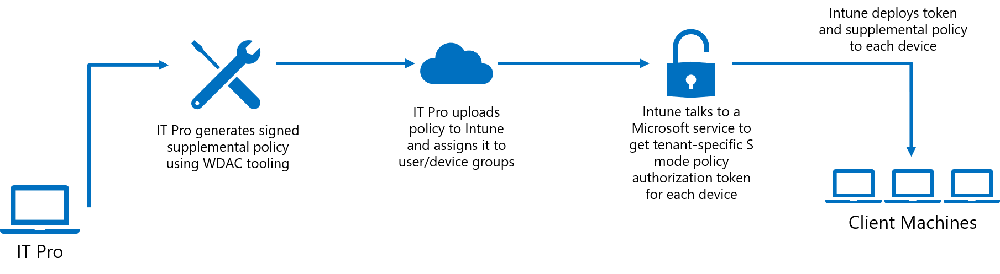
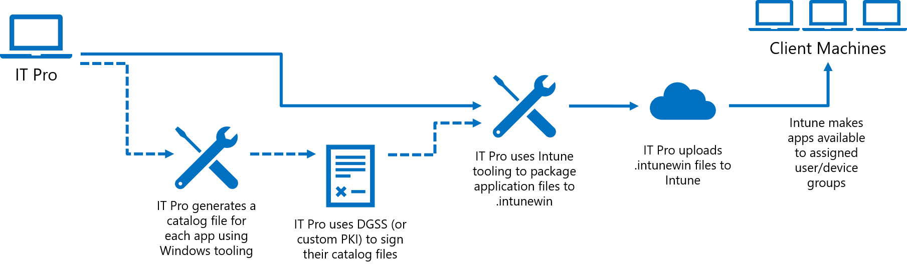

# Allow Line-of-Business Win32 Apps on Intune-Managed S Mode Devices

**Applies to:**

-   Windows 10

Beginning with the Windows 10 November 2019 update (build 18363), Microsoft Intune enables customers to deploy and run business critical Win32 applications as well as Windows components that are normally blocked in S mode (ex. PowerShell.exe) on their Intune-managed Windows 10 in S mode devices. 

With Intune, IT Pros can now configure their managed S mode devices using a Windows Defender Application Control (WDAC) supplemental policy that expands the S mode base policy to authorize the apps their business uses. This feature changes the S mode security posture from “every app is Microsoft-verified" to “every app is verified by Microsoft or your organization”. 

Refer to the below video for an overview and brief demo.
> [!VIDEO https://www.microsoft.com/videoplayer/embed/RE4mlcp]

## Policy Authorization Process

The general steps for expanding the S mode base policy on your Intune-managed devices are to generate a supplemental policy, sign that policy, and then upload the signed policy to Intune and assign it to user or device groups. Because you need access to WDAC PowerShell cmdlets to generate your supplemental policy, you should create and manage your policies on a non-S mode device. Once the policy has been uploaded to Intune, we recommend assigning it to a single test S-mode device to verify expected functioning before deploying the policy more broadly.

1. Generate a supplemental policy with WDAC tooling

    This policy will expand the S mode base policy to authorize additional applications. Anything authorized by either the S mode base policy or your supplemental policy will be allowed to run. Your supplemental policies can specify filepath rules, trusted publishers, and more. 
    
    Refer to [Deploy multiple Windows Defender Application Control Policies](deploy-multiple-windows-defender-application-control-policies.md) for guidance on creating supplemental policies and [Deploy Windows Defender Application Control policy rules and file rules](select-types-of-rules-to-create.md) to choose the right type of rules to create for your policy. 

    Below are a basic set of instructions for creating an S mode supplemental policy:
    - Create a new base policy using [New-CIPolicy](https://docs.microsoft.com/powershell/module/configci/new-cipolicy?view=win10-ps)

        ```powershell
        New-CIPolicy -MultiplePolicyFormat -ScanPath <path> -UserPEs -FilePath "<path>\SupplementalPolicy.xml" -Level Publisher -Fallback Hash
        ```
    - Change it to a supplemental policy using [Set-CIPolicyIdInfo](https://docs.microsoft.com/powershell/module/configci/set-cipolicyidinfo?view=win10-ps)

        ```powershell
        Set-CIPolicyIdInfo -SupplementsBasePolicyID 5951A96A-E0B5-4D3D-8FB8-3E5B61030784 -FilePath "<path>\SupplementalPolicy.xml"
        ```
        Policies which are supplementing the S mode base policy must use **-SupplementsBasePolicyID 5951A96A-E0B5-4D3D-8FB8-3E5B61030784**, as this is the S mode policy ID.
    - Put the policy in enforce mode using [Set-RuleOption](https://docs.microsoft.com/powershell/module/configci/set-ruleoption?view=win10-ps)

        ```powershell
        Set-RuleOption -FilePath "<path>\SupplementalPolicy.xml>" -Option 3 –Delete
        ```
        This deletes the ‘audit mode’ qualifier.
    -  Since you'll be signing your policy, you must authorize the signing certificate you will use to sign the policy and optionally one or more additional signers that can be used to sign updates to the policy in the future. For more information, refer to Section 2, Sign policy. Use Add-SignerRule to add the signing certificate to the WDAC policy: 
       
        ```powershell
        Add-SignerRule -FilePath <policypath> -CertificatePath <certpath> -User -Update
        ```
    - Convert to .bin using [ConvertFrom-CIPolicy](https://docs.microsoft.com/powershell/module/configci/convertfrom-cipolicy?view=win10-ps)

        ```powershell
        ConvertFrom-CIPolicy -XmlFilePath "<path>\SupplementalPolicy.xml" -BinaryFilePath "<path>\SupplementalPolicy.bin>
        ```

2. Sign policy
    
    Supplemental S mode policies must be digitally signed. To sign your policy, you can choose to use the Device Guard Signing Service (DGSS) or your organization's custom Public Key Infrastructure (PKI). Refer to [Use the Device Guard Signing Portal in the Microsoft Store for Business](use-device-guard-signing-portal-in-microsoft-store-for-business.md) for guidance on using DGSS and [Create a code signing cert for WDAC](create-code-signing-cert-for-windows-defender-application-control.md) for guidance on signing using an internal CA.

    Rename your policy to "{PolicyID}.p7b" after you've signed it. PolicyID can be found by inspecting the Supplemental Policy XML.

3. Deploy the signed supplemental policy using Microsoft Intune

    Go to the Azure portal online and navigate to the Microsoft Intune page, then go to the Client apps blade and select 'S mode supplemental policies'. Upload the signed policy to Intune and assign it to user or device groups. Intune will generate tenant- and device- specific authorization tokens. Intune then deploys the corresponding authorization token and supplemental policy to each device in the assigned group. Together, these expand the S mode base policy on the device. 

> [!Note]
> When updating your supplemental policy, ensure that the new version number is strictly greater than the previous one. Using the same version number is not allowed by Intune. Refer to [Set-CIPolicyVersion](https://docs.microsoft.com/powershell/module/configci/set-cipolicyversion?view=win10-ps) for information on setting the version number.

## Standard Process for Deploying Apps through Intune

Refer to [Intune Standalone - Win32 app management](https://docs.microsoft.com/intune/apps-win32-app-management)  for guidance on the existing procedure of packaging signed catalogs and app deployment.

## Optional: Process for Deploying Apps using Catalogs

Your supplemental policy can be used to significantly relax the S mode base policy, but there are security trade-offs you must consider in doing so. For example, you can use a signer rule to trust an external signer, but that will authorize all apps signed by that certificate, which may include apps you don’t want to allow as well.

Instead of authorizing signers external to your organization, Intune has added new functionality to make it easier to authorize existing applications (without requiring repackaging or access to the source code) through the use of signed catalogs. This works for apps which may be unsigned or even signed apps when you don’t want to trust all apps that may share the same signing certificate.

The basic process is to generate a catalog file for each app using Package Inspector, then sign the catalog files using the DGSS or a custom PKI. Use the Add-SignerRule PowerShell cmdlet as shown above to authorize the catalog signing certificate in the supplemental policy. After that, IT Pros can use the standard Intune app deployment process outlined above. Refer to [Deploy catalog files to support Windows Defender Application Control](deploy-catalog-files-to-support-windows-defender-application-control.md) for more in-depth guidance on generating catalogs. 

> [!Note] 
> Every time an app updates, you will need to deploy an updated catalog. Because of this, IT Pros should try to avoid using catalog files for applications that auto-update and direct users not to update applications on their own.

## Sample policy
Below is a sample policy that allows kernel debuggers, PowerShell ISE, and Registry Editor. It also demonstrates how to specify your organization's code signing and policy signing certificates.
```xml
<?xml version="1.0" encoding="utf-8"?>
<SiPolicy xmlns="urn:schemas-microsoft-com:sipolicy" PolicyType="Supplemental Policy">
  <VersionEx>10.0.0.0</VersionEx>
  <PlatformID>{2E07F7E4-194C-4D20-B7C9-6F44A6C5A234}</PlatformID>
  <!--Standard S mode GUID-->
  <BasePolicyID>{5951A96A-E0B5-4D3D-8FB8-3E5B61030784}</BasePolicyID>
  <!--Unique policy GUID-->
  <PolicyID>{52671094-ACC6-43CF-AAF1-096DC69C1345}</PolicyID>
  <!--EKUS-->
  <EKUs />
  <!--File Rules-->
  <FileRules>
    <!--Allow kernel debuggers-->
    <Allow ID="ID_ALLOW_CBD_0" FriendlyName="cdb.exe" FileName="CDB.Exe" />
    <Allow ID="ID_ALLOW_KD_0" FriendlyName="kd.exe" FileName="kd.Exe" />
    <Allow ID="ID_ALLOW_WINDBG_0" FriendlyName="windbg.exe" FileName="windbg.Exe" />
    <Allow ID="ID_ALLOW_MSBUILD_0" FriendlyName="MSBuild.exe" FileName="MSBuild.Exe" />
    <Allow ID="ID_ALLOW_NTSD_0" FriendlyName="ntsd.exe" FileName="ntsd.Exe" />
    <!--Allow PowerShell ISE and Registry Editor-->
    <Allow ID="ID_ALLOW_POWERSHELLISE_0" FriendlyName="powershell_ise.exe" FileName="powershell_ise.exe" />
    <Allow ID="ID_ALLOW_REGEDIT_0" FriendlyName="regedit.exe" FileName="regedit.exe" />
  </FileRules>
  <!--Signers-->
  <Signers>
    <!--info of the certificate you will use to do any code/catalog signing-->
    <Signer ID="EXAMPLE_ID_SIGNER_CODE" Name="Example Code Signing Certificate Friendly Name">
      <CertRoot Type="TBS" Value="<value>" />
    </Signer>
    
    <!--info of the certificate you will use to sign your policy-->
    <Signer ID="EXAMPLE_ID_SIGNER_POLICY" Name="Example Policy Signing Certificate Friendly Name">
      <CertRoot Type="TBS" Value="<value>" />
    </Signer>
  </Signers>
  <!--Driver Signing Scenarios-->
  <SigningScenarios>
    <SigningScenario Value="131" ID="ID_SIGNINGSCENARIO_KMCI" FriendlyName="Example Name">
      <ProductSigners />
    </SigningScenario>
    <SigningScenario Value="12" ID="ID_SIGNINGSCENARIO_UMCI" FriendlyName="Example Name">
      <ProductSigners>
        <AllowedSigners>
          <AllowedSigner SignerId="EXAMPLE_ID_SIGNER_CODE" />          
        </AllowedSigners>
        <FileRulesRef>
          <FileRuleRef RuleID="ID_ALLOW_CBD_0" />
          <FileRuleRef RuleID="ID_ALLOW_KD_0" />
          <FileRuleRef RuleID="ID_ALLOW_WINDBG_0" />
          <FileRuleRef RuleID="ID_ALLOW_MSBUILD_0" />
          <FileRuleRef RuleID="ID_ALLOW_NTSD_0" />
          <FileRuleRef RuleID="ID_ALLOW_POWERSHELLISE_0" />
          <FileRuleRef RuleID="ID_ALLOW_REGEDIT_0" />
        </FileRulesRef>
      </ProductSigners>
    </SigningScenario>
  </SigningScenarios>
  <!--Specify one or more certificates that can be used to sign updated policy-->
  <UpdatePolicySigners>
    <UpdatePolicySigner SignerId="EXAMPLE_ID_SIGNER_POLICY" />
  </UpdatePolicySigners>
  <!--Specify one or more codesigning certificates to trust-->
  <CiSigners>
    <CiSigner SignerId="EXAMPLE_ID_SIGNER_CODE" />
  </CiSigners>
  <!-- example remove core isolation a.k.a. Hypervisor Enforced Code Integrity (HVCI) options, consider enabling if your system supports it-->
  <HvciOptions>0</HvciOptions>
  <Settings>
    <Setting Provider="PolicyInfo" Key="Information" ValueName="Name">
      <Value>
        <String>Example Policy Name</String>
      </Value>
    </Setting>
    <Setting Provider="PolicyInfo" Key="Information" ValueName="Id">
      <Value>
        <String>Example-Policy-10.0.0.0</String>
      </Value>
    </Setting>
  </Settings>
</SiPolicy>
```
## Policy removal
In order to revert users to an unmodified S mode policy, an IT Pro can remove a user or users from the targeted Intune group which received the policy, which will trigger a removal of both the policy and the authorization token from the device.

IT Pros also have the choice of deleting a supplemental policy through Intune.
> [!Note]
> This feature currently has a known bug which occurs when an S mode supplemental policy is deleted through Intune, in which the policy is not immediately removed from the devices to which it was deployed. A fix is expected in the 2D update in late February 2020. In the meantime, IT Pros are recommended to update their policy with the below 'empty' policy which makes no changes to S mode.

```xml
<?xml version="1.0" encoding="utf-8"?>
<SiPolicy xmlns="urn:schemas-microsoft-com:sipolicy" PolicyType="Supplemental Policy">
  <VersionEx>10.0.0.1</VersionEx>
  <PlatformID>{2E07F7E4-194C-4D20-B7C9-6F44A6C5A234}</PlatformID>
  <BasePolicyID>{5951A96A-E0B5-4D3D-8FB8-3E5B61030784}</BasePolicyID>
  <PolicyID>{52671094-ACC6-43CF-AAF1-096DC69C1345}</PolicyID>
  <Rules>
  </Rules>
  <!--EKUS-->
  <EKUs />
  <!--File Rules-->

  <!--Signers-->
  <Signers>
    <!--info of the certificate you will use to sign your policy-->
    <Signer ID="EXAMPLE_ID_SIGNER_POLICY" Name="Example Policy Signing Certificate Friendly Name">
      <CertRoot Type="TBS" Value="<value>" />
    </Signer>
  </Signers>
  <!--Driver Signing Scenarios-->
  <SigningScenarios>
    <SigningScenario Value="131" ID="ID_SIGNINGSCENARIO_KMCI" FriendlyName="KMCI">
      <ProductSigners>
      </ProductSigners>
    </SigningScenario>
    <SigningScenario Value="12" ID="ID_SIGNINGSCENARIO_UMCI" FriendlyName="UMCI">
      <ProductSigners>
      </ProductSigners>
    </SigningScenario>
  </SigningScenarios>
  <UpdatePolicySigners>
    <UpdatePolicySigner SignerId="EXAMPLE_ID_SIGNER_POLICY" />
  </UpdatePolicySigners>
  <!-- example remove core isolation a.k.a. Hypervisor Enforced Code Integrity (HVCI) options, consider enabling if your system is supported-->
  <HvciOptions>0</HvciOptions>
  <Settings>
    <Setting Provider="PolicyInfo" Key="Information" ValueName="Name">
      <Value>
        <String>Example Policy Name - Empty</String>
      </Value>
    </Setting>
    <Setting Provider="PolicyInfo" Key="Information" ValueName="Id">
      <Value>
        <String>Example-Policy-Empty-10.0.0.1</String>
      </Value>
    </Setting>
  </Settings>
</SiPolicy>
```

## Errata
If an S-mode device with a policy authorization token and supplemental policy is rolled back from the 1909 update to the 1903 build, it will not revert to locked-down S mode until the next policy refresh. To achieve an immediate change to a locked-down S mode state, IT Pros should delete any tokens in %SystemRoot%\System32\CI\Tokens\Active.
