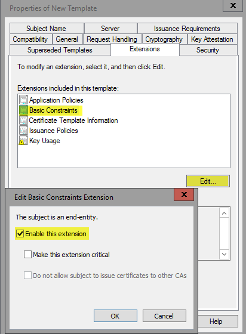
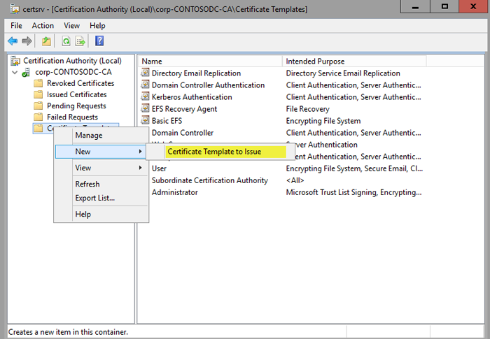
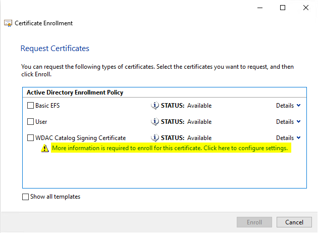

# Optional: Create a code signing cert for Windows Defender Application Control  

**Applies to:**

-   Windows 10
-   Windows Server 2016

As you deploy Windows Defender Application Control (WDAC) (also part of Windows Defender Device Guard), you might need to sign catalog files or WDAC policies internally. To do this, you will either need a publicly issued code signing certificate or an internal CA. If you have purchased a code signing certificate, you can skip this topic and instead follow other topics listed in the [Windows Defender Application Control Deployment Guide](windows-defender-application-control-deployment-guide.md). 

If you have an internal CA, complete these steps to create a code signing certificate. 
Only RSA algorithm is supported for the code signing certificate, and signatures must be PKCS 1.5 padded. 
ECDSA is not supported.

1.  Open the Certification Authority Microsoft Management Console (MMC) snap-in, and then select your issuing CA.

2.  When connected, right-click **Certificate Templates**, and then click **Manage** to open the Certification Templates Console.

    

    Figure 1. Manage the certificate templates

3.  In the navigation pane, right-click the Code Signing certificate, and then click **Duplicate Template**.

4.  On the **Compatibility** tab, clear the **Show resulting changes** check box. Select **Windows Server 2012** from the **Certification Authority** list, and then select **Windows 8 / Windows Server 2012** from the **Certificate recipient** list.

5.  On the **General** tab, specify the **Template display name** and **Template name**. This example uses the name **WDAC Catalog Signing Certificate**.

6.  On the **Request Handling** tab, select the **Allow private key to be exported** check box.

7.  On the **Extensions** tab, select the **Basic Constraints** check box, and then click **Edit**.

8.  In the **Edit Basic Constraints Extension** dialog box, select **Enable this extension**, as shown in Figure 2.

    

    Figure 2. Select constraints on the new template

9.  If a certificate manager is required to approve any issued certificates, on the **Issuance Requirements** tab, select **CA certificate manager approval**.

10. On the **Subject Name** tab, select **Supply in the request**.

11. On the **Security** tab, verify that whatever account will be used to request the certificate has the right to enroll the certificate.

12. Click **OK** to create the template, and then close the Certificate Template Console.

When this certificate template has been created, you must publish it to the CA published template store. To do so, complete the following steps:

1.  In the Certification Authority MMC snap-in, right-click **Certification Templates**, point to **New**, and then click **Certificate Template to Issue**, as shown in Figure 3.

    

    Figure 3. Select the new certificate template to issue

    A list of available templates to issue appears, including the template you just created.

2.  Select the WDAC Catalog signing certificate, and then click **OK**.

Now that the template is available to be issued, you must request one from the computer running Windows 10 on which you create and sign catalog files. To begin, open the MMC, and then complete the following steps:

1.  In MMC, from the **File** menu, click **Add/Remove Snap-in**. Double-click **Certificates**, and then select **My user account**.

2.  In the Certificates snap-in, right-click the Personal store folder, point to **All Tasks**, and then click **Request New Certificate**.

3.  Click **Next** twice to get to the certificate selection list.

4.  In the **Request Certificate** list, select your newly created code signing certificate, and then select the blue text that requests additional information, as shown in Figure 4.

    

    Figure 4. Get more information for your code signing certificate

5.  In the **Certificate Properties** dialog box, for **Type**, select **Common name**. For **Value**, select **ContosoDGSigningCert**, and then click **Add**. When added, click **OK.**

6.  Enroll and finish.

> **Note**&nbsp;&nbsp;If a certificate manager is required to approve any issued certificates and you selected to require management approval on the template, the request will need to be approved in the CA before it will be issued to the client.

This certificate must be installed in the user’s personal store on the computer that will be signing the catalog files and code integrity policies. If the signing is going to be taking place on the computer on which you just requested the certificate, exporting the certificate to a .pfx file will not be required because it already exists in your personal store. If you are signing on another computer, you will need to export the .pfx certificate with the necessary keys and properties. To do so, complete the following steps:

1.  Right-click the certificate, point to **All Tasks**, and then click **Export**.

2.  Click **Next**, and then select **Yes, export the private key**.

3.  Choose the default settings, and then select **Export all extended properties**.

4.  Set a password, select an export path, and then select **WDACCatSigningCert.pfx** as the file name.

When the certificate has been exported, import it into the personal store for the user who will be signing the catalog files or code integrity policies on the specific computer that will be signing them.

## Related topics

- [Windows Defender Application Control](windows-defender-application-control.md)

- [Windows Defender Application Control Deployment Guide](windows-defender-application-control-deployment-guide.md)

