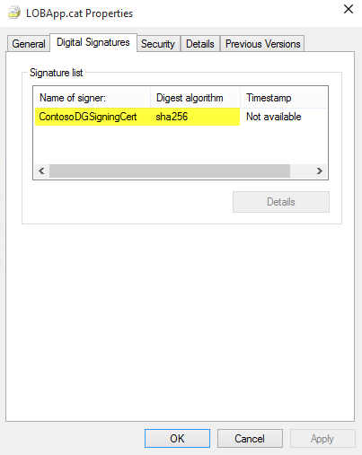
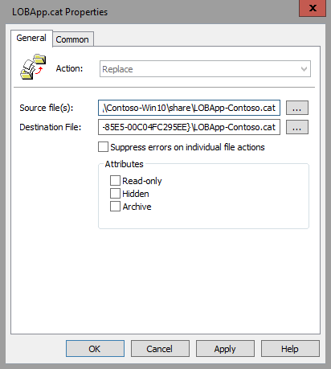
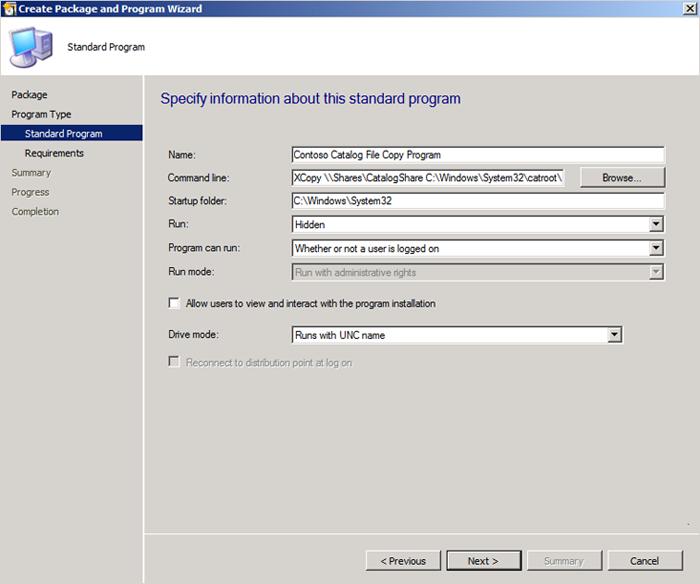
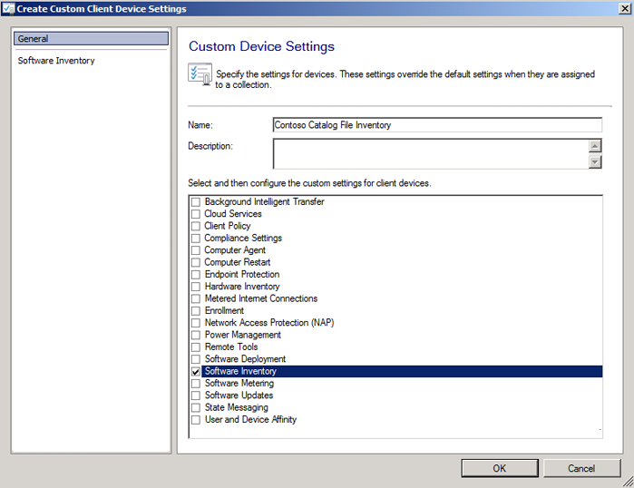

# Deploy catalog files to support Windows Defender Application Control   

**Applies to:**

-   Windows 10
-   Windows Server 2016

Catalog files can be important in your deployment of Windows Defender Application Control (WDAC) if you have unsigned line-of-business (LOB) applications for which the process of signing is difficult. To prepare to create WDAC policies that allow these trusted applications but block unsigned code (most malware is unsigned), you create a *catalog file* that contains information about the trusted applications. After you sign and distribute the catalog, your trusted applications can be handled by WDAC in the same way as any other signed application. With this foundation, you can more easily block all unsigned applications, allowing only signed applications to run.

## Create catalog files

The creation of a catalog file simplifies the steps to run unsigned applications in the presence of a WDAC policy.

To create a catalog file, you use a tool called **Package Inspector**. You must also have a WDAC policy deployed in audit mode on the computer on which you run Package Inspector, so that Package Inspector can include any temporary installation files that are added and then removed from the computer during the installation process.

> [!NOTE]
> When you establish a naming convention it makes it easier to detect deployed catalog files in the future. In this guide, *\*-Contoso.cat* is used as the example naming convention. 

1.  Be sure that a WDAC policy is currently deployed in audit mode on the computer on which you will run Package Inspector.

    Package Inspector does not always detect temporary installation files that are added and then removed from the computer during the installation process. To ensure that these binaries are also included in your catalog file, deploy a WDAC policy in audit mode. 

    > [!NOTE]
    > This process should **not** be performed on a system with an enforced Windows Defender Application Control policy, only with a policy in audit mode. If a policy is currently being enforced, you will not be able to install and run the application unless the policy already allows it.

2.  Start Package Inspector, and then start scanning a local drive, for example, drive C:

    ` PackageInspector.exe Start C:`

    > [!NOTE]
    > Package inspector can monitor installations on any local drive. Specify the appropriate drive on the local computer.
    
3.  Copy the installation media to the local drive (typically drive C).

    By copying the installation media to the local drive, you ensure that Package Inspector detects and catalogs the actual installer. If you skip this step, the future WDAC policy may allow the application to run but not to be installed.

4.  Install the application. Install it to the same drive that the application installer is located on (the drive you are scanning). Also, while Package Inspector is running, do not run any installations or updates that you don't want to capture in the catalog.

    > [!IMPORTANT]
    > Every binary that is run while Package Inspector is running will be captured in the catalog. Ensure that only trusted applications are run during this time. 

5.  Start the application.

6.  Ensure that product updates are installed, and downloadable content associated with the application is downloaded.

7.  Close and reopen the application. 

    This step is necessary to ensure that the scan has captured all binaries.
    
8.  As appropriate, with Package Inspector still running, repeat the process for another application that you want in the catalog. Copy the installation media to the local drive, install the application, ensure it is updated, and then close and reopen the application.

9. When you have confirmed that the previous steps are complete, use the following commands to generate the catalog and definition files on your computer's desktop. The filenames used in these example commands are **LOBApp-Contoso.cat** (catalog file) and **LOBApp.cdf** (definition file)—substitute different filenames as appropriate. 

    For the last command, which stops Package Inspector, be sure to type the drive letter of the drive you have been scanning, for example, C:.  

    ` $ExamplePath=$env:userprofile+"\Desktop"`

    ` $CatFileName=$ExamplePath+"\LOBApp-Contoso.cat"`

    ` $CatDefName=$ExamplePath+"\LOBApp.cdf"`

    ` PackageInspector.exe Stop C: -Name $CatFileName -cdfpath $CatDefName`

> **Note**&nbsp;&nbsp;Package Inspector catalogs the hash values for each discovered binary file. If the applications that were scanned are updated, complete this process again to trust the new binaries’ hash values.

When finished, the files will be saved to your desktop. You can double-click the \*.cat file to see its contents, and you can view the \*.cdf file with a text editor. 

To trust the contents of the catalog file within a WDAC policy, the catalog must first be signed. Then, the signing certificate can be added to the WDAC policy, and the catalog file can be distributed to the individual client computers. 

### Resolving package failures

Packages can fail for the following reasons:

- Package is too large for default USN Journal or Event Log sizes
    - To diagnose whether USN journal size is the issue, after running through Package Inspector, click Start > install app > PackageInspector stop
        - Get the value of the reg key at HKEY\_CURRENT\_USER/PackageInspectorRegistryKey/c: (this was the most recent USN when you ran PackageInspector start)
        - `fsutil usn readjournal C: startusn=RegKeyValue > inspectedusn.txt`
        - ReadJournal command should throw an error if the older USNs don’t exist anymore due to overflow
    - For USN Journal, log size can be expanded using: `fsutil usn createjournal` command with a new size and alloc delta. `Fsutil usn queryjournal` will give the current size and allocation delta, so using a multiple of that may help
    - To diagnose whether Eventlog size is the issue, look at the Microsoft/Windows/CodeIntegrity/Operational log under Applications and Services logs in Event Viewer and ensure that there are entries present from when you began Package Inspector (You can use write time as a justification; if you started the install 2 hours ago and there are only entries from 30 minutes prior, the log is definitely too small)
    - To increase Eventlog size, in Event Viewer you can right click the operational log, click properties, and then set new values (some multiple of what it was previously)
- Package files that change hash each time the package is installed
    - Package Inspector is completely incompatible if files in the package (temporary or otherwise) change hash each time the package is installed. You can diagnose this by looking at the hash field in the 3077 block events when the package is failing in enforcement.  If each time you attempt to run the package you get a new block event with a different hash, the package will not work with Package Inspector
- Files with an invalid signature blob or otherwise “unhashable” files
    - This issue arises when a file that has been signed is modified post signing in a way that invalidates the PE header and renders the file unable to be hashed by the Authenticode Spec.
    - WDAC uses Authenticode Hashes to validate files when they are running. If the file is unhashable via the authenticode SIP, there is no way to identify the file to allow it, regardless of if you attempt to add the file to the policy directly, or re-sign the file with a Package Inspector catalog (the signature is invalidated due to file being edited, file can’t be allowed by hash due to authenticode hashing algorithm rejecting it)
    - Recent versions of InstallShield packages that use custom actions can hit this. If the DLL input to the custom action was signed before being put through InstallShield, InstallShield adds tracking markers to the file (editing it post signature) which leaves the file in this “unhashable” state and renders the file unable to be allowed by Device Guard (regardless of if you try to allow directly by policy or resign with Package Inspector)

## Catalog signing with SignTool.exe

To sign a catalog file you generated by using PackageInspector.exe, you need the following:

-   SignTool.exe, found in the Windows software development kit (SDK—Windows 7 or later)

-   The catalog file that you generated previously

-   An internal certification authority (CA) code signing certificate or purchased code signing certificate

To sign the existing catalog file, copy each of the following commands into an elevated Windows PowerShell session.

1. Initialize the variables that will be used. Replace the *$ExamplePath* and *$CatFileName* variables as needed:

   ` $ExamplePath=$env:userprofile+"\Desktop"`
    
   ` $CatFileName=$ExamplePath+"\LOBApp-Contoso.cat"`

2. Import the code signing certificate that will be used to sign the catalog file. Import it to the signing user’s personal store. 

3. Sign the catalog file with Signtool.exe:

   ` <path to signtool.exe> sign /n "ContosoDGSigningCert" /fd sha256 /v $CatFileName`

   > **Note**&nbsp;&nbsp;The *&lt;Path to signtool.exe&gt;* variable should be the full path to the Signtool.exe utility. *ContosoDGSigningCert* represents the subject name of the certificate that you will use to sign the catalog file. This certificate should be imported to your personal certificate store on the computer on which you are attempting to sign the catalog file.
   > 
   > **Note**&nbsp;&nbsp;For additional information about Signtool.exe and all additional switches, visit the [Sign Tool page](https://docs.microsoft.com/dotnet/framework/tools/signtool-exe).
    
4. Verify the catalog file digital signature. Right-click the catalog file, and then click **Properties**. On the **Digital Signatures** tab, verify that your signing certificate exists with a **sha256** algorithm, as shown in Figure 1.

   

   Figure 1. Verify that the signing certificate exists

5. Copy the catalog file to C:\\Windows\\System32\\catroot\\{F750E6C3-38EE-11D1-85E5-00C04FC295EE}.

   For testing purposes, you can manually copy signed catalog files to their intended folder. For large-scale implementations, to copy the appropriate catalog files to all desired computers, we recommend that you use Group Policy File Preferences or an enterprise systems management product such as System Center Configuration Manager. Doing this also simplifies the management of catalog versions.

## Add a catalog signing certificate to a Windows Defender Application Control policy

After the catalog file is signed, add the signing certificate to a WDAC policy, as described in the following steps.

1.  If you have not already verified the catalog file digital signature, right-click the catalog file, and then click **Properties**. On the **Digital Signatures** tab, verify that your signing certificate exists with the algorithm you expect.

2.  If you already have an XML policy file that you want to add the signing certificate to, skip to the next step. Otherwise, use [New-CIPolicy](https://docs.microsoft.com/powershell/module/configci/new-cipolicy) to create a WDAC policy that you will later merge into another policy (not deploy as-is). This example creates a policy called **CatalogSignatureOnly.xml** in the location **C:\\PolicyFolder**:

    ` New-CIPolicy -Level PcaCertificate -FilePath C:\PolicyFolder\CatalogSignatureOnly.xml –UserPEs`

    > [!NOTE]
    > Include the **-UserPEs** parameter to ensure that the policy includes user mode code integrity.

3.  Use [Add-SignerRule](https://docs.microsoft.com/powershell/module/configci/add-signerrule) to add the signing certificate to the WDAC policy, filling in the correct path and filenames for `<policypath>` and `<certpath>`:

    ` Add-SignerRule -FilePath <policypath> -CertificatePath <certpath> -User `

If you used step 2 to create a new WDAC policy, and want information about merging policies together, see [Merge Windows Defender Application Control policies](merge-windows-defender-application-control-policies.md).  

## Deploy catalog files with Group Policy

To simplify the management of catalog files, you can use Group Policy preferences to deploy catalog files to the appropriate computers in your organization. The following process walks you through the deployment of a signed catalog file called **LOBApp-Contoso.cat** to a test OU called DG Enabled PCs with a GPO called **Contoso DG Catalog File GPO Test**.

**To deploy a catalog file with Group Policy:**

1. From either a domain controller or a client computer that has Remote Server Administration Tools (RSAT) installed, open the Group Policy Management Console (GPMC) by running **GPMC.MSC** or by searching for Group Policy Management.

2. Create a new GPO: right-click an OU, for example, the **DG Enabled PCs OU**, and then click **Create a GPO in this domain, and Link it here**, as shown in Figure 2.

   > [!NOTE]
   > You can use any OU name. Also, security group filtering is an option when you consider different ways of combining WDAC policies (or keeping them separate).

   

   Figure 2. Create a new GPO

3. Give the new GPO a name, for example, **Contoso DG Catalog File GPO Test**, or any name you prefer.

4. Open the Group Policy Management Editor: right-click the new GPO, and then click **Edit**.

5. Within the selected GPO, navigate to Computer Configuration\\Preferences\\Windows Settings\\Files. Right-click **Files**, point to **New**, and then click **File**, as shown in Figure 3.

   

   Figure 3. Create a new file

6. Configure the catalog file share.

   To use this setting to provide consistent deployment of your catalog file (in this example, LOBApp-Contoso.cat), the source file should be on a share that is accessible to the computer account of every deployed computer. This example uses a share (on a computer running Windows 10) called \\\\Contoso-Win10\\Share. The catalog file being deployed is copied to this share.

7. To keep versions consistent, in the **New File Properties** dialog box (Figure 4), select **Replace** from the **Action** list so that the newest version is always used.

   

   Figure 4. Set the new file properties

8. In the **Source file(s)** box, type the name of your accessible share, with the catalog file name included (for example, \\\\Contoso-Win10\\share\\LOBApp-Contoso.cat).

9. In the **Destination File** box, type a path and file name, for example:

   **C:\\Windows\\System32\\catroot\\{F750E6C3-38EE-11D1-85E5-00C04FC295EE}\\LOBApp-Contoso.cat**

   For the catalog file name, use the name of the catalog you are deploying.

10. On the **Common** tab of the **New File Properties** dialog box, select the **Remove this item when it is no longer applied** option. Doing this ensures that the catalog file is removed from every system, in case you ever need to stop trusting this application.

11. Click **OK** to complete file creation.

12. Close the Group Policy Management Editor, and then update the policy on the test computer running Windows 10, by running GPUpdate.exe. When the policy has been updated, verify that the catalog file exists in C:\\Windows\\System32\\catroot\\{F750E6C3-38EE-11D1-85E5-00C04FC295EE} on the computer running Windows 10.

Before you begin testing the deployed catalog file, make sure that the catalog signing certificate has been added to an appropriate WDAC policy.

## Deploy catalog files with System Center Configuration Manager

As an alternative to Group Policy, you can use System Center Configuration Manager to deploy catalog files to the managed computers in your environment. This approach can simplify the deployment and management of multiple catalog files as well as provide reporting around which catalog each client or collection has deployed. In addition to the deployment of these files, System Center Configuration Manager can also be used to inventory the currently deployed catalog files for reporting and compliance purposes. Complete the following steps to create a new deployment package for catalog files:

> **Note**&nbsp;&nbsp;The following example uses a network share named \\\\Shares\\CatalogShare as a source for the catalog files. If you have collection specific catalog files, or prefer to deploy them individually, use whichever folder structure works best for your organization.

1.  Open the Configuration Manager console, and select the Software Library workspace.

2.  Navigate to Overview\\Application Management, right-click **Packages**, and then click **Create Package**.

3.  Name the package, set your organization as the manufacturer, and select an appropriate version number.

    

    Figure 5. Specify information about the new package

4.  Click **Next**, and then select **Standard program** as the program type.

5.  On the **Standard Program** page, select a name, and then set the **Command Line** property to **XCopy \\\\Shares\\CatalogShare C:\\Windows\\System32\\catroot\\{F750E6C3-38EE-11D1-85E5-00C04FC295EE} /H /K /E /Y**.

6.  On the **Standard Program** page, select the following options (Figure 6):

    -   In **Name**, type a name such as **Contoso Catalog File Copy Program**.

    -   In **Command line**, browse to the program location.

    -   In **Startup folder**, type **C:\\Windows\\System32**.

    -   From the **Run** list, select **Hidden**.

    -   From the **Program can run** list, select **Whether or not a user is logged on**.

    -   From the **Drive mode** list, select **Runs with UNC name**.

    

    Figure 6. Specify information about the standard program

7.  Accept the defaults for the rest of the wizard, and then close the wizard.

After you create the deployment package, deploy it to a collection so that the clients will receive the catalog files. In this example, you deploy the package you just created to a test collection:

1.  In the Software Library workspace, navigate to Overview\\Application Management\\Packages, right-click the catalog file package, and then click **Deploy**.

2.  On the **General** page, select the test collection to which the catalog files will be deployed, and then click **Next**.

3.  On the **Content** page, click **Add** to select the distribution point that will serve content to the selected collection, and then click **Next**.

4.  On the **Deployment Settings** page, select **Required** in the **Purpose** box.

5.  On the **Scheduling** page, click **New**.

6.  In the **Assignment Schedule** dialog box, select **Assign immediately after this event**, set the value to **As soon as possible**, and then click **OK**.

7.  On the **Scheduling** page, click **Next**.

8.  On the **User Experience** page (Figure 7), set the following options, and then click **Next**:

    -   Select the **Software installation** check box.

    -   Select the **Commit changes at deadline or during a maintenance window (requires restarts)** check box.

    

    Figure 7. Specify the user experience

9.  On the **Distribution Points** page, in the **Deployment options** box, select **Run program from distribution point**, and then click **Next**.

10. On the **Summary** page, review the selections, and then click **Next**.

11. Close the wizard.

Before you begin testing the deployed catalog file, make sure that the catalog signing certificate has been added to an appropriate WDAC policy,.

## Inventory catalog files with System Center Configuration Manager

When catalog files have been deployed to the computers within your environment, whether by using Group Policy or System Center Configuration Manager, you can inventory them with the software inventory feature of System Center Configuration Manager. The following process walks you through the enablement of software inventory to discover catalog files on your managed systems through the creation and deployment of a new client settings policy.

> **Note**&nbsp;&nbsp;A standard naming convention for your catalog files will significantly simplify the catalog file software inventory process. In this example, *-Contoso* has been added to all catalog file names.

1.  Open the Configuration Manager console, and select the Administration workspace.

2.  Navigate to **Overview\\Client Settings**, right-click **Client Settings**, and then click **Create Custom Client Device Settings**.

3.  Name the new policy, and under **Select and then configure the custom settings for client devices**, select the **Software Inventory** check box, as shown in Figure 8.

    

    Figure 8. Select custom settings

4.  In the navigation pane, click **Software Inventory**, and then click **Set Types**, as shown in Figure 9.

    

    Figure 9. Set the software inventory

5.  In the **Configure Client Setting** dialog box, click the **Start** button to open the **Inventories File Properties** dialog box.

6.  In the **Name** box, type a name such as **\*Contoso.cat**, and then click **Set**.

    > **Note**&nbsp;&nbsp;When typing the name, follow your naming convention for catalog files.

7.  In the **Path Properties** dialog box, select **Variable or path name**, and then type **C:\\Windows\\System32\\catroot\\{F750E6C3-38EE-11D1-85E5-00C04FC295EE}** in the box, as shown in Figure 10.

    

    Figure 10. Set the path properties

8.  Click **OK**.

9.  Now that you have created the client settings policy, right-click the new policy, click **Deploy**, and then choose the collection on which you would like to inventory the catalog files.

At the time of the next software inventory cycle, when the targeted clients receive the new client settings policy, you will be able to view the inventoried files in the built-in System Center Configuration Manager reports or Resource Explorer. To view the inventoried files on a client within Resource Explorer, complete the following steps:

1.  Open the Configuration Manager console, and select the Assets and Compliance workspace.

2.  Navigate to Overview\\Devices, and search for the device on which you want to view the inventoried files.

3.  Right-click the computer, point to **Start**, and then click **Resource Explorer**.

4.  In Resource Explorer, navigate to Software\\File Details to view the inventoried catalog files.

> **Note**&nbsp;&nbsp;If nothing is displayed in this view, navigate to Software\\Last Software Scan in Resource Explorer to verify that the client has recently completed a software inventory scan.

## Related topics

- [Windows Defender Application Control](windows-defender-application-control.md)

- [Windows Defender Application Control Design Guide](windows-defender-application-control-design-guide.md)

- [Windows Defender Application Control Deployment Guide](windows-defender-application-control-deployment-guide.md)

