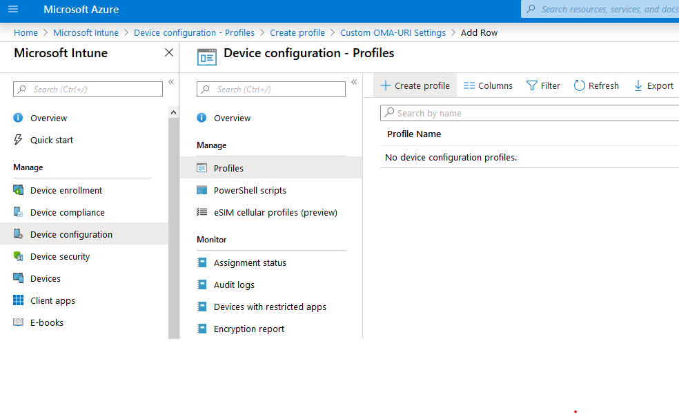

> [!NOTE]
> For WDAC enhancements see [Delivering major enhancements in Windows Defender Application Control with the Windows 10 May 2019 Update](https://www.microsoft.com/security/blog/2019/07/01/). 

# Deploy Windows Defender Application Control policies by using Microsoft Intune

**Applies to:**

-   Windows 10
-   Windows Server 2016

Microsoft Intune can be used to configure Windows Defender Application Control (WDAC) on Windows 10 client computers. Intune includes both basic native support for WDAC as well as the option to use Custom OMA-URI for customized policies.

Intune includes a limited number of default policies, which are available in both audit and enforce mode. You can use these default policies to only allow Windows components and Microsoft Store apps to run, or choose to also allow reputable apps defined by the [Intelligent Security Graph (ISG)](use-windows-defender-application-control-with-intelligent-security-graph.md). These policies are currently deployed using the [AppLocker CSP](windows\client-management\mdm\applocker-csp.md), which requires a reboot even for rebootless policies.

Intune also allows you the option of using Custom OMA-URI to deploy customized policies. Note that beginning in 1903, Custom OMA-URI deployment leverages the new [ApplicationControl CSP](windows\client-management\mdm\applicationcontrol-csp.md), which offers support for [multiple policies](deploy-multiple-windows-defender-application-control-policies.md) and rebootless policies (policies that have the “Enabled:Update Policy No Reboot” option set don't require a reboot to take effect).

## Using Default Intune WDAC Policies

1. Open the Microsoft Intune portal and click **Device configuration** > **Profiles** > **Create profile**.

2. Type a name for the new profile, select **Windows 10 and later** as the **Platform** and **Endpoint protection** as the **Profile type**.  

   

3. Click **Configure** > **Windows Defender Application Control**, choose from the following settings and then click **OK**:

   - **Application control code integrity policies**: Select **Audit only** to log events but not block any apps from running or select **Enforce** to allow only Windows components and Store apps to run.  
   - **Trust apps with good reputation**: Select **Enable** to allow reputable apps as defined by the Intelligent Security Graph to run in addition to Windows components and Store apps.

   

## Using Custom OMA-URI with ApplicationControl CSP

For systems running Windows 10 version 1903 and above, the steps to use Custom OMA-URI functionality to leverage the [ApplicationControl CSP](windows\client-management\mdm\applicationcontrol-csp.md) and apply a Code Integrity policy are:

<!--TODO: add screenshots-->
1. Locate the policy’s GUID, which can be found in the policy xml as `<PolicyID>`

       

2. Convert the policies to binary format using the ConvertFrom-CIPolicy cmdlet. The binary policy may be signed or unsigned.

    ```powershell
    ConvertFrom-CIPolicy -XmlFilePath ".\Policy.xml" - BinaryFilePath "Policy.bin"
    ```

3. In the Intune portal, navigate to Device configuration, then Profiles, then create a profile.

    

4. Name your policy, set Platform to Windows 10 and later, and change profile type to Custom (OMA-URI). Add a row and use the following:
    - OMA-URI: ./Vendor/MSFT/ApplicationControl/Policies/_{Policy GUID}_/Policy
    - Data type: Base64
    - Certificate file: upload your binary format policy file

    

5. Set Scope and Applicability Rules, then save your policy.

6. Finally, assign your policy to the appropriate groups.

    

## Using Custom OMA-URI with AppLocker CSP

If you need to deploy your policies to clients running older versions of Windows 10, use Custom OMA-URI to leverage the [AppLocker CSP](https://docs.microsoft.com/windows/client-management/mdm/applocker-csp):

<!--TODO: confirm if these steps are correct-->
1. Convert the policy to binary format using the ConvertFrom-CIPolicy cmdlet. The binary policy may be signed or unsigned.
2. In the Intune portal, navigate to Device configuration, then Profiles, then create a profile.
3. Name your policy, set Platform to Windows 10 and later, and change profile type to Custom (OMA-URI). Add a row and use the following:

    - OMA-URI: ./Vendor/MSFT/AppLocker/EnterpriseDataProtection/_Grouping_/EXE/Policy
    - Data type: Base64
    - Certificate file: upload your binary format policy file

4. Set Scope and Applicability Rules, then save your policy.
5. Finally, assign your policy to the appropriate groups.

