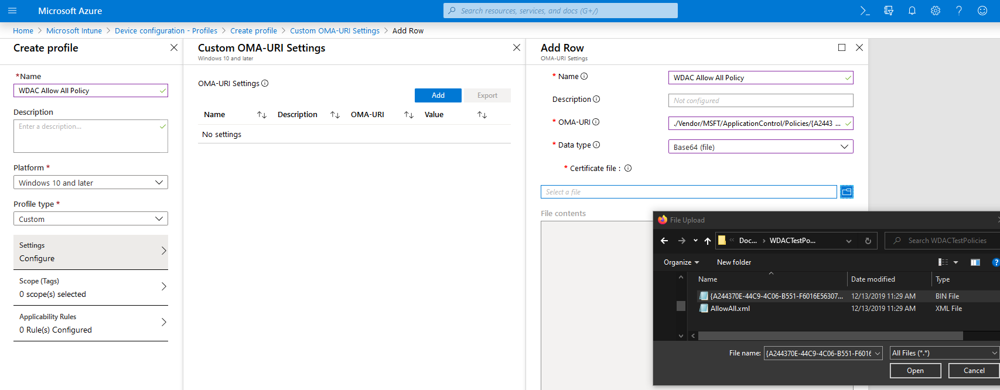

# Deploy Windows Defender Application Control policies by using Microsoft Intune

**Applies to:**

- Windows 10
- Windows Server 2016

You can use Microsoft Endpoint Manager (MEM) Intune to configure Windows Defender Application Control (WDAC). Intune includes native support for WDAC, which allows you to configure Windows 10 client computers to only run Windows components and Microsoft Store apps, or to also allow reputable apps as defined by the Intelligent Security Graph (ISG). Using the built-in policies can be a helpful starting point, but many customers may find the available circle-of-trust options to be too limited. 

In order to deploy a custom policy through Intune and define your own circle of trust, you can configure a profile using Custom OMA-URI. Beginning in 1903, Custom OMA-URI policy deployment leverages the [ApplicationControl CSP](https://docs.microsoft.com/windows/client-management/mdm/applicationcontrol-csp), which has support for multiple policies and rebootless policies. Custom OMA-URI can also be used on pre-1903 systems to deploy custom policies via the [AppLocker CSP](https://docs.microsoft.com/windows/client-management/mdm/applocker-csp).

## Using Intune's Built-In Policies

Intune's built-in WDAC support enables you to deploy a policy which only allows Windows components and Microsoft Store apps to run. This policy is the non-Multiple Policy Format version of the DefaultWindows policy; the Multiple Policy Format version can be found at C:\Windows\schemas\CodeIntegrity\ExamplePolicies.

Setting "Trust apps with good reputation" to enabled is equivalent to adding [Option 14 (Enabled: Intelligent Security Graph Authorization)](https://docs.microsoft.com/windows/security/threat-protection/windows-defender-application-control/select-types-of-rules-to-create#windows-defender-application-control-policy-rules) to the DefaultWindows policy.

1. Open the Microsoft Intune portal and click **Device configuration** > **Profiles** > **Create profile**.

2. Type a name for the new profile, select **Windows 10 and later** as the **Platform** and **Endpoint protection** as the **Profile type**.  

   

3. Click **Configure** > **Windows Defender Application Control**, choose from the following settings and then click **OK**:

   - **Application control code integrity policies**: Select **Audit only** to log events but not block any apps from running or select **Enforce** to allow only Windows components and Store apps to run.  
   - **Trust apps with good reputation**: Select **Enable** to allow reputable apps as defined by the Intelligent Security Graph to run in addition to Windows components and Store apps.

   

## Using a Custom OMA-URI Profile

### For 1903+ systems
The steps to use Intune's Custom OMA-URI functionality to leverage the [ApplicationControl CSP](https://docs.microsoft.com/windows/client-management/mdm/applicationcontrol-csp) and deploy a custom WDAC policy to 1903+ systems are:

1. Know a generated policy's GUID, which can be found in the policy xml as `<PolicyID>`
2. Convert the policy XML to binary format using the ConvertFrom-CIPolicy cmdlet in order to be deployed. The binary policy may be signed or unsigned.
3. Open the Microsoft Intune portal and click **Device configuration** > **Profiles** > **Create profile**.
4. Type a name for the new profile, select **Windows 10 and later** as the **Platform** and **Custom** as the **Profile type**.
5. Add a row, then give your policy a name and use the following settings:
    - **OMA-URI**: ./Vendor/MSFT/ApplicationControl/Policies/_Policy GUID_/Policy
    - **Data type**: Base64
    - **Certificate file**: upload your binary format policy file

    

> [!NOTE]
> Upon deletion, policies deployed through Intune via the ApplicationControl CSP are removed from the system but stay in effect until the next reboot. In order to functionally do a rebootless delete, replace the existing policy with an Allow All policy (found at C:\Windows\schemas\CodeIntegrity\ExamplePolicies\AllowAll.xml) and then delete the updated policy. This will immediately prevent anything from being blocked and fully deactive the policy on the next reboot.

### For pre-1903 systems
The steps to use Intune's Custom OMA-URI functionality to leverage the [AppLocker CSP](https://docs.microsoft.com/windows/client-management/mdm/applocker-csp) and deploy a custom WDAC policy to pre-1903 systems are:

1. Convert the policy XML to binary format using the ConvertFrom-CIPolicy cmdlet in order to be deployed. The binary policy may be signed or unsigned.
2. Open the Microsoft Intune portal and click **Device configuration** > **Profiles** > **Create profile**.
3. Type a name for the new profile, select **Windows 10 and later** as the **Platform** and **Custom** as the **Profile type**.
4. Add a row, then give your policy a name and use the following settings:
    - **OMA-URI**: ./Vendor/MSFT/AppLocker/ApplicationLaunchRestrictions/_Grouping_/CodeIntegrity/Policy)
    - **Data type**: Base64
    - **Certificate file**: upload your binary format policy file

> [!NOTE]
> Policies deployed through Intune via the AppLocker CSP cannot be deleted through the Intune console. In order to disable WDAC policy enforcement, either deploy an audit-mode policy and/or use a script to delete the existing policy.

> [!NOTE]
> Deploying policies via the AppLocker CSP will force a reboot during OOBE.
