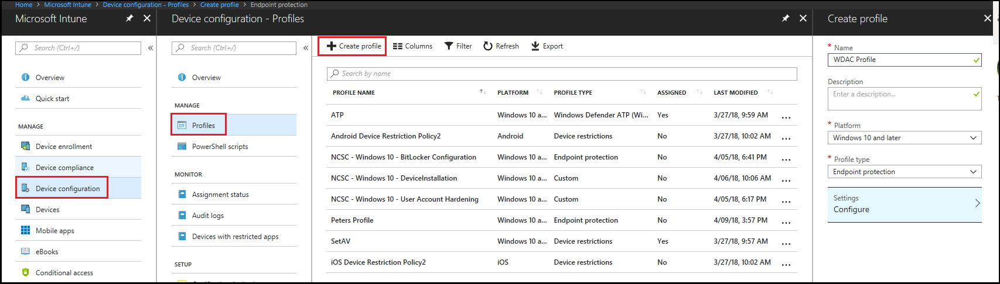
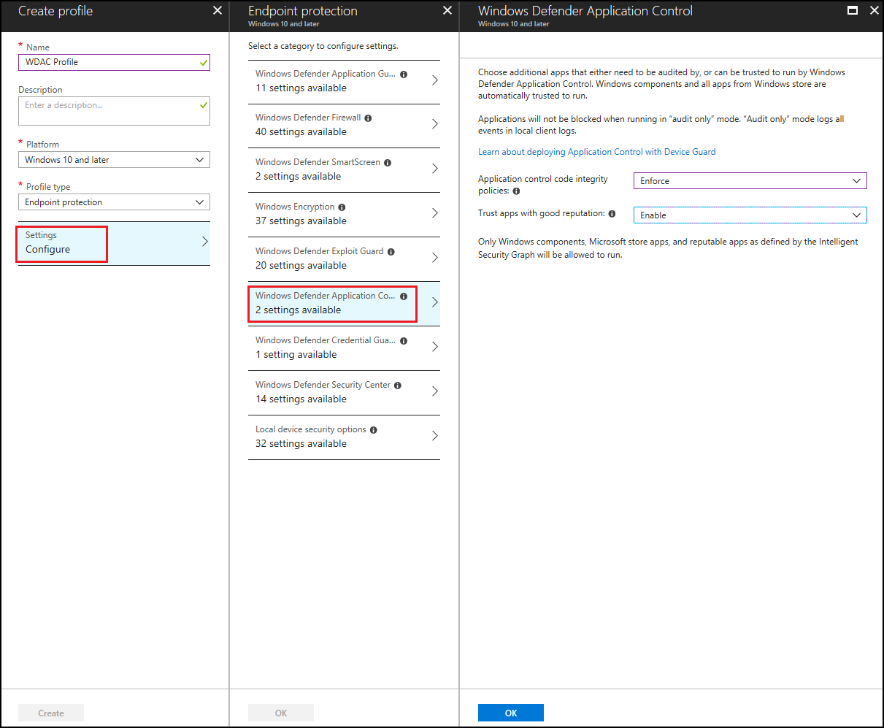

# Deploy Windows Defender Application Control policies by using Microsoft Intune

**Applies to:**

-   Windows 10
-   Windows Server 2016

You can use Microsoft Intune to configure Windows Defender Application Control (WDAC). You can configure Windows 10 client computers to only run Windows components and Microsoft Store apps, or let them also run reputable apps defined by the Intelligent Security Graph.   

1. Open the Microsoft Intune portal and click **Device configuration** > **Profiles** > **Create profile**.

3. Type a name for the new profile, select **Windows 10 and later** as the **Platform** and **Endpoint protection** as the **Profile type**.  

   

4. Click **Configure** > **Windows Defender Application Control**, choose from the following settings and then click **OK**:

   - **Application control code intergity policies**: Select **Audit only** to log events but not block any apps from running or select **Enforce** to allow only Windows components and Store apps to run.  
   - **Trust apps with good reputation**: Select **Enable** to allow reputable apps as defined by the Intelligent Security Graph to run in addition to Windows components and Store apps.

   
