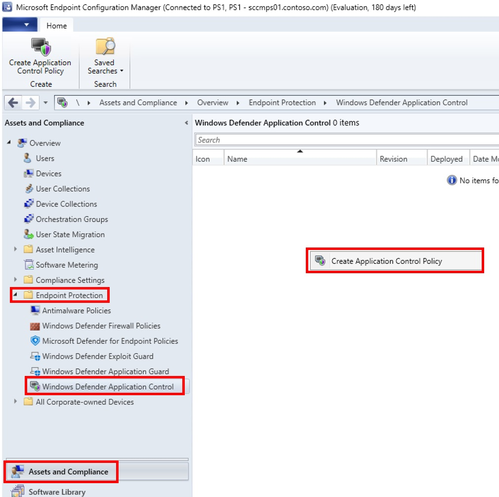
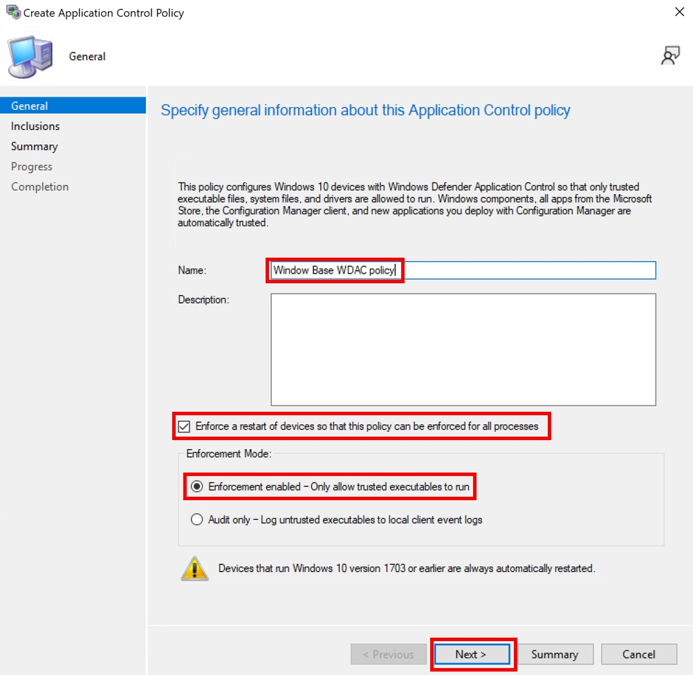
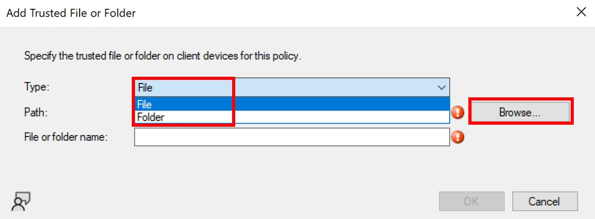
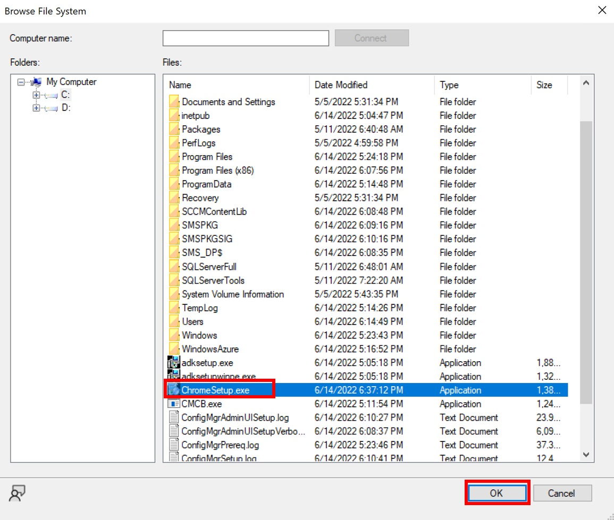
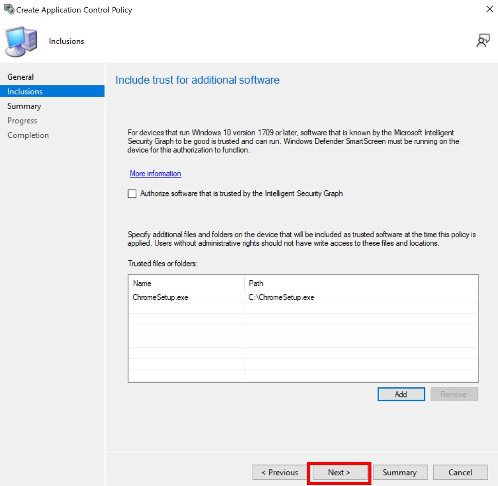
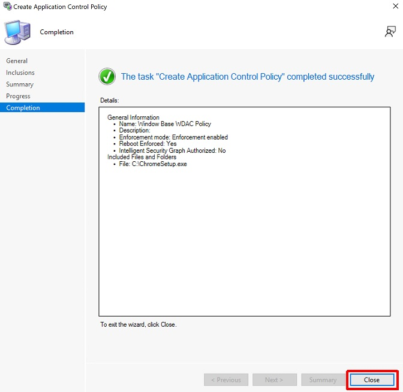
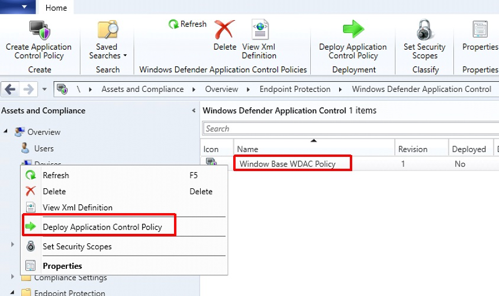
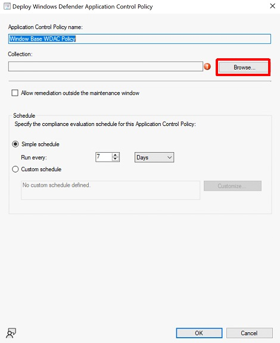
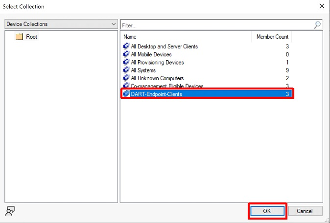
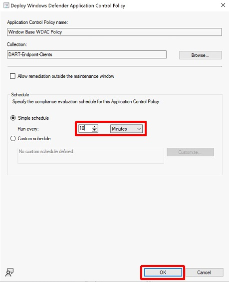

# Deploy WDAC policies by using Microsoft Configuration Manager

**Applies to:**

- Windows 10
- Windows 11
- Windows Server 2016 and above

> [!NOTE]
> Some capabilities of Windows Defender Application Control (WDAC) are only available on specific Windows versions. Learn more about the [Application Control feature availability](../feature-availability.md).

You can use Microsoft Configuration Manager to configure Windows Defender Application Control (WDAC) on client machines.

## Use Configuration Manager's built-in policies

Configuration Manager includes native support for WDAC, which allows you to configure Windows 10 and Windows 11 client computers with a policy that will only allow:

- Windows components
- Microsoft Store apps
- Apps installed by Configuration Manager (Configuration Manager self-configured as a managed installer)
- (Optional) Reputable apps as defined by the Intelligent Security Graph (ISG)
- (Optional) Apps and executables already installed in admin-definable folder locations that Configuration Manager will allow through a one-time scan during policy creation on managed endpoints.

Configuration Manager doesn't remove policies once deployed. To stop enforcement, you should switch the policy to audit mode, which will produce the same effect. If you want to disable Windows Defender Application Control (WDAC) altogether (including audit mode), you can deploy a script to delete the policy file from disk, and either trigger a reboot or wait for the next reboot.

### Create a WDAC Policy in Configuration Manager

1. Select **Asset and Compliance** > **Endpoint Protection** > **Windows Defender Application Control** > **Create Application Control Policy**

    

2. Enter the name of the policy > **Next**
3. Enable **Enforce a restart of devices so that this policy can be enforced for all processes**
4. Select the mode that you want the policy to run (Enforcement enabled / Audit Only)
5. Select **Next**

    

6. Select **Add** to begin creating rules for trusted software

    

7. Select **File** or **Folder** to create a path rule > **Browse**

    

8. Select the executable or folder for your path rule > **OK**

    

9. Select **OK** to add the rule to the table of trusted files or folder
10. Select **Next** to navigate to the summary page > **Close**

    

### Deploy the WDAC policy in Configuration Manager

1. Right-click the newly created policy > **Deploy Application Control Policy**

    

2. Select **Browse**

    

3. Select the Device Collection you created earlier > **OK**

    

4. Change the schedule > **OK**

    

For more information on using Configuration Manager's native WDAC policies, see [Windows Defender Application Control management with Configuration Manager](/mem/configmgr/protect/deploy-use/use-device-guard-with-configuration-manager).

Download the entire [WDAC in Configuration Manager lab paper](https://download.microsoft.com/download/c/f/d/cfd6227c-8ec4-442d-8c50-825550d412f6/WDAC-Deploy-WDAC-using-MEMCM.pdf).

## Deploy custom WDAC policies using Packages/Programs or Task Sequences

Using Configuration Manager's built-in policies can be a helpful starting point, but customers may find the circle-of-trust options available in Configuration Manager too limiting. To define your own circle-of-trust, you can use Configuration Manager to deploy custom WDAC policies using [script-based deployment](deploy-wdac-policies-with-script.md) via Software Distribution Packages and Programs or Operating System Deployment Task Sequences.
