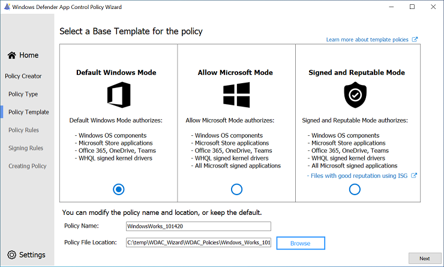
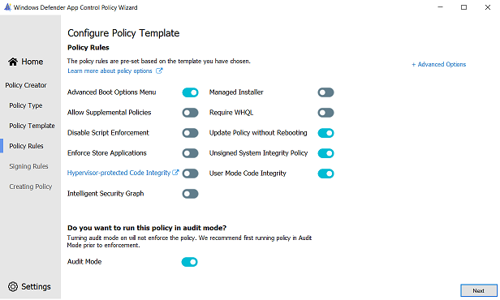
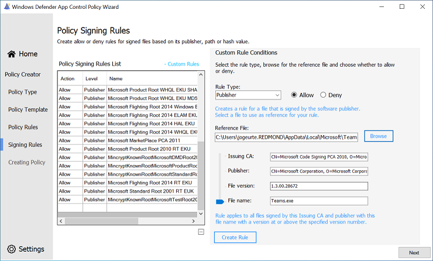
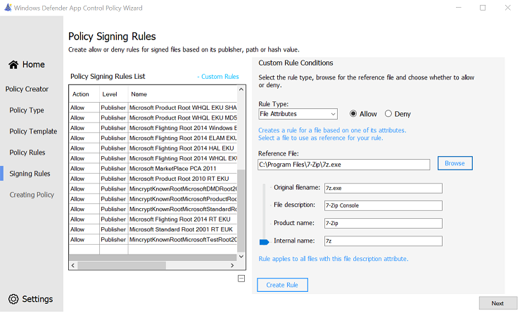

# Creating a new Base Policy with the Wizard

**Applies to**

- Windows 10
- Windows 11
- Windows Server 2016 and above

> [!NOTE]
> Some capabilities of Windows Defender Application Control are only available on specific Windows versions. Learn more about the [Defender App Guard feature availability](feature-availability.md).

When creating policies for use with Windows Defender Application Control (WDAC), it is recommended to start with a template policy and then add or remove rules to suit your application control scenario. For this reason, the WDAC Wizard offers three template policies to start from and customize during the base policy creation workflow. Prerequisite information about application control can be accessed through the [WDAC design guide](windows-defender-application-control-design-guide.md). This page outlines the steps to create a new application control policy from a template, configure the policy options, and the signer and file rules. 

## Template Base Policies

Each of the template policies has a unique set of policy allow list rules that will affect the circle-of-trust and security model of the policy. The following table lists the policies in increasing order of trust and freedom. For instance, the Default Windows mode policy trusts fewer application publishers and signers than the Signed and Reputable mode policy. The Default Windows policy will have a smaller circle-of-trust with better security than the Signed and Reputable policy, but at the expense of compatibility.  

| Template Base Policy | Description | 
|---------------------------------|-------------------------------------------------------------------|
| **Default Windows Mode**      | Default Windows mode will authorize the following components:  <ul><li>Windows operating components - any binary installed by a fresh install of Windows</li><li>Apps installed from the Microsoft Store</li><li>Microsoft Office365 apps, OneDrive, and Microsoft Teams</li><li>Third-party [Windows Hardware Compatible drivers](/windows-hardware/drivers/install/whql-release-signature)</li></ul>|
| **Allow Microsoft Mode**      | Allow mode will authorize the following components:  <ul><li>Windows operating components - any binary installed by a fresh install of Windows</li><li>Apps installed from the Microsoft Store</li><li>Microsoft Office365 apps, OneDrive, and Microsoft Teams</li><li>Third-party [Windows Hardware Compatible drivers](/windows-hardware/drivers/install/whql-release-signature)</li><li>*All Microsoft-signed software*</li></ul>|
| **Signed and Reputable Mode** | Signed and Reputable mode will authorize the following components:  <ul><li>Windows operating components - any binary installed by a fresh install of Windows</li><li>Apps installed from the Microsoft Store</li><li>Microsoft Office365 apps, OneDrive, and Microsoft Teams</li><li>Third-party [Windows Hardware Compatible drivers](/windows-hardware/drivers/install/whql-release-signature)</li><li>All Microsoft-signed software</li><li>*Files with good reputation per [Microsoft Defender's Intelligent Security Graph technology](use-windows-defender-application-control-with-intelligent-security-graph.md)*</li></ul>|

*Italicized content denotes the changes in the current policy with respect to the policy prior.*

More information about the Default Windows Mode and Allow Microsoft Mode policies can be accessed through the [Example WDAC base policies article](example-wdac-base-policies.md). 

Once the base template is selected, give the policy a name and choose where to save the application control policy on disk.

## Configuring Policy Rules

Upon page launch, policy rules will be automatically enabled/disabled depending on the chosen template from the previous page. Choose to enable or disable the desired policy rule options by pressing the slider button next to the policy rule titles. A short description of each rule will appear at the bottom of the page when the mouse hovers over the rule title. 

### Policy Rules Description

A description of each policy rule, beginning with the left-most column, is provided below. The [Policy rules article](select-types-of-rules-to-create.md#windows-defender-application-control-policy-rules) provides a full description of each policy rule. 

| Rule option | Description |
|------------ | ----------- |
| **Advanced Boot Options Menu** | The F8 preboot menu is disabled by default for all WDAC policies. Setting this rule option allows the F8 menu to appear to physically present users. |
| **Allow Supplemental Policies** | Use this option on a base policy to allow supplemental policies to expand it. |
| **Disable Script Enforcement** | This option disables script enforcement options. Unsigned PowerShell scripts and interactive PowerShell are no longer restricted to [Constrained Language Mode](/powershell/module/microsoft.powershell.core/about/about_language_modes). NOTE: This option is required to run HTA files, and is only supported with the Windows 10 May 2019 Update (1903) and higher. Using it on earlier versions of Windows 10 is not supported and may have unintended results. |
|**[Hypervisor-protected code integrity (HVCI)](../device-guard/enable-virtualization-based-protection-of-code-integrity.md)**| When enabled, policy enforcement uses virtualization-based security to run the code integrity service inside a secure environment. HVCI provides stronger protections against kernel malware.|
| **Intelligent Security Graph Authorization** | Use this option to automatically allow applications with "known good" reputation as defined by Microsoft’s Intelligent Security Graph (ISG). |
| **Managed Installer** | Use this option to automatically allow applications installed by a software distribution solution, such as Microsoft Endpoint Configuration Manager, that has been defined as a managed installer. |
| **Require WHQL** | By default, legacy drivers that are not Windows Hardware Quality Labs (WHQL) signed are allowed to execute. Enabling this rule requires that every executed driver is WHQL signed and removes legacy driver support. Going forward, every new Windows–compatible driver must be WHQL certified. |
| **Update Policy without Rebooting** | Use this option to allow future WDAC policy updates to apply without requiring a system reboot. |
| **Unsigned System Integrity Policy** | Allows the policy to remain unsigned. When this option is removed, the policy must be signed and have UpdatePolicySigners added to the policy to enable future policy modifications. |
| **User Mode Code Integrity** | WDAC policies restrict both kernel-mode and user-mode binaries. By default, only kernel-mode binaries are restricted. Enabling this rule option validates user mode executables and scripts. |

> [!div class="mx-imgBorder"]
> 

### Advanced Policy Rules Description

Selecting the **+ Advanced Options** label will show another column of policy rules; advanced policy rules. A description of each policy rule is provided below. 

| Rule option | Description |
|------------ | ----------- |
| **Boot Audit on Failure** | Used when the WDAC policy is in enforcement mode. When a driver fails during startup, the WDAC policy will be placed in audit mode so that Windows will load. Administrators can validate the reason for the failure in the CodeIntegrity event log. |
| **Disable Flight Signing** | If enabled, WDAC policies will not trust flightroot-signed binaries. This would be used in the scenario in which organizations only want to run released binaries, not flight/preview-signed builds. |
| **Disable Runtime FilePath Rule Protection** | Disable default FilePath rule protection (apps and executables allowed based on file path rules must come from a file path that’s only writable by an administrator) for any FileRule that allows a file based on FilePath. |
| **Dynamic Code Security** | Enables policy enforcement for .NET applications and dynamically loaded libraries (DLLs). |
| **Invalidate EAs on Reboot** | When the Intelligent Security Graph option (14) is used, WDAC sets an extended file attribute that indicates that the file was authorized to run. This option will cause WDAC to periodically revalidate the reputation for files that were authorized by the ISG.| 
| **Require EV Signers** | In addition to being WHQL signed, this rule requires that drivers must have been submitted by a partner that has an Extended Verification (EV) certificate. All Windows 10 and later, or Windows 11 drivers will meet this requirement. |

> [!NOTE]
> We recommend that you **enable Audit Mode** initially because it allows you to test new WDAC policies before you enforce them. With audit mode, no application is blocked—instead the policy logs an event whenever an application outside the policy is started. For this reason, all templates have Audit Mode enabled by default. 

## Creating custom file rules

[File rules](select-types-of-rules-to-create.md#windows-defender-application-control-file-rule-levels) in an application control policy will specify the level at which applications will be identified and trusted. File rules are the main mechanism for defining trust in the application control policy. Selecting the **+ Custom Rules** will open the custom file rule conditions panel to create custom file rules for your policy. The Wizard supports four types of file rules: 

### Publisher Rules

The Publisher file rule type uses properties in the code signing certificate chain to base file rules. Once the file to base the rule off of, called the *reference file*, is selected, use the slider to indicate the specificity of the rule.  The table below shows the relationship between the slider placement, the corresponding WDAC rule level and its description. The lower the placement on the table and the UI slider, the greater the specificity of the rule. 

| Rule Condition | WDAC Rule Level | Description |
|------------ | ----------- | ----------- |
| **Issuing CA** | PCACertificate | Highest available certificate is added to the signers. This is typically the PCA certificate, one level below the root certificate. Any file signed by this certificate will be affected. |
| **Publisher** | Publisher | This rule is a combination of the PCACertificate rule and the common name (CN) of the leaf certificate. Any file signed by a major CA but with a leaf from a specific company, for example a device driver corp, is affected. |
| **File version** | SignedVersion | This rule is a combination of PCACertificate, publisher, and a version number. Anything from the specified publisher with a version at or above the one specified is affected. |
| **File name** | FilePublisher | Most specific. Combination of the file name, publisher, and PCA certificate as well as a minimum version number. Files from the publisher with the specified name and greater or equal to the specified version are affected. |

### Filepath Rules

Filepath rules do not provide the same security guarantees that explicit signer rules do, as they are based on mutable access permissions. To create a filepath rule, select the file using the *Browse* button. 

### File Attribute Rules

The Wizard supports the creation of [file name rules](select-types-of-rules-to-create.md#windows-defender-application-control-filename-rules) based on authenticated file attributes. File name rules are useful when an application and its dependencies (for example, DLLs) may all share the same product name, for instance. This rule level allows users to easily create targeted policies based on the Product Name file name parameter. To select the file attribute to create the rule, move the slider on the Wizard to the desired attribute. The table below describes each of the supported file attributes off which to create a rule. 

| Rule level | Description |
|------------ | ----------- |
| **Original Filename** | Specifies the original file name, or the name with which the file was first created, of the binary. |
| **File description** | Specifies the file description provided by the developer of the binary. |
| **Product name** | Specifies the name of the product with which the binary ships. |
| **Internal name** | Specifies the internal name of the binary. |

> [!div class="mx-imgBorder"]
> 

### File Hash Rules

Lastly, the Wizard supports creating file rules using the hash of the file. Although this level is specific, it can cause additional administrative overhead to maintain the current product versions’ hash values. Each time a binary is updated, the hash value changes, therefore requiring a policy update. By default, the Wizard will use file hash as the fallback in case a file rule cannot be created using the specified file rule level. 

#### Deleting Signing Rules 
  
The policy signing rules list table on the left of the page will document the allow and deny rules in the template, as well as any custom rules you create. Template signing rules and custom rules can be deleted from the policy by selecting the rule from the rules list table. Once the rule is highlighted, press the delete button underneath the table. you will be prompted for additional confirmation. Select `Yes` to remove the rule from the policy and the rules table. 

## Up next

- [Editing a WDAC policy using the Wizard](wdac-wizard-editing-policy.md)