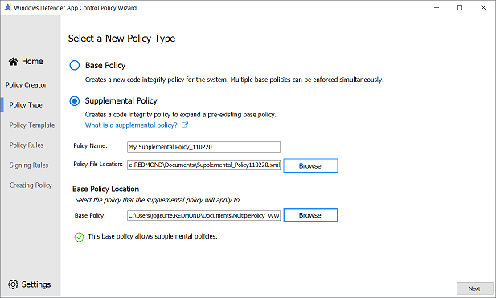
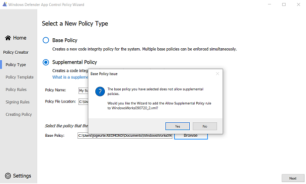
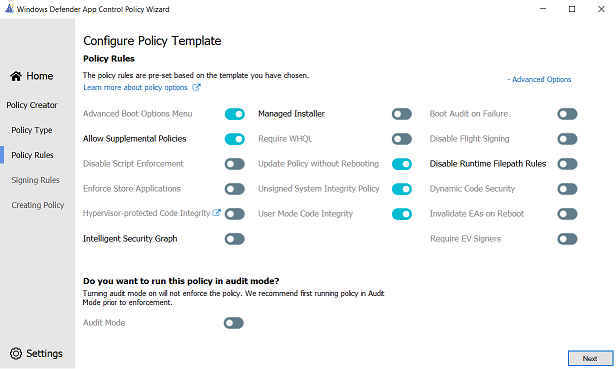

# Creating a new Supplemental Policy with the Wizard

**Applies to**
-   Windows 10
-   Windows Server 2016 and above

Beginning in Windows 10 version 1903, WDAC supports the creation of multiple active policies on a device. One or more supplemental policies allow customers to expand a [WDAC base policy](wdac-wizard-create-base-policy.md) to increase the circle of trust of the policy. A supplemental policy can expand only one base policy, but multiple supplementals can expand the same base policy. When using supplemental policies, applications allowed by the base or its supplemental policy/policies will be allowed to execute. 

Prerequisite information about application control can be accessed through the [WDAC design guide](windows-defender-application-control-design-guide.md). This page outlines the steps to create a supplemental application control policy, configure the policy options, and the signer and file rules. 

## Expanding a Base Policy

Once the Supplemental Policy type is chosen on the New Policy page, policy name and file dialog fields can be used to name and save the supplemental policy. The next step requires selecting a base policy to expand. To expand a base policy, the base must allow supplemental policies. The WDAC Wizard will verify if the base policy allows supplementals and will show the following confirmation. 

If the base policy is not configured for supplemental policies, the Wizard will attempt to convert the policy to one that can be supplemented. Once successful, the Wizard will show a dialog demonstrating that the addition of the Allow Supplemental Policy rule was completed.  

Policies that cannot be supplemented, for instance, a supplemental policy, will be detected by the Wizard and will show the following error. Only a base policy can be supplemented. More information on supplemental policies can be found on our [Multiple Policies article](deploy-multiple-windows-defender-application-control-policies.md).

## Configuring Policy Rules

Upon page launch, policy rules will be automatically enabled/disabled depending on the chosen base policy from the previous page. Most of the supplemental policy rules must be inherited from the base policy. The Wizard will automatically parse the base policy and set the required supplemental policy rules to match the base policy rules. Inherited policy rules will be grayed out and will not be modifiable in the user interface. 

A short description of the rule will be shown at the bottom of the page when the cursor is placed on the rule title. 

### Configurable Supplemental Policy Rules Description

There are only three policy rules that can be configured by the supplemental policy. A description of each policy rule, beginning with the left-most column, is provided below. Selecting the **+ Advanced Options** label will show another column of policy rules; advanced policy rules. 

| Rule option | Description |
|------------ | ----------- |
| **Intelligent Security Graph Authorization** | Use this option to automatically allow applications with "known good" reputation as defined by Microsoft’s Intelligent Security Graph (ISG). |
| **Managed Installer** | Use this option to automatically allow applications installed by a software distribution solution, such as Microsoft Endpoint Configuration Manager, that has been defined as a managed installer. |
| **Disable Runtime FilePath Rule Protection** | Disable default FilePath rule protection (apps and executables allowed based on file path rules must come from a file path that’s only writable by an administrator) for any FileRule that allows a file based on FilePath. |

## Creating custom file rules

File rules in an application control policy will specify the level at which applications will be identified and trusted. File rules are the main mechanism for defining trust in the application control policy. Selecting the **+ Custom Rules** will open the custom file rule conditions panel to create and customize targeted file rules for your policy. The Wizard supports four types of file rules: 

### Publisher Rules

The Publisher file rule type uses properties in the code signing certificate chain to base file rules. Once the file to base the rule off of, called the *reference file*, is selected, use the slider to indicate the specificity of the rule.  The table below shows the relationship between the slider placement, the corresponding WDAC rule level, and its description. The lower the placement on the table and the UI slider, the greater the specificity of the rule. 

| Rule Condition | WDAC Rule Level | Description |
|------------ | ----------- | ----------- |
| **Issuing CA** | PCACertificate | Highest available certificate is added to the signers. This certificate is typically the PCA certificate, one level below the root certificate. Any file signed by this certificate will be affected. |
| **Publisher** | Publisher | This rule is a combination of the PCACertificate rule and the common name (CN) of the leaf certificate. Any file signed by a major CA but with a leaf from a specific company, for example a device driver publisher, is affected. |
| **File version** | SignedVersion | This rule is a combination of the PCACertificate and Publisher rule, and a version number. Anything from the specified publisher with a version at or above the one specified is affected. |
| **File name** | FilePublisher | Most specific. Combination of the file name, publisher, and PCA certificate and a minimum version number. Files from the publisher with the specified name and greater or equal to the specified version are affected. |

### Filepath Rules

Filepath rules do not provide the same security guarantees that explicit signer rules do, as they are based on mutable access permissions. To create a filepath rule, select the file using the *Browse* button. 

### File Attribute Rules

The Wizard supports the creation of [file name rules](select-types-of-rules-to-create.md#windows-defender-application-control-filename-rules) based on authenticated file attributes. File name rules are useful when an application and its dependencies (for example, DLLs) may all share the same product name, for instance. This rule level allows users to easily create targeted policies based on the Product Name file name. To select the file attribute to create the rule, move the slider on the Wizard to the desired attribute. The table below describes each of the supported file attributes off which to create a rule. 

| Rule level | Description |
|------------ | ----------- |
| **Original Filename** | Specifies the original file name, or the name with which the file was first created, of the binary. |
| **File description** | Specifies the file description provided by the developer of the binary. |
| **Product name** | Specifies the name of the product with which the binary ships. |
| **Internal name** | Specifies the internal name of the binary. |

### File Hash Rules

Lastly, the Wizard supports creating file rules using the hash of the file. Although this level is specific, it can cause extra administrative overhead to maintain the current product versions’ hash values. Each time a binary is updated, the hash value changes, therefore requiring a policy update. By default, the Wizard will use file hash as the fallback in case a file rule cannot be created using the specified file rule level. 

#### Deleting Signing Rules 
  
The table on the left of the page will document the allow and deny rules in the template, and any custom rules you create. Rules can be deleted from the policy by selecting the rule from the rules list table. Once the rule is highlighted, press the delete button underneath the table. you will be prompted for additional confirmation. Select `Yes` to remove the rule from the policy and the rules table. 

## Up next

- [Editing a WDAC policy using the Wizard](wdac-wizard-editing-policy.md)
