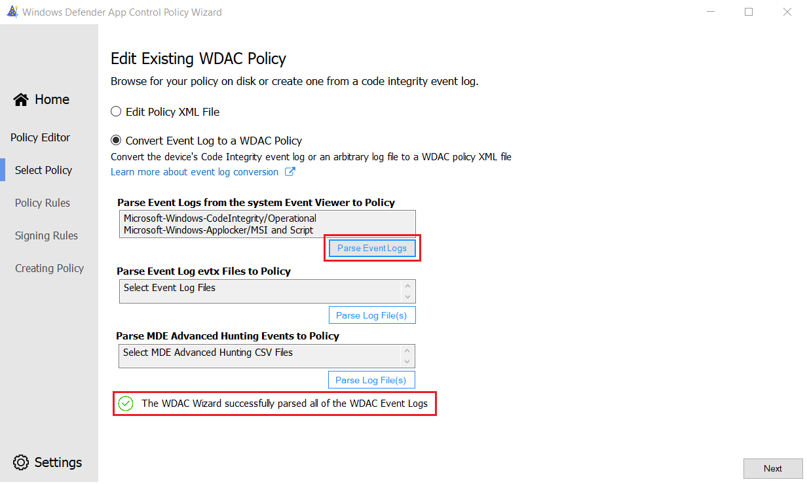
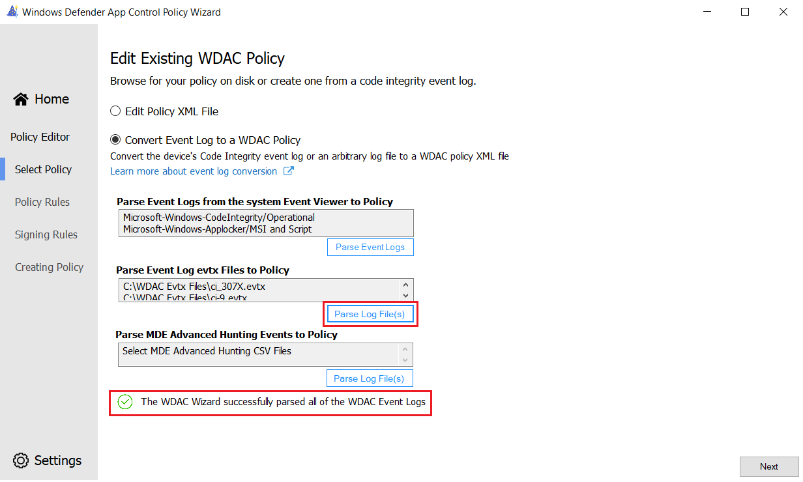
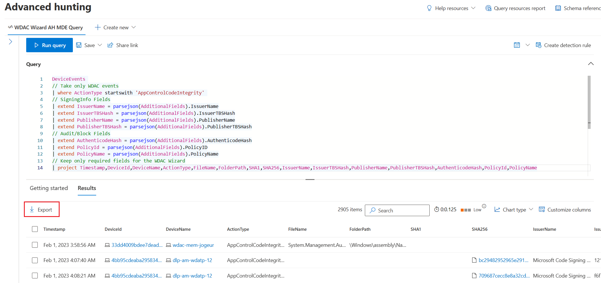
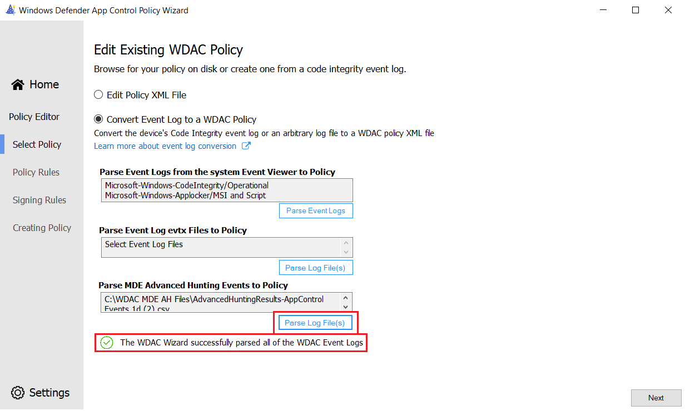
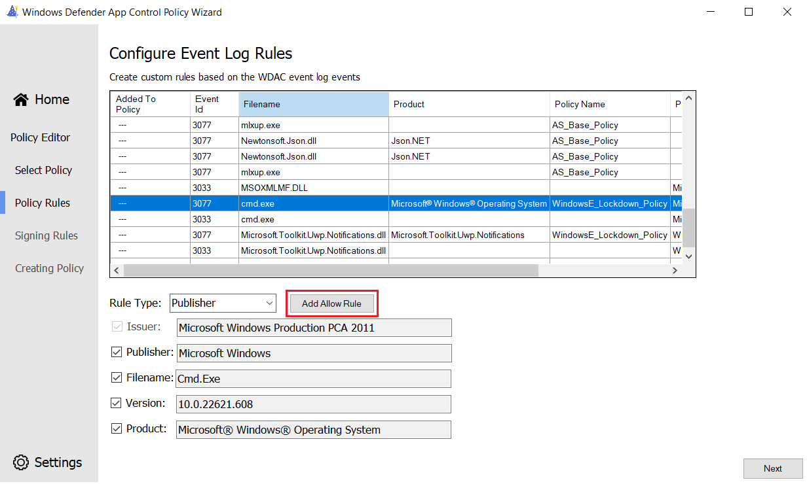

# Creating WDAC Policy Rules from WDAC Events in the Wizard

**Applies to**

- Windows 10
- Windows 11
- Windows Server 2016 and above

> [!NOTE]
> Some capabilities of Windows Defender Application Control are only available on specific Windows versions. Learn more about the [Windows Defender Application Control feature availability](feature-availability.md).

As of [version 2.2.0.0](https://webapp-wdac-wizard.azurewebsites.net/archives.html), the WDAC Wizard supports creating WDAC policy rules the follow: 

1. The WDAC event log events on the system
2. Exported .EVTX log files from any system
3. Exported WDAC events from [MDE Advanced Hunting](querying-application-control-events-centrally-using-advanced-hunting.md) WDAC events


## WDAC Event Log File Parsing

To create rules from the WDAC event logs on the system:

1. Select **Policy Editor** from the WDAC Wizard main page
2. Select **Convert Event Log to a WDAC Policy**
3. Select the **Parse Event Logs** button under the Parse Event Logs from the "System Event Viewer to Policy" header

The Wizard will parse the relevant audit and block events from the CodeIntegrity (WDAC) Operational and AppLocker MSI and Script logs. You will see a notification when the Wizard successfully finishes reading the events. 

> [!div class="mx-imgBorder"]
> 

4. Select the Next button to navigate to the table of software to view the audit and block events and create rules from
5. <Link to generic parsing instructions>

## WDAC Event Log File Parsing

To create rules from the WDAC .EVTX event logs files on the system:

1. Select **Policy Editor** from the WDAC Wizard main page
2. Select **Convert Event Log to a WDAC Policy**
3. Select the **Parse Log File(s)** button under the "Parse Event Log evtx Files to Policy" header
4. Multi-select the .EVTX WDAC CodeIntegrity files from the disk to parse

The Wizard will parse the relevant audit and block events from the selected log files. You will see a notification when the Wizard successfully finishes reading the events. 

> [!div class="mx-imgBorder"]
> 

4. Select the Next button to navigate to the table of software to view the audit and block events and create rules from
5. <Link to generic parsing instructions>

## MDE Advanced Hunting WDAC Event Parsing

To create rules from the WDAC events in [MDE Advanced Hunting](querying-application-control-events-centrally-using-advanced-hunting.md):

1. Export the WDAC events from MDE Advanced Hunting. **The Wizard requires the following fields** in the Advanced Hunting csv file export: 

```KQL
| project Timestamp, DeviceId, DeviceName, ActionType, FileName, FolderPath, SHA1, SHA256, IssuerName, IssuerTBSHash, PublisherName, PublisherTBSHash, AuthenticodeHash, PolicyId, PolicyName
```

The following Advanced Hunting query is recommended:

```KQL
DeviceEvents 
// Take only WDAC events
| where ActionType startswith 'AppControlCodeIntegrity' 
// SigningInfo Fields
| extend IssuerName = parsejson(AdditionalFields).IssuerName
| extend IssuerTBSHash = parsejson(AdditionalFields).IssuerTBSHash
| extend PublisherName = parsejson(AdditionalFields).PublisherName
| extend PublisherTBSHash = parsejson(AdditionalFields).PublisherTBSHash
// Audit/Block Fields
| extend AuthenticodeHash = parsejson(AdditionalFields).AuthenticodeHash
| extend PolicyId = parsejson(AdditionalFields).PolicyID
| extend PolicyName = parsejson(AdditionalFields).PolicyName
// Keep only required fields for the WDAC Wizard
| project Timestamp,DeviceId,DeviceName,ActionType,FileName,FolderPath,SHA1,SHA256,IssuerName,IssuerTBSHash,PublisherName,PublisherTBSHash,AuthenticodeHash,PolicyId,PolicyName
```

2. Export the WDAC event results by selecting the **Export** button in the results view

> [!div class="mx-imgBorder"]
> 

3. Select **Policy Editor** from the WDAC Wizard main page
4. Select **Convert Event Log to a WDAC Policy**
5. Select the **Parse Log File(s)** button under the "Parse MDE Advanced Hunting Events to Policy" header
6. Multi-select the .CSV WDAC MDE Advanced Hunting export files from the disk to parse

The Wizard will parse the relevant audit and block events from the selected Advanced Hunting log files. You will see a notification when the Wizard successfully finishes reading the events. 

> [!div class="mx-imgBorder"]
> 

7. Select the Next button to navigate to the table of software to view the audit and block events and create rules from
8. <Link to generic parsing instructions>


## Creating Policy Rules from the Events

On the "Configure Event Log Rules" page, the unique log events will be shown in the table. Event Ids, filenames, product names, the policy name that audited or blocked the file, as well as the file publisher is shown in the table. The table can be sorted alphabetically by clicking on any of the headers. 

To create a rule: 

1. Select an audit or block event in the table by selecting the row of interest
2. Select a rule type from the dropdown. The supported types are: Publisher, Path, File Attribute, Packaged App or Hash rules
3. Select the attributes and fields that should be added to the policy rules using the checkboxes provider per rule type
4. Select the **Add Allow Rule** button to add the configured rule to the policy generated by the Wizard. The "Added to policy" label will be added to the selected row confirming that the rule will be generated in the WDAC policy

> [!div class="mx-imgBorder"]
> 

5. Select the **Next** button to output the policy. Once generated, the event log policy should be merged with your base or supplemental policies. It is not recommended to deploy the event log policy on its own, as it likely lacks rules to authorize Windows and may cause blue screens


## Up next

- [Merging Windows Defender Application Control (WDAC) policies using the Wizard](wdac-wizard-merging-policies.md)