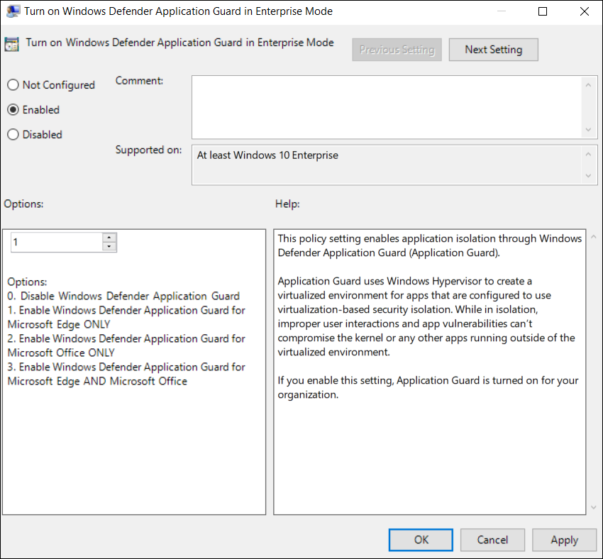
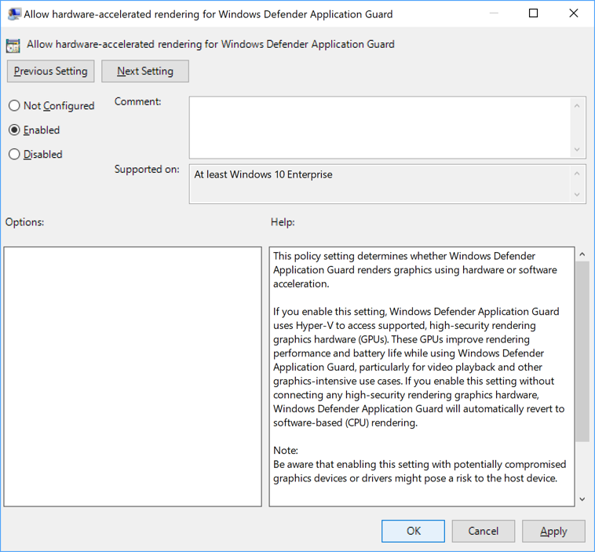
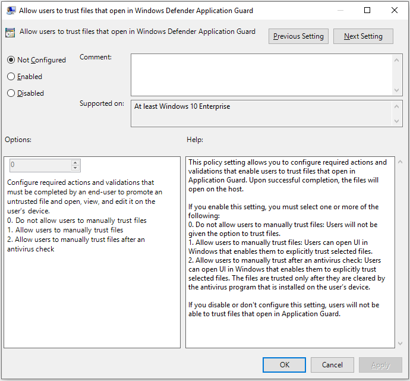
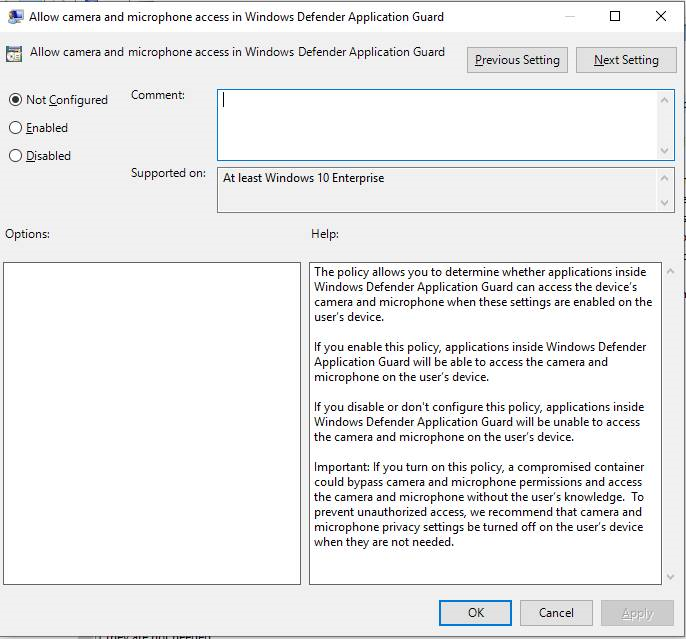
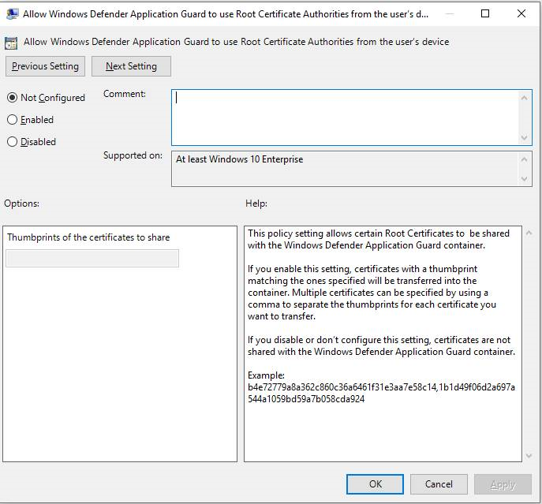

# Application Guard testing scenarios

**Applies to:** [Microsoft Defender Advanced Threat Protection (Microsoft Defender ATP)](https://go.microsoft.com/fwlink/p/?linkid=2069559)

We've come up with a list of scenarios that you can use to test hardware-based isolation in your organization.

## Application Guard in standalone mode
You can see how an employee would use standalone mode with Application Guard.

**To test Application Guard in Standalone mode**

1.	[Install Application Guard](https://docs.microsoft.com/windows/security/threat-protection/windows-defender-application-guard/install-wd-app-guard).

2.	Restart the device, start Microsoft Edge, and then click **New Application Guard window** from the menu.

    
 
3.	Wait for Application Guard to set up the isolated environment.

    >[!NOTE]
    >Starting Application Guard too quickly after restarting the device might cause it to take a bit longer to load. However, subsequent starts should occur without any perceivable delays. 
 
4. Go to an untrusted, but safe URL (for this example, we used msn.com) and view the new Microsoft Edge window, making sure you see the Application Guard visual cues.

    

## Application Guard in Enterprise-managed mode 
How to install, set up, turn on, and configure Application Guard for Enterprise-managed mode.

### Install, set up, and turn on Application Guard
Before you can use Application Guard in enterprise mode, you must install Windows 10 Enterprise edition, version 1709, which includes the functionality. Then, you must use Group Policy to set up the required settings.

1.	[Install Application Guard](https://docs.microsoft.com/windows/security/threat-protection/windows-defender-application-guard/install-wd-app-guard#install-application-guard).

2.	Restart the device and then start Microsoft Edge.

3.	Set up the Network Isolation settings in Group Policy:

    a.	Click on the **Windows** icon, type _Group Policy_, and then click **Edit Group Policy**.
    
    b.	Go to the **Administrative Templates\Network\Network Isolation\Enterprise resource domains hosted in the cloud** setting.

    c.	For the purposes of this scenario, type _.microsoft.com_ into the **Enterprise cloud resources** box.

    

    d. Go to the **Administrative Templates\Network\Network Isolation\Domains categorized as both work and personal** setting.

    e. For the purposes of this scenario, type _bing.com_ into the **Neutral resources** box.

    

4.	Go to the **Computer Configuration\Administrative Templates\Windows Components\Windows Defender Application Guard\Turn on Windows Defender Application Guard in Enterprise Mode** setting.

5.	Click **Enabled**, choose Option **1**, and click **OK**.

    

    >[!NOTE]
    >Enabling this setting verifies that all the necessary settings are properly configured on your employee devices, including the network isolation settings set earlier in this scenario.

6. Start Microsoft Edge and type _www.microsoft.com_.
    
    After you submit the URL, Application Guard determines the URL is trusted because it uses the domain you’ve marked as trusted and shows the site directly on the host PC instead of in Application Guard.

    

7.	In the same Microsoft Edge browser, type any URL that isn’t part of your trusted or neutral site lists.
 
    After you submit the URL, Application Guard determines the URL is untrusted and redirects the request to the hardware-isolated environment.

    

### Customize Application Guard
Application Guard lets you specify your configuration, allowing you to create the proper balance between isolation-based security and productivity for your employees.

Application Guard provides the following default behavior for your employees:

- No copying and pasting between the host PC and the isolated container.

- No printing from the isolated container.

- No data persistence from one isolated container to another isolated container.

You have the option to change each of these settings to work with your enterprise from within Group Policy.

**Applies to:**
- Windows 10 Enterpise edition, version 1709 or higher
- Windows 10 Professional edition, version 1803

#### Copy and paste options

1.	Go to the **Computer Configuration\Administrative Templates\Windows Components\Windows Defender Application Guard\Configure Windows Defender Application Guard clipboard settings**.

2.	Click **Enabled** and click **OK**.
 
    

3.	Choose how the clipboard works:
    
    - Copy and paste from the isolated session to the host PC
    
    - Copy and paste from the host PC to the isolated session
    
    - Copy and paste both directions

4.	Choose what can be copied:
    
    - **1.** Only text can be copied between the host PC and the isolated container.

    - **2.** Only images can be copied between the host PC and the isolated container.

    - **3.** Both text and images can be copied between the host PC and the isolated container.

5.	Click **OK**.

#### Print options

1.	Go to the **Computer Configuration\Administrative Templates\Windows Components\Windows Defender Application Guard\Configure Windows Defender Application Guard print** settings.

2.	Click **Enabled** and click **OK**.

    

3.	Based on the list provided in the setting, choose the number that best represents what type of printing should be available to your employees. You can allow any combination of local, network, PDF, and XPS printing.

4. Click **OK**.

#### Data persistence options

1.	Go to the **Computer Configuration\Administrative Templates\Windows Components\Windows Defender Application Guard\Allow data persistence for Windows Defender Application Guard** setting.

2.	Click **Enabled** and click **OK**.

    
 
3.	Open Microsoft Edge and browse to an untrusted, but safe URL.

    The website opens in the isolated session. 

4.	Add the site to your **Favorites** list and then close the isolated session.

5.  Log out and back on to your device, opening Microsoft Edge in Application Guard again.

    The previously added site should still appear in your **Favorites** list.

    >[!NOTE]
    >If you don't allow or turn off data persistence, restarting a device or logging in and out of the isolated container triggers a recycle event that discards all generated data, including session cookies, Favorites, and so on, removing the data from Application Guard. If you turn on data persistence, all employee-generated artifacts are preserved across container recycle events. However, these artifacts only exist in the isolated container and aren’t shared with the host PC. This data persists after restarts and even through build-to-build upgrades of Windows 10.  If you turn on data persistence, but later decide to stop supporting it for your employees, you can use our Windows-provided utility to reset the container and to discard any personal data.  **To reset the container:**<ol><li>Open a command-line program and navigate to Windows/System32.</li><li>Type `wdagtool.exe cleanup`. The container environment is reset, retaining only the employee-generated data.</li><li>Type `wdagtool.exe cleanup RESET_PERSISTENCE_LAYER`. The container environment is reset, including discarding all employee-generated data.</li></ol>
    
**Applies to:**
- Windows 10 Enterpise edition, version 1803
- Windows 10 Professional edition, version 1803

#### Download options

1.	Go to the **Computer Configuration\Administrative Templates\Windows Components\Windows Defender Application Guard\Allow files to download and save to the host operating system from Windows Defender Application Guard** setting.

2.	Click **Enabled** and click **OK**.

    
 
3.	Log out and back on to your device, opening Microsoft Edge in Application Guard again.

4.	Download a file from Windows Defender Application Guard. 

5.	Check to see the file has been downloaded into This PC > Downloads > Untrusted files.

#### Hardware acceleration options

1.	Go to the **Computer Configuration\Administrative Templates\Windows Components\Windows Defender Application Guard\Allow hardware-accelerated rendering for Windows Defender Application Guard** setting.

2.	Click **Enabled** and click **OK**.

    
 
3.	Once you have enabled this feature, open Microsoft Edge and browse to an untrusted, but safe URL with video, 3D, or other graphics-intensive content. The website opens in an isolated session. 

4.	Assess the visual experience and battery performance. 

**Applies to:**
- Windows 10 Enterpise edition, version 1809
- Windows 10 Professional edition, version 1809

#### File trust options

1.	Go to the **Computer Configuration\Administrative Templates\Windows Components\Windows Defender Application Guard\Allow users to trust files that open in Windows Defender Application Guard** setting.

2.	Click **Enabled**, set **Options** to 2, and click **OK**.

    
 
3.	Log out and back on to your device, opening Microsoft Edge in Application Guard again.

4.	Open a file in Edge, such an Office 365 file. 

5.	Check to see that an antivirus scan completed before the file was opened.

#### Camera and microphone options

1.	Go to the **Computer Configuration\Administrative Templates\Windows Components\Windows Defender Application Guard\Allow camera and microphone access in Windows Defender Application Guard** setting.

2.	Click **Enabled** and click **OK**.

    
 
3.	Log out and back on to your device, opening Microsoft Edge in Application Guard again.

4.	Open an application with video or audio capability in Edge. 

5.	Check that the camera and microphone work as expected.

#### Root certificate sharing options

1.	Go to the **Computer Configuration\Administrative Templates\Windows Components\Windows Defender Application Guard\Allow Windows Defender Application Guard to use Root Certificate Authorities from the user's device** setting.

2.	Click **Enabled**, copy the thumbprint of each certificate to share, separated by a comma, and click **OK**.

    
 
3.	Log out and back on to your device, opening Microsoft Edge in Application Guard again.

