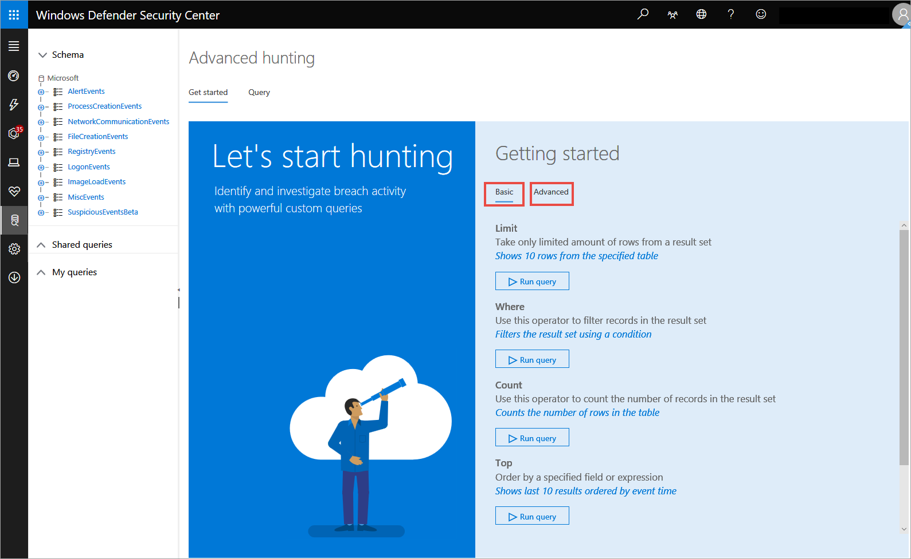
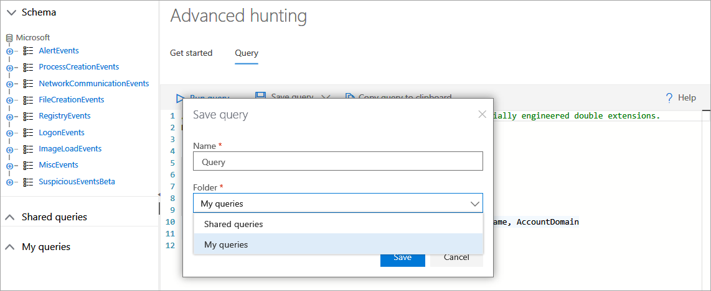
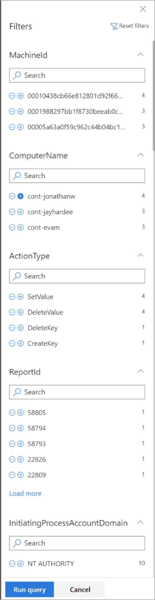

# Advanced hunting in Windows Defender ATP

**Applies to:**

- Windows 10 Enterprise
- Windows 10 Education
- Windows 10 Pro
- Windows 10 Pro Education
- Windows Defender Advanced Threat Protection (Windows Defender ATP)

[!include[Prerelease information](prerelease.md)]

>Want to experience Windows Defender ATP? [Sign up for a free trial.](https://www.microsoft.com/en-us/WindowsForBusiness/windows-atp?ocid=docs-wdatp-advancedhunting-abovefoldlink)

Advanced hunting allows you to proactively hunt for possible threats across your organization using a powerful search and query tool. Take advantage of the following capabilities: 

- **Powerful query language with IntelliSense** - Built on top of a query language that gives you the flexibility you need to take hunting to the next level.
- **Query all stored telemetry** - All telemetry data is accessible in tables for you to query. For example, you can query process creation, network communication, and many other event types.
- **Links to portal** - Certain query results, such as machine names and file names are actually direct links to the portal, consolidating the advanced hunting query experience and the existing portal investigation experience.
- **Query examples** - A welcome page provides examples designed to get you started and get you familiar with the tables and the query language.

To get you started in querying your data, you can use the basic or advanced query examples that have some preloaded queries for you to understand the basic query syntax.

## Use advanced hunting to query data

A typical query starts with a table name followed by a series of operators separated by **|**.

In the following example, we start with the table name **ProcessCreationEvents** and add piped elements as needed.

First, we define a time filter to review only records from the previous seven days. 

We then add a filter on the _FileName_  to contain only instances of _powershell.exe_.

Afterwards, we add a filter on the _ProcessCommandLine_
Finally, we  project only the columns we're interested in exploring and limit the results to 100 and click **Run query**.

### Use operators
The query language is very powerful and has a lot of available operators, some of them are - 

- **limit** - Return up to the specified number of rows.
- **where** - Filter a table to the subset of rows that satisfy a predicate.
- **count** - Return the number of records in the input record set.
- **top** - Return the first N records sorted by the specified columns.
- **project** - Select the columns to include, rename or drop, and insert new computed columns.
- **summarize** - Produce a table that aggregates the content of the input table.
- **extend** - Create calculated columns and append them to the result set.
- **join** - Merge the rows of two tables to form a new table by matching values of the specified column(s) from each table.
- **makeset** -  Return a dynamic (JSON) array of the set of distinct values that Expr takes in the group
- **find** - Find rows that match a predicate across a set of tables.

To see a live example of these operators, run them as part of the **Get started** section.

## Access query language documentation

For more information on the query language and supported operators, see [Query Language](https://docs.loganalytics.io/docs/Language-Reference/).

## Use exposed tables in advanced hunting

The following tables are exposed as part of advanced hunting:

- **AlertEvents** - Stores all alerts related information 
- **ProcessCreationEvents** - Stores all process creation events 
- **NetworkCommunicationEvents** - Stores all network communication events o
- **FileCreationEvents** - Stores all file creation, modification, and rename events
- **RegistryEvents** - Stores all registry key creation, modification, rename and deletion events 
- **LogonEvents** - Stores all login events 
- **ImageLoadEvents** - Stores all load dll events  
- **MiscEvents** - Stores several types of events, including Windows Defender Exploit Guard, Windows Defender SmartScreen, Windows Defender Application Guard, and Firewall events.

## Use shared queries
Shared queries are prepopulated queries that give you a starting point on running queries on your organization's data. It includes a couple of examples that help demonstrate the query language capabilities.

You can save, edit, update, or delete queries.

### Save a query
You can create or modify a query and save it as your own query or share it with users who are in the same tenant. 

1. Create or modify a query. 

2. Click the **Save query** drop-down button and select **Save as**.
    
3. Enter a name for the query. 

   

4. Select the folder where you'd like to save the query.
    - Shared queries - Allows other users in the tenant to access the query
    - My query - Accessible only to the user who saved the query
    
5. Click **Save**. 

### Update a query
These steps guide you on modifying and overwriting an existing query.

1. Edit an existing query. 

2. Click the **Save**.

### Delete a query
1. Right-click on a query you want to delete.

    

2. Select **Delete** and confirm that you want to delete the query.

## Results set capabilities in advanced hunting

The results set has several capabilities to provide you with effective investigation, including:

- Columns that return entity-related objects, such as Machine name, Machine ID, File name, SHA1, User, IP, and URL, are linked to their entity pages in the Windows Defender ATP portal.
- You can right-click on a cell in the results set and add a filter to your written query. The current filtering options are **include**, **exclude** or **advanced filter**, which provides additional filtering options on the cell value. These cell values are part of the row set. 

## Filter results in advanced hunting
In advanced hunting, you can use the advanced filter on the output results set of the query. 
The filters provide an overview of the result set where 
each column has it's own section and shows the distinct values that appear in the column and their prevalence.

You can refine your query based on the filter by clicking the "+" or "-" buttons on the values that you want to include or exclude and click **Run query**.

The filter selections will resolve as an additional query term and the results will be updated accordingly.

## Public Advanced Hunting query GitHub repository  
Check out the [Advanced Hunting repository](https://github.com/Microsoft/WindowsDefenderATP-Hunting-Queries). Contribute and use example queries shared by our customers. 

>Want to experience Windows Defender ATP? [Sign up for a free trial.](https://www.microsoft.com/en-us/WindowsForBusiness/windows-atp?ocid=docs-wdatp-advancedhunting-belowfoldlink)

## Related topic
- [Advanced hunting reference](advanced-hunting-reference-windows-defender-advanced-threat-protection.md)

