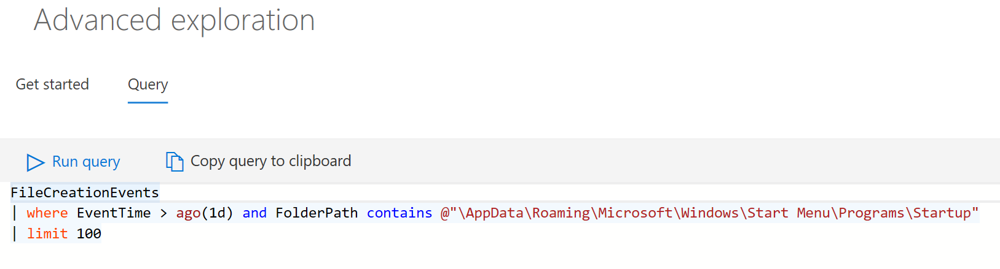

# Advanced hunting in Windows Defender ATP

**Applies to:**

- Windows 10 Enterprise
- Windows 10 Education
- Windows 10 Pro
- Windows 10 Pro Education
- Windows Defender Advanced Threat Protection (Windows Defender ATP)

[!include[Prerelease information](prerelease.md)]

Advanced hunting allows you to proactively hunt for possible threats across your organization using a powerful search and query tool. Take advantage of the following capabilities: 

- **Powerful query language with IntelliSense** - Built on top of a query language that gives you the flexibility you need to take hunting to the next level.
- **Query all stored telemetry** - All telemetry data is accessible in tables for you to query. For example, you can query process creation, network communication, and many other event types.
- **Links to portal** - Certain query results, such as machine names and file names are actually direct links to the portal, consolidating the advanced hunting query experience and the existing portal investigation experience.
- **Query examples** - A welcome page provides examples designed to get you started and get you familiar with the tables and the query language.

To get you started in querying your data, you can use the basic or advanced query examples that have some preloaded queries for you to understand the basic query syntax.

## Query data in advanced hunting

A typical query starts with a table name followed by a series of operators separated by **|**.

In the following example, we start with the table name **ProcessCreationEvents** and add piped elements as needed.

First, we define a time filter to review only records from the previous seven days. 

We then add a filter on the _FileName_  to contain only instances of _powershell.exe_.

Afterwards, we add a filter on the _ProcessCommandLine_
Finally, we  project only the columns we're interested in exploring and limit the results to 100 and click **Run query**.

### Operators
The query language is very powerful and has a lot of available operators, some of them are - 

- **limit** - Return up to the specified number of rows.
- **where** - Filter a table to the subset of rows that satisfy a predicate.
- **count** - Return the number of records in the input record set.
- **top** - Return the first N records sorted by the specified columns.
- **project** - Select the columns to include, rename or drop, and insert new computed columns.
- **summarize** - Produce a table that aggregates the content of the input table.
- **extend** - Create calculated columns and append them to the result set.
- **join** - Merge the rows of two tables to form a new table by matching values of the specified column(s) from each table.
- **makeset** -  Return a dynamic (JSON) array of the set of distinct values that Expr takes in the group
- **find** - Find rows that match a predicate across a set of tables.

To see a live example of these operators, run them as part of the **Get started** section.

## Query language documentation

For more information on the query language and supported operators, see [Query Language](https://docs.loganalytics.io/docs/Language-Reference/).

## Tables in advanced hunting

The following tables are exposed as part of advanced hunting:

- **AlertEvents** - Stores all alerts related information 
- **ProcessCreationEvents** - Stores all process creation events 
- **NetworkCommunicationEvents** - Stores all network communication events o
- **FileCreationEvents** - Stores all file creation, modification, and rename events
- **RegistryEvents** - Stores all registry key creation, modification, rename and deletion events 
- **LogonEvents** - Stores all login events 
- **ImageLoadEvents** - Stores all load dll events  
- **MiscEvents** - Stores several types of events, including Windows Defender Exploit Guard, Windows Defender SmartScreen, Windows Defender Application Guard, and Firewall events.
- **SuspiciousEvents** - Stores all events that deviate from typical event behavior

## Shared queries
Shared queries are prepopulated queries that give you a starting point on running queries on your organization's data. It includes a couple of examples that help demonstrate the query language capabilities.

You can save, edit, update, or delete queries.

### Save a query
You can create or modify a query and save it as your own query or share it with users who are in the same tenant. 

1. Create or modify a query. 

2. Click the **Save query** drop-down button and select **Save as**.
    
3. Enter a name for the query. 

   

4. Select the folder where you'd like to save the query.
    - Shared queries - Allows other users in the tenant to access the query
    - My query - Accessible only to the user who saved the query
    
5. Click **Save**. 

### Update a query
These steps guide you on modifying and overwriting an existing query.

1. Edit an existing query. 

2. Click the **Save**.

### Delete a query
1. Right-click on a query you want to delete.

    

2. Select **Delete** and confirm that you want to delete the query.

## Results set capabilities in advanced hunting

The results set has several capabilities to provide you with effective investigation, including:

- Columns that return entity-related objects, such as Machine name, Machine ID, File name, SHA1, User, IP, and URL, are linked to their entity pages in the Windows Defender ATP portal.
- You can right-click on a cell in the results set and add a filter to your written query. The current filtering options are **include**, **exclude** or **advanced filter**, which provides additional filtering options on the cell value. These cell values are part of the row set. 

## Filters on results in advanced hunting
In advanced hunting, you can use the advanced filter on the output results set of the query. 
The filters provide an overview of the result set where 
each column has it's own section and shows the distinct values that appear in the column and their prevalence.

You can refine your query based on the filter by clicking the "+" or "-" buttons on the values that you want to include or exclude and click **Run query**.

The filter selections will resolve as an additional query term and the results will be updated accordingly.

## Query best practices
- Use time filters first. Kusto is highly optimized to utilize time filters.
- Put filters that are expected to remove most of the data in the beginning of the query, following the time filter.
- Prefer 'has' keyword over 'contains' when looking for full tokens.
- Prefer looking in specific column rather than using full text search accross all columns.
- When joining between two tables - choose the table with less rows to be the first one (left-most). 
- When joining between two tables - project only needed columns from both sides of the join.

## Public Advanced Hunting query GitHub repository  
Check out the [Advanced Hunting repository](https://github.com/Microsoft/Advanced-Hunting-Queries). Contribute and use example queries shared by our customers. 

## Advanced hunting table reference

| Column name | Column type | Description
:---|:--- |:---                                                                                                      
| MachineId                           | string      | Unique identifier for the machine in the service.    
| ComputerName                        | string      | Fully qualified domain name (FQDN) of the machine.   
| EventTime                           | datetime    | Date and time when the event was recorded.             
| ActionType                          | string      | Type of activity that triggered the event.            
| ProviderId                          |             | Unique identifier for the Event Tracing for Windows (ETW) provider that collected the event log. 
| EventId                             |             | Unique identifier used by Event Tracing for Windows (ETW) for the event type.                    
| EventType                           | string      | Table where the record is stored.
| ReportIndex                         |             | Event identifier that is unique among the same event type.
| FileName                            | string      | Name of the file that the recorded action was applied to.   
| SHA1                                | string      | SHA-1 of the file that the recorded action was applied to. 
| SHA256                              | string      | SHA-256 of the file that the recorded action was applied to.
| MD5                                 | string      | MD5 hash of the file that the recorded action was applied to. 
| FolderPath                          | string      | Folder containing the file that the recorded action was applied to.  
| FileOriginUrl                       | string      | URL where the file was downloaded from.   
| FileOriginIp                        | string      | IP address where the file was downloaded from.
| FileOriginReferrerUrl               | string      | URL of the web page that links to the downloaded file. 
| InitiatingProcessId                 | int         | Process ID (PID) of the process that initiated the event.   
| InitiatingProcessCreationTime       | datetime    | Date and time when the process that initiated the event was started.  
| InitiatingProcessFileName           | string      | Name of the process that initiated the event.  
| InitiatingProcessSha256             | string      | SHA-256 of the process (image file) that initiated the event.  
| InitiatingProcessMd5                | string      | MD5 hash of the process (image file) that initiated the event. 
| InitiatingProcessSha1               | string      | SHA-1 of the process (image file) that initiated the event. 
| InitiatingProcessCommandLine        | string      | Path and command line arguments used to run the process that initiated the event. 
| InitiatingProcessFolderPath         | string      | Folder containing the process (image file) that initiated the event.
| InitiatingProcessAccountDomain      | string      | Domain of the account that ran the process responsible for the event.  
| InitiatingProcessAccountName        | string      | User name of the account that ran the process responsible for the event. 
| InitiatingProcessAccountSid         | string      | Security Identifier (SID) of the account that ran the process responsible for the event.
| InitiatingProcessIntegrityLevel     | string      | Integrity level of the process that initiated the event. Windows assigns integrity levels to processes based on certain characteristics, such as if they were launched from an internet downloaded. These integrity levels influence permissions to resources. 
| InitiatingProcessTokenElevation     | string      | Token type indicating the presence or absence of User Access Control (UAC) privilege elevation applied to the process that initiated the event.  
| InitiatingProcessParentCreationTime | datetime    | Date and time when the parent of the process responsible for the event was event was started.  
| InitiatingProcessParentName         | string      | Name of the parent process that spawned the process responsible for the event.  
| InitiatingProcessParentId           | int         | Process ID (PID) of the parent process that spawned the process responsible for the event. 
| AdditionalFields                    |             | Additional information about the event in JSON array format.  
| AccountName                         | string      | User name of the account.          
| AccountDomain                       | string      | Domain of the account. 
| AccountSid                          | string      | Security Identifier (SID) of the account.  
| LogonType                           | string      | Type of logon session, specifically:    - **Interactive** - User physically interacts with the machine using the local keyboard and screen.    - **Remote interactive (RDP) logons** - User interacts with the machine remotely using Remote Desktop, Terminal Services, Remote Assistance, or other RDP clients.     - **Network** - Session initiated when the machine is accessed using PsExec or when shared resources on the machine, such as printers and shared folders, are accessed.    - **Batch** - Session initiated by scheduled tasks.    - **Service** - Session initiated by services as they start.   
| RemoteUrl                           | string      | URL or fully qualified domain name (FQDN) that was being connected to.
| RemoteIP                            | string      | IP address that was being connected to.  
| RemotePort                          | int         | TCP port on the remote device that was being connected to. 
| LocalPort                           | int         | TCP port on the local machine used during communication.
| LocalIP                             | string      | IP address assigned to the local machine used during communication.
| ProcessCreationTime                 | datetime    | Date and time the process was created.  
| RegistryKey                         | string      | Registry key that the recorded action was applied to. 
| RegistryValueType                   | string      | Data type, such as binary or string, of the registry value that the recorded action was applied to.  
| RegistryValueName                   | string      | Name of the registry value that the recorded action was applied to.
| RegistryValueData                   | string      | Data of the registry value that the recorded action was applied to.
| PreviousRegistryKey                 | string      | Original registry key of the registry value before it was modified. 
| PreviousRegistryValueData           | string      | Original data of the registry value before it was modified. 
| PreviousRegistryValueName           | string      | Original name of the registry value before it was modified. 
| PreviousRegistryValueType           | string      | Original data type of the registry value before it was modified. 
| ProcessCommandline                  | string      | Path and command line arguments used to create the new process.
| ProcessIntegrityLevel               | string      | Integrity level of the newly created process. Windows assigns integrity levels to processes based on certain characteristics, such as if they were launched from an internet downloaded. These integrity levels influence permissions to resources.           
| ProcessTokenElevation               | string      | Token type indicating the presence or absence of User Access Control (UAC) privilege elevation applied to the newly created process.  
| ProcessId                           | int         | Process ID (PID) of the newly created process. 
| AlertId                             | string      | Unique identifier for the alert. 
| OSArchitecture                      | string      | Architecture of the operating system running on the machine. 
| OSPlatform                          | string      | Platform of the operating system running on the machine. This indicates specific operating systems, including variations within the same family, such Windows 10 and Windows 7. 
| OSBuild                             | string      | Build version of the operating system running on the machine. 
| NetworkCardIPs                      | string      | List of all network adapters on the machine, including their MAC addresses and assigned IP addresses, in JSON array format.  
| IsAzureADJoined                     | boolean     | Boolean indicator of whether machine is joined to the Azure Active Directory.
| LoggedOnUsers                       | string      | List of all users that are logged on the machine at the time of the event in JSON array format.
| MachineGroup                        | string      | Machine group of the machine. This group is used by role-based access control to determine access to the machine.