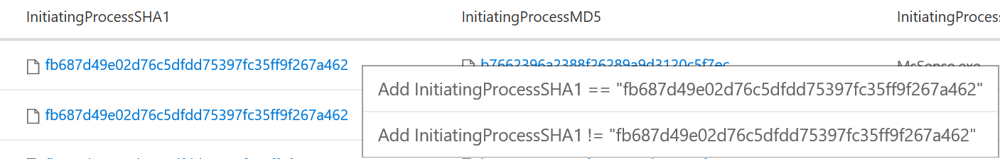

# Advanced hunting in Windows Defender ATP

**Applies to:**

- Windows 10 Enterprise
- Windows 10 Education
- Windows 10 Pro
- Windows 10 Pro Education
- Windows Defender Advanced Threat Protection (Windows Defender ATP)

Advanced hunting allows you to proactively hunt and investigate across your organization using a powerful search and query tool. Take advantage of the following capabilities: 

- **Powerful query language with IntelliSense** - Built on top of a query language that gives you the flexibility you need to take hunting to the next level.
- **Query all stored telemetry** - All telemetry data is accessible in tables for you to query. For example, you can query process creation, network communication, and many other event types.
- **Links to portal** - Certain query results, such as endpoint names and file names are actually direct links to the Windows Defender ATP portal, consolidating the Advanced hunting query experience and the existing portal investigation experience.
- **Query examples** - A welcome page provides examples designed to get you started and get you familiar with the tables and the query language.

To get you started in querying your Windows Defender ATP data, you can use the basic or advanced query examples that have some preloaded queries for you to understand the basic query syntax.

## Query data in advanced hunting

A typical query starts with a table name followed by a series of operators separated by **|**.

We start with the table name FileCreationEvents and add piped elements as needed.

First, we define a time filter to review only records from the last 1 day. We then add a filter on the _FolderPath_ field to contain only the paths \AppData\Roaming\Microsoft\Windows\Start Menu\Programs\Startup.

Finally, we limit the results to 100 and click **Run query**.

The query language is very powerful and has the following usable operators: 

- **Limit** - Return up to the specified number of rows.
- **Where** - Filter a table to the subset of rows that satisfy a predicate.
- **Count** - Return the number of records in the input record set.
- **Top** - Return the first N records sorted by the specified columns.
- **Project** - Select the columns to include, rename or drop, and insert new computed columns.
- **Summarize** - Produce a table that aggregates the content of the input table.
- **Extend** - Create calculated columns and append them to the result set.
- **Join** - Merge the rows of two tables to form a new table by matching values of the specified column(s) from each table.
- **Makeset** -  Return a dynamic (JSON) array of the set of distinct values that Expr takes in the group
- **Find** - Find rows that match a predicate across a set of tables.

To see a live example of these operators, run them as part of the **Get started** section.

## Query language documentation

For more information on the query language and supported operators, see [Query Language](https://docs.loganalytics.io/docs/Language-Reference/).

## Tables in advanced hunting

The following tables are exposed as part of advanced hunting:

- **ProcessCreationEvents** – stores all process creation events telemetry of the organization.
- **NetworkCommunicationEvents** - stores all network communication events telemetry of the organization.
- **FileCreationEvents** - stores all file creation, modification and rename events telemetry of the organization.
- **AlertEvents** - stores all alerts related information trigged in the organization.
- **RegistryEvents** - stores all registry key creation, modification, rename and deletion events telemetry of the organization.
- **LogonEvents** – stores all Login events telemetry of the organization.
- **ImageLoadEvents** – stores all load dll events telemetry of the organization.
- **MiscEvents** – stores several types of events, including Exploit Guard, Smart Screen, Application Guard, and Firewall events.

## Results set in advanced hunting

The results set has several capabilities to provide you with effective investigation, including:

- Columns that return entity-related objects, such as Machine name, Machine ID, File name, SHA1, user, IP, and URL, are linked to their entity pages in the Windows Defender ATP portal.
- If you right-click on a cell in the results set, you can add a filter to your written query. The current filtering options are **include** or **exclude**; these cell values are part of the row set. 
 

## Related topics

- [View the Windows Defender Advanced Threat Protection Security operations dashboard](dashboard-windows-defender-advanced-threat-protection.md)
- [View the Windows Defender Advanced Threat Protection Security analytics dashboard](security-analytics-dashboard-windows-defender-advanced-threat-protection.md)
- [Investigate Windows Defender Advanced Threat Protection alerts](investigate-alerts-windows-defender-advanced-threat-protection.md)
- [Investigate a file associated with a Windows Defender ATP alert](investigate-files-windows-defender-advanced-threat-protection.md)
- [Investigate an IP address associated with a Windows Defender ATP alert](investigate-ip-windows-defender-advanced-threat-protection.md)
- [Investigate a domain associated with a Windows Defender ATP alert](investigate-domain-windows-defender-advanced-threat-protection.md)
- [View and organize the Windows Defender ATP Machines list](machines-view-overview-windows-defender-advanced-threat-protection.md)
- [Investigate machines in the Windows Defender ATP Machines list](investigate-machines-windows-defender-advanced-threat-protection.md)
- [Investigate a user account in Windows Defender ATP](investigate-user-windows-defender-advanced-threat-protection.md)
- [Manage Windows Defender Advanced Threat Protection alerts](manage-alerts-windows-defender-advanced-threat-protection.md)
- [Take response actions in Windows Defender ATP](response-actions-windows-defender-advanced-threat-protection.md)
